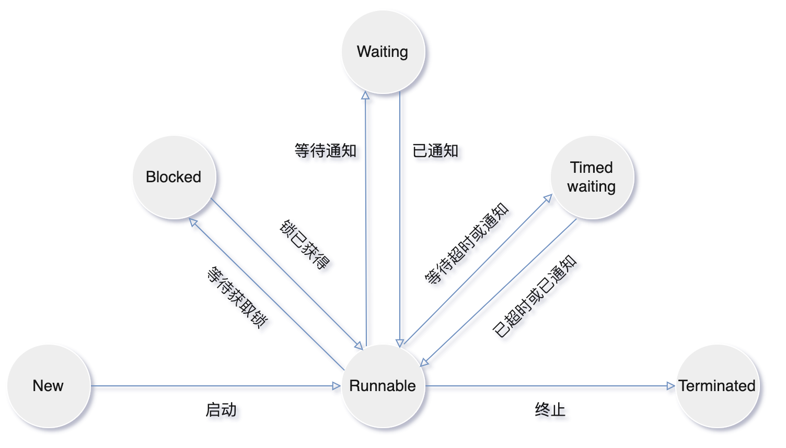
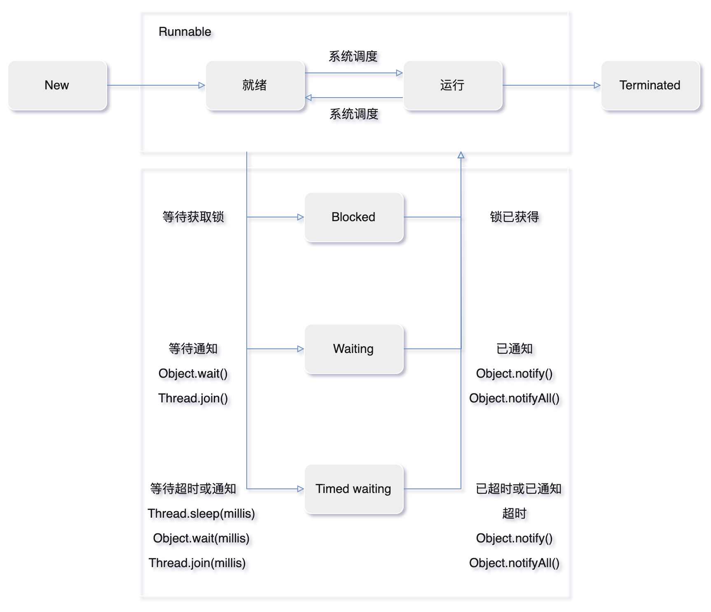
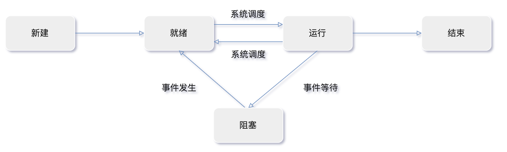

# 线程基础

## 使用线程

有三种使用线程的方法：

- 实现 `Runnable` 接口
- 实现 `Callable` 接口（泛型接口）
- 继承 `Thread` 类

`Runnable`、`Callable`都是函数式接口，可以提供一个`lambda`表达式。

`Runnable` 和 `Callable` 接口的实现类只是一个可以在线程中运行的任务，不是真正意义上的线程。

任务最终还需要通过 `Thread` 来调用，即任务是通过线程驱动从而执行的。

`Thread.start()`方法才会创建一个执行`run()`方法的新线程。

虚拟机会将该线程放入就绪队列中等待被调度，当一个线程被调度时会执行该线程的 `run()` 方法。

### 实现 Runnable 接口

- 任务类实现`Runnable`接口中的 `run()` 方法。
- 使用 `Runnable` 实例再创建一个 `Thread`实例，然后调用 `Thread` 实例的 `start()` 方法来启动线程。

### 实现 Callable 接口

- 任务类实现`Callable`接口中的 ` call()` 方法。
- 与 `Runnable` 相比，`Callable` 可以有返回值，返回值通过 `FutureTask` 进行封装。
- 使用 `FutureTask` 实例再创建一个 `Thread`实例，然后调用 `Thread` 实例的 `start()` 方法来启动线程。

### 继承 Thread 类

- 任务类覆写`run()` 方法，因为 `Thread`  类也实现`Runnable`接口中的 `run()` 方法。
- 调用  `Thread` 实例`start()` 方法启动一个线程时。

### 实现接口 VS 继承 Thread

实现接口会更好

- Java 不支持多重继承，继承了`Thread` 类就无法继承其它类，但是可以实现多个接口。
- 类可能只要求可执行就行，继承整个 `Thread` 类开销过大。

### Runnable和Callable的区别

- `Callable`接口方法是`call()`；`Runnable`接口方法是`run()`。
- `Callable`的任务执行后可返回值，而`Runnable`的任务不能返回值。
- `Call`方法可以抛出异常，`run`方法不可以。

- `Callable`任务可以拿到一个`Future`对象，表示异步计算的结果。
  - `Future`对象提供了检查计算是否完成的方法，以等待计算的完成，并检索计算的结果。
  - `Future`对象可以了解任务执行情况，可取消任务的执行，还可获取执行结果。

```java
Runnable r = new MyRunnable();
Thread t1 = new Thread(r);
t1.start();

Callable c = new MyCallable();
FutureTask ft = new FutureTask<>(c);
Thread t2 = new Thread(ft);
t2.start();

Thread t3 = new MyThread();
t3.start();
```

## 线程6种状态

- `New`：新建
- `Runnable`：可运行（就绪+运行）
- `Blocked`：阻塞
- `Waiting`：等待
- `Timed waiting`：计时等待
- `Terminated`：终止

### New（新建）

`new Thread(r)`，线程创建后尚未启动。

### Runnable可运行（就绪+运行）

可能正在运行，也可能正在等待 CPU 时间片（就绪）。

包含了**操作系统线程状态**中的 **Running（运行）和 Ready（就绪）**。

**当调用线程对象`start()`方法，线程进入就绪状态(等待调度):**

- 处于就绪状态的线程，只是说明此线程准备好了，随时等待CPU调度执行，并不是说执行了`t.start()`此线程立即就会执行。

### Blocked（阻塞）

等待获取一个排它锁，如果其它线程释放了锁，此线程就会结束此状态。

- 一个线程请求获取锁(`synchronized`)，但是这个锁目前被其它线程占用，该线程会被阻塞。
- 当所有其它线程都释放了这个锁，线程调度器并允许该线程持有这个锁，它将变成`Runnable`状态。

### Waiting（无限期等待）

**已经获得锁，等待，放弃锁。**

等待其它线程**显式唤醒**，否则不会被分配 CPU 时间片。

调用以下方法进入`Waiting`状态

- `Object.wait()`：使线程进入无限期等待。
- `Thread.join()`：等待其它线程完成（唤醒）。

| 进入方法             | 退出方法                               |
| -------------------- | -------------------------------------- |
| 无参`Object.wait()`  | `Object.notify()`/`Object.notifyAll()` |
| 无参`Thread.join()`  | 被调用的线程执行完毕                   |
| `LockSupport.park()` | `LockSupport.unpark(Thread)`           |

### Timed waiting （计时等待、限期等待）

**已获得锁，等待，继续持有锁。**

超时后会被系统自动唤醒，无需等待其它线程显式唤醒。

睡眠和挂起是用来描述行为，而阻塞和等待用来描述状态。

调用以下方法进入`Timed waiting`状态

- `Thread.sleep(millis)`：使线程进入限期等待状态，常用“使一个线程睡眠”进行描述。
- `Object.wait(millis)`：使线程进入限期等待，常用“挂起一个线程”进行描述。
- `Thread.join(millis)`：等待其它线程完成（唤醒），超时自动唤醒。

| 进入方法                              | 退出方法                                        |
| ------------------------------------- | ----------------------------------------------- |
| `Thread.sleep(millis)`                | 时间结束                                        |
| 有参`Object.wait(millis)`             | 时间结束/`Object.notify()`/`Object.notifyAll()` |
| 有参`Thread.join(millis)`             | 时间结束/被调用的线程执行完毕                   |
| `LockSupport.parkNanos(nanoseconds)`  | `LockSupport.unpark(Thread)`                    |
| `LockSupport.parkUntil(milliseconds)` | `LockSupport.unpark(Thread)`                    |

### Terminated（终止）

- `run()`方法正常退出，线程自然终止。
- 产生了异常而结束。

### Blocked(阻塞)和Waiting(等待)区别

- `Blocked`是被动的，没有获得锁，它是在等待获取一个排它锁。
- `Waiting`是主动的，已经获得锁，主动放弃。

## Java线程状态流程图

当线程阻塞或等待（或终止），可以调度另一个线程运行。



## Java线程生命周期



## 操作系统线程生命周期



## Java线程和操作系统线程状态区别

Java中将操作系统中的 **就绪状态+运⾏状态** 转化为⼀个状态`Runnable`；

Java中将操作系统中 **阻塞状态** 细分为了三种：

- `Blocked`、`Waiting`、`Timed waiting`

## 中断线程

Java中的中断是一种**协作机制**。

一个线程不能直接强制另一个线程停止，它只能“请求”（即中断）目标线程停止它正在做的事情，**被中断的线程可以决定如何响应中断** 。

至于目标线程是否响应这个请求、何时响应以及如何响应，完全由目标线程自己决定。一般处理如下：

1. 捕捉线程异常，处理或者抛出。
2. 更普遍的操作，将中断解释为一个终止请求，中断后，线程自行决定如何响应中断。

---

### 中断线程相关方法

| 方法                           | 说明                                                         |
| ------------------------------ | ------------------------------------------------------------ |
| `void interrupt()`             | 设置线程的中断标志位为 `true`。若线程处于阻塞状态，会触发 `InterruptedException`，并**清除状态**（重置为 `false`）。 |
| `boolean isInterrupted()`      | 检查线程的中断标志位，**不会清除**当前状态。                 |
| `static boolean interrupted()` | 检查当前线程的中断标志位，并**清除状态**（重置为 `false`）。 |
| `Executor`中断操作             | `shutdown()`，`shutdownNow()`。                              |

### interrupt()

- **定义于**: `java.lang.Thread` 类
- **调用方式**: `someThread.interrupt()`
- **作用**: **实例方法**。它用于**向另一个线程发送一个中断信号（请求）**。
- **常见使用场景**：由外部线程调用，请求目标线程停止。

线程的 **`interrupt()`** 方法用于向线程发送一个中断信号，请求线程终止当前的操作或进入特定的中断处理逻辑。

注意，**`interrupt()` 并不会直接终止线程**，而是通过设置线程的中断标志位，由线程自身决定如何响应中断（例如清理资源后结束运行）。

1. **中断标志位**：
   - 每个线程内部有一个布尔类型的中断状态（interrupt status）。
   - 调用 `interrupt()` 方法会将此标志位设为 `true`。
   - 线程可以检查此标志位，决定是否响应中断。
2. **阻塞方法的中断**：
   - 如果线程正在执行 `sleep()`、`wait()`、`join()` 等阻塞方法，调用 `interrupt()` 会触发这些方法抛出 **`InterruptedException`**，并**清除中断标志位**（重置为 `false`）。
3. **非阻塞方法的中断**：
   - 如果目标线程正在运行（未被阻塞），那么该方法只是**设置线程的中断状态为 `true`**，不会导致任何 immediate 行为。线程需要自己检查这个状态并做出响应。

### interrupted()

- **定义于**: `java.lang.Thread` 类
- **调用方式**: `Thread.interrupted()`
- **作用**: **静态方法**。它用于**检查当前正在执行的线程的中断状态**。
  - **关键特性：它在返回中断状态后，会清除中断状态**。也就是说，如果第一次调用 `Thread.interrupted()` 返回 `true`，那么第二次调用（如果没有新的中断发生）将返回 `false`，因为它已经把状态重置了。

没有执行 `sleep()` 等会抛出`InterruptedException` 的操作，就无法使用 `interrupt()` 方法线程提前结束进程，比如：

- 如果一个线程的 `run()` 方法执行一个无限循环 （`while` 循环）。

但可以使用 `interrupted()`方法，将中断为一个终止请求，提前结束进程：

1. 首先调用 `interrupt()` 方法会设置线程的中断标记（`true`）。
2. 此时调用 `interrupted()` 方法检查，会返回 `true`。
3. 因此可以在循环体中使用 `interrupted()` 方法来判断线程是否处于中断状态，从而提前结束线程。

###  isInterrupted()

- **定义于**: `java.lang.Thread` 类
- **调用方式**: `someThread.isInterrupted()` 或 `this.isInterrupted()`
- **作用**: **实例方法**。它用于**检查指定线程的中断状态**。
  - 它只做一件事：返回目标线程的中断状态（`boolean` 值，`true` 表示已被中断）。
  - **关键特性：它不会改变中断状态**。调用这个方法后，线程的中断标志位保持不变（是 `true` 就还是 `true`，是 `false` 就还是 `false`）。
- **常见使用场景**：在目标线程内部或外部，检查其是否被请求中断。

### Executor 中断线程

- `shutdownNow == interrupt`

- 调用 `Executor` 的 `shutdown()` 方法，会等待线程都执行完毕之后再关闭。

- 调用 `Executor` 的`shutdownNow()` 方法，相当于调用每个线程的 `interrupt()` 方法。

### 线程如何响应中断？

1. **主动检查中断标志**：

   ```java
   // 线程调用interrupt()设置中断标记为true
   t.interrupt()
   
   // 线程run()方法，interrupted()检查返回true，退出循环
   while (!Thread.currentThread().isInterrupted() && more work to do){
       // 执行任务
   }
   // 检测到中断后，清理资源并退出
   ```

2. **处理 `InterruptedException`**：

   ```java
   // 线程调用interrupt()设置中断标记为true
   t.interrupt()
   
   // 线程run()方法
   try {
       Thread.sleep(1000); // 抛出异常
   } catch (InterruptedException e) {
       // 捕获异常后，通常需要重新设置中断标志（因为状态已被清除）
       Thread.currentThread().interrupt();
       // 处理中断逻辑（如退出循环）
   }
   ```

---

### 注意事项

1. **协作式中断**：
   - 中断机制依赖线程自身的响应，需要线程主动检查中断标志或处理异常。如果线程忽略中断标志或未处理 `InterruptedException`，则无法终止。

2. **不可中断的阻塞操作**：
   - 某些 I/O 操作（如 `Socket.read()`）或 `synchronized` 锁不会响应中断。此时需通过其他方式终止线程（如关闭底层资源）。

3. **中断状态重置**：
   - `InterruptedException` 会清除中断标志，需根据业务决定是否重新设置。

---

### 示例代码

```java
Thread thread = new Thread(() -> {
    while (!Thread.currentThread().isInterrupted()) {
        try {
            System.out.println("运行中...");
            Thread.sleep(1000);
        } catch (InterruptedException e) {
            System.out.println("收到中断请求，退出线程");
            // 重新设置中断标志（可选）
            Thread.currentThread().interrupt();
        }
    }
});

thread.start();
// 主线程休眠后中断子线程
Thread.sleep(3000);
thread.interrupt();
```

## 守护进程

`t.setDaemon(true)`

- 标志该线程为守护线程/用户线程，在线程启动前调用。

- 唯一用途，为其它线程提供服务：
  - 计时器线程。
  - 清空过时缓存项的线程。

- `main()` 属于非守护线程。

- 当只剩下守护线程，虚拟机就会退出，没必要运行程序了，同时会杀死所有守护线程。

## 线程优先级

`t.setPriority(newPriority)`

- 设置线程优先级。
- `newPriority`取值为 [1, 10]。

## 常用方法

- `Thread(Runnable target)`
  - 构造一个新线程，调用指定目标的`run()`方法。
- `public synchronized void start()`
  - 启动线程，从而调用`run()`方法。
- `public abstract void run()`
  - 调用相关`Runnable`的`run()`方法。
- `public static native void sleep(long millis)`
  - 休眠指定毫秒数。
- `public static native void yield()`
  - 使当前正在执行线程向另一个线程交出运行权，静态方法。
- `void join()`
  - 等待指定的线程终止。
- `void join(long millis)`
  - 等待指定的线程终止或者等待经过指定的毫秒数。
- `public State getState()` 
  - 得到线程的当前状态，取值为：`NEW`、`RUNNABLE`、`BLOCKED`、`WAITING`、`TIMED_WAITING`、`TERMINATED`。

## wait() 方法和 sleep() 方法区别

- `sleep()` 休眠指定毫秒数，线程进入`Timed waiting` 状态，超时会解除阻塞，进入`Runnable`状态，等待CPU的到来。
- `wait`方法必须与`synchronized`关键字一起使用，线程进入`Blocked`状态。
  - 当`notify`或`notifyall`被调用后（显示唤醒），会解除阻塞，唤醒后只有重新占用互斥锁后才会进入`Runnable`状态。
- `wait()` 是 `Object` 的方法。
- `sleep()` 是 `Thread` 的静态方法。

- `wait()` 会释放锁，`sleep()` 不释放锁。

## join()方法

等待指定的线程终止，在一个线程中调用另一个线程的 `join()` 方法，会将当前线程挂起，而不是忙等待，直到目标线程结束。

例如：线程 a, b，先执行线程 b，b 执行中调用 `a.join()`，b会等待a终止后，b继续执行，保证 a 线程的输出先于 b 线程的输出。

```java
A a = new A();
B b = new B(a);
// 线程 a, b 启动
// 先执行线程b，线程b执行中调用a.join(), b会等待a终止后，b继续执行
b.start();
a.start();
```

## run() 方法

```java
// 函数式接口
@FunctionalInterface
public interface Runnable {
    public abstract void run();
}
```

直接执行 `run()` 方法，会把`run()`方法当成一个 `main`线程下的普通方法去执行，并不会在某个线程中执行它，所以这并不是多线程工作。

调用 `start()` 方法才是启动线程，并使线程进入就绪状态，等待系统调度(分配时间片)运行`run()` 方法。

## yield() 方法

使当前正在执行线程向另一个线程交出运行权，静态方法。

- ``yield()``方法可以暂停当前正在执行的线程对象，让其它有相同优先级的线程执行。
- 只保证当前线程放弃CPU占用，而不能保证使其它线程一定能占用CPU，执行`yield()`的线程有可能在进入到暂停状态后马上又被执行。

## 线程死亡的三种方式

1. 正常结束：`run()` 或者 `call()` 方法执行完成后，线程正常结束。
2. 异常结束：线程抛出一个未捕获的 `Exception` 或     `Error`，导致线程异常结束。
3. 调用 `stop()`结束线程：一般不推荐使用该种方式，因为该方法通常容易导致死锁。