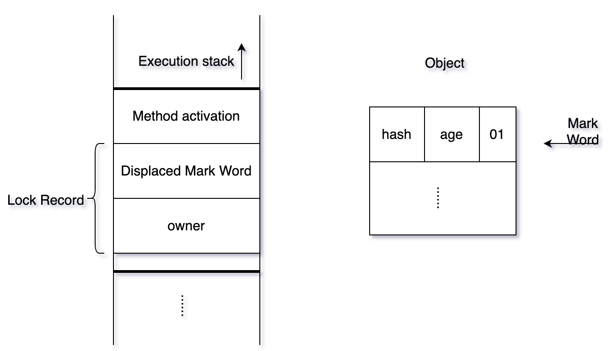
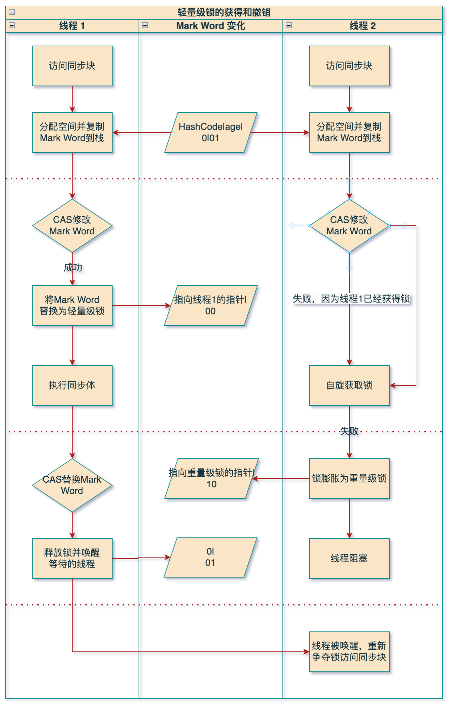

# 轻量级锁

## 核心思想

**设计初衷**：在没有多线程竞争的前提下，减少传统的重量级锁使用操作系统互斥量带来的性能消耗。

- 轻量级锁是相对于使⽤操作系统互斥量来实现的传统锁（重量级锁）⽽⾔的。
- 轻量级锁并不是⽤来代替重量级锁的。

**核心逻辑**：在无实际竞争或短时间竞争(多线程交替执行)场景下，可以通过 **CAS 操作（Compare-And-Swap）** 来避免直接使用重量级锁的开销。如果 CAS 失败，说明竞争加剧，锁会膨胀为重量级锁。

- 避免使用操作系统互斥量（重量级锁），减少用户态与内核态的切换开销。  
- 适合多个线程竞争不激烈场景。

## 加锁（CAS+自旋）

1. **检查状态**：线程执行同步块之前，JVM 会先在当前线程的栈帧中创建一个名为 **锁记录（Lock Record）** 的空间。锁记录空间（`Lock Record`）包含两部分：
   1. `Displaced Mark Word`：⽤于存储锁对象⽬前的`Mark Word`的拷贝。
   2. `owner`：指向当前锁对象的指针。

2. **复制对象头**：将对象当前的 Mark Word 复制到线程的锁记录中（`Displaced Mark Word`）。
2. **CAS 操作尝试加锁**：尝试将对象头的 Mark Word 更新为指向当前线程`Lock Record`的指针。
   1. 如果成功，当前线程获得锁，对象锁标志位变为`00`。
   2. 如果失败，表示存在其它线程竞争锁，当前线程尝试使用自旋获取锁 (自旋超过次数，变为重量级锁)。

## 解锁（CAS）

使用原子CAS操作将`Lock Record`中的`Displaced Mark Word`替换为对象头。

- 如果成功，表示没有竞争。
- 如果失败，表示当前锁存在竞争，锁会膨胀为重量锁 。

### 轻量级锁⾃旋

线程不会立即被挂起，而是执行一个忙循环（空循环），看看持有锁的线程是否会很快释放锁。

这是一种**用 CPU 时间换取线程阻塞/唤醒开销**的策略。

在 JDK 1.6 之后，引入了**适应性自旋**，自旋的次数不再固定，而是由前一次在同一个锁上的自旋时间及锁的拥有者的状态来决定。

### 自旋原因

如果升级为重量级锁，是通过操作系统来实现，涉及到内核态和⽤户态之间的切换，操作比较耗时。

如果竞争没有那么激烈，同步代码块执⾏的时间还没有切换上下⽂花的时间多，反⽽得不偿失。

因此采⽤⾃旋锁，出现竞争后等⼀等再去尝试，可能前⾯获得锁的线程已经执⾏完了，再次加锁，避免升级重量锁带来的消耗。

### 优点

- 对于绝大部分**不存在真正竞争**的锁，或者在**竞争程度很轻**（线程交替执行）的情况下，避免了重量级锁的巨大开销。
- 竞争的线程不会被挂起，提高了程序的响应速度。

### 缺点：

- 如果锁竞争激烈，除了互斥开销外，还额外发生了 **CAS 操作**和**自旋**的开销，性能反而会比重量级锁更差（因为白白浪费了CPU周期）。

### 适用场景：

- **线程交替执行**同步块的场景。
- 追求**响应时间**，同步块执行速度非常快的场景（自旋代价小）。
- 绝大多数情况下**不会出现多线程竞争**的场景。
