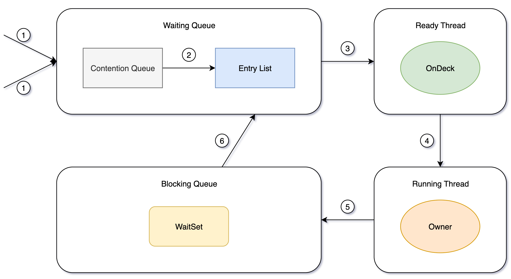
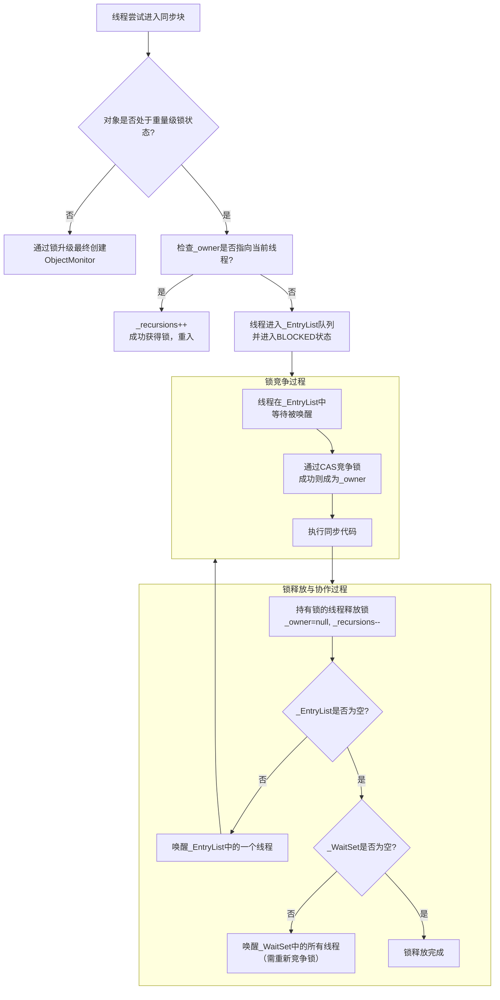

# 重量级锁

## 1.什么是重量级锁

重量级锁的核心不再依赖于用户态的 CAS 循环，而是直接依赖操作系统内核提供的 **互斥量（Mutex Lock）** 来实现线程同步。

**“重量”体现在哪里？**

- **系统调用**：需要从用户态（User Mode）切换到内核态（Kernel Mode），请求操作系统协助管理线程的阻塞与唤醒。
- **线程状态转换**：未抢到锁的线程会被挂起（Blocked），从“可运行状态”进入“阻塞状态”。当锁被释放时，操作系统需要唤醒被阻塞的线程。
- **开销大**：这种用户态/内核态的切换以及线程的上下文切换（Context Switch）需要消耗大量的 CPU 时间，其操作成本远高于在用户态执行几条指令。

简单来说，**轻量级锁是在用户态“自己解决问题”（自旋），而重量级锁是“找操作系统老大帮忙裁决”**，后者虽然绝对正确且能应对最复杂的竞争，但“请示汇报”的过程非常耗时。

------

## 2.Monitor

重量级锁的语义是通过 **ObjectMonitor** 来实现的，即 **管程（Monitor）** 模型。⽽ObjectMonitor又依赖于操作系统底层的Mutex Lock（互斥锁）实现。

Monitor可以理解为⼀个同步⼯具或⼀种同步机制，通常被描述为⼀个对象。

在 JVM 中，每个 Java 对象都可以关联一个 `ObjectMonitor` 对象来控制线程对该对象的访问。

当一个对象升级为重量级锁后，它的**对象头Mark Word**中的内容会被替换为一个指向这个 `ObjectMonitor` 对象的指针。

`ObjectMonitor` 位于 `hotspot/src/share/vm/runtime/objectMonitor.hpp`。

`ObjectMonitor` 的核心结构如下（源于 HotSpot 虚拟机源码）：

```c++
ObjectMonitor() {
    _header       = NULL;    // 存储原始的 Mark Word
    _count        = 0;       // 重入次数计数器
    _waiters      = 0,       // 等待线程数（处于 wait 状态的）
    _recursions   = 0;       // 锁的重入次数
    _object       = NULL;    // 关联的 Java 对象
    _owner        = NULL;    // 指向当前持有锁的线程
    _WaitSet      = NULL;    // 等待队列：处于 WAITING 状态的线程（调用了 wait() 方法）
    _WaitSetLock  = 0 ;
    _EntryList    = NULL;    // 阻塞队列：处于 BLOCKED 状态的线程（等待锁）
    _cxq          = NULL:    // 优化竞争的单向链表（新竞争线程先入此队列）
}
```



### 1). 线程所有权与重入计数  

- `_owner`：`void*` 类型，指向当前持有Monitor的线程（Java线程的底层 `JavaThread` 对象）。若为 `null`，表示Monitor未被任何线程持有。  
- `_recursions`：`int` 类型，记录当前线程对Monitor的**重入次数**（解决 `synchronized` 的可重入性）。例如，同一线程多次进入同步块时，`_recursions` 递增，退出时递减，直到为0才释放Monitor。  


### 2). 线程等待队列  

- `_entryList`：双向链表，存储**竞争锁失败的线程**（状态为 `BLOCKED`）。这些线程在Monitor的入口处等待，故称为“入口集”。  
- `_waitSet`：双向链表，存储调用 `wait()` 方法后释放锁并等待唤醒的线程（状态为 `WAITING` 或 `TIMED_WAITING`）。这些线程需通过 `notify()` 或 `notifyAll()` 唤醒后，重新进入 `_entryList` 竞争锁。  


### 3). 锁竞争与线程调度  

- `_count`：`int` 类型，记录当前持有Monitor的线程对锁的“占用次数”（与 `_recursions` 配合实现重入）。  
- `_cxq`（Contention Queue）：单向链表，用于**优化线程竞争**。新竞争锁失败的线程会先进入 `_cxq`，后续由JVM调度迁移到 `_entryList`，减少对 `_entryList` 的频繁修改（CAS操作更高效）。  

------

## 3. Monitor设计目标

Monitor的底层结构设计围绕以下核心目标优化：  

- **互斥性**：通过 `_owner` 字段确保同一时间仅一个线程持有锁。  
- **可重入性**：通过 `_recursions` 支持同一线程多次获取同一锁。  
- **高效调度**：通过 `_cxq` 和 `_entryList` 分离竞争线程的快速入队与调度，减少对共享队列的频繁修改。  
- **协作支持**：通过 `_waitSet` 实现线程间的等待-通知（`wait/notify`）机制。  

Monitor是JVM实现 `synchronized` 的底层基石，通过 `_owner`、`_entryList`、`_waitSet` 等字段管理线程的互斥与协作。

## 4.重量级锁流程

1. **锁膨胀（Inflate）**：
   - 当轻量级锁在自旋失败后，会触发锁膨胀。
   - JVM 会为锁对象创建一个 `ObjectMonitor` 对象，并将对象的 Mark Word 指向它。
   - 此时，锁正式升级为重量级锁，标志位变为 `10`。
2. **线程竞争（如下图“锁竞争过程”）**：
   - 线程想要获得锁，会先进入 `_EntryList` 队列中阻塞等待（`BLOCKED` 状态）。
   - 当持有锁的线程（`_owner`）释放锁后，`_EntryList` 中的线程会被唤醒，并尝试通过 CAS 操作去竞争锁，抢到的线程成为新的 `_owner`。
3. **线程协作（如下图“锁释放与协作过程”）**：
   - 如果持有锁的线程调用 `object.wait()` 方法，它会释放锁，然后自身被加入到 `_WaitSet` 队列中，变为 `WAITING` 状态。
   - 当其他线程调用 `object.notify()` 或 `notifyAll()` 时，`_WaitSet` 中的线程会被移回 `_EntryList`，重新参与锁竞争。


------

## 5. 优缺点与适用场景

*   **优点**：
    *   **功能完备**：提供了完整的同步机制，包括 `wait/notify`。
    *   **应对激烈竞争**：在**高强度竞争**的场景下，它是唯一正确的选择。自旋锁会浪费大量 CPU 资源，而重量级锁将线程挂起，避免了 CPU 的空转，让 CPU 可以去执行其他任务。

*   **缺点**：
    *   **性能开销巨大**：用户态/内核态的切换、线程的阻塞和唤醒都是非常耗时的操作，导致性能最低。

*   **适用场景**：
    *   **锁竞争非常激烈**：同步块执行时间较长，或者总有多个线程同时在争抢锁。
    *   **需要调用 `wait/notify` 方法**：这些方法的功能依赖于 `ObjectMonitor`，因此必须使用重量级锁。

---

## 6. 总结与对比

| 特性         | 轻量级锁                             | 重量级锁                                      |
| :----------- | :----------------------------------- | :-------------------------------------------- |
| **实现机制** | **用户态** CAS + 自旋                | **内核态** 互斥量 (Mutex)                     |
| **线程状态** | 始终处于 **RUNNABLE**（自旋）        | 竞争失败进入 **BLOCKED**（挂起）              |
| **开销**     | **小**（消耗CPU时间片）              | **大**（系统调用、上下文切换）                |
| **本质**     | **乐观锁**（认为竞争不激烈，先试试） | **悲观锁**（认为竞争激烈，直接排队）          |
| **适用场景** | 追求响应时间，**低竞争**，同步块小   | **高竞争**，同步块执行时间长，需`wait/notify` |

## 7.核心思想

Java 的 `synchronized` 锁升级策略（无锁 -> 偏向 -> 轻量 -> 重量）是一种 **“按需付费”** 的优化思想。

它假设大多数情况是没有竞争或低竞争的，因此先用成本最低的方式（偏向、轻量）尝试。

只有在不得已的情况下，才会付出最高的成本（重量级），从而在大多数场景下获得更高的性能，同时又能保证在所有场景下的正确性。

简单比喻：

*   **轻量级锁**：顾客不多，顾客（线程）看到收银台空着就自己上去操作（CAS），如果被人占了就等一会儿再看（自旋）。
*   **重量级锁**：顾客排长队，必须有一个正式的排队机制（`_EntryList`），由经理（操作系统）叫号，没叫到的顾客（线程）只能原地休息（阻塞），不能去干别的。