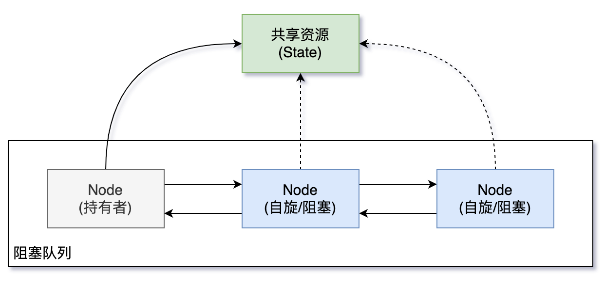

# AQS 

## AbstractQueuedSynchronizer 

⼀个⽤来构建锁和同步器的框架，AQS 被认为是 JUC 的核心，许多的经典的同步器都是基于AQS构建出来的。

1. `CountDownLatch`：倒计时器，用来控制一个或者多个线程等待多个线程。
2. `CyclicBarrier`：循环屏障，用来控制多个线程互相等待，只有当多个线程都到达时，这些线程才会继续执行。
3. `Semaphored`：信号量，类似于操作系统中的信号量，可以控制对互斥资源的访问线程数。
4. `ReentrantLock`：可重入锁。

AQS通过一个FIFO队列维护线程同步状态，实现类只需要继承该类，并重写指定方法即可实现一套线程同步机制。

AQS根据资源互斥级别提供了独占和共享两种资源访问模式，同时其定义`Condition`结构提供了`wait`/`signal`等待唤醒机制。

- `Exclusive`（独占）：只有一个线程能执行，如`ReentrantLock`。
- `Share`（共享）：多个线程可同时执行，如`Semaphore`/`CountDownLatch`。

## AQS原理（双向队列，volatile 变量）

AQS维护了一个`volatile int state`变量和一个`CLH`双向队列(三个人名缩写)。

队列中的节点持有线程引用，每个节点均可通过`getState()`、`setState()`和`compareAndSetState()`对`state`进行修改和访问（CAS）。

当线程获取锁时，即试图对`state`变量做修改。

- 如修改成功，则获取锁。
- 如修改失败，则包装为节点挂载到队列中，等待持有锁的线程释放锁，并唤醒队列中的节点。



## CountDownLatch

用来控制**一个或者多个线程等待多个线程**。

- 维护了一个计数器 `cnt`；
- 每次调用 `countDown()` 方法`cnt`减1；
- 减到 0 时，那些因为调用 `await()` 方法陷入等待的线程就会被唤醒。

```java
/**
 * @author: Ban
 * @description: <p>
 * 用来控制一个或者多个线程等待多个线程。
 */
public class CountdownLatchExample {
    public static void main(String[] args) throws InterruptedException {
        final int totalThread = 10;
        CountDownLatch countDownLatch = new CountDownLatch(totalThread);
        ExecutorService executorService = Executors.newCachedThreadPool();
        for (int i = 0; i < totalThread; i++) {
            executorService.execute(() -> {
                System.out.print("run..");
                countDownLatch.countDown();
            });
        }
        // 等待，只有 cnt 为0时，才会被唤醒
        countDownLatch.await();
        System.out.println("end");
        executorService.shutdown();
    }
}
```

------

## CyclicBarrier(**循环屏障**)

用来**控制多个线程互相等待**，只有当多个线程都到达时，这些线程才会继续执行。

- 维护了一个计数器 `cnt`；
- 线程执行 `await()` 方法之后`cnt`减1，并进行等待；
- 直到`cnt`为 0，所有调用 `await()` 方法而在等待的线程才能继续执行。

`CyclicBarrier` 有两个构造函数。

- `parties`指示计数器的初始值；
- `barrierAction` 在所有线程都到达屏障时会执行一次。

`CyclicBarrier` 和` CountdownLatch` 的一个区别：

- `CyclicBarrier` 的计数器通过调用 `reset()` 方法可以循环使用，所以才叫做循环屏障。

```java
/**
 * @author: Ban
 * @description: <p>
 * 用来控制多个线程互相等待，只有当多个线程都到达时，这些线程才会继续执行。
 */
public class CyclicBarrierExample {
    public static void main(String[] args) {
        final int totalThread = 10;
        CyclicBarrier cyclicBarrier = new CyclicBarrier(totalThread);
        ExecutorService executorService = Executors.newCachedThreadPool();
        for (int i = 0; i < totalThread; i++) {
            executorService.execute(() -> {
                System.out.print("before..");
                try {
                    cyclicBarrier.await(); // 每次调用await，计数器减1
                } catch (InterruptedException | BrokenBarrierException e) {
                    e.printStackTrace();
                }
                System.out.print("after..");
            });
        }
        executorService.shutdown();
    }
}
```


## Semaphore（信号量）

`Semaphore` 类似于操作系统中的信号量，可以**控制对互斥资源的访问线程数**。

`Semaphore semaphore = new Semaphore(clientCount);`

- `clientCount`=3，对互斥资源的访问线程数为3
- `clientCount`=1，对互斥资源的访问线程数为1

