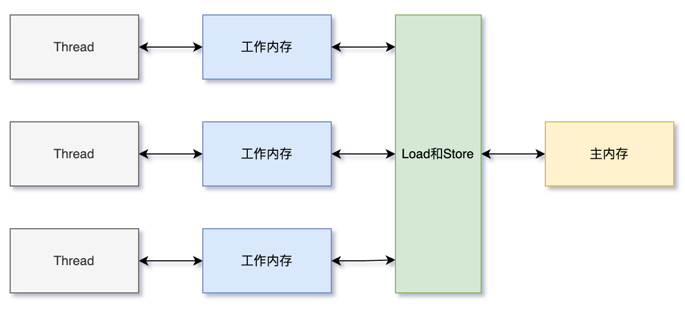
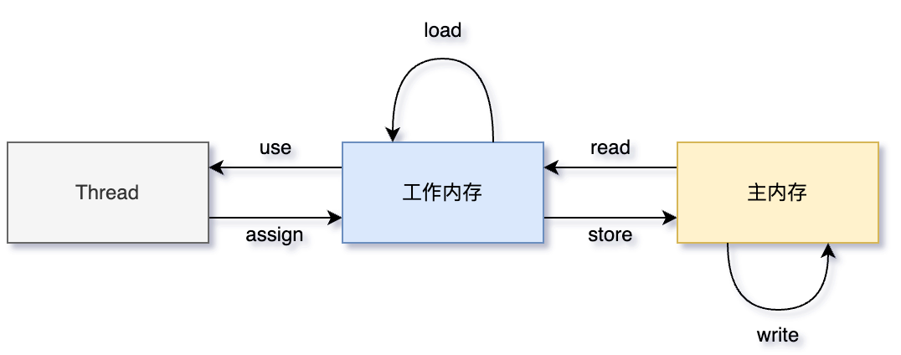
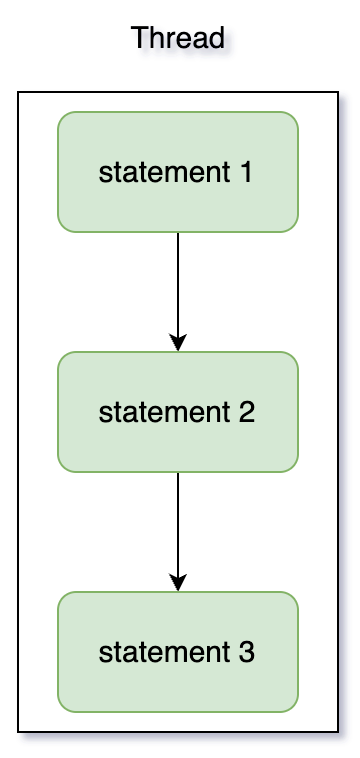
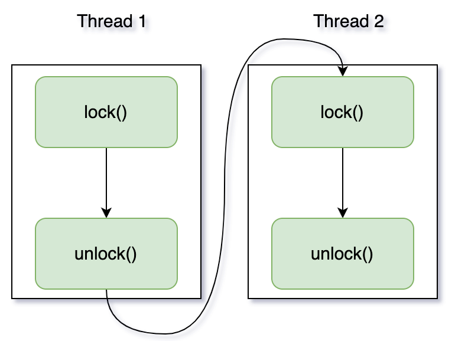
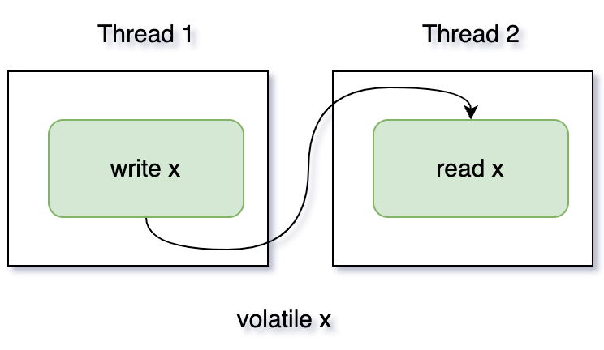
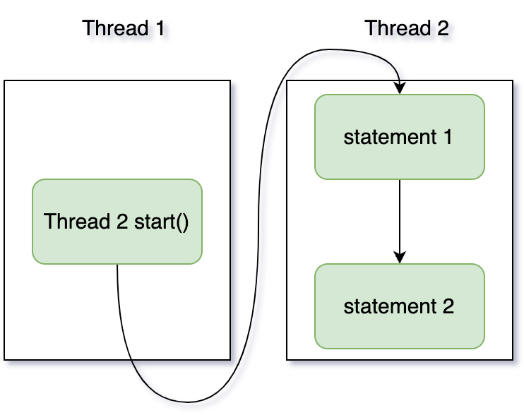
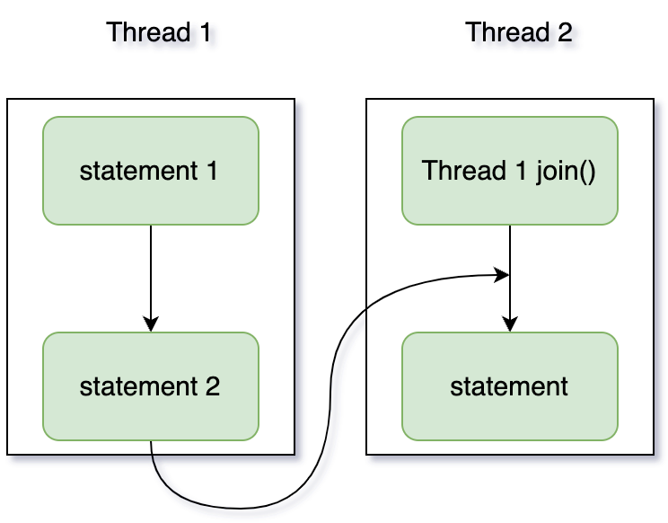

# Java内存模型

## JMM定义

**内存模型：在特定的操作协议下，对特定的内存或高速缓存进⾏读写访问的过程抽象**。

不同的硬件之间的内存模型有些许差异，Java内存模型(JMM)屏蔽各种硬件和操作系统的内存访问差异，以实现让Java程序在各种平台下都能达到⼀致的内存访问效果。

## 并发编程的通信和同步

在并发编程中，**线程间通信有两种模型：共享内存和消息传递**。

### 共享内存

- 共享内存是指线程间共享，通过读写内存中的公共状态来实现隐式通信。
- 共享内存的同步是显式执⾏的，必须显⽰的指定某个⽅法或者某段代码在程序之间互斥执⾏。

### 消息传递

- 消息传递线程间没有共享状态，线程间必须通过发送/接受消息来进⾏显式通信。
- 消息传递的同步是隐式执⾏的，消息的发送⼀定在消息的接受之前。

**Java采⽤的是共享内存模型：隐式通信、显式同步**。

- 共享内存存在缓存一致性问题。

## 缓存一致性

**存储器层次结构：寄存器 > Cache > 内存**。

高速缓存带来了一个新问题，缓存一致性：

- 如果多个缓存共享同一块主内存区域，那么多个缓存的数据可能会不一致，需要协议来解决，保证缓存一致性。

## 主内存与线程工作内存

所有变量都存储在主内存中，线程共享。

线程有自己的工作内存，工作内存在高速缓存或者寄存器中，保存了该线程使用的变量主内存副本拷贝。

线程只能直接操作工作内存中的变量，线程之间的变量值传递需要通过主内存来完成（共享内存），所以存在缓存一致性问题。



- 主内存对应于Java堆内存中的数据部分（对象等）。

- 局部变量表和⽅法参数等线程私有，不会被共享，分配在线程虚拟机栈上。

## 内存间交互操作(原子操作)



- read：把一个变量的值从主内存传输到工作内存中
- load：在 read 之后执行，把 read 得到的值放入工作内存的变量副本中
- use：把工作内存中一个变量的值传递给执行引擎
- assign：把一个从执行引擎接收到的值赋给工作内存的变量
- store：把工作内存的一个变量的值传送到主内存中
- write：在 store 之后执行，把 store 得到的值放入主内存的变量中
- lock：加锁，作用于主内存的变量
- unlock：解锁，作用于主内存的变量

相关规则

- unlock 必须在lock 之后
- read、load两两成对
- store、write两两成对

## volatile内存语义实现(限制重排序)

### 1.load和store

和volatile相关的记住两个重要操作：load和store。

### 2.限制部分重排序

变量被volatile标注会限制⼀部分重排序，防止结果被改变。

| 是否能重排序   | 第二个操作 |             |             |
| -------------- | ---------- | ----------- | ----------- |
| **第一个操作** | 普通读/写  | volatile 读 | volatile 写 |
| 普通读/写      |            |             | NO          |
| volatile 读    | NO         | NO          | NO          |
| volatile 写    |            | NO          | NO          |

1. 第一个操作是volatile 读，不允许重排序，确保volatile 读之后的操作不会被编译器重排序到 volatile 读之前。
2. 第二个操作是volatile 写，不允许重排序，确保volatile 写之前的操作不会被编译器重排序到 volatile 写之后。
3. 第一个操作是volatile 写，第二个操作是volatile 读/写，不允许重排序。

## final内存语义(限制重排序)

对于 final 域，编译器和处理器要遵守排序规则。

1. 这两个操作之间不能重排序（先写入final值再引用）
   1. **构造函数内对 `final` 域的写入**
   1. **随后将被构造对象的引用赋值给一个引用变量**


2. 这两个操作之间不能重排序（先读引用再读final值）
   1. **初次读一个包含 `final` 域的对象的引用**
   1. **随后初次读这个 `final` 域**

3. 这两个操作之间不能重排序
   1. **在构造函数内对一个 `final` 引用的对象的成员域的写入**
   2. **随后在构造函数外将被构造对象的引用赋值给一个引用变量**

`final` 语义还保证了内存的可见性：

- **`final` 域的写入：** 在构造函数中对一个 `final` 域的写入，**会确保该写入操作对其它线程可见**（即会将值从当前线程的工作内存刷新到主内存）。
- **`final` 域的读取：** 读一个 `final` 域，**会确保从主内存中读取最新的值**（即会使当前线程的工作内存中该 `final` 域的缓存失效）。

| 场景                      | 规则描述                                                     | 保证效果                                                     |
| :------------------------ | :----------------------------------------------------------- | :----------------------------------------------------------- |
| **`final` 基本类型/引用** | 禁止将构造函数内的 `final` 域写入重排序到对象发布之后。      | 只要对象正确发布，任何线程看到的 `final` 域都是构造完成的值。 |
| **读取顺序**              | 禁止初次读对象引用与初次读该对象的 `final` 域这两个操作重排序。 | 保证了读取 `final` 域时，对象引用一定是有效的。              |
| **`final` 引用类型内部**  | 禁止将构造函数内对 `final` 引用所指对象的修改重排序到对象发布之后。 | 防止了“内部 `this` 逃逸”，保证了 `final` 引用所指对象的内部状态在发布时已初始化完毕。 |

**重要前提：**

这些强大的保证都有一个**共同的前提：对象必须被正确地构造和发布，不能发生“`this` 逃逸”**。

正确使用 `final` 并结合安全的对象发布实践（如避免 `this` 逃逸），是编写无需同步就能实现线程安全的不可变对象的关键。

## 内存屏障

### 1.为什么需要内存屏障？

想象一下现代计算机的架构：

1. **多级缓存**：CPU 有自己独占的 L1、L2 缓存，以及共享的 L3 缓存。这是为了弥补 CPU 高速和内存低速之间的差距。
2. **指令重排序**：编译器和 CPU 为了优化性能，会打乱没有数据依赖的指令的执行顺序。

这带来了两个问题：

1. **可见性 (Visibility)**：一个 CPU 核心修改了数据，该数据可能只停留在其本地缓存中，未能及时写回主内存，导致其他核心看不到这个更改。
2. **有序性 (Ordering)**：重排序可能破坏多线程程序固有的逻辑顺序，导致程序行为错误。

**内存屏障就是为了解决这两个问题而插入的一个“特殊指令”。** 它就像一个“栅栏”，强制完成某些操作，并禁止指令跨越这个栅栏进行重排序。

### 2.内存屏障的作用

内存屏障主要提供两大保障：

1. **确保可见性**：强制将写缓冲区/缓存中的数据**刷回主内存**，并**使其他CPU中对应的缓存行失效**。这保证了屏障之后的读操作一定能读到最新的值。
2. **确保有序性**：**阻止屏障两侧的指令进行重排序**。编译器和CPU遇到内存屏障时，必须严格遵守屏障的约束。

### 3.JMM 中的四种内存屏障

Java 内存模型（JMM）根据不同的需求，抽象出了四种类型的内存屏障。

JVM 会在编译时在生成的机器码中相应地插入这些屏障指令（如 x86 架构上的 `mfence`, `lfence`, `sfence` 等）。

| 屏障类型       | 英文全称            | 指令示例                     | 作用                                                         |
| :------------- | :------------------ | :--------------------------- | :----------------------------------------------------------- |
| **LoadLoad**   | Load-Load Barrier   | `Load1; LoadLoad; Load2`     | 确保 `Load1` 的数据装载操作先于 `Load2` **及之后所有装载指令**执行。 |
| **StoreStore** | Store-Store Barrier | `Store1; StoreStore; Store2` | 确保 `Store1` 的数据刷新到内存操作先于 `Store2` **及之后所有存储指令**执行，并且对其他处理器可见。 |
| **LoadStore**  | Load-Store Barrier  | `Load1; LoadStore; Store2`   | 确保 `Load1` 的数据装载操作先于 `Store2` **及之后所有存储指令**执行。 |
| **StoreLoad**  | Store-Load Barrier  | `Store1; StoreLoad; Load2`   | 确保 `Store1` 的数据刷新到内存并对其他处理器可见的操作先于 `Load2` **及之后所有装载指令**执行。**这是开销最大的屏障，因为它同时具备了其他三种屏障的效果。** |

### 4.内存屏障在 Java 中的实际应用

你不需要直接使用内存屏障，但你在使用高级关键字时，JVM 会自动为你插入它们。

#### 1). `volatile` 变量的写操作

对一个 `volatile` 变量进行写操作时，JMM 会在写指令后插入一个 **`StoreStore`** 屏障，并在之后插入一个 **`StoreLoad`** 屏障。

```java
// Java 代码
instance = new Singleton(); // volatile 写

// 近似等效的屏障插入（概念上）
// ... 初始化对象的操作 ...
StoreStore Barrier; // 1. 保证上面的普通写操作（如初始化字段）在 volatile 写之前已完成并刷新
instance = ...;     // volatile 写操作本身
StoreLoad Barrier;  // 2. 保证 volatile 写操作完成后，任何后续的读操作都能看到这个结果
```

**作用**：这确保了当一个线程写 `volatile` 变量时，任何在此之前的所有普通变量的写操作都**已经完成并对其他线程可见**（解决了有序性）。同时，这个写操作本身也会立刻对其他线程可见（解决了可见性）。

#### 2). `volatile` 变量的读操作

对一个 `volatile` 变量进行读操作时，JMM 会在读指令前插入一个 **`LoadLoad`** 屏障，并在之后插入一个 **`LoadStore`** 屏障。

```java
// Java 代码
if (instance != null) { // volatile 读

// 近似等效的屏障插入（概念上）
LoadLoad Barrier;    // 1. 保证 volatile 读之前，所有之前的读操作已完成
... = instance;      // volatile 读操作本身
LoadStore Barrier;   // 2. 保证 volatile 读之后，任何后续的写操作才能开始
```

**作用**：这确保了当一个线程读 `volatile` 变量时，它一定能看到**最近一次**对这个变量的写操作（解决了可见性）。同时，它还能防止这个读操作与其后的任何读写操作进行重排序（解决了有序性）。

#### 3). `synchronized` 同步块

`synchronized` 同步块的**入口**在获取锁（monitorenter）时，其语义相当于一个 **`LoadLoad`** 和 **`LoadStore`** 屏障。而**出口**在释放锁（monitorexit）时，其语义相当于一个 **`StoreStore`** 和 **`StoreLoad`** 屏障。

**作用**：这确保了线程在进入同步块时，能看到之前线程在同步块内修改的所有最新结果（可见性）。在退出同步块时，能保证本线程的修改全部刷新到主内存，并对后续获得锁的线程可见（可见性和有序性）。

#### 4). `final` 字段

在构造函数中对 `final` 字段的赋值之后，以及在构造函数return之前，JMM 会插入一个 **`StoreStore`** 屏障。

**作用**：这确保了 `final` 字段的初始化值（以及通过它可达的其他对象的初始化值）在构造函数完成、对象引用被发布给其他线程时，一定是已经正确初始化的，防止了“`this` 逃逸”问题。

---

### 5.总结与类比

| 特性                   | 说明                                                         |
| :--------------------- | :----------------------------------------------------------- |
| **本质**               | 一组**CPU指令**，是硬件级别的概念，由 JVM 根据 JMM 规则在编译期插入。 |
| **核心作用**           | **1. 保证可见性；2. 保证有序性。**                           |
| **与高级关键字的关系** | `volatile`, `synchronized`, `final` 的语义是 **“承诺”** ，而**内存屏障是实现这些“承诺”的“手段”**。 |
| **开销**               | 内存屏障会**抑制编译器和CPU的优化**，强制刷新缓存，因此会带来性能开销。`StoreLoad` 屏障开销最大。 |
| **对程序员的价值**     | 你不需要直接操作内存屏障。理解它有助于你**从根本上理解** `volatile` 等关键字是如何工作的，从而能更自信地编写正确的并发代码。 |

你可以把内存屏障想象成**交通警察**：

*   在一条复杂的多车道高速路上（多核CPU），车辆（指令）可以超车、变道（重排序）。
*   内存屏障就是警察设置的一个**检查点**，他要求：
    1.  **所有车辆必须在此停下，确保信息同步**（刷新缓存，保证可见性）。
    2.  **在检查点之前的所有车辆必须全部通过后，后面的车辆才能继续行驶**（禁止重排序，保证有序性）。

正是这些无处不在的“警察”，维持着并发世界里的秩序。

## 内存模型三大特性

### 1.原子性

原子性：不可被中断的一个或一系列操作

read、load、use、assign、store、write、lock 和 unlock 操作具有原子性，单个操作具备原子性 。

Java通过**锁和循环CAS**的方式实现原子操作

- 显式锁-`Lock`、隐式锁-`synchronized`
  - 对应的内存间交互操作为：lock 和 unlock
  - 在虚拟机实现上对应的字节码指令为 monitorenter 和 monitorexit

- CAS(乐观锁)-JUC的原子类

### 2.可见性

可见性：当一个线程修改了共享变量的值，其它线程能够立即得知这个修改。

主要有三种实现可见性的方式：

1. `volatile`，不能保证原子性，两条实现原则：
   1. `Lock`前缀指令会引起处理器**缓存回写到内存**。
   2. 一个处理器的缓存回写到内存操作会导致其它处理器的**缓存失效** 。
2. `synchronized`，对一个变量执行 unlock  操作之前，必须把变量值同步回主内存。
3. `final` ，只要对象引用本身是正确发布的（没有发生 `this` 逃逸），任何线程都能看到 `final` 字段被构造函数正确初始化后的值。

### 3. 有序性

有序性：**在多线程环境下**，虽然一个线程内部的指令可能被重排序，但通过 Java 内存模型提供的一系列规则，保证所有线程的操作都是按某种“正确的”顺序执行的。从而保证程序执行结果的正确性。

JMM 的有序性**并不禁止重排序**，而是**通过规则约束重排序的发生条件**，使得即使发生了重排序，从程序执行结果上看，也**像是**没有重排序一样。

JMM 解决有序性问题的核心工具就是 **`Happens-Before` 规则**。例如

- `volatile`通过添加内存屏障来禁止指令重排，即重排序时不能把后面的指令放到内存屏障之前。
- `synchronized`保证每个时刻只有一个线程执行同步代码，相当于是让线程顺序执行同步代码。

## 重排序

现代计算机系统和编译器为了极致的性能，会对指令进行各种优化，这些优化会改变指令的执行顺序。

**1. 编译器的重排序**
**编译器在不改变单线程程序语义的前提下，可能会重新排列语句的顺序，以利用CPU指令流水线，提高执行效率。**

**2. 处理器(指令)的重排序**
现代CPU普遍采用**指令级并行（ILP）** 技术。为了避免空闲等待（比如IO），CPU可能会将多条指令乱序执行（Out-of-Order Execution）。

**3. 内存系统的重排序**
由于CPU有多级缓存（L1, L2, L3），一个处理器对内存的写操作可能不会立即对其他处理器可见，导致其他处理器看到的操作顺序与实际执行顺序不一致。


## as-if-serial 语义

### 1.定义

**语义：不管编译器和处理器如何进行重排序优化（为了提升执行效率），单线程程序的执行结果不能被改变。**

换句话说，编译器和处理器可以“为所欲为”地重新排列指令的执行顺序，但必须保证在**单线程**的视角下，最终看到的结果和严格按照代码顺序（程序次序）执行的结果是完全一致的。

### 2.为什么需要 as-if-serial

现代计算机为了极致性能，会做大量优化：

1. **编译器优化重排序**：编译器在不改变语义的前提下，重新安排语句顺序。
2. **指令级并行重排序**：CPU 采用流水线技术，将多条指令重叠执行，如果后续指令不依赖前面指令的结果，就可以先执行。
3. **内存系统重排序**：由于 CPU 存在多级缓存，读写操作可能以与程序顺序不同的顺序被提交到主内存。

如果没有约束，这些重排序会让程序运行结果变得不可预测。

**as-if-serial 语义就是给这些优化套上的“缰绳”**，它告诉编译器和处理器：“你们可以优化，但必须假装是串行执行的，不能露出马脚。”

### 3.关键原理：数据依赖性

编译器和处理器是否会对两个操作进行重排序，关键在于这两个操作之间是否存在**数据依赖性**。

如果两个操作**访问同⼀个变量**，且这两个操作中**有⼀个为写操作**，此时这两个操作之间就**存在数据依赖性**。

**数据依赖性主要分为三种：**

1. **写后读 (Read After Write, RAW)**
   - `a = 1; b = a;`
   - 后一条语句 `b = a` 依赖于前一条语句 `a = 1` 的结果。**这种顺序绝对不能重排**，否则 `b` 会得到错误的 `a` 值。
2. **写后写 (Write After Write, WAW)**
   - `a = 1; a = 2;`
   - 两条语句都对同一个变量写入。**不能重排**，否则 `a` 的最终值会是 `1` 而不是 `2`。
3. **读后写 (Read After Write, WAR)**
   - `b = a; a = 1;` (注意：在 JMM 中，由于指令重排序，这种依赖比较微妙，但编译器会谨慎处理)
   - 如果重排序，先执行 `a = 1`，再执行 `b = a`，那么 `b` 的值就从原来的 `a` 变成了 `1`，结果被改变。**这种顺序也不能重排**。

**结论：如果两个操作访问同一个变量，且其中一个是写操作，并且这两个操作之间存在数据依赖关系，那么编译器和处理器就不会对它们进行重排序。**

### 4.举例说明

```java
int a = 1;    // 语句 1
int b = 2;    // 语句 2
int c = a + b; // 语句 3
```

这段代码存在两个数据依赖：

1. 语句 3 依赖于语句 1 (`a`)。
2. 语句 3 依赖于语句 2 (`b`)。

**根据 as-if-serial 语义：**

- **语句 1 和 语句 2** 之间**没有数据依赖**。编译器和处理器可以自由地对它们进行重排序。可能先执行语句 1，也可能先执行语句 2。这对最终结果没有任何影响。
- **语句 3** **不能**被重排序到语句 1 或语句 2 之前，因为它依赖于它们的结果。

所以，可能的执行顺序有：

- `1 -> 2 -> 3` (原始顺序)
- `2 -> 1 -> 3` (重排序后)

无论哪种顺序，最终结果都是 `c = 3`。这就是 as-if-serial 语义的体现：**优化是允许的，但结果必须和代码顺序执行的结果一致。**

### 5.as-if-serial 与 JMM 的关系

这是一个极其重要的区分点：

| 特性         | **as-if-serial**                       | **Java 内存模型 (JMM)**                                      |
| :----------- | :------------------------------------- | :----------------------------------------------------------- |
| **关注点**   | **单线程**程序的正确性。               | **多线程**环境下，各个线程之间工作内存与主内存之间的数据一致性、可见性和有序性。 |
| **保证**     | 保证单线程程序的执行结果不被改变。     | 为程序员提供了一系列同步手段（如 `volatile`, `synchronized`, `happens-before`），**在正确同步的前提下**，保证多线程程序的执行结果。 |
| **与重排序** | **允许**任意不影响单线程结果的重排序。 | **允许**编译器和处理器进行重排序，但通过内存屏障和 `happens-before` 规则**限制**某些在单线程下允许、但在多线程下会出问题的重排序。 |

**关系比喻：**

- **as-if-serial** 是 JMM 的 **“初心”** 或 **“底线”**。它保证了即使在最复杂的底层优化下，单线程程序依然能正确运行。
- **JMM** 是 **as-if-serial 语义在多线程世界的扩展**。它告诉程序员，如果你不做任何同步（`synchronized`, `volatile` 等），那么 JMM 对线程之间的操作顺序几乎不做任何保证，可能会出现重排序导致的问题。但如果你使用了正确的同步，JMM 就会提供强大的 `happens-before` 保证，使得多线程程序的行为变得可预测。

### 6.总结

1. **as-if-serial 语义**是保证**单线程程序**结果正确的基石。
2. 它**允许**编译器和处理器进行任何**不改变单线程程序结果**的重排序优化。
3. 判断能否重排序的核心是分析操作之间是否存在**数据依赖性**。
4. 它是理解更复杂的多线程 **Java 内存模型 (JMM)** 的基础。JMM 在 as-if-serial 的基础上，增加了对多线程交互行为的规则和约束。

## 顺序⼀致性模型

顺序⼀致性模型是⼀种理想化理论参考模型。

1. ⼀个线程中的所有操作必须按照程序的顺序来执⾏（串⾏执⾏）。
2. 所有线程都只能看到⼀个单⼀的操作执⾏顺序。
3. 在顺序⼀致性内存模型中，每个操作都必须原⼦执⾏且⽴刻对所有线程可见。

JMM并没有实现顺序⼀致模型，因为那样的成本太⼤了，各种优化措施都不能⽤。

JMM只保证：如果程序正确同步，程序的执⾏将具有顺序⼀致性，即程序的执⾏结果与该程序在顺序⼀致性内存模型中的执⾏结果相同。

- 注意：执⾏结果相同，并不是按照⼀致性执⾏，JMM允许重排序且只有在正确同步下才能保证可见性。

对于未同步或未正确同步的多线程程序，JMM 只提供最⼩安全性。

- 线程读取到的值，要么是默认值（0，null等），要么是其他线程写⼊的值。

## **happens-before（先行发生原则** ）

volatile 和 synchronized 来保证有序性。除此之外，JVM 还规定了**先行发生原则，**让一个操作无需控制就能先于另一个操作完成。

1. 单一线程原则



Single Thread rule

- 在一个线程内，在程序前面的操作先行发生于后面的操作。

2. 管程锁定规则



Monitor Lock Rule

- 一个 unlock 操作先行发生于后面对同一个锁的 lock 操作。

3. volatile 变量规则



Volatile Variable Rule

- 对一个 volatile 变量的写操作先行发生于后面对这个变量的读操作。

4. 线程启动规则



Thread Start Rule

- Thread 对象的 start() 方法调用先行发生于此线程的每一个动作。

5. 线程加入规则



Thread Join Rule

- Thread 对象的结束先行发生于 join() 方法返回。

6. 线程中断规则

Thread Interruption Rule

- 对线程 interrupt() 方法的调用先行发生于被中断线程的代码检测到中断事件的发生，可以通过 interrupted() 方法检测到是否有中断发生。

7. 对象终结规则

Finalizer Rule

- 一个对象的初始化完成（构造函数执行结束）先行发生于它的 finalize() 方法的开始。

8. 传递性

Transitivity

- 如果操作 A 先行发生于操作 B，操作 B 先行发生于操作 C，那么操作 A 先行发生于操作 C。