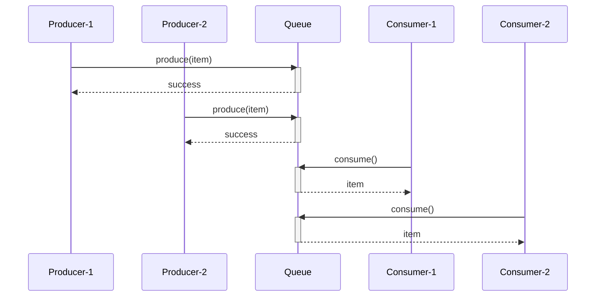

# 线程通信

## 一 wait/notify 机制

```java
public class ProducerConsumer {
    private final Queue<Integer> queue = new LinkedList<>();
    private final int capacity = 5;

    public void produce() throws InterruptedException {
        synchronized (queue) {
            while (queue.size() == capacity) {
                queue.wait();  // 队列满，等待
            }
            queue.offer(1);
            queue.notifyAll();  // 通知消费者
        }
    }

    public void consume() throws InterruptedException {
        synchronized (queue) {
            while (queue.isEmpty()) {
                queue.wait();  // 队列空，等待
            }
            queue.poll();
            queue.notifyAll();  // 通知生产者
        }
    }
}
```

## 二 生产者-消费者模型



## 三 其他通信方式

| 方式               | 说明                      |
| ------------------ | ------------------------- |
| **CountDownLatch** | 等待多个线程完成          |
| **CyclicBarrier**  | 多线程互相等待到达屏障点  |
| **Semaphore**      | 控制并发访问数量          |
| **Exchanger**      | 两个线程间交换数据        |
| **BlockingQueue**  | 阻塞队列实现生产者-消费者 |