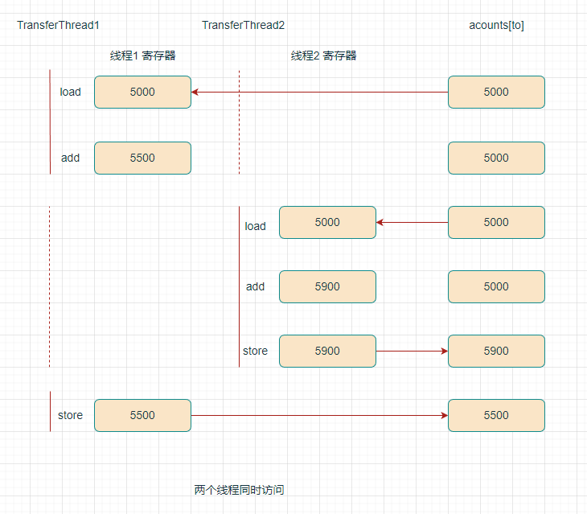

# 互斥同步

## 竞态条件

两个或两个以上线程需要共享对同一数据的存取 ，线程会相互覆盖，取决于线程访问数据的次序，可能导致数据被破坏。线程会相互覆盖，取决于线程访问数据的次序，可能导致数据被破坏。

- 指令操作（线程工作内存和主存之间的数据交换）：
  1. 将 `acounts[to]` 加载到 寄存器（线程工作内存）。
  2. 增加 `acounts[to]`。
  3. 将结果写入 `acounts[to]`（主存）。

- 线程1 会 覆盖 线程2 所做的 更新。

线程工作内存：一般在寄存器或者高速缓存。



## 锁对象

两种机制防止并发访问代码块，控制多个线程对共享资源的互斥访问（防止并发情况导致的数据不一致情况）

- `ReentrantLock`（重入锁）
- `synchronized`（内部锁）

## ReentrantLock（重入锁，显式锁）

基本结构如下：

```java
myLock.lock(); // a ReentrantLock object
try {
    Critical section
} finally {
    myLock.unlock(); // make sure the lock is unlocked even if an exception is thrown
}
```

- 任何时刻只有一个线程进入**临界区(对临界资源进行访问的那段代码)**，一旦一个线程锁定了锁对象，其它线程无法通过 `lock` 语句。
- 当其它线程调用`lock`时，它们会阻塞，直到第一个线程释放锁对象。
- `unlock` 放在 `finally`中，临界区若抛出异常，锁必须被释放，防止其它线程被永远堵塞。
- 使用锁时，不能使用 `try-with-resources`语句。

重入锁（`reentrant`）

- 线程可以反复获得已拥有的锁。
- 锁有一个持有计数 ，跟踪对`lock`方法的嵌套调用。
- 被一个锁保护的代码可以调用另一个使用相同锁的方法。

常用方法

`void lock()`

- 获得锁，如果锁被其它线程占用，则阻塞。

`void unlock()`

- 释放锁。

`new ReentrantLock()`

- 构造一个重入锁，保护临界区（代码）。

`new ReentrantLock(boolean fair)`

- 构造公平锁，倾向于等待时间最长的线程，影响性能。

### 条件对象

条件对象，也被称为条件变量，用来**管理获得锁却不能做有用工作的线程**（条件不满足，等待）

- 通常`await`调用放在如下形式的循环：

```java
while (!OK to proced) // 指定条件，不满足，等待
  sufficientFunds.await(); // 等待
```

 `await`

- 线程调用`await`方法后，放弃锁，进入等待集（`wait set`）。

- 线程无法自动激活，需要其它线程调用`signal` 或者 `signalAll` 方法。

 `signal`、`signalAll` 

- `signal` 从等待集中随机选择一个线程，解除阻塞。
- `signalAll` 等待集中的所有线程，解除阻塞。
- 激活后，从等待集中移出，进入`Runnable`状态，所有线程竞向访问对象，线程获得锁后，从之前暂停的地方继续执行。

方法

`Condition newCondition()`

- 返回与锁对象相关联的条件对象。

`void await() throws InterruptedException`

- 将该线程放在这个条件的等待集（`wait set`）。

`void signal()`

- 该条件的等待集中，随机选择一个线程，解除阻塞。

`void signalAll()`

- 该条件的等待集中，所有线程，解除阻塞。

### 总结

- 锁用来保护代码片段（临界区），一次只有一个线程执行被保护的代码。
- 锁可以管理试图进入被保护代码段的线程（通过条件对象）。

- 一个锁可以有一个或多个相关联的条件对象。

- 每个条件对象管理那些已经进入被保护代码段（获得锁） 但还不能运行的程序。

## synchronized（内部锁，隐式锁）

- Java每个对象都有一个内部锁（对象头）
- 内部对象锁只有一个条件对象

### 同步方法（只作用于同一个对象）

`synchronized` 修饰方法，线程调用同步方法获得内部锁。

只作用于同一个对象，如果调用两个对象上的同步代码块，就不会进行同步。

```java
public synchronized void method(){
    method body
}
// 等价于
public void method(){
    this.lock(); // 获得锁
    try
    {
        method body
    }
    finally
    {
        this.intrinsicLock.unlock(); // 释放锁
    }
}
```

### 同步块（只作用于同一个对象）

`synchronized` 修饰代码块，线程进入同步块获得内部锁。

锁是 `Synchonized` 括号⾥配置的对象。

```java
public void func() {
	synchronized (obj){ // obj是一个对象
		// ...
	}
}
```

### 同步静态方法（同步一个类）

`synchronized` 修饰静态方法，作用于整个类，即两个或多个线程调用同一个类的不同对象上的同步语句，也会进行同步。

获得类对象的内部锁，没有其它线程可以调用这个类的该方法或任何其它同步静态方法。

```java
public synchronized static void fun() {
	// ...
}
```

### 同步块（同步一个类）

`synchronized` 修饰静态代码块，作用于整个类。

锁是 `Synchonized` 括号⾥配置的类对象。

```java
public void func() {
   synchronized (类名.class) { // 类对象
		// ...
  }
}
```

## 只可在同步方法/块中使用的方法

`wait`、`notify`、`notifyAll`只可在同步方法/同步块中使用，否则会在运行时抛出 `IllegalMonitorStateException`。

`public final void wait() throws InterruptedException`

- 等价于`await`，但`await()` 可以指定等待的条件，更加灵活。
- 无参数，`waiting`（无限期等待）。
- 有参数，`Timed waiting`（限期等待）。

`public final native void notify()`

- 等价于`signal`。

`public final native void notifyAll()`

- 等价于`signalAll`。

## wait()注意事项

- 调用 `wait()` 使得线程等待某个条件满足，线程在等待时会被挂起。
- 当其它线程的运行使得这个条件满足时，其它线程会调用`notify()` 或者 `notifyAll()` 来唤醒挂起的线程。

- 使用 `wait()` 挂起期间，线程会释放锁。
- 如果没有释放锁，其它线程就无法进入对象的同步方法或者同步控制块中，那么就无法执行`notify()` 或者 `notifyAll()` 来唤醒挂起的线程，这样会造成死锁。

## 内部锁的限制

1. 不能中断一个正尝试获得锁线程。
2. 不能指定尝试获得锁时的超时时间。
3. 只有一个条件对象。

## 选择

1. `ReentrantLock`、`synchronized`最好都不使用，使用`JUC`包中的线程安全的集合。
2. 若使用，优先使用`synchronized`，`synchronized` 不用担心死锁问题，因为 JVM 会确保锁的释放。
3. 若多个条件对象，使用`Lock`/`Condition` 。

## synchronized 和 ReentrantLock 比较

1. 两者都是可重入锁
2. 锁的实现
   1. `synchronized` 是 JVM 实现的
   2. `ReentrantLock` 是 JDK 实现的。
3. 性能
   1. 高版本JDK对`synchronized`进行了很多优化，例如偏向锁、轻量锁、自旋锁。
4. 等待可中断
   1. `ReentrantLock`当持有锁的线程长期不释放锁时，正在等待的线程可以选择放弃等待，改为处理其它事情（指定超时时间）
   2. `ReentrantLock` 可中断，而 `synchronized` 不行。
5. 公平锁
   1. 公平锁是指多个线程在等待同一个锁时，必须按照申请锁的时间顺序来依次获得锁。
   2. `synchronized` 中的锁是非公平的，`ReentrantLock`默认情况下也是非公平的，但是也可以是公平的。
6. 锁绑定多个条件
   1. 一个 `ReentrantLock` 可以同时绑定多个 `Condition` 对象。
   2. `synchronized`只有一个条件对象。

## synchronized 和 Lock 有什么区别？

1. `synchronized` 可以给类、方法、代码块加锁；而 `Lock` 只能给代码块加锁。
2. `synchronized` 不需要手动获取锁和释放锁，使用简单，发生异常会自动释放锁，不会造成死锁。
3. `Lock` 需要自己加锁和释放锁，如果使用不当没有 `unLock()`去释放锁就会造成死锁。
4. `Lock` 可以知道有没有成功获取锁，而  `synchronized` 却无法办到。