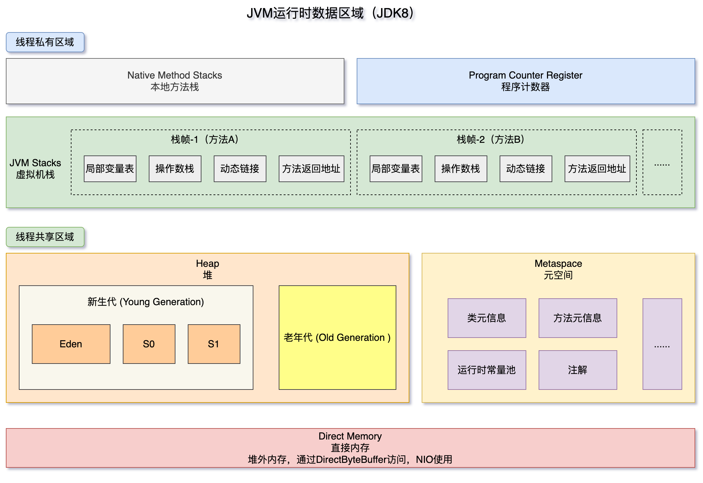
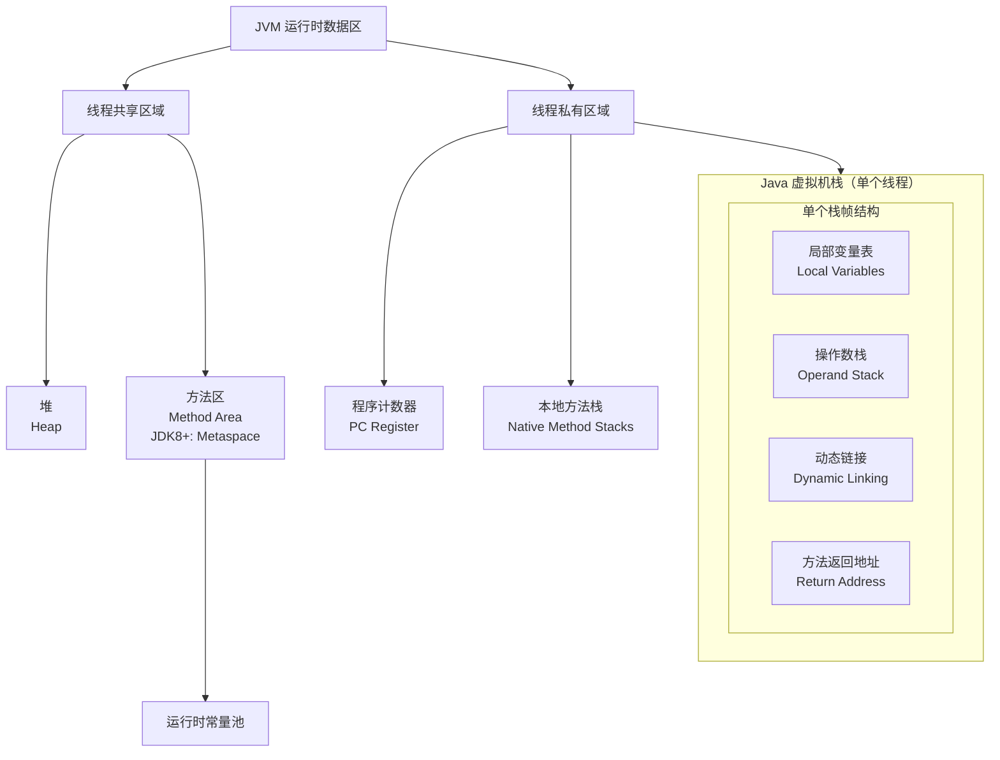

# 运行时数据区域





## 私有数据区

### 程序计数器

**定义**：一块较小的内存空间，可以看作是**当前线程所执行的字节码的行号指示器**。

**作用**：

- 字节码解释器通过改变这个计数器的值来选取下一条需要执行的字节码指令。
- 分支、循环、跳转、异常处理、线程恢复等基础功能都需要依赖这个计数器来完成。

**特点**：

- **线程私有**：每条线程都有一个独立的程序计数器，各条线程之间互不影响，独立存储。
- 如果线程正在执行的是一个 **Java 方法**，这个计数器记录的是正在执行的**虚拟机字节码指令的地址**。
- 如果正在执行的是 **Native 方法**（本地方法，如 C++ 代码），这个计数器的值则为**空** (Undefined)。
- 此区域是**唯一一个**在《Java 虚拟机规范》中没有规定任何 `OutOfMemoryError` 情况的区域。

### Java 虚拟机栈

Java虚拟机栈是线程执行Java方法的**现场**，每一个栈帧都记录了一个方法调用所需的全部信息，包括它的局部变量、计算中间结果、如何返回以及它属于哪个方法。

**定义**：描述 Java **方法执行的内存模型**。

- 每个方法在执行的同时都会创建一个**栈帧** (Stack Frame) 用于存储局部变量表、操作数栈、动态链接、方法出口等信息。
- 每一个方法从调用直至执行完成的过程，就对应着一个栈帧在虚拟机栈中从入栈到出栈的过程。

**线程私有**：生命周期与线程相同。

**栈帧 (Stack Frame)** 的构成：

- **局部变量表** (Local Variable Table)：
  - **存储内容**：用于存放**方法参数**和**方法内部定义的局部变量**。
  
  - **存储单位**：它以**变量槽（Slot）** 为基本单位。
  
    - 对于基本数据类型（`boolean`, `byte`, `char`, `short`, `int`, `float`, `long`, `double`），除了 `long` 和 `double` 占用2个Slot，其余都占用1个Slot。
    - 对于引用类型（`reference`），它存储的是一个**指向堆内存中对象实例的引用地址**，占用1个Slot。
  
  - 所需内存空间在**编译期间**完成分配。
  
  - **索引访问**：通过索引来访问，而非内存地址。索引0通常用于存储**实例方法**的 `this` 引用（静态方法没有this），然后从1开始依次是方法的参数、方法体内定义的局部变量。
  
  - ```java
    public void myMethod(int param1, Object param2) {
        int localVar1 = 10;
        String localVar2 = "hello";
        // ...
    }
    ```
  
  - 对应的局部变量表大致如下：
  
    | 索引 | 内容        | 说明                  |
    | :--- | :---------- | :-------------------- |
    | 0    | `this`      | 当前对象的引用        |
    | 1    | `param1`    | 方法参数1             |
    | 2    | `param2`    | 方法参数2（一个引用） |
    | 3    | `localVar1` | 局部变量1             |
    | 4    | `localVar2` | 局部变量2（一个引用） |
  
- **操作数栈** (Operand Stack)：用于**执行字节码指令**。
  
  - **存储内容**：方法执行过程中，各种字节码指令（如算术运算、方法调用等）都是通过操作数栈来**写入和取出中间结果**的。
  - **工作方式**：可以把它想象成一个**工作台**。例如，执行 `iadd`（整数加法）指令时，它会从操作数栈的顶部弹出两个整数，将它们相加，然后再将结果压回栈顶。
  - **示例：**对于代码 `int a = 1 + 2;`，其字节码指令在操作数栈中的操作可能如下：
    1. `iconst_1`：将整数1压入操作数栈。 [ 1 ]
    2. `iconst_2`：将整数2压入操作数栈。 [ 1, 2 ]
    3. `iadd`：弹出栈顶的两个值（1和2），相加得到3，将3压入栈顶。 [ 3 ]
    4. `istore_1`：将栈顶的整数值3弹出，并存入局部变量表索引1的位置（对应变量a）。 [ ]
  
- **动态链接** (Dynamic Linking)：
  
  - **存储内容**：指向**运行时常量池(方法区)**中该栈帧所属方法的引用。
  - **作用**：在方法调用过程中，需要将符号引用（如方法名、描述符）转换为具体的直接引用（如方法在内存中的实际地址）。动态链接的作用就是在**运行时**完成这个转换。这与“静态解析”（在类加载阶段完成转换）相对应。Java的多态性（虚方法调用）很大程度上依赖于动态链接。
  
- **方法返回地址** (Return Address)：
  - **存储内容**：方法被调用时，**调用者程序计数器的值**。
  - **作用**：当一个方法正常执行完成或通过异常终止后，JVM需要知道接下来应该回到哪里继续执行。这个地址就是用来告诉JVM应该跳转回调用该方法的下一条指令位置。

**异常** (Error)：

- **`StackOverflowError`**：如果线程请求的栈深度大于虚拟机所允许的深度（例如无限递归）。
- **`OutOfMemoryError`**：如果虚拟机栈可以动态扩展，但扩展时无法申请到足够的内存。

**参数**：通过 -Xss 这个虚拟机参数来指定每个线程的 Java 虚拟机栈内存大小。

- JDK 1.4 中默认为 256K
- JDK 1.5+ 默认为 1M
- java -Xss2M HackTheJava


### 本地方法栈

**作用**：与虚拟机栈非常相似。其区别在于：**虚拟机栈为虚拟机执行 Java 方法（也就是字节码）服务，而本地方法栈则为虚拟机使用到的 Native 方法服务。**

**线程私有**。

《Java 虚拟机规范》对本地方法栈中方法使用的语言、使用方式与数据结构并没有强制规定，因此具体的虚拟机可以自由实现它。

**异常**：与虚拟机栈一样，也会抛出 `StackOverflowError` 和 `OutOfMemoryError`。

## 共享数据区

### 堆（heap，GC 堆）

**定义**：这是 JVM 所管理的**内存中最大的一块**。是被所有线程**共享**的一块内存区域，在虚拟机启动时创建。

**作用**：**此内存区域的唯一目的就是存放对象实例。几乎所有的对象实例以及数组都在这里分配内存。**

- **普通对象**：例如 `new String()`, `new ArrayList<>()`, `new MyCustomClass()` 等。

- **数组对象**：无论是基本类型数组（如 `int[]`）还是引用类型数组（如 `String[]`），数组本身这个对象是在堆上的。

- **字符串常量池**：
  - **字符串字面量**：例如，代码中直接写的 `"hello"`。
  - 调用 `String` 的 `intern()` 方法后，如果池中不存在，则会将该字符串的引用放入池中。


  > **注意**：随着 JIT 编译器的发展与**逃逸分析**技术的逐渐成熟，**栈上分配**和**标量替换**优化技术允许某些线程私有的对象被拆分后直接在栈上分配，而不一定全部在堆上分配。但这属于优化行为，从 JVM 规范的角度看，对象实例的分配地点是堆。

**特点**：

- 是**垃圾收集器管理的主要区域**，因此很多时候也被称作 **“GC 堆”** (Garbage Collected Heap)。
- 从内存分配的角度看，线程共享的 Java 堆中可能划分出多个线程私有的分配缓冲区 (Thread Local Allocation Buffer, TLAB)，以提升对象分配时的效率。
- 现代 JVM（如 HotSpot）的堆内存结构不再是简单的“新生代+老年代”，但其主流GC（如G1, ZGC）仍然遵循分代收集理论来设计。

**新生代** (Young Generation)：新创建的对象首先在这里分配。又可细分为：
- **Eden 区（伊甸园）**：新对象出生的地方。
- **Survivor 区（幸存者区）**：分为 S0 和 S1（也称为 From 和 To）。在 Minor GC 后，存活的对象会从 Eden 区被移动到空的 Survivor 区，并且年龄加 1。多次 GC 后仍然存活的对象（默认年龄达到 15）会被晋升到老年代。

**老年代** (Old Generation / Tenured Generation)：

- 在新生代中经历了多次 GC 后仍然存活的对象会被晋升到老年代
- 一些大对象（可能会直接分配在老年代）
- 老年代区域发生的垃圾回收称为 Major GC / Full GC，频率较低，但耗时通常远长于 Minor GC。

**注意**：在 G1垃圾收集器 中，堆的物理结构是不连续的区域集合，但逻辑上仍保留分代概念。

**异常**：**`OutOfMemoryError`**：如果在堆中没有内存完成实例分配，并且堆也无法再扩展时。

**参数**：通过 -Xms 和 -Xmx 这两个虚拟机参数来指定一个程序的堆内存大小：

- 第一个参数设置初始值

- 第二个参数设置最大值

- java -Xms1M -Xmx2M HackTheJava


### 方法区

⽅法区是接口、是规范；永久代/元空间是 HotSpot 虚拟机给出的实现。方法区规定要存放的内容，都放在永久代/元空间。

#### JDK 7及以前：永久代

永久代位于虚拟机内存中。

用于存放已被加载的类信息、常量、静态变量、即时编译器编译后的代码等数据。

- 和堆一样不需要连续的内存，并且可以动态扩展，动态扩展失败一样会抛出 OutOfMemoryError 异常。
- 很难确定永久代的大小，并且每次 Full GC 之后永久代的大小都会改变，所以经常会抛出OutOfMemoryError 异常。
- 永久代的空间有限，大量使用字符串场景下会导致  OutOfMemoryError 错误

#### JDK 8及以后：元空间

元空间位于本地内存中。

每个被加载的类，其相关信息都会存储在元空间里，包括：

- **类的结构信息**：例如类的全限定名、直接父类的全限定名、访问修饰符（public, final, abstract等）。
- **方法的元数据**：方法名、返回值类型、参数列表（包含参数类型和顺序）、访问修饰符、方法的字节码、异常表等。
- **字段的元数据**：字段名、类型、访问修饰符。
- **运行时常量池**：这是类文件中常量池表的运行时表示。它包含更多的符号引用，如：
  - 类和接口的全限定名
  - 字段的名称和描述符
  - 方法的名称和描述符
- **类级别的注解**。
- **方法信息表（Method Code）**：方法的字节码、局部变量表、操作数栈大小等信息（但实际执行的JIT编译后的代码存放在**代码缓存（Code Cache）** 中，不属于元空间）。

| 特性            | 永久代（JDK 7及以前）                       | 元空间（JDK 8及以后）                                        |
| :-------------- | :------------------------------------------ | :----------------------------------------------------------- |
| **位置**        | 堆内存的一部分                              | **本地内存（Native Memory）**                                |
| **大小限制**    | 固定大小，通过 `-XX:MaxPermSize` 设置       | 默认只受本地内存大小限制。可通过 `-XX:MaxMetaspaceSize` 设置上限 |
| **垃圾回收**    | Full GC时触发，回收效率低，容易导致OOM      | 当类加载器死亡时，会触发对其加载的类的元数据进行回收。独立于Java堆的GC，更高效。 |
| **出现OOM错误** | `java.lang.OutOfMemoryError: PermGen space` | `java.lang.OutOfMemoryError: Metaspace`                      |

### 直接内存

在 JDK 1.4 中新引入了 NIO 类，它可以使用 Native 函数库直接分配堆外内存，然后通过 Java 堆里的 DirectByteBuffer 对象作为这块内存的引用进行操作。

这样能在一些场景中显著提高性能，因为避免了在堆内存和堆外内存来回拷贝数据。

**直接内存(Direct Memory)**并不是虚拟机运行时数据区的一部分，但也被频繁使用（如NIO），可能导致OutOfMemoryError。

### **简单记忆**

**堆是用来“装东西”的（装对象），而元空间 / 方法区是用来“描述东西”的（描述类、方法、字段等）**。

当你用 `new` 创建东西时，东西本身在堆里，而它的“设计图纸”（类定义）在元空间里。
