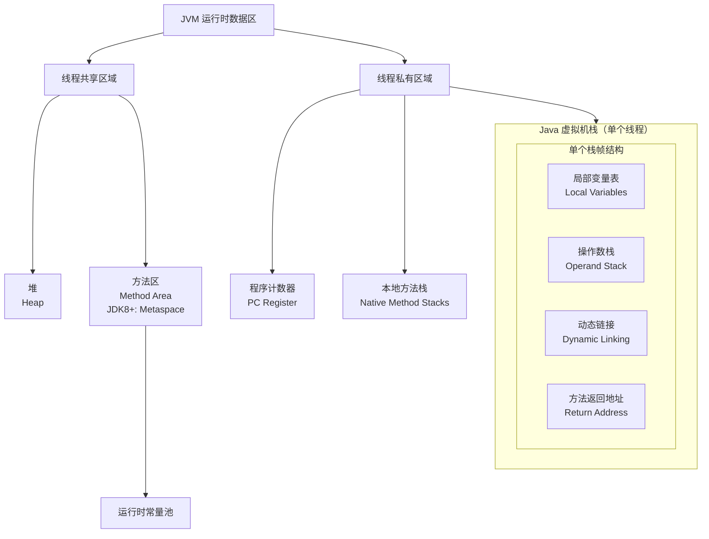

# 运行时数据区域

## 私有数据区

### 程序计数器

记录正在执行的虚拟机字节码指令的地址（如果正在执行的是本地方法则为空）。

唯一没有OOM的区域。

### Java 虚拟机栈

每个Java 方法在执行时会创建一个栈帧用于存储局部变量表、操作数栈、动态链接、方法返回地址等信息。

从方法调用直至执行完成的过程，对应着一个栈帧在 Java 虚拟机栈中入栈和出栈的过程。

#### 局部变量表

存放编译期间可知的各种 Java 虚拟机基本数据类型，对象引用和returnAddress 类型（指向了⼀条字节码指令的地址）。

可以通过 -Xss 这个虚拟机参数来指定每个线程的 Java 虚拟机栈内存大小

- JDK 1.4 中默认为 256K
- JDK 1.5+ 默认为 1M
- java -Xss2M HackTheJava

该区域可能抛出以下异常：

- 当线程请求的栈深度超过最大值，会抛出 StackOverflowError 异常。
- 栈进行动态扩展时，如果无法申请到足够内存，会抛出 OutOfMemoryError 异常。

### 本地方法栈

本地方法栈与 Java 虚拟机栈类似，保存的是native方法的信息。

它们之间的区别只不过是本地方法栈为本地方法服务，由虚拟机自由实现。

本地方法一般是用其它语言（C、C++ 或汇编语言等）编写的，并且被编译为基于本机硬件和操作系统的程序，对待这些方法需要特别处理。

## 共享数据区

## 堆（heap，GC 堆）

所有对象都在这里分配内存，垃圾收集主要区域，堆由垃圾收集器自动回收。

现代的垃圾收集器基本都是采用分代收集算法，回收思想：针对不同类型的对象采取不同的垃圾回收算法。

可以将堆分成两块：

- 新生代（Young Generation）
- 老年代（Old Generation）

堆不需要连续内存，并且可以动态增加其内存，增加失败会抛出 OutOfMemoryError 异常（OOM）

可以通过 -Xms 和 -Xmx 这两个虚拟机参数来指定一个程序的堆内存大小：

- 第一个参数设置初始值
- 第二个参数设置最大值
- java -Xms1M -Xmx2M HackTheJava

### 元空间（本地内存中）

⽅法区是接口、是规范，永久代与元空间是 HotSpot 虚拟机给出的实现

### 1.8之前：方法区

用于存放已被加载的类信息、常量、静态变量、即时编译器编译后的代码等数据。

- 和堆一样不需要连续的内存，并且可以动态扩展，动态扩展失败一样会抛出 OutOfMemoryError 异常。
- 很难确定永久代的大小，并且每次 Full GC 之后永久代的大小都会改变，所以经常会抛出OutOfMemoryError 异常。
- 永久代的空间有限，大量使用字符串场景下会导致  OutOfMemoryError 错误

### 1.8开始：元空间

存放常量池、klass类元信息、方法元等信息。

为了更容易管理方法区，从 JDK 1.8 开始，移除永久代（Pern区），并把方法区移至元空间，元空间位于本地内存中，而不是虚拟机内存中。

### 直接内存

在 JDK 1.4 中新引入了 NIO 类，它可以使用 Native 函数库直接分配堆外内存，然后通过 Java 堆里的 DirectByteBuffer 对象作为这块内存的引用进行操作。

这样能在一些场景中显著提高性能，因为避免了在堆内存和堆外内存来回拷贝数据。

**直接内存(Direct Memory)**并不是虚拟机运行时数据区的一部分，但也被频繁使用（如NIO），可能导致OutOfMemoryError。