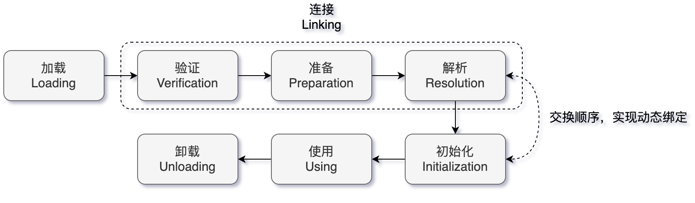
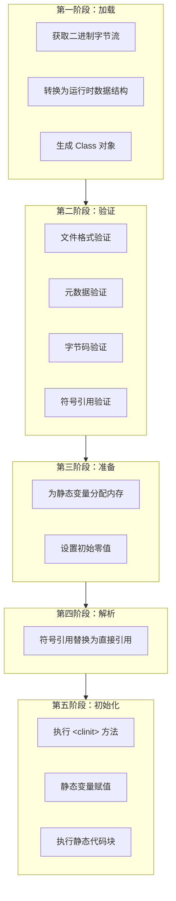

# 类加载机制

## 一 类加载器与双亲委派模型

### 1. 类加载器

类加载器负责将 `.class` 文件的二进制数据读入内存，并将其转换为 JVM 能够使用的运行时数据结构。

JDK 8 中主要有三类内置的类加载器：

- **Bootstrap ClassLoader（启动类加载器）**：
  - 由 C++ 实现，是 JVM 自身的一部分。
  - 负责加载 `JAVA_HOME/lib` 目录下的核心类库（如 `rt.jar`, `charsets.jar` 等）。
  - 是**最高层级**的加载器，没有父加载器。
- **Extension ClassLoader（扩展类加载器）**：
  - 由 Java 实现，继承自 `java.lang.ClassLoader`。
  - 负责加载 `JAVA_HOME/lib/ext` 目录下的，或被 `java.ext.dirs` 系统变量指定的路径中的所有类库。
  - 其父加载器是 **Bootstrap ClassLoader**。
- **Application ClassLoader（应用程序类加载器）**：
  - 由 Java 实现。
  - 负责加载**用户类路径（ClassPath）** 上指定的类库。
  - 是程序中**默认的类加载器**。我们通过 `new` 关键字创建的类，通常都是由它加载的。
  - 其父加载器是 **Extension ClassLoader**。

- ⾃定义加载器
  - 由java语言实现，通过继承 `java.lang.ClassLoader` 类来实现。
  - ⽤户⾃⾏扩展，例如：增加除了磁盘位置之外的Class⽂件来源，或者通过类加载器实现类的隔离、重载等功能。

### 2. 双亲委派模型

类加载器之间的层次关系，保证类的唯一性。

双亲委派模型是类加载的一种**工作模式**，而非一个强制约束。

**当一个类加载器收到了类加载的请求时，它首先不会自己去尝试加载这个类，而是把这个请求委派给父类加载器去完成。**

1. 从下至上检查：应用程序类加载器 -> 扩展类加载器 -> 启动类加载器。
2. 只有当父加载器反馈自己无法完成这个加载请求（在自己的搜索范围内没找到所需的类）时，子加载器才会尝试自己去加载。

**双亲委派模型的作用：**

- **保证核心类库的安全**：防止用户自定义一个核心类（如 `java.lang.Object`）来替换掉 JVM 自带的核心类，确保了 Java 核心 API 的稳定性和安全性。
- **避免类的重复加载**：确保了同一个类在 JVM 中只会被一个类加载器加载，从而保证了类的唯一性。

## 二 类加载机制（类数据从Class⽂件加载到内存）

- 类的数据从Class⽂件加载到内存，并对数据进⾏验证、准备、解析和初始化，最终形成可以被虚拟机直接使用的 Java类型。

- 类是在运行期间，第一次使用时动态加载的，而不是一次性加载所有类，因为如果一次性加载，那么会占用很多的内存。
- 包括以下 7 个阶段：
  1. 加载（Loading）
  2. 验证（Verification）
  3. 准备（Preparation）
  4. 解析（Resolution）
  5. 初始化（Initialization）
  6. 使用（Using）
  7. 卸载（Unloading）
- 注意：解析也可以在初始化之后，位置并不唯⼀。

## 三 类加载过程

