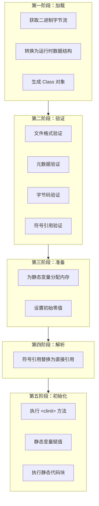

# 类加载机制

## 一 类加载器与双亲委派模型

### 1. 类加载器

类加载器负责将 `.class` 文件的二进制数据读入内存，并将其转换为 JVM 能够使用的运行时数据结构。

JDK 8 中主要有三类内置的类加载器：

- **Bootstrap ClassLoader（启动类加载器）**：
  - 由 C++ 实现，是 JVM 自身的一部分。
  - 负责加载 `JAVA_HOME/lib` 目录下的核心类库（如 `rt.jar`, `charsets.jar` 等）。
  - 是**最高层级**的加载器，没有父加载器。
- **Extension ClassLoader（扩展类加载器）**：
  - 由 Java 实现，继承自 `java.lang.ClassLoader`。
  - 负责加载 `JAVA_HOME/lib/ext` 目录下的，或被 `java.ext.dirs` 系统变量指定的路径中的所有类库。
  - 其父加载器是 **Bootstrap ClassLoader**。
- **Application ClassLoader（应用程序类加载器）**：
  - 由 Java 实现。
  - 负责加载**用户类路径（ClassPath）** 上指定的类库。
  - 是程序中**默认的类加载器**。我们通过 `new` 关键字创建的类，通常都是由它加载的。
  - 其父加载器是 **Extension ClassLoader**。

- **⾃定义加载器**
  - 由java语言实现，通过继承 `java.lang.ClassLoader` 类来实现。
  - ⽤户⾃⾏扩展，例如：增加除了磁盘位置之外的Class⽂件来源，或者通过类加载器实现类的隔离、重载等功能。
  - `java.lang.ClassLoader` 的` loadClass() `实现了双亲委派模型的逻辑，自定义类加载器一般不重写，但需要重写 `findClass()`。

### 2. 双亲委派模型

类加载器之间的层次关系，保证类的唯一性。

双亲委派模型是类加载的一种**工作模式**，而非一个强制约束。

**当一个类加载器收到了类加载的请求时，它首先不会自己去尝试加载这个类，而是把这个请求委派给父类加载器去完成。**

1. 从下至上检查：应用程序类加载器 -> 扩展类加载器 -> 启动类加载器。
2. 只有当父加载器反馈自己无法完成这个加载请求（在自己的搜索范围内没找到所需的类）时，子加载器才会尝试自己去加载。

**双亲委派模型的作用：**

- **保证核心类库的安全**：防止用户自定义一个核心类（如 `java.lang.Object`）来替换掉 JVM 自带的核心类，确保了 Java 核心 API 的稳定性和安全性。
- **避免类的重复加载**：确保了同一个类在 JVM 中只会被一个类加载器加载，从而保证了类的唯一性。

**破坏双亲委派模型**：

1. 继承`java.lang.ClassLoader`
2. 重写 `loadClass()` 方法
3. 重写 `findClass()` 方法

## 3.ClassLoader 代码片段

```java
public abstract class ClassLoader {

    private final ClassLoader parent;

    protected Class<?> loadClass(String name, boolean resolve)
            throws ClassNotFoundException {
        synchronized (getClassLoadingLock(name)) {
            // First, check if the class has already been loaded
            Class<?> c = findLoadedClass(name);
            if (c == null) {
                long t0 = System.nanoTime();
                try {
                    if (parent != null) {
                        c = parent.loadClass(name, false);
                    } else {
                        c = findBootstrapClassOrNull(name);
                    }
                } catch (ClassNotFoundException e) {
                    // ClassNotFoundException thrown if class not found
                    // from the non-null parent class loader
                }
                if (c == null) {
                    // If still not found, then invoke findClass in order
                    // to find the class.
                    long t1 = System.nanoTime();
                    c = findClass(name);
                    // this is the defining class loader; record the stats
                }
            }
            if (resolve) {
                resolveClass(c);
            }
            return c;
        }
    }

}
```

`loadClass()` 方法运行过程如下：

1. 先检查类是否已经加载过；
2. 如果没有则让父类加载器去加载；
3. 当父类加载器加载失败时抛出 `ClassNotFoundException`，此时尝试自己去加载。

## 二 类加载机制

**类的数据从Class⽂件加载到内存，并对数据进⾏验证、准备、解析和初始化，最终形成可以被虚拟机直接使用的 Java类型。**

- 类是在运行期间，第一次使用时动态加载的，而不是一次性加载所有类，因为如果一次性加载，那么会占用很多的内存。
- 包括以下 7 个阶段：
  1. 加载（Loading）
  2. 验证（Verification）
  3. 准备（Preparation）
  4. 解析（Resolution）
  5. 初始化（Initialization）
  6. 使用（Using）
  7. 卸载（Unloading）
- 注意：解析也可以在初始化之后，位置并不唯⼀。


## 三 类加载过程的五个阶段

类加载的完整过程包括以下五个阶段。其中，**加载、验证、准备、解析和初始化**。



### 阶段一：加载
此阶段是"类加载"过程中的一个子阶段，主要完成三件事：
1.  **通过类的全限定名获取定义此类的二进制字节流。**
    *   来源可以是：Class 文件、JAR 包、网络、动态生成（代理）、数据库等。
    *   使用到类加载器。
2.  **将这个字节流所代表的静态存储结构转换为方法区的运行时数据结构。**
    *   在 JDK 8 中，类的元数据（如类名、方法信息、字段信息等）存储在**元空间**。
    *   常量池 -> 运行时常量池。
3.  **在内存中生成一个代表这个类的 `java.lang.Class` 对象，作为方法区这个类的各种数据的访问入口。**
    *   这个 `Class` 对象本身是存放在**堆**中的。

**注意**：数组类本身不通过类加载器创建，而是由 JVM 直接创建，但其元素类型最终仍需要靠类加载器加载。

### 阶段二：验证
目的是确保 Class 文件的字节流中包含的信息符合《Java 虚拟机规范》的全部约束要求，保证其不会危害虚拟机自身安全。

**验证阶段有点类似查杀病毒，确保虚拟机执⾏的 Class ⽂件都是正确的。**

*   **文件格式验证**：验证字节流是否符合 Class 文件格式的规范（魔数、版本号、常量池类型等）。
*   **元数据验证**：对字节码描述的信息进行语义分析，保证其符合 Java 语言规范（如是否有父类、是否继承了 final 类、非抽象类是否实现了所有抽象方法等）。
*   **字节码验证**：最复杂的阶段，通过数据流和控制流分析，确定程序语义是合法的、符合逻辑的（确保跳转指令不会跳转到方法体以外的字节码上、方法体中的类型转换是有效的等）。
*   **符号引用验证**：发生在解析阶段，验证符号引用能否找到对应的类、字段或方法，以及访问权限（如 `private`, `public`）是否合法。

### 阶段三：准备
此阶段正式为**类变量**分配内存并设置**初始零值**。

*   **分配内存**：为类中定义的静态变量（被 `static` 修饰的变量）在**方法区**（具体是 JDK 8 的元空间）中分配内存。
*   **设置初始值**：设置变量的**零值**，而不是代码中显式赋予的值。
    *   例如：`public static int value = 123;` 在准备阶段过后，`value` 的初始值是 `0`，而不是 `123`。
    *   **例外**：如果类字段的字段属性表中存在 `ConstantValue` 属性（即被 `static final` 修饰的常量），那么在准备阶段变量值就会被初始化为 `ConstantValue` 属性所指定的值。
        *   例如：`public static final int value = 123;` 在准备阶段过后，`value` 的值就是 `123`。

### 阶段四：解析
此阶段是虚拟机将**符号引用**替换为**直接引用**的过程。
*   **符号引用**：以一组符号来描述所引用的目标，与虚拟机实现的内存布局无关。Class 文件格式中的常量池大量使用了符号引用。
*   **直接引用**：可以是直接指向目标的指针、相对偏移量或一个能间接定位到目标的句柄。直接引用和虚拟机实现的内存布局直接相关。

解析主要针对以下几类符号引用进行：
*   类或接口
*   字段
*   类方法
*   接口方法
*   方法类型
*   方法句柄
*   调用点限定符

解析过程在某些情况下可以在初始化阶段之后再开始，这是为了支持 Java 的动态绑定。

### 阶段五：初始化
这是类加载过程的最后一步，真正开始执行类中定义的 Java 程序代码（或者说字节码）。

- **根据程序员通过程序制定的主观计划去初始化类变量和其它资源。**

在此阶段，JVM 会执行类的**构造器 `<clinit>()` 方法**。

`<clinit>()` 方法是由编译器自动收集类中的所有**类变量的赋值动作**和**静态语句块**中的语句合并产生的。

编译器收集的顺序是由语句在源文件中出现的顺序决定的。

- 静态语句块只能访问到定义在它之前的类变量，定义在它之后的类变量只能赋值，不能访问。

```java
public class Main {
    static {
        // 编译通过
        i = 1;
        // 报错 "java: 非法前向引用"
        System.out.println(i);
    }
    public static int i = 0;
    public static void main(String[] args) {
        System.out.println(i);
    }
}
```

**关键特性：**
* `<clinit>()` 方法与类的构造函数（实例构造器 `<init>()`）不同，它不需要显式调用父类构造器，虚拟机会保证在子类的 `<clinit>()` 方法执行之前，父类的 `<clinit>()` 方法已经执行完毕。

  * 因此，JVM 中第一个被执行的 `<clinit>()` 方法的类肯定是 `java.lang.Object`。

  * ```java
    public static class Parent {
        public static int a = 1;
        static {
            a = 2;
        }
    }
    public static class Child extends Parent {
        public static int b = a;
    }
    public static void main(String[] args) {
        System.out.println(Child.b); // 2
    }
    ```

* 父类中定义的静态语句块要优先于子类的变量赋值操作。

* `<clinit>()` 方法对于类或接口来说并不是必需的，如果一个类中没有静态语句块，也没有对类变量的赋值操作，那么编译器可以不为这个类生成 `<clinit>()` 方法。

* 接口中不能使用静态语句块，但仍然可以有变量初始化的赋值操作，因此接口也会生成 `<clinit>()` 方法。但执行接口的 `<clinit>()` 方法不需要先执行父接口的 `<clinit>()` 方法。

* JVM 会保证一个类的 `<clinit>()` 方法在多线程环境中被正确地加锁、同步。如果多个线程同时去初始化一个类，那么只会有一个线程去执行这个类的 `<clinit>()` 方法，其他线程都需要阻塞等待。

---

## 四 类初始化的时机（主动引用）

JVM 规范规定了有且只有以下六种情况必须立即对类进行"初始化"（而加载、验证、准备自然需要在此之前开始）：

1.  **遇到 `new`, `getstatic`, `putstatic`, `invokestatic` 这四条字节码指令时。**
    *   对应场景：使用 `new` 关键字实例化对象、读取或设置一个类的静态字段（被 `final` 修饰、已在编译期把结果放入常量池的静态字段除外）、调用一个类的静态方法。
2.  **使用 `java.lang.reflect` 包的方法对类型进行反射调用的时候。**
3.  **当初始化一个类时，如果发现其父类还没有进行过初始化，则需要先触发其父类的初始化。**
4.  **当虚拟机启动时，用户需要指定一个要执行的主类（包含 `main()` 方法的那个类），虚拟机会先初始化这个主类。**
5.  **当使用 JDK 7 新加入的动态语言支持时...**
6.  **当一个接口中定义了 JDK 8 新加入的默认方法时，如果有这个接口的实现类发生了初始化，那么该接口要在其之前被初始化。**

所有以上六种场景中的行为称为对一个类进行**主动引用**。除此之外，所有引用类的方式都不会触发初始化，称为**被动引用**。

**被动引用示例：**
*   **通过子类引用父类的静态字段，不会导致子类初始化。**
    ```java
    class Parent {
        static { System.out.println("Parent init!"); }
        public static int value = 123;
    }
    class Child extends Parent {
        static { System.out.println("Child init!"); }
    }
    // 执行 System.out.println(Child.value); 只会输出 "Parent init!"，不会输出 "Child init!"。
    ```
*   **通过数组定义来引用类，不会触发此类的初始化。**
    ```java
    Parent[] arr = new Parent[10]; // 不会触发 Parent 类的初始化。
    ```
*   **引用编译期常量（`static final`）不会触发初始化。**
    ```java
    class ConstClass {
        static { System.out.println("ConstClass init!"); }
        public static final String HELLO_WORLD = "Hello, World!";
    }
    // 执行 System.out.println(ConstClass.HELLO_WORLD); 不会输出 "ConstClass init!"。
    ```

## 五 总结

JDK 8 的类加载过程是一个严谨而复杂的过程，它通过 **双亲委派模型** 确保了类的安全性和唯一性，并通过 **加载、验证、准备、解析、初始化** 五个阶段，将静态的 Class 文件转化为 JVM 中可用的动态运行时数据结构。

理解这个过程对于解决 `ClassNotFoundException`, `NoClassDefFoundError`，实现热部署、模块化以及进行高级 Java 开发都至关重要。