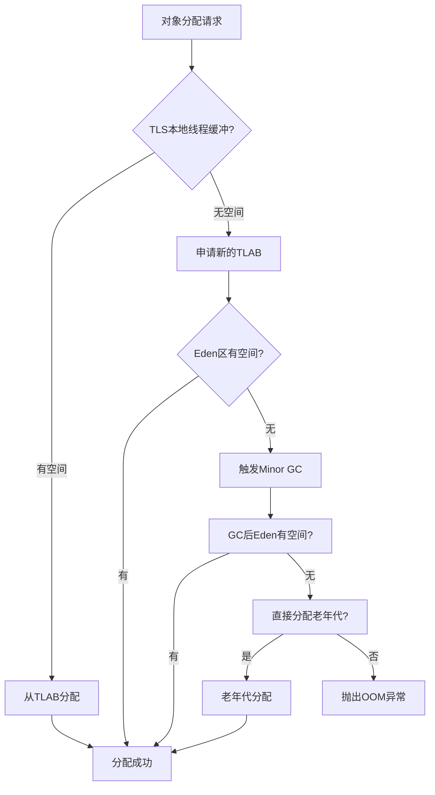

# 垃圾收集概念

垃圾收集主要是针对**堆和元空间**进行。

程序计数器、虚拟机栈和本地方法栈属于线程私有，只存在于线程的生命周期内，线程结束之后就会消失，因此不需要垃圾回收。

## 一 分代收集理论

这是所有现代垃圾收集器的设计基础。JVM 将堆内存逻辑上划分为不同的"代"，基于一个经验法则："**弱分代假说**"——绝大多数对象都是朝生夕死的。

- **年轻代**：新创建的对象首先在这里分配。
  - **Eden 区**：对象诞生的地方。
  - **Survivor 区 (S0, S1)**：存放 Minor GC 后存活的对象。两个 Survivor 区互为副本。
- **老年代**：存放经过多次年轻代 GC 后仍然存活的对象（即"长寿"对象）。也存放一些大对象（取决于具体收集器实现）。
- **元空间**：在 JDK 8 中，**永久代被移除**，取而代之的是**元空间**。它存储类的元数据等信息，使用本地内存，因此理论上只受操作系统可用内存的限制。

- **根据每代的特点，采用最适合、最高效的垃圾收集算法**。

## 二 GC 的类型

- **Minor GC / Young GC**：只收集年轻代的垃圾。
- **Major GC / Old GC**：只收集老年代的垃圾。（注意：有时 Major GC 和 Full GC 被混用，但严格来说不同）。
- **Full GC**：收集整个堆，包括年轻代、老年代，以及方法区。通常停顿时间最长，应尽量避免。

## 三 内存分配策略

**分配策略：**

1. **TLAB** (Thread Local Allocation Buffer): 线程本地分配缓冲，避免锁竞争
2. **Eden区分配**: 优先在新生代Eden区分配
3. **Minor GC**：当 Eden 区满时，触发一次 Minor GC。
   - 将 Eden 和 **一个** Survivor (如 S0) 中存活的对象，复制到 **另一个** Survivor (如 S1)。
   - 对象的年龄（经历过 Minor GC 的次数）会增加。
   - 清空 Eden 和刚才使用的 S0。
4. **晋升**：当对象的年龄超过阈值（`-XX:MaxTenuringThreshold`，默认15），或 Survivor 空间不足时，对象会被晋升到**老年代**。
5. **大对象直接进入老年代**: -XX:PretenureSizeThreshold参数控制
6. **空间分配担保**: 老年代为新生代提供分配担保

## 四 垃圾收集算法

收集器是算法的实现，核心算法有以下三种：

- **标记-清除**：先标记所有需要回收的对象，然后统一清除。**问题**：产生内存碎片。
- **标记-复制**：将内存分为两块，每次只使用一块。垃圾回收时，将存活对象复制到另一块，然后清空已使用的块。**优点**：无碎片。**缺点**：内存利用率只有一半。**主要用于年轻代**。
- **标记-整理**：标记过程与"标记-清除"一样，但后续步骤不是直接清除，而是让所有存活对象都向一端移动，然后直接清理掉边界以外的内存。**优点**：无碎片。**缺点**：移动对象成本高。**主要用于老年代**。