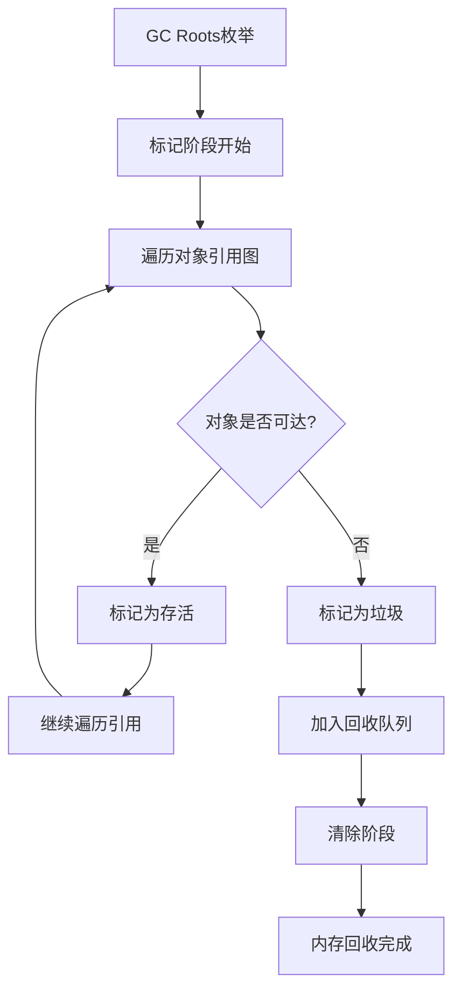
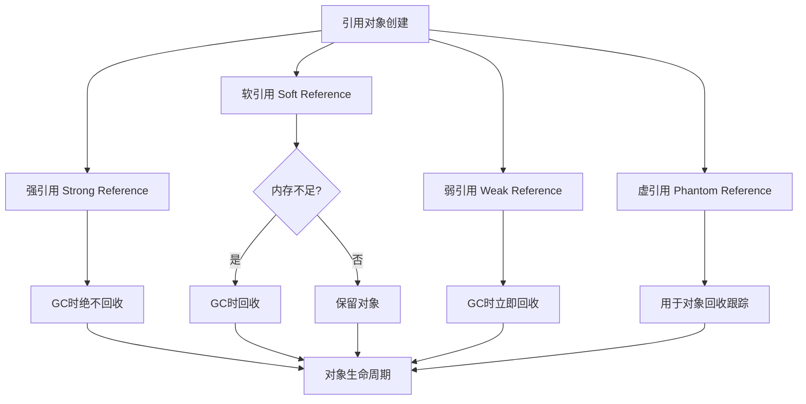

# 回收判断

## 对象回收判断方法

### 1. 引用计数算法

引用计数法是早期垃圾收集器使用的方法，Java虚拟机并未采用此方法。

**工作原理：**

- 每个对象维护一个引用计数器
- 当被引用时计数器+1，引用失效时计数器-1
- 当计数器为0时，对象可以被回收

**缺点：**

- 无法解决循环引用问题：两个对象出现循环引用的情况下，此时引用计数器永远不为 0，导致无法回收。
- 计数器维护开销大

### 2. 可达性分析算法



Java虚拟机采用可达性分析算法来判断对象是否存活。

**核心概念：**

- **GC Roots**：作为起始点的对象集合
- **引用链**：从GC Roots到对象的引用路径

**判断流程：**

```
从GC Roots开始 → 标记所有可达对象 → 未标记对象即为垃圾
```

1. 可达的对象都是存活的
2. 不可达的对象可被回收

**GC Roots包括：**

1. 虚拟机栈中引用的对象
2. 方法区中类静态属性引用的对象
3. 方法区中常量引用的对象
4. 本地方法栈中JNI引用的对象
5. 虚拟机内部引用（Class对象、异常对象等）

### 3. 方法区的回收

主要是对**常量池的回收**和对**类的卸载**。

为了避免内存溢出，在大量使用反射和动态代理的场景都需要虚拟机具备类卸载功能。

类的卸载条件很多，需要满足以下三个条件，并且满足了条件也不一定会被卸载：

1. 该类所有的实例都已经被回收，此时堆中不存在该类的任何实例。
2. 加载该类的 `ClassLoader` 已经被回收。
3. 该类对应的 `Class` 对象没有在任何地方被引用，也就无法在任何地方通过反射访问该类方法。

### 4. finalize()

用于关闭外部资源（try-finally 等方式可做得更好）。

`finalize` 是在 `java.lang.Object` 里定义的方法，每一个对象都有这个方法。

`finalize` 方法在 gc 启动，该对象被回收的时候被调用。

该方法运行代价很高，不确定性大，无法保证各个对象的调用顺序，因此最好不要使用。

1. 一个对象的 `finalize` 方法只会被调用一次；
2. `finalize` 被调用不一定会立即回收该对象，有可能调用 `finalize` 后，该对象又不需要被回收了；
3. 然后到了真正要被回收的时候，因为前面调用过一次，所以不会再次调用 `finalize` 了，进而产生问题，因此不推荐使用。

## 引用类型




```java
// 强引用
Object obj = new Object();

// 软引用
SoftReference<Object> softReference = new SoftReference<>(new Object());

// 弱引用
WeakReference<Object> weakReference = new WeakReference<>(new Object());

// 虚引用
PhantomReference<Object> phantomReference = new PhantomReference<>(new Object(), new ReferenceQueue<>());
```

**强引用**

1. 最常见的引用，GC绝不会回收。
2. 使用 `new` 一个新对象的方式来创建强引用。

**软引用**

1. 内存不足时才会被回收。
2. 使用 `SoftReference` 类来创建软引用。

**弱引用**

1. 下一次GC时就会被回收。
2. 使用 `WeakReference` 类来创建弱引用。

**虚引用**

1. 一种形同虚设的引用，一个对象是否有虚引用的存在，不会对其生存时间造成影响，也无法通过虚引用得到一个对象。
2. 为一个对象设置虚引用的目的：在这个对象被回收时收到一个系统通知（**用于对象回收跟踪**）
3. 必须与`ReferenceQueue`配合使用
