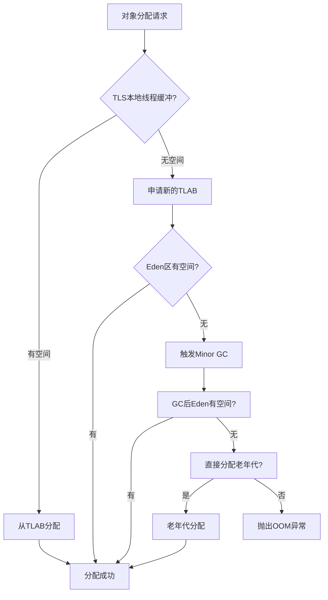
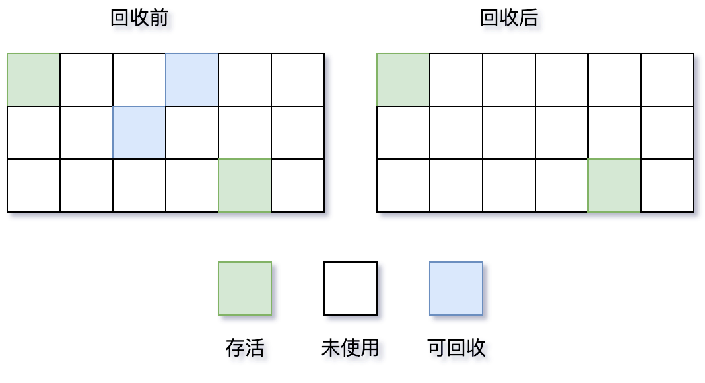
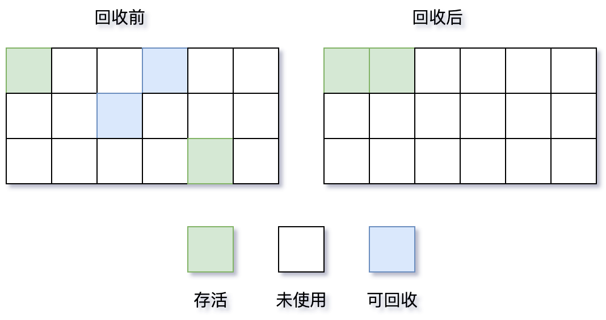
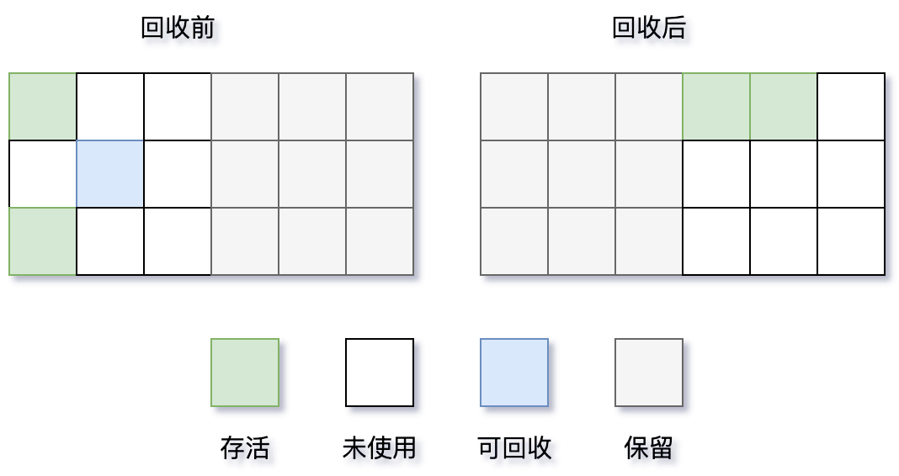
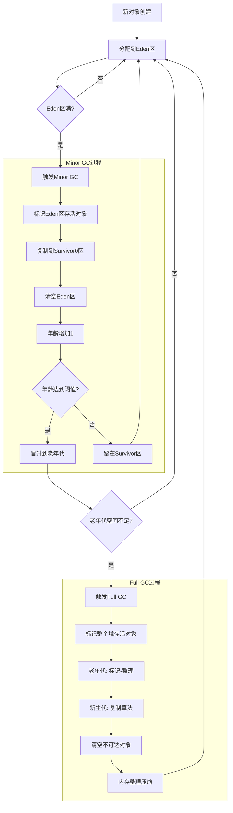
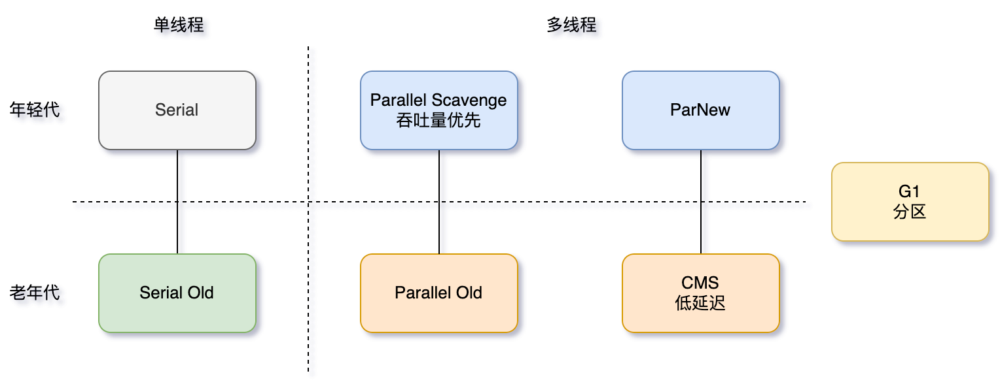

# 垃圾收集

垃圾收集主要是针对**堆和元空间**进行。

程序计数器、虚拟机栈和本地方法栈属于线程私有，只存在于线程的生命周期内，线程结束之后就会消失，因此不需要垃圾回收。

## 一 内存分配流程图

**分配策略：**

- **TLAB** (Thread Local Allocation Buffer): 线程本地分配缓冲，避免锁竞争
- **Eden区分配**: 优先在新生代Eden区分配
- **大对象直接进入老年代**: -XX:PretenureSizeThreshold参数控制
- **空间分配担保**: 老年代为新生代提供分配担保

## 二 垃圾收集算法

### 2.1 标记-清除算法（Mark-Sweep）

**工作原理：**

1. **标记阶段**：遍历所有存活的对象，并对其进行标记。

   - 垃圾收集器从 **GC Roots** 对象开始（包括虚拟机栈中引用的对象、方法区中静态属性引用的对象、方法区中常量引用的对象、本地方法栈中JNI引用的对象等）。
   - 顺着引用链进行可达性分析，所有能被从 GC Roots 访问到的对象，都被标记为 **“存活”**。
   - 而那些从 GC Roots 不可达的对象，则被判定为 **“可回收”** 的垃圾。
2. **清除阶段**：回收未标记对象所占用的空间。
   - 垃圾收集器线性地遍历整个堆内存。
   - 对于未被标记为“存活”的对象，将其所占用的**内存块**记录到一个 **空闲列表** 中。
   - 另外，还会判断回收后的内存块与前一个**内存块**是否连续，若连续，会合并。
3. **当需要分配新对象时**：内存分配器就可以从这个**空闲列表**中寻找合适大小的内存块进行分配。

**优缺点：**

- 优点：实现简单
- 缺点：产生内存碎片，导致无法给大对象分配内存。
- 缺点：效率较低，标记和清除过程效率都不高

### 2.2 标记-整理算法（Mark-Compact）

**工作原理：**

1. **标记阶段**：标记所有存活对象
   - 从 **GC Roots** 集合开始，通过可达性分析算法，遍历整个对象图。
   - 所有能被访问到的对象都被打上一个 **存活** 的标记。
   - 这个阶段通常需要 **“Stop The World”**，以确保在标记过程中对象引用关系不会发生变化。
2. **整理阶段**：将所有存活对象向一端移动
   - **将所有的存活对象都向内存空间的一个方向（通常是起始地址或结束地址）移动**。
   - 移动完成后，**直接清理掉边界以外所有的内存**。
   - 这个阶段**需要“Stop The World”**，因为移动对象需要更新所有指向这些对象的引用指针，如果用户线程同时也在访问这些对象，会导致严重问题。

**通过移动存活对象，用空间上的“整理”来换取时间上的“分配效率”和空间上的“无碎片化”**。

**优缺点：**

- 优点：无内存碎片，内存利用率高
- 缺点：移动对象开销大

### 2.3 复制算法（Copying）

**工作原理：**

1. 存活对象标记与复制
   - 垃圾收集器从 **GC Roots** 开始进行可达性分析。
   - 每当发现一个存活对象，就将其从 **From 空间**（正在使用的半区）复制到 **To 空间**（空闲的半区）。
   - 在复制的同时，**紧挨着**前一个复制的对象放置新对象，确保在 To 空间中没有内存碎片。
   - 同时，更新该对象的引用地址，指向新的位置。
2. 内存交换与清理
   - 当 `From` 空间中所有存活对象都被复制到 `To` 空间后，**一次性清理掉整个 `From` 空间**。
   - 然后，将 `From` 和 `To` 的角色进行**交换**。原来的 `To` 空间变成新的 `From` 空间（用于分配新对象），原来的 `From` 空间变成新的 `To` 空间（用于下一次回收）。

**优缺点：**

- 优点：无内存碎片，效率高。
- **优点：复制算法在“对象死亡率高”的场景下表现出的巨大优势。**
- 缺点：内存利用率只有50%。

### 2.4 分代收集算法（Generational Collection）

核心思想：**基于对象生命周期存在显著差异的经验规律，对堆内存进行分代，并对不同代施以最匹配的垃圾收集策略，从而实现以最小的代价完成内存回收。**

分代收集算法的核心思想源于两个被广泛观察到的**程序运行经验**：

1. **弱分代假说**：绝大多数对象的寿命都非常短，几乎是“朝生夕死”的。
2. **强分代假说**：熬过越多次垃圾收集过程的对象，就越难以消亡。

基于这两个“经验法则”，分代收集算法采取了**分而治之**的策略：

- 将堆内存划分为不同的“代”：**新生代，老年代**。
- **根据每代的特点，采用最适合、最高效的垃圾收集算法**。

**分代说明：**

- **新生代**: Eden + 2个Survivor区，使用**复制**算法。
  - 区域较小，但垃圾回收发生**非常频繁**。
  - **默认比例是 `8:1:1`**，保证了内存的利用率达到 90%
- **老年代**: 长期存活对象，使用**标记-清除**或**标记-整理**算法。
  - 区域较大，垃圾回收发生**不那么频繁**。
- **晋升阈值**: 默认15次GC后晋升老年代（-XX:MaxTenuringThreshold）

**优缺点：**

- 优点：性能高效，灵活性高。
- 缺点：实现复杂，并非万能。

对象分配与晋升

- 新对象优先在 **Eden** 区分配。

- 当 Eden 区满时，触发一次 **Minor GC**。

- 在 Minor GC 中，Eden 和 **From Survivor** 中存活的对象会被复制到 **To Survivor**。

- 每个对象在 Survivor 区中每“熬过”一次 Minor GC，年龄就增加1岁。

## 三 垃圾收集器

| 收集器名称            | 作用域   | 分类 | 目标                          | 参数（启用）              |
| :-------------------- | :------- | :--- | :---------------------------- | :------------------------ |
| **Serial**            | 年轻代   | 串行 | 单线程、客户端模式            | `-XX:+UseSerialGC`        |
| **ParNew**            | 年轻代   | 串行 | 多线程、与CMS配合             | `-XX:+UseParNewGC`        |
| **Parallel Scavenge** | 年轻代   | 串行 | 高吞吐量                      | `-XX:+UseParallelGC`      |
| **Serial Old**        | 老年代   | 串行 | Serial的老年代版本            | (通常与Serial配对)        |
| **Parallel Old**      | 老年代   | 串行 | Parallel Scavenge的老年代版本 | `-XX:+UseParallelOldGC`   |
| **CMS**               | 老年代   | 并行 | 低延迟                        | `-XX:+UseConcMarkSweepGC` |
| **G1**                | **全堆** | 并行 | 兼顾吞吐量与低延迟            | `-XX:+UseG1GC`            |

> **注意**：G1 在逻辑上仍然分代，但在物理内存布局上不再像传统收集器那样要求年轻代和老年代是连续的内存空间。它将自己管理的整个堆划分为多个大小相等的 Region。

**单线程与多线程**

- 单线程指的是垃圾收集器**使用一个线程**。
- 多线程指的是垃圾收集器**使用多个线程。**

**串行与并行（垃圾收集器、用户程序）**

- 串行指的是**垃圾收集器**与**用户程序**交替执行，即在执行**垃圾收集**时需要**停顿用户程序。**

- 并行指的是垃圾收集器和用户程序**同时执行**。

## 1. Serial 收集器

- 单线程收集器，只使用一个线程进行垃圾收集工作。
- 优点是简单高效，在单个CPU 环境下，由于没有线程交互的开销，因此拥有最高的单线程收集效率。
- Client 场景下的默认年轻代收集器，因为在该场景下内存一般来说不会很大。
- 收集一两百兆垃圾的停顿时间可以控制在一百多毫秒以内，只要不是太频繁，这点停顿时间是可以接受的。

## 2.ParNew 收集器

- Server 场景下默认的新生代收集器。
- 除了 Serial 收集器，只有它能与 CMS 收集器配合使用。

### 3. Parallel Scavenge 收集器

目标：达到一个可控制的吞吐量，被称为“吞吐量优先”收集器（更快的完成工作）

- 吞吐量就是 CPU 运行用户代码的时间 与 CPU总消耗时间 的比值

- **吞吐量 = 运行用户代码时间 / (运行用户代码时间 + 垃圾回收时间)**
- 高吞吐量可以高效率地利用 CPU 时间，尽快完成程序的运算任务，适合在后台运算，而不需要太多交互的任务。

### 吞吐量和停顿时间

Paralle目标：达到一个可控制的吞吐量。

其它收集器目标：减少垃圾收集停顿时间，即尽可能缩短用户线程的停顿时间（更好的交互）。

- 停顿时间越短就越适合需要与用户交互的程序，良好的响应速度能提升用户体验。

直观上，只要最大的垃圾收集停顿时间越小，吞吐量是越高的，但停顿时间的缩短是以 牺牲 新生代空间 和 吞吐量 来换取的
  - 停顿时间变小(回收的少)，新生代空间变小，垃圾回收变得频繁（多次时间累计，总时间变长了），导致吞吐量下降

示例：

- 每次停顿100毫秒，原来线程每10秒收集一次；
- 修改为每次停顿70毫秒，但是线程回收次数变得频繁了，每5秒收集一次；
- 停顿时间少的同时，回收空间少，导致回收次数变多，垃圾回收总时间变大，反而导致吞吐量下降。

### GC 自适应调节策略（GC Ergonomics）

- 不需要指定新生代的大小、Eden 和Survivor 区的比例、晋升老年代对象年龄等细节参数了；
- 虚拟机会根据当前系统的运行情况收集性能监控信息，动态调整这些参数以提供最合适的停顿时间或者最大的吞吐量。

### 4. Serial Old 收集器（标记 - 整理）

- Serial 收集器的老年代版本。
- Client 场景下的虚拟机使用。

- 如果用在 Server 场景下，它有两大用途：
  - 在 JDK 1.5 以及之前版本（Parallel Old 诞生以前）中与 Parallel Scavenge 收集器搭配使用。
  - 作为 CMS 收集器的后备预案，在并发收集发生Concurrent Mode Failure 时使用。

## 5. Parallel Old 收集器

- Parallel Scavenge 收集器的老年代版本。
- 在注重吞吐量以及 CPU 资源敏感的场合，都可以优先考虑 Parallel  Scavenge +Parallel Old。

### 6. CMS 收集器（标记-清除）

CMS（Concurrent Mark Sweep），Mark Sweep 指的是标记 - 清除算法，回收老年代。

分为以下四个流程：

1. **初始标记**：仅仅只是标记一下 GC Roots     能直接关联到的对象，速度很快，需要停顿。

1. **并发标记**：进行 GC Roots Tracing 的过程，它在整个回收过程中耗时最长，不需要停顿。
2. **重新标记**：为了修正并发标记期间，因程序继续运作而导致标记产生变动的那一部分对象，需要停顿。
3. **并发清除**：不需要停顿。

在整个过程中耗时最长的并发标记和并发清除过程中，收集器线程都可以与用户线程一起工作，不停顿。

**缺点：**

- 吞吐量低：低停顿时间是以牺牲吞吐量为代价的，导致 CPU 利用率不够高。

- 无法处理浮动垃圾（下一次 GC 回收），可能出现 Concurrent Mode Failure
  - 浮动垃圾是指并发清除阶段由于用户线程继续运行而产生的垃圾，这部分垃圾只能到下一次 GC 时才能进行回收。
  - 由于浮动垃圾的存在，因此需要预留出一部分内存，意味着 CMS 收集不能像其它收集器那样等待老年代快满的时候再回收。
- 如果预留内存不够存放浮动垃圾，就会出现 Concurrent Mode Failure，这时虚拟机将临时启用 Serial Old 来替代 CMS。

- 标记 - 清除算法
  - 算法导致的空间碎片，往往出现老年代空间剩余，但无法找到足够大连续空间来分配当前对象，不得不提前触发一次 Full GC。

### 7. G1 收集器

G1 可对新生代和老年代一起回收。

G1 把堆划分成多个大小相等的独立区域（Region），新生代和老年代不再物理隔离，每个小空间可以单独进行垃圾回收。

- 这种划分方法带来了很大的灵活性，使得可预测的停顿时间模型成为可能。

 记录每个Region 垃圾回收时间及回收所获得的空间，并维护一个优先列表，每次根据允许的收集时间，优先回收价值最大的Region

- 每个Region垃圾回收时间 和 允许收集时间 比较，在允许收集时间内就可被回收

 每个Region都有一个 Remembered Set，记录该 Region对象的引用对象所在Region

- 通过使用 Remembered Set，在做可达性分析的时候就可以避免全堆扫描

G1 垃圾收集过程主要分为4个阶段： 

1. **初始标记**：标记     GC Roots 能直接关联的对象
2. **并发标记**：进行 GC Roots Tracing 的过程，收集器线程都可以与用户线程一起工作，标记出所有回收对象
3. **最终标记**（停顿线程）：处理并发标记后，新产⽣的对象 
   - 修正在 并发标记期间 因用户程序继续运作 而导致标记产生变动的那一部分标记记录
   - 虚拟机将这段时间对象变化记录在线程的 Remembered Set      Logs 里面
   - 最终标记阶段需要把 Remembered Set Logs 的数据合并到 Remembered Set 中。
   - 这阶段需要停顿线程

4. 筛选回收（可以并发执行）
   1. 先对各个 Region 中的回收价值和成本进行排序
   2. 根据期望 GC 停顿时间来制定回收计划，选择性回收Region（和GC 停顿时间比较，在时间内的，回收价值最大的）
   3. 回收时采⽤标记复制，多条收集器线程并发执⾏ 
   4. 不追求⼀次全部清理完，只回收一部分 Region
   5. 此阶段其实也可以做到与用户程序一起并发执行，因为只回收一部分 Region，时间是用户可控制的，而且停顿用户线程将大幅度提高收集效率。

优点：

- 空间整合
  - 整体来看是基于“标记 - 整理”算法实现的收集器
  - 局部（两个 Region 之间）上来看是基于“复制”算法实现的，这意味着运行期间不会产生内存空间碎片。
- 可预测的停顿：能让使用者明确指定在一个长度为 M 毫秒的时间片段内，消耗在 GC 上的时间不得超过 N 毫秒。