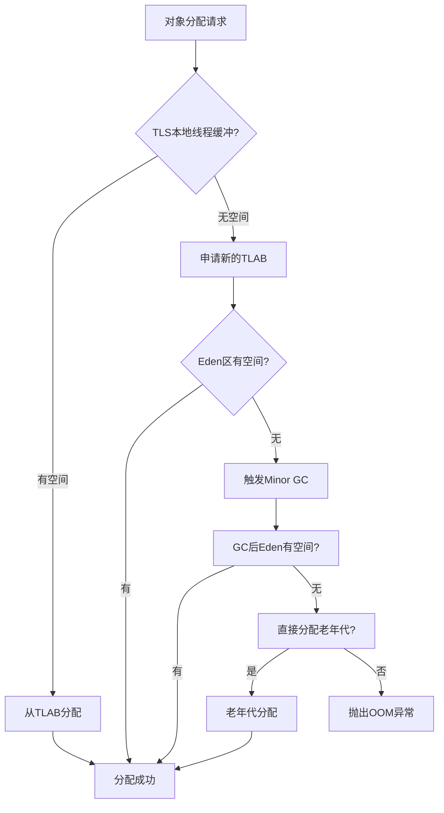
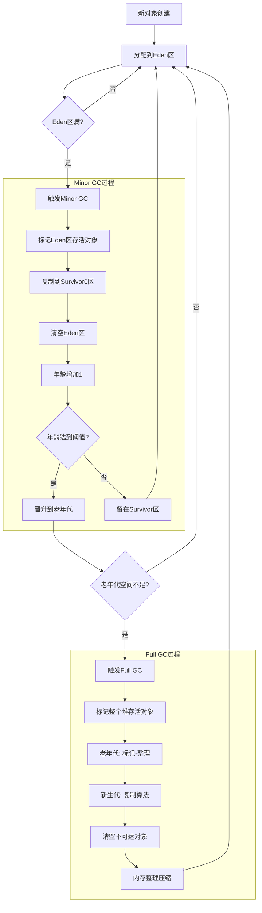

# 垃圾收集

垃圾收集主要是针对**堆和元空间**进行。

程序计数器、虚拟机栈和本地方法栈属于线程私有，只存在于线程的生命周期内，线程结束之后就会消失，因此不需要垃圾回收。

## 一 内存分配流程图

**分配策略：**

- **TLAB** (Thread Local Allocation Buffer): 线程本地分配缓冲，避免锁竞争
- **Eden区分配**: 优先在新生代Eden区分配
- **大对象直接进入老年代**: -XX:PretenureSizeThreshold参数控制
- **空间分配担保**: 老年代为新生代提供分配担保

## 二 垃圾收集算法

### 2.1 标记-清除算法（Mark-Sweep）

**工作原理：**

1. **标记阶段**：遍历所有存活的对象，并对其进行标记。

   - 垃圾收集器从 **GC Roots** 对象开始（包括虚拟机栈中引用的对象、方法区中静态属性引用的对象、方法区中常量引用的对象、本地方法栈中JNI引用的对象等）。
   - 顺着引用链进行可达性分析，所有能被从 GC Roots 访问到的对象，都被标记为 **“存活”**。
   - 而那些从 GC Roots 不可达的对象，则被判定为 **“可回收”** 的垃圾。
2. **清除阶段**：回收未标记对象所占用的空间。
   - 垃圾收集器线性地遍历整个堆内存。
   - 对于未被标记为“存活”的对象，将其所占用的**内存块**记录到一个 **空闲列表** 中。
   - 另外，还会判断回收后的内存块与前一个**内存块**是否连续，若连续，会合并。
3. **当需要分配新对象时**：内存分配器就可以从这个**空闲列表**中寻找合适大小的内存块进行分配。

**优缺点：**

- 优点：实现简单
- 缺点：产生内存碎片，导致无法给大对象分配内存。
- 缺点：效率较低，标记和清除过程效率都不高

### 2.2 标记-整理算法（Mark-Compact）

**工作原理：**

1. **标记阶段**：标记所有存活对象
   - 从 **GC Roots** 集合开始，通过可达性分析算法，遍历整个对象图。
   - 所有能被访问到的对象都被打上一个 **存活** 的标记。
   - 这个阶段通常需要 **“Stop The World”**，以确保在标记过程中对象引用关系不会发生变化。
2. **整理阶段**：将所有存活对象向一端移动
   - **将所有的存活对象都向内存空间的一个方向（通常是起始地址或结束地址）移动**。
   - 移动完成后，**直接清理掉边界以外所有的内存**。
   - 这个阶段**需要“Stop The World”**，因为移动对象需要更新所有指向这些对象的引用指针，如果用户线程同时也在访问这些对象，会导致严重问题。

**通过移动存活对象，用空间上的“整理”来换取时间上的“分配效率”和空间上的“无碎片化”**。

**优缺点：**

- 优点：无内存碎片，内存利用率高
- 缺点：移动对象开销大

### 2.3 复制算法（Copying）

**工作原理：**

1. 存活对象标记与复制
   - 垃圾收集器从 **GC Roots** 开始进行可达性分析。
   - 每当发现一个存活对象，就将其从 **From 空间**（正在使用的半区）复制到 **To 空间**（空闲的半区）。
   - 在复制的同时，**紧挨着**前一个复制的对象放置新对象，确保在 To 空间中没有内存碎片。
   - 同时，更新该对象的引用地址，指向新的位置。
2. 内存交换与清理
   - 当 `From` 空间中所有存活对象都被复制到 `To` 空间后，**一次性清理掉整个 `From` 空间**。
   - 然后，将 `From` 和 `To` 的角色进行**交换**。原来的 `To` 空间变成新的 `From` 空间（用于分配新对象），原来的 `From` 空间变成新的 `To` 空间（用于下一次回收）。

**优缺点：**

- 优点：无内存碎片，效率高。
- **优点：复制算法在“对象死亡率高”的场景下表现出的巨大优势。**
- 缺点：内存利用率只有50%。

### 2.4 分代收集算法（Generational Collection）

核心思想：**基于对象生命周期存在显著差异的经验规律，对堆内存进行分代，并对不同代施以最匹配的垃圾收集策略，从而实现以最小的代价完成内存回收。**

分代收集算法的核心思想源于两个被广泛观察到的**程序运行经验**：

1. **弱分代假说**：绝大多数对象的寿命都非常短，几乎是“朝生夕死”的。
2. **强分代假说**：熬过越多次垃圾收集过程的对象，就越难以消亡。

基于这两个“经验法则”，分代收集算法采取了**分而治之**的策略：

- 将堆内存划分为不同的“代”：**新生代，老年代**。
- **根据每代的特点，采用最适合、最高效的垃圾收集算法**。

**分代说明：**

- **新生代**: Eden + 2个Survivor区，使用**复制**算法。
  - 区域较小，但垃圾回收发生**非常频繁**。
  - **默认比例是 `8:1:1`**，保证了内存的利用率达到 90%
- **老年代**: 长期存活对象，使用**标记-清除**或**标记-整理**算法。
  - 区域较大，垃圾回收发生**不那么频繁**。
- **晋升阈值**: 默认15次GC后晋升老年代（-XX:MaxTenuringThreshold）

**优缺点：**

- 优点：性能高效，灵活性高。
- 缺点：实现复杂，并非万能。

对象分配与晋升

- 新对象优先在 **Eden** 区分配。

- 当 Eden 区满时，触发一次 **Minor GC**。

- 在 Minor GC 中，Eden 和 **From Survivor** 中存活的对象会被复制到 **To Survivor**。

- 每个对象在 Survivor 区中每“熬过”一次 Minor GC，年龄就增加1岁。

## 三 垃圾收集器

| 收集器名称            | 作用域   | 分类 | 目标                          | 参数（启用）              |
| :-------------------- | :------- | :--- | :---------------------------- | :------------------------ |
| **Serial**            | 年轻代   | 串行 | 单线程、客户端模式            | `-XX:+UseSerialGC`        |
| **ParNew**            | 年轻代   | 串行 | 多线程、与CMS配合             | `-XX:+UseParNewGC`        |
| **Parallel Scavenge** | 年轻代   | 串行 | 高吞吐量                      | `-XX:+UseParallelGC`      |
| **Serial Old**        | 老年代   | 串行 | Serial的老年代版本            | (通常与Serial配对)        |
| **Parallel Old**      | 老年代   | 串行 | Parallel Scavenge的老年代版本 | `-XX:+UseParallelOldGC`   |
| **CMS**               | 老年代   | 并行 | 低延迟                        | `-XX:+UseConcMarkSweepGC` |
| **G1**                | **全堆** | 并行 | 兼顾吞吐量与低延迟            | `-XX:+UseG1GC`            |

> **注意**：G1 在逻辑上仍然分代，但在物理内存布局上不再像传统收集器那样要求年轻代和老年代是连续的内存空间。它将自己管理的整个堆划分为多个大小相等的 Region。

**单线程与多线程**

- 单线程指的是垃圾收集器**使用一个线程**。
- 多线程指的是垃圾收集器**使用多个线程。**

**串行与并行（垃圾收集器、用户程序）**

- 串行指的是**垃圾收集器**与**用户程序**交替执行，即在执行**垃圾收集**时需要**停顿用户程序。**

- 并行指的是垃圾收集器和用户程序**同时执行**。

### 1. Serial 收集器（年轻代）

- **工作方式**：**单线程**工作。在进行垃圾回收时，必须暂停所有工作线程（Stop-The-World），直到收集结束。
- **特点**：简单而高效。由于没有线程交互的开销，在单核CPU环境下，它通常是最佳选择。它是**客户端模式下的默认年轻代收集器**。
- **应用场景**：适用于内存资源受限的客户端小程序，或者单核服务器。

### 2. ParNew 收集器（年轻代）

- **工作方式**：本质上是 **Serial 收集器的多线程并行版本**。它使用多个线程进行垃圾回收，但在回收时同样需要 Stop-The-World。
- **特点**：在多核CPU环境下，可以有效减少垃圾回收时间。它是**与 CMS 收集器搭配使用**的首选年轻代收集器。
- **应用场景**：主要用在需要与 CMS 收集器配合的服务端应用中。

### 3. Parallel Scavenge 收集器（年轻代）

**目标**：达到一个**可控制的吞吐量**。

- **吞吐量 = 运行用户代码时间 / (运行用户代码时间 + 垃圾回收时间)**

- **工作方式**：并行的多线程收集器，与 ParNew 类似。
- **可调节参数**：提供了两个参数用于精确控制吞吐量：
  - `-XX:MaxGCPauseMillis`：控制最大垃圾收集停顿时间（这是一个期望值，JVM会尽力实现，但不保证）。
  - `-XX:GCTimeRatio`：直接设置吞吐量大小。
- **应用场景**：适合后台运算、科学计算等不需要太多交互，但追求高吞吐量的任务。

### 4. Serial Old 收集器（老年代，标记-整理）

- **工作方式**：Serial 收集器的老年代版本，同样是一个**单线程**收集器，使用 **标记-整理** 算法。
- **特点**：主要也是用于客户端模式。在服务端，它主要有两种用途：
  - 与 Parallel Scavenge 收集器搭配使用；
  - 作为 CMS 收集器失败时的后备预案。

### 5. Parallel Old 收集器（老年代，标记-整理）

- **工作方式**：Parallel Scavenge 收集器的老年代版本，使用**多线程**和 **标记-整理** 算法。
- **特点**：在 JDK 6 之后才开始提供。在此之前，Parallel Scavenge 只能与 Serial Old 搭配，导致其强大的吞吐量特性受限于老年代的串行收集。**Parallel Scavenge + Parallel Old** 是一个真正面向**高吞吐量**的组合。
- **应用场景**：与 Parallel Scavenge 搭配，用于关注吞吐量的应用。在 JDK 8 中，这是**服务端模式的默认GC组合**。

### 6. CMS 收集器（老年代，标记-清除）

CMS（Concurrent Mark Sweep），Mark Sweep 指的是**标记-清除算法，**回收老年代。

- **工作方式**：以获取**最短回收停顿时间**为目标的收集器。它允许垃圾收集线程与用户线程**并发**工作。
- **回收过程（4个步骤）**：
  1. **初始标记**：Stop-The-World，仅标记一下 GC Roots 能直接关联到的对象，速度很快。
  2. **并发标记**：与用户线程并发执行，从 GC Roots 开始进行可达性分析。
  3. **重新标记**：Stop-The-World，用于修正并发标记期间因用户程序继续运作而导致标记产生变动的那一部分对象的标记记录。
  4. **并发清除**：与用户线程并发执行，清理垃圾。
- **优点**：低延迟，停顿时间短。
- **缺点**：
  - **对CPU资源敏感**：并发阶段会占用一部分线程，导致应用程序变慢。
  - **无法处理“浮动垃圾”**：在并发清理阶段，用户线程仍在运行，可能会产生新的垃圾，这部分垃圾只能留到下一次GC处理。
  - **会产生空间碎片**：使用 **标记-清除** 算法，可能导致 Full GC 提前触发。
    - 可以通过参数 `-XX:+UseCMSCompactAtFullCollection` 在 Full GC 后进行碎片整理。

### 7. G1 收集器（新生代，老年代）

G1 的全称是 **Garbage-First**，顾名思义，它是**优先处理垃圾最多**的区域。

- **工作方式**：G1 是面向**服务端应用**的垃圾收集器，是 **CMS 的长期替代者**。它将整个 Java 堆划分为多个大小固定的独立区域（Region），并跟踪这些区域里面的垃圾堆积程度，在后台维护一个优先列表，每次根据允许的收集时间，**优先回收价值最大的区域**。
- **特点**：
  - **并行与并发**：能充分利用多核环境优势。
  - **分代收集**：逻辑上分代，物理上不分代。
  - **空间整合**：从整体看是基于 **标记-整理** 算法，从局部（两个Region之间）看是基于 **复制** 算法，这意味着它不会产生内存空间碎片。
  - **可预测的停顿**：这是 G1 相对于 CMS 的一个巨大优势，可以指定在长度为 M 毫秒的时间片段内，消耗在垃圾收集上的时间不超过 N 毫秒。
- **应用场景**：适用于大内存、多核CPU，且追求低延迟和可控停顿时间的应用。它是 JDK 9 及以后版本的**默认垃圾收集器**。

### 吞吐量和停顿时间

Paralle目标：达到一个可控制的吞吐量，与其它收集器不同。

其它收集器目标：减少垃圾收集停顿时间，即尽可能缩短垃圾回收时用户线程的停顿时间（低延迟，更好的交互）。

- 停顿时间越短就越适合需要与用户交互的程序，良好的响应速度能提升用户体验。

直观上，只要最大的垃圾收集停顿时间越小，吞吐量是越高的，但停顿时间的缩短是以 牺牲 新生代空间 和 吞吐量 来换取的

  - 停顿时间变小(回收的少)，新生代空间变小，垃圾回收变得频繁（多次时间累计，总时间变长了），导致吞吐量下降

示例：

- 每次停顿100毫秒，原来线程每10秒收集一次；
- 修改为每次停顿70毫秒，但是线程回收次数变得频繁了，每5秒收集一次；
- 停顿时间少的同时，回收空间少，导致回收次数变多，垃圾回收总时间变大，反而导致吞吐量下降。

### GC 自适应调节策略

- 不需要指定新生代的大小、Eden 和Survivor 区的比例、晋升老年代对象年龄等细节参数了；
- 虚拟机会根据当前系统的运行情况收集性能监控信息，动态调整这些参数以提供最合适的停顿时间或者最大的吞吐量。

------

## 四 收集器之间的关系与组合

在 JDK 8 中，这些收集器可以形成以下几种**有效组合**：

1. **Serial + Serial Old**
   - 启用参数：`-XX:+UseSerialGC`
   - 描述：经典的客户端模式组合，简单高效。
2. **ParNew + CMS**
   - 启用参数：`-XX:+UseParNewGC` + `-XX:+UseConcMarkSweepGC`
   - 描述：**低延迟组合**。ParNew 负责年轻代，CMS 负责老年代，是追求低延迟服务的经典选择。当 CMS 并发失败（Concurrent Mode Failure）时，会使用 Serial Old 作为后备进行 Full GC。
3. **Parallel Scavenge + Parallel Old**
   - 启用参数：`-XX:+UseParallelGC` + `-XX:+UseParallelOldGC` (在 JDK 8 中，设置其中一个通常会激活另一个)
   - 描述：**高吞吐量组合**。JDK 8 服务端模式的默认组合。
4. **G1 (单独使用)**
   - 启用参数：`-XX:+UseG1GC`
   - 描述：G1 自己管理整个堆，不再需要像上面那样进行年轻代和老年代的组合。它是一个“全能型”选手，旨在替代 CMS。

**不兼容的组合**：

- **ParNew** 不能与 **Parallel Old** 配合使用。
- **Parallel Scavenge** 不能与 **CMS** 配合使用。

## 五 总结与选择建议

| 场景                         | 推荐组合                                        | 理由                                             |
| :--------------------------- | :---------------------------------------------- | :----------------------------------------------- |
| **客户端/单核/小内存**       | **Serial + Serial Old**                         | 简单高效，无线程交互开销。                       |
| **关注吞吐量的服务端**       | **Parallel Scavenge + Parallel Old** (JDK8默认) | 最大化应用程序运行时间，适合批处理、计算任务。   |
| **关注低延迟的服务端**       | **ParNew + CMS**                                | 减少GC停顿时间，提高响应速度，适合Web服务。      |
| **大内存、全功能、未来导向** | **G1**                                          | 兼顾吞吐量和延迟，可预测停顿，是技术演进的方向。 |

**演进提示**：从 JDK 9 开始，G1 取代了 Parallel Scavenge + Parallel Old，成为了默认的垃圾收集器。在 JDK 后续版本中，还引入了 ZGC 和 Shenandoah 等追求极低延迟（亚毫秒级）的全新收集器。