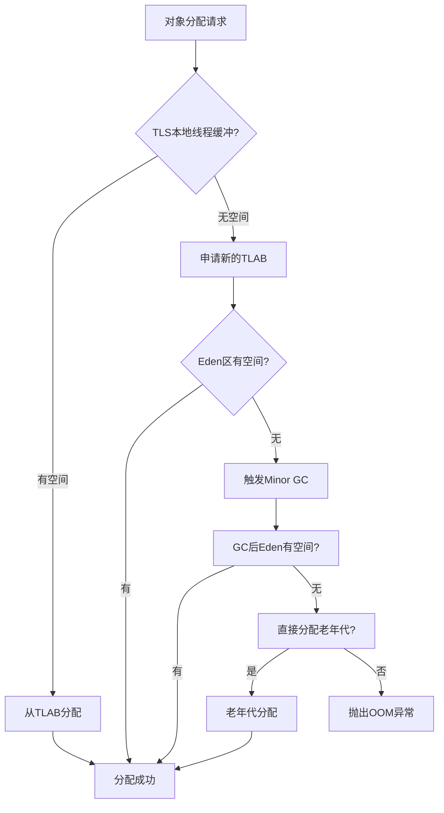
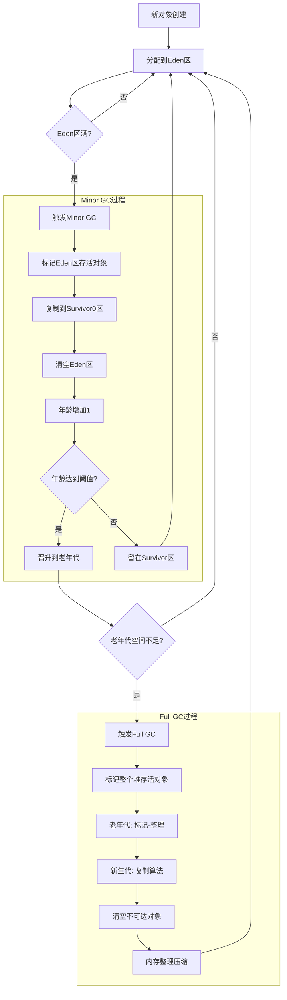

# 垃圾收集

垃圾收集主要是针对**堆和元空间**进行。

程序计数器、虚拟机栈和本地方法栈属于线程私有，只存在于线程的生命周期内，线程结束之后就会消失，因此不需要垃圾回收。

## 一 内存分配流程图

**分配策略：**

- **TLAB** (Thread Local Allocation Buffer): 线程本地分配缓冲，避免锁竞争
- **Eden区分配**: 优先在新生代Eden区分配
- **大对象直接进入老年代**: -XX:PretenureSizeThreshold参数控制
- **空间分配担保**: 老年代为新生代提供分配担保

## 二 垃圾收集算法

### 2.1 标记-清除算法（Mark-Sweep）

**工作原理：**

1. **标记阶段**：标记所有存活对象
2. **清除阶段**：回收未标记对象所占用的空间

**优缺点：**

- ✅ 实现简单
- ❌ 产生内存碎片
- ❌ 效率较低

### 2.2 复制算法（Copying）

**工作原理：**

1. 将内存分为两个相等的半区
2. 每次只使用其中一个半区
3. 垃圾收集时，将存活对象复制到另一个半区
4. 清空当前使用的半区

**优缺点：**

- ✅ 无内存碎片
- ✅ 效率高
- ❌ 内存利用率只有50%

### 2.3 标记-整理算法（Mark-Compact）

**工作原理：**

1. **标记阶段**：标记所有存活对象
2. **整理阶段**：将所有存活对象向一端移动
3. **清理阶段**：清理边界以外的内存

**优缺点：**

- ✅ 无内存碎片
- ✅ 内存利用率高
- ❌ 移动对象开销大

### 2.4 分代收集算法（Generational Collection）

Java虚拟机采用分代收集理论，将堆内存划分为不同代：

- **新生代（Young Generation）**：新创建的对象
- **老年代（Old Generation）**：长期存活的对象

**分代收集策略：**

- 新生代使用复制算法
- 老年代使用标记-清除或标记-整理算法

**分代说明：**

- **新生代**: Eden + 2个Survivor区，使用复制算法
- **老年代**: 长期存活对象，使用标记-清除或标记-整理算法
- **晋升阈值**: 默认15次GC后晋升老年代（-XX:MaxTenuringThreshold）

## 三 垃圾收集器