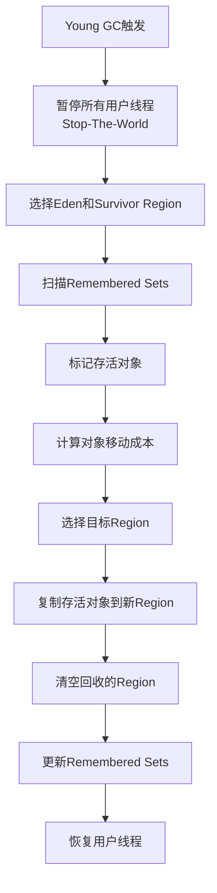
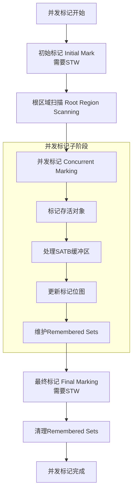
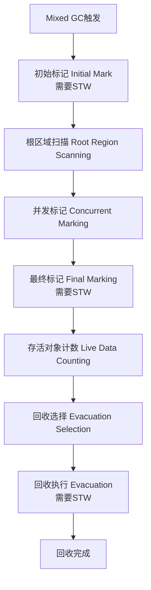

# G1 垃圾收集器

G1 是 JDK 7 Update 4 中正式引入，并在 JDK 9 中取代 Parallel Scavenge + Parallel Old 组合成为**服务端模式下的默认垃圾收集器**。

它的设计目标是为了替代 CMS 收集器，解决 CMS 带来的一些棘手问题，同时适应越来越大的堆内存。

---

## 一、G1 的核心设计思想与目标

G1 的全称是 **Garbage-First**，顾名思义，它是**优先处理垃圾最多**的区域。

*   **目标**：在**延迟可控**的情况下，尽可能实现**高吞吐量**。它并非实时收集器，但可以提供可预测的、较短的停顿时间（Soft Real-Time）。
*   **核心思想**：G1 不再坚持传统的物理连续年轻代和老年代划分，而是将整个 Java 堆划分为多个**大小相等的独立区域（Region）**。每个 Region 在逻辑上仍然扮演着 Eden、Survivor、Old 的角色，但它们是动态的，不需要连续。
*   **工作方式**：G1 跟踪各个 Region 里面的**垃圾堆积“价值”**（即回收所能获得的空间大小以及回收所需时间的经验值），在后台维护一个**优先列表**。每次根据用户设定的**最大停顿时间**，优先回收价值最大的那些 Region。这种方式保证了在有限的时间内，垃圾回收的效率最高。

---

## 二、G1 的关键技术与核心概念

### 1. Region 化内存布局

*   G1 将堆划分为多个 Region（默认约 2048 个），每个 Region 的大小可以通过 `-XX:G1HeapRegionSize` 设定，范围从 1M 到 32M，必须是 2 的幂。
*   Region 的角色不固定，可以是：
    *   **Eden Region**：新对象分配的区域。
    *   **Survivor Region**：存放年轻代 GC 后存活的对象。
    *   **Old Region**：存放多次 GC 后仍然存活的对象（晋升的老对象）。
    *   **Humongous Region**：专门用于存放大对象（大小超过单个 Region 容量 50% 的对象）。对于超过整个 Region 大小的巨型对象，会存放在连续的多个 Humongous Region 中。
        *   **Humongous 对象的分配和回收影响**：分配时可能因为找不到连续空间而导致 Full GC。对 Humongous 对象的回收通常在并发标记周期后的清理阶段或 Full GC 时进行。它是 G1 优化的一个重要关注点。

### 2. 记忆集与写屏障

*   **问题**：由于对象可能被分配在任何 Region 中，一个 Region 中的对象完全可能被其它 Region 中的对象引用。在进行 Young GC 时，为了找出当前 Region 的存活对象，需要扫描整个堆吗？这显然效率太低。
*   **解决方案**：
    *   **记忆集**：每个 Region 都有一个对应的**记忆集**，用于记录**“谁引用了我的对象”**。具体来说，它记录的是其它 Region 指向本 Region 的引用（指针）。这是一种“空间换时间”的策略，避免了全堆扫描。
    *   **写屏障**：为了实现 RSet 的更新，JVM 在**写操作**（例如 `objA.field = objB`）之前或之后插入一小段代码，这就是写屏障。当发生引用关系改变时，写屏障会把新的引用信息记录到对应的 `RSet` 中。这个过程会带来一定的性能开销。

---

## 三、G1 的垃圾收集过程

G1 的收集过程主要分为两个阶段：

1.  **年轻代 GC**
2.  **并发标记周期**
3.  **混合 GC**

### 1. 年轻代 GC

*   **触发时机**：Eden Region 被耗尽时。
*   **过程**：这是一个 **Stop-The-World** 的并行收集（多线程）。
    1.  从 GC Roots 开始，扫描对象图，找出存活对象。
    2.  使用**复制算法**，将存活对象从一个或多个 Eden/Survivor Region 复制到一个新的 Survivor Region 或 Old Region（如果对象年龄超过阈值 `-XX:MaxTenuringThreshold`）。
    3.  清空原来的 Eden/Survivor Region，将它们放入空闲 Region 列表。
*   **特点**：只回收年轻代的 Region，整个过程是 STW 的。

### 2. 并发标记周期

这是 G1 **回收老年代（Humongous Region**）的核心阶段。它并**不立即**进行回收，而是为了识别出各个 Region 中垃圾的比例，为后面的**混合 GC** 做准备。

其过程与 CMS 类似，但更为复杂：

1.  **初始标记**：
    *   **STW**。标记从 GC Roots **直接可达**的对象。
    *   这个阶段通常借用于一次 **年轻代 GC**，所以开销很小。

2.  **根区域扫描**：
    *   **并发**。扫描在初始标记中存活的老年代 Region 所引用的 Survivor Region（即“根区域”）。
    *   这个阶段必须在下次 **年轻代 GC** 开始前完成，因为年轻代 GC 会改变 Survivor Region。

3.  **并发标记**：
    *   **并发**。在整个堆中从 GC Roots 开始进行可达性分析，标记所有存活对象。
    *   这个阶段应用程序线程也在运行。

4.  **最终标记**：
    *   **STW**。处理并发标记阶段结束后仍遗留下来的少量 SATB 记录，并完成最终的标记。
    *   使用 **SATB 算法** 来处理并发标记期间的对象变化，比 CMS 的增量更新算法更高效。

5.  **清理**：
    *   **STW**。这个阶段会做三件事：
        a. **统计**：统计各个 Region 的存活对象信息和回收价值（空间大小）。
        b. **回收**：立即回收完全空闲的 Region。
        c. **排序**：根据回收价值对 Region 进行排序，更新到优先列表，为混合 GC 做准备。

### 3. 混合 GC

*   **触发时机**：当老年代堆占用率达到阈值（默认 `-XX:InitiatingHeapOccupancyPercent=45`，即 45%）时，在并发标记周期**之后**，就会开始发生混合 GC。
*   **过程**：
    *   它不仅仅回收年轻代，**还会根据并发标记周期得出的回收价值排序，选择部分价值高的老年代 Region 进行回收**。
    *   它是一次 **Stop-The-World** 的并行收集，使用**复制算法**将选定 Region 中的存活对象复制到新的空闲 Region 中。
*   **目标**：通过多次的混合 GC，逐步清理老年代的垃圾，从而避免一次性的、长时间的 Full GC。

---

## 四、G1 的优缺点

### 优点：

1.  **分区管理**：将堆划分为多个大小相等的Region
2.  **并发标记**：大部分标记工作与用户线程并发执行
3.  **Remembered Sets**：维护跨Region引用信息
4.  **可预测的停顿模型**： G1 最大的优势。用户可以通过 `-XX:MaxGCPauseMillis` 参数（默认 200ms）设定一个期望的停顿时间目标，G1 会尽力在这个目标范围内完成垃圾回收。
5.  **空间整合**：从整体上看，G1 是基于 **“标记-整理”** 算法的，从局部（两个 Region 之间）看是基于 **“复制”** 算法的。这意味着它在运行期间会进行内存整理，**有效避免了内存碎片**问题。
6.  **高效的 Full GC 规避**：在正常调优的情况下，G1 的**并发标记和混合 GC** 机制可以有效地清理老年代，从而**极大地避免了 Full GC** 的发生。

### 缺点与挑战：

1.  **内存占用更高**：由于每个 Region 都需要维护一个记忆集，这部分内存开销不容忽视，通常比其它收集器高出 10%~20%。
2.  **写屏障开销**：写屏障的代码执行会带来额外的 CPU 开销，对程序运行效率有一定影响。
3.  **比 CMS 更复杂**：其内部机制比 CMS 复杂得多，调优参数也更多。
4.  **Full GC 的“后路”**：如果对象分配速度过快，在混合 GC 来不及回收时，或者并发模式失败（Concurrent Mode Failure），G1 会**退化**为使用 **Serial Old** 收集器进行 Full GC，这将是单线程的，停顿时间会非常长。这是需要极力避免的情况。

---

## 五、关键调优参数

*   `-XX:+UseG1GC`：启用 G1 收集器。
*   `-XX:MaxGCPauseMillis=200`：设置期望的最大 GC 停顿时间目标（毫秒）。这是一个**目标**，而非保证。
*   `-XX:InitiatingHeapOccupancyPercent=45`：设置触发并发标记周期的堆占用率阈值。
*   `-XX:G1HeapRegionSize=16m`：设置 Region 的大小。
*   `-XX:G1NewSizePercent` / `-XX:G1MaxNewSizePercent`：控制年轻代大小占整个堆的最小和最大比例。

## 总结

G1 是一款里程碑式的垃圾收集器，它通过 **Region 化内存布局**、**基于价值的回收优先列表** 和 **可预测的停顿模型**，成功地在吞吐量和低延迟之间找到了一个出色的平衡点。

它解决了 CMS 的内存碎片和不可预测停顿等问题，虽然引入了更高的内存和写屏障开销，但凭借其强大的综合能力和可管理性，成为了现代大内存、多核应用服务器的首选收集器。