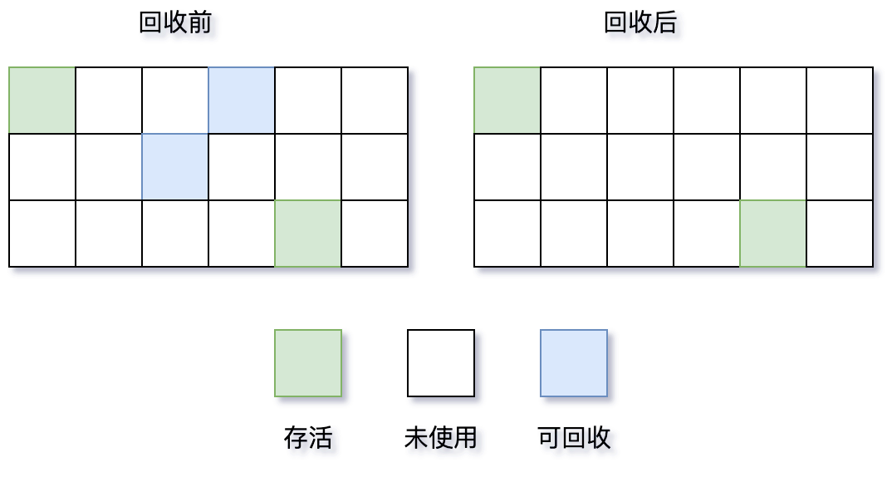
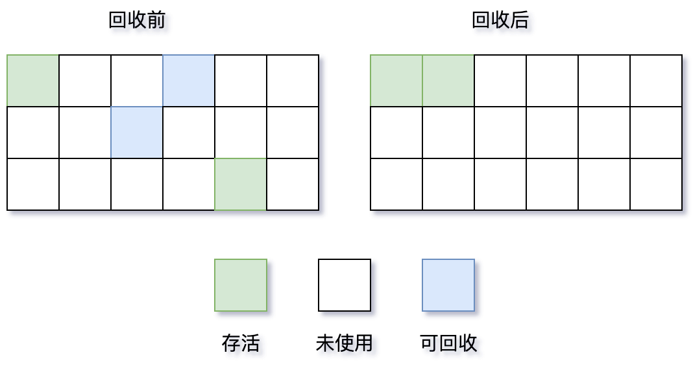

# 垃圾收集算法

## 一  标记-清除算法（Mark-Sweep）

**工作原理：**

1. **标记阶段**：遍历所有存活的对象，并对其进行标记。

   - 垃圾收集器从 **GC Roots** 对象开始（包括虚拟机栈中引用的对象、方法区中静态属性引用的对象、方法区中常量引用的对象、本地方法栈中JNI引用的对象等）。
   - 顺着引用链进行可达性分析，所有能被从 GC Roots 访问到的对象，都被标记为 **“存活”**。
   - 而那些从 GC Roots 不可达的对象，则被判定为 **“可回收”** 的垃圾。
2. **清除阶段**：回收未标记对象所占用的空间。
   - 垃圾收集器线性地遍历整个堆内存。
   - 对于未被标记为“存活”的对象，将其所占用的**内存块**记录到一个 **空闲列表** 中。
   - 另外，还会判断回收后的内存块与前一个**内存块**是否连续，若连续，会合并。
3. **当需要分配新对象时**：内存分配器就可以从这个**空闲列表**中寻找合适大小的内存块进行分配。

**优缺点：**

- 优点：实现简单
- 缺点：产生内存碎片，导致无法给大对象分配内存。
- 缺点：效率较低，标记和清除过程效率都不高

## 二 标记-整理算法（Mark-Compact）

**工作原理：**

1. **标记阶段**：标记所有存活对象
   - 从 **GC Roots** 集合开始，通过可达性分析算法，遍历整个对象图。
   - 所有能被访问到的对象都被打上一个 **存活** 的标记。
   - 这个阶段通常需要 **“Stop The World”**，以确保在标记过程中对象引用关系不会发生变化。
2. **整理阶段**：将所有存活对象向一端移动
   - **将所有的存活对象都向内存空间的一个方向（通常是起始地址或结束地址）移动**。
   - 移动完成后，**直接清理掉边界以外所有的内存**。
   - 这个阶段**需要“Stop The World”**，因为移动对象需要更新所有指向这些对象的引用指针，如果用户线程同时也在访问这些对象，会导致严重问题。

**通过移动存活对象，用空间上的“整理”来换取时间上的“分配效率”和空间上的“无碎片化”**。

**优缺点：**

- 优点：无内存碎片，内存利用率高
- 缺点：移动对象开销大

## 三 复制算法（Copying）

**工作原理：**

1. 存活对象标记与复制
   - 垃圾收集器从 **GC Roots** 开始进行可达性分析。
   - 每当发现一个存活对象，就将其从 **From 空间**（正在使用的半区）复制到 **To 空间**（空闲的半区）。
   - 在复制的同时，**紧挨着**前一个复制的对象放置新对象，确保在 To 空间中没有内存碎片。
   - 同时，更新该对象的引用地址，指向新的位置。
2. 内存交换与清理
   - 当 `From` 空间中所有存活对象都被复制到 `To` 空间后，**一次性清理掉整个 `From` 空间**。
   - 然后，将 `From` 和 `To` 的角色进行**交换**。原来的 `To` 空间变成新的 `From` 空间（用于分配新对象），原来的 `From` 空间变成新的 `To` 空间（用于下一次回收）。

**优缺点：**

- 优点：无内存碎片，效率高。
- **优点：复制算法在“对象死亡率高”的场景下表现出的巨大优势。**
- 缺点：内存利用率只有50%。

### 2.4 分代收集算法（Generational Collection）

核心思想：**基于对象生命周期存在显著差异的经验规律，对堆内存进行分代，并对不同代施以最匹配的垃圾收集策略，从而实现以最小的代价完成内存回收。**

分代收集算法的核心思想源于两个被广泛观察到的**程序运行经验**：

1. **弱分代假说**：绝大多数对象的寿命都非常短，几乎是“朝生夕死”的。
2. **强分代假说**：熬过越多次垃圾收集过程的对象，就越难以消亡。

基于这两个“经验法则”，分代收集算法采取了**分而治之**的策略：

- 将堆内存划分为不同的“代”：**新生代，老年代**。
- **根据每代的特点，采用最适合、最高效的垃圾收集算法**。

**分代说明：**

- **新生代**: Eden + 2个Survivor区，使用**复制**算法。
  - 区域较小，但垃圾回收发生**非常频繁**。
  - **默认比例是 `8:1:1`**，保证了内存的利用率达到 90%
- **老年代**: 长期存活对象，使用**标记-清除**或**标记-整理**算法。
  - 区域较大，垃圾回收发生**不那么频繁**。
- **晋升阈值**: 默认15次GC后晋升老年代（-XX:MaxTenuringThreshold）

**优缺点：**

- 优点：性能高效，灵活性高。
- 缺点：实现复杂，并非万能。

对象分配与晋升

- 新对象优先在 **Eden** 区分配。

- 当 Eden 区满时，触发一次 **Minor GC**。

- 在 Minor GC 中，Eden 和 **From Survivor** 中存活的对象会被复制到 **To Survivor**。

- 每个对象在 Survivor 区中每“熬过”一次 Minor GC，年龄就增加1岁。

