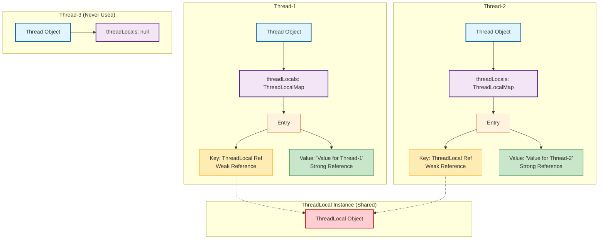

# ThreadLocal

## 一 概念

`ThreadLocal` 提供了一个线程局部变量。

每个访问该变量的线程（通过其 `get` 或 `set` 方法）都拥有自己独立初始化后的变量副本。

简单来说，**`ThreadLocal` 为每个线程创建了一个变量的“私有”拷贝，使得每个线程都可以独立地改变自己的副本，而不会影响其他线程的副本。**

这解决了多线程编程中最棘手的问题之一：**数据共享的冲突**。

通过`ThreadLocal`，你可以将那些非线程安全的对象（如`SimpleDateFormat`）以线程安全的方式“共享”给所有线程。

## 二 数据存储模型

1. 每个运行的`Thread`线程对象内部，都有一个名为 `threadLocals` 的成员变量，其类型是 `ThreadLocalMap`。
2. `ThreadLocalMap` 是一个特殊的Map，它的**Key是`ThreadLocal`对象本身（使用弱引用，见下文）**，**Value是当前线程要存储的变量副本**。
3. 当你调用 `threadLocal.set(value)` 时，实际上是在**当前线程**的 `threadLocals` 这个Map里，以当前 `threadLocal` 对象为Key，放入了一个键值对 `(threadLocal, value)`。
4. 当你调用 `threadLocal.get()` 时，它会从**当前线程**的 `threadLocals` 这个Map里，以自己（`threadLocal`）为Key，去查找对应的Value。

**简单比喻：**
`ThreadLocal` 就像一个“存取处”或“钥匙”。

所有线程都来同一个存取处（同一个`ThreadLocal`对象）存东西，但管理员（`ThreadLocal`的`get/set`方法）会根据不同的客户（线程）打开不同的储物柜（线程的`threadLocals`），所以每个客户只能拿到自己的东西，互不干扰。

**ThreadLocalMap 和 HashMap区别：**

ThreadLocalMap和HashMap差不多，数据结构都是hash表，不过对于hash冲突的解决⽅式不同：

- ThreadLocalMap 使⽤的是线型探测，装载因⼦采⽤的是黄⾦分割点；
- HashMap 使⽤的是拉链法，扩容⽅式均为原Entry数组的2倍。

## 三 关键源码分析

### 1.Thread 类

每个`Thread`对象都持有一个`ThreadLocalMap`。

```java
public class Thread implements Runnable {
    // ...
    ThreadLocal.ThreadLocalMap threadLocals = null;
    // ...
}
```

### 2.ThreadLocal 的 set 方法

```java
public void set(T value) {
    Thread t = Thread.currentThread(); // 1. 获取当前线程
    ThreadLocalMap map = getMap(t);    // 2. 获取该线程的ThreadLocalMap
    if (map != null) {
        map.set(this, value); // 3. 如果Map存在，以当前ThreadLocal为Key设值
    } else {
        createMap(t, value);  // 4. 如果Map不存在，为当前线程创建Map
    }
}

ThreadLocalMap getMap(Thread t) {
    return t.threadLocals; // 返回线程自己的threadLocals
}

void createMap(Thread t, T firstValue) {
    t.threadLocals = new ThreadLocalMap(this, firstValue);
}
```

### 3.ThreadLocal 的 get 方法

```java
public T get() {
    Thread t = Thread.currentThread();
    ThreadLocalMap map = getMap(t);
    if (map != null) {
        // 以当前ThreadLocal为Key，从Map中获取Entry
        ThreadLocalMap.Entry e = map.getEntry(this);
        if (e != null) {
            @SuppressWarnings("unchecked")
            T result = (T)e.value;
            return result;
        }
    }
    // 如果Map为空或Entry为空，则进行初始化
    return setInitialValue();
}
```

## 四 内存泄漏问题

在`ThreadLocalMap`中，Key是`ThreadLocal`对象，但它是一个 **`WeakReference`（弱引用）**。

```java
static class ThreadLocalMap {
    static class Entry extends WeakReference<ThreadLocal<?>> {
        Object value;
        Entry(ThreadLocal<?> k, Object v) {
            super(k); // 这里，Key被包装成了一个弱引用
            value = v;
        }
    }
    // ...
}
```

**弱引用的特性**：当一个对象**只**被弱引用指向时，无论内存是否充足，只要触发GC，这个对象都会被回收。

这就导致了以下情况：

1. 假设你在一个方法中创建了一个`ThreadLocal`局部变量并使用了它。
2. 方法结束后，栈帧销毁，指向`ThreadLocal`对象的强引用没了。
3. 由于`ThreadLocalMap`的Key是弱引用，GC发生时，这个`ThreadLocal`对象会被回收。此时，Map中就出现了一个Key为`null`的Entry。
4. 但是，这个Entry的Value（即你存储的数据）仍然是一个强引用，只要线程还在运行（例如使用线程池中的线程，线程会一直存活），这个Value就无法被回收，造成了**内存泄漏**。

因此使⽤完后调⽤`ThreadLocal`的`remove`⽅法删除对应线程的`threadLocals`中的本地变量。

## 五 使用示例

`withInitial`方法

```java
public static <S> ThreadLocal<S> withInitial(Supplier<? extends S> supplier) {
    return new SuppliedThreadLocal<>(supplier);
}
```

- 创建一个线程局部变量，其初始值通过调用给定的提供者(Supplier)生成。
- Supplier：lambda表达式，对象引用。
- 首次调用get，会执行lambda表达式/对象引用内容，返回属于当前线程的实例。

```java
public class ThreadLocalDemo {

    // SimpleDateFormat 多线程不安全
    public static final SimpleDateFormat DATE_FORMAT = new SimpleDateFormat("yyyy-MM-dd");
    // ThreadLocal 为各个线程提供一个单独的 SimpleDateFormat
    public static final ThreadLocal<SimpleDateFormat> FORMAT_THREAD_LOCAL = ThreadLocal.withInitial(() -> new SimpleDateFormat("yyyy-MM-dd"));

    // Random实现线程安全的，若多个线程共享一个随机数生成器，很低效
    // ThreadLocal 为各个线程提供一个单独的 Random
    public static final ThreadLocal<Random> RANDOM_THREAD_LOCAL = ThreadLocal.withInitial(Random::new);
    // public static final ThreadLocal<Random> local = ThreadLocal.withInitial(() -> new Random());

    public static void main(String[] args) {
        // 不安全
        String s1 = DATE_FORMAT.format(new Date());
        System.out.println(s1);
        // 安全
        String s2 = FORMAT_THREAD_LOCAL.get().format(new Date());
        System.out.println(s2);
        // 回收，防止内存泄漏
        FORMAT_THREAD_LOCAL.remove();

        Random localRandom = RANDOM_THREAD_LOCAL.get();
        System.out.println(localRandom.nextInt(100));
        // 也可使用 ThreadLocalRandom.current() 返回属于当前线程的 Random实例
        localRandom = ThreadLocalRandom.current();
        System.out.println(localRandom.nextInt(100));
        // 回收，防止内存泄漏
        RANDOM_THREAD_LOCAL.remove();
    }
}
```

## 六 可见范围（同一线程内）

如果一段代码中所需要的数据（如用户认证信息）必须与其它代码共享，**判断共享数据的代码 是否能保证 在同一个线程中执行**。

如果能保证，就可把共享数据的可见范围限制在同一个线程之内，这样无须同步，也能保证线程之间不出现数据争用的问题。

## 七 应用场景

1. **消息队列**：大部分使用消费队列的架构模式（生产者-消费者）都会将消息的消费过程尽量在一个线程中消费完。

2. **存储用户会话信息（Session）**：在Web服务器中，一个请求对应一个线程。可以使用`ThreadLocal`来存储当前登录用户的信息，在控制器、服务层等任何地方都可以方便地获取，而无需在方法参数中层层传递。
3. **数据库连接与事务管理**：在Spring等框架中，经常使用`ThreadLocal`来保证一个事务内的所有数据库操作使用的是同一个Connection。
4. **日期格式化**：将非线程安全的`SimpleDateFormat`对象放入`ThreadLocal`，每个线程使用自己的副本，变相实现了线程安全。
5. **全局参数传递**：避免在调用链的每一层都传递某个通用参数（如TraceId用于全链路追踪）。

## 八 多线程存储图解



**多线程存储核心机制：**

1. **共享的ThreadLocal对象**：
   - 所有线程访问同一个`ThreadLocal`实例
   - 这是数据访问的"入口点"和"钥匙"
2. **线程独立的存储空间**：
   - 每个`Thread`对象都有自己独立的`threadLocals: ThreadLocalMap`
   - **Key-Value结构**：在`ThreadLocalMap`中，每个条目（`Entry`）都是一个键值对。
     - **Key**：是那个共享的`ThreadLocal`对象（使用**弱引用**指向）。
     - **Value**：是该线程通过`threadLocal.set()`方法存储的**私有数据副本**（强引用）。
   - **线程1**和**线程2**各自拥有完整的存储结构
   - **线程3**从未使用过该ThreadLocal，其`threadLocals`为null
3. **引用关系**：
   - **Key弱引用**：虚线箭头(`-.->`)表示弱引用，当外部没有强引用时，ThreadLocal对象可被GC回收
   - **Value强引用**：实线箭头(`-->`)表示强引用，需要手动`remove()`来避免内存泄漏

## 九 总结

| 特性         | 解释                                                         |
| :----------- | :----------------------------------------------------------- |
| **目的**     | 实现线程级别的数据隔离，避免共享冲突。                       |
| **存储位置** | 数据存储在每个线程自身的`threadLocals`（一个`ThreadLocalMap`）变量中。 |
| **数据结构** | `ThreadLocalMap`，Key为`ThreadLocal`对象（弱引用），Value为存储的值（强引用）。 |
| **内存泄漏** | 由于Key是弱引用，容易产生Key为null的Entry，导致Value无法被回收。 |
| **解决方案** | 1. JDK 8在内部方法中加入了惰性清理机制。 2. **最重要**：养成习惯，在用完后主动调用 `remove()`。 |
| **适用场景** | 线程内全局上下文、数据库连接、用户会话、工具类（如日期格式化）等。 |

