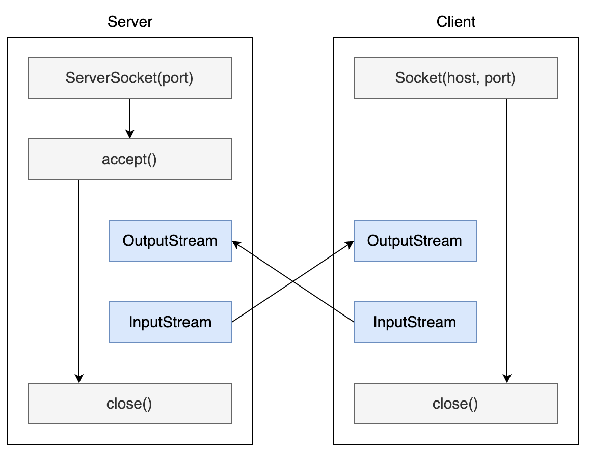

# 网络操作

Java 中的网络支持：

- `InetAddress`：用于表示网络上的硬件资源，即 IP 地址；
- `URL`：统一资源定位符；
- `Sockets`：使用 TCP 协议实现网络通信；
- `Datagram`：使用 UDP 协议实现网络通信。

## InetAddress

没有公有的构造函数，只能通过静态方法来创建实例。

- `InetAddress.getByName(String host);`
- `InetAddress.getByAddress(byte[] address);`

## URL

可以直接从 URL 中读取字节流数据。

## Sockets

`ServerSocket`：服务器端类

`Socket`：客户端类

服务器和客户端通过 `InputStream` 和 `OutputStream` 进行输入输出。

## Datagram

`DatagramSocket`：通信类

`DatagramPacket`：数据包类