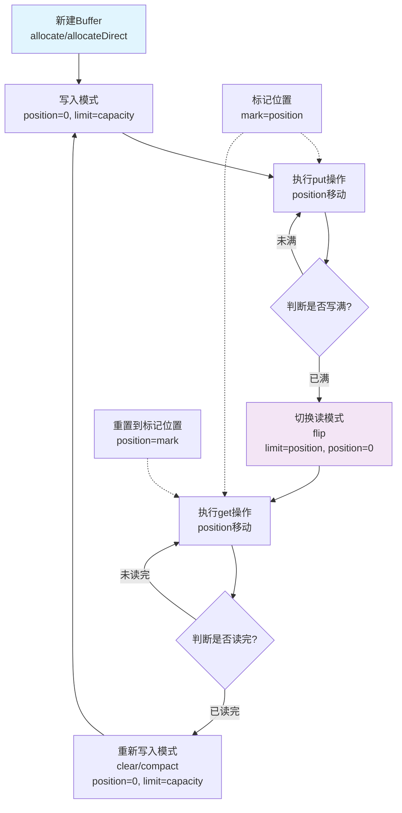
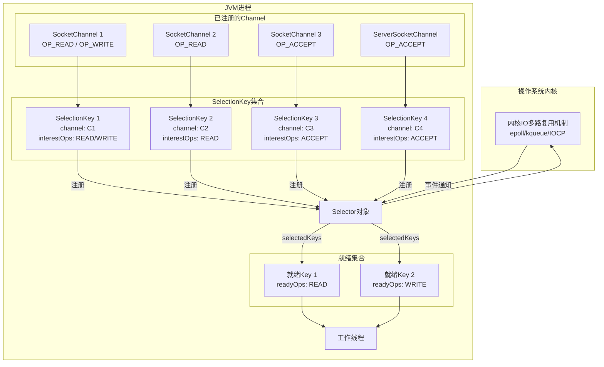

# NIO

## 一 NIO 概述与核心思想

### 1.1 什么是NIO？

传统IO（`java.io`）是基于**流（Stream）** 的**阻塞式（Blocking）** I/O。每个连接需要一个线程，线程在读写数据时会一直等待，导致资源浪费和并发能力受限。

NIO（`java.nio`，New I/O / Non-blocking I/O）是基于**通道（Channel）** 和**缓冲区（Buffer）** 的**非阻塞式（Non-blocking）** 或**选择器（Selector）驱动**的I/O。

核心思想是：**一个线程可以管理多个连接**。线程不会傻等某个连接的数据，而是去问“哪些连接准备好了？”，然后只处理那些已经就绪的连接。

NIO的核心设计目标是：

- 更高的性能：减少系统调用，使用内存映射
- 更好的扩展性：单线程处理多个连接
- 更灵活的IO操作：非阻塞模式、选择器机制

### 1.2 传统IO vs NIO

| 特性         | 传统IO (`java.io`)               | NIO (`java.nio`)                                         |
| :----------- | :------------------------------- | :------------------------------------------------------- |
| **数据流**   | 面向**流**(Stream)，单向流动     | 面向**块**(Buffer)和**通道**(Channel)，双向              |
| **阻塞模式** | **阻塞式**，线程在读写时被挂起   | **可选择非阻塞**，线程不会在I/O上被挂起                  |
| **多路复用** | 不支持，一个连接一个线程         | 支持，一个Selector可监控多个Channel                      |
| **适用场景** | 连接数少、并发要求不高、代码简单 | 高并发连接（如聊天服务器、游戏服务器）、文件系统高级操作 |
| **API**      | 相对简单直观                     | 更复杂，需要理解缓冲区、选择器等概念                     |

## 二 缓冲区(Buffer)

- **是什么**：一个用于存储特定基本类型数据的容器对象。它是数据进出的载体，所有读写操作都通过缓冲区进行。
- **核心属性**：
  - `capacity`： 容量，创建时固定。
  - `limit`： 读写操作的界限。
  - `position`： 当前读写的位置。
  - `mark`： 一个标记位置，可通过`reset()`返回。
- **工作流程**：`flip()`, `clear()`, `compact()`, `rewind()` 等方法通过改变这三个属性的值来控制缓冲区的读写状态。

### Buffer 的层次结构

```java
// Buffer继承体系
Buffer (抽象类)
├── ByteBuffer (最常用)
│   ├── HeapByteBuffer (堆内存)
│   ├── DirectByteBuffer (直接内存)
│   └── MappedByteBuffer (内存映射)
├── CharBuffer
├── ShortBuffer
├── IntBuffer
├── LongBuffer
├── FloatBuffer
└── DoubleBuffer
```

### Buffer 内部状态图




### Buffer 内存布局示例

```java
// ByteBuffer.allocate(8) 的初始状态
// capacity=8, position=0, limit=8, mark=undefined
+---+---+---+---+---+---+---+---+
|   |   |   |   |   |   |   |   |
+---+---+---+---+---+---+---+---+
 0   1   2   3   4   5   6   7

// 写入3个字节后: put('A'), put('B'), put('C')
// capacity=8, position=3, limit=8
+---+---+---+---+---+---+---+---+
| A | B | C |   |   |   |   |   |
+---+---+---+---+---+---+---+---+
 0   1   2   3   4   5   6   7

// flip() 后: 切换为读模式
// capacity=8, position=0, limit=3
+---+---+---+---+---+---+---+---+
| A | B | C |   |   |   |   |   |
+---+---+---+---+---+---+---+---+
 0   1   2   3   4   5   6   7
```

## 三 通道(Channel)

- **是什么**：连接数据源（文件、网络套接字）与缓冲区的双向管道。可以非阻塞地读写。
- **特点**：可以从通道读数据到缓冲区，也可以从缓冲区写数据到通道。
- **核心方法**：`read(buffer)`, `write(buffer)`, `configureBlocking(false)` (设置为非阻塞模式)。

### Channel 继承体系

```java
// Channel主要类型
Channel (接口)
├── ReadableByteChannel
├── WritableByteChannel
├── ByteChannel (组合ReadableByteChannel和WritableByteChannel)
├── FileChannel (文件操作)
├── SocketChannel (TCP客户端)
├── ServerSocketChannel (TCP服务器)
├── DatagramChannel (UDP)
└── SelectableChannel (可注册到Selector)
```

## 四 选择器 (Selector)

- **是什么**：NIO非阻塞模式的“大脑”或“多路复用器”，允许单个线程管理多个 Channel，实现**非阻塞 I/O**。
  - 一个Selector可以轮询（`select()`）多个注册到它上面的Channel。


```java
// 核心关系图
One Thread → One Selector → Multiple Channels
      ↓
  事件驱动
      ↓
  高效处理
```

- **核心优势**：**单线程即可高效管理成千上万的网络连接**，这是构建高性能服务器（如Netty）的基础。
- **工作原理**：
  1. 将多个Channel（必须是非阻塞模式）**注册**到Selector上，并指定**感兴趣的事件**（`SelectionKey.OP_ACCEPT`, `OP_CONNECT`, `OP_READ`, `OP_WRITE`）。
  2. 调用`select()`方法，它会**阻塞**（也可设置超时或非阻塞），直到有注册的Channel发生了其感兴趣的事件。
  3. 方法返回后，获取到`SelectionKey`的集合，每一个Key代表一个就绪的Channel和事件。
  4. 遍历这些Key，进行相应的业务处理（如接受连接、读取数据、写入数据）。

```java
注册Channel到Selector
       ↓
Selector监听事件
       ↓
事件发生 → Selector.select()返回
       ↓
获取SelectionKey集合
       ↓
遍历处理就绪事件
```

### 工作原理



### 核心组件详解

#### 1. Selector 创建与使用

```java
// 1. 创建 Selector
Selector selector = Selector.open();

// 2. 配置 Channel 为非阻塞模式
ServerSocketChannel serverChannel = ServerSocketChannel.open();
serverChannel.configureBlocking(false);

// 3. 绑定端口
serverChannel.bind(new InetSocketAddress(8080));

// 4. 注册 Channel 到 Selector
// 第二个参数是"感兴趣的事件"
serverChannel.register(selector, SelectionKey.OP_ACCEPT);
```

#### 2. SelectionKey 事件类型

```java
// 四种事件类型
int OP_ACCEPT  = 1 << 0;  // 连接接受事件，值为 1
int OP_CONNECT = 1 << 1;  // 连接就绪事件，值为 2
int OP_READ    = 1 << 2;  // 读就绪事件，值为 4
int OP_WRITE   = 1 << 3;  // 写就绪事件，值为 8

// 组合监听多个事件
int interestSet = SelectionKey.OP_READ | SelectionKey.OP_WRITE;
```

#### 3. SelectionKey 关键属性

```java
// SelectionKey 提供的关键信息
SelectionKey key = channel.register(selector, interestSet, attachment);

// 1. 事件集合
int interestOps = key.interestOps();   // 感兴趣的事件
int readyOps = key.readyOps();         // 已就绪的事件

// 2. 附件（Attachment）
key.attach(new Object());              // 附加对象
Object attachment = key.attachment();  // 获取附件

// 3. 获取 Channel
SelectableChannel channel = key.channel();

// 4. 获取 Selector
Selector selector = key.selector();
```

### Selector 核心方法详解

#### 1. select() 方法族

```java
// 1. 阻塞直到至少一个事件发生
int select();  

// 2. 阻塞指定时间（毫秒）
int select(long timeout);  

// 3. 立即返回，不阻塞
int selectNow();  

// 4. 唤醒阻塞中的 select()
Selector.wakeup();

// 5. 关闭 Selector
selector.close();
```

#### 2. select() 返回值含义

```java
int readyCount = selector.select();

// readyCount 的三种情况：
// > 0: 有事件就绪的 Channel 数量
// = 0: 超时返回（设置了 timeout）
// = 0: selectNow() 没有事件
```

#### 3. 正确的事件循环模式

```java
while (true) {
    // 模式1：无限阻塞
    int ready = selector.select();
    
    // 模式2：带超时的阻塞（可响应关闭信号）
    int ready = selector.select(1000);
    
    // 模式3：非阻塞（适合与任务队列结合）
    int ready = selector.selectNow();
    
    if (ready > 0) {
        Set<SelectionKey> selectedKeys = selector.selectedKeys();
        Iterator<SelectionKey> iter = selectedKeys.iterator();
        
        while (iter.hasNext()) {
            SelectionKey key = iter.next();
            iter.remove();  // 关键步骤！
            
            // 处理事件...
        }
    }
    
    // 可在此处执行其他任务
    processOtherTasks();
}
```

## 五 JDK 7/8 (NIO 2) 的关键增强

JDK 7引入了 **NIO.2**（`java.nio.file` 等包），在JDK 8中得到了稳定和支持。

1. **异步文件通道 (AsynchronousFileChannel)**
   - 提供了真正的异步文件I/O操作，使用`Future`或`CompletionHandler`回调机制，避免线程在文件读写时被阻塞。
2. **异步套接字通道 (AsynchronousSocketChannel / AsynchronousServerSocketChannel)**
   - 提供了非阻塞的、基于回调（`CompletionHandler`）或`Future`的异步网络I/O，为构建高性能异步网络应用提供了更底层的API。
3. **文件系统API (java.nio.file)**
   - **核心类 `Path`**： 取代了容易出错的`File`类，提供了更强大、更易用的路径操作。
   - **核心类 `Files`**： 一个强大的工具类，提供了海量的静态方法，用于文件复制、移动、删除、读取所有行、获取文件属性等，功能远超旧的`File`。
   - **文件变化监视 (WatchService)**： 可以监视目录（如新文件创建、文件修改、删除），并实时响应。非常适合实现文件监听、日志收集等功能。
   - **文件属性视图 (FileAttributeView)**： 提供统一的API访问各种文件系统的特有属性（如POSIX权限、所有者等）。

## 六 基础 Echo 服务器示例

```java
public class NioEchoServer {
    private static final int BUFFER_SIZE = 1024;
    
    public static void main(String[] args) throws IOException {
        // 1. 创建 Selector
        Selector selector = Selector.open();
        
        // 2. 创建 ServerSocketChannel
        ServerSocketChannel serverSocketChannel = ServerSocketChannel.open();
        serverSocketChannel.bind(new InetSocketAddress(8080));
        serverSocketChannel.configureBlocking(false);
        
        // 3. 将ServerSocketChannel注册到Selector，监听ACCEPT事件
        serverSocketChannel.register(selector, SelectionKey.OP_ACCEPT);
        System.out.println("服务器启动在端口 8080");
        
        // 4. 事件循环
        while (true) {
            // 阻塞直到有事件发生，参数为超时时间（毫秒）
            int readyChannels = selector.select(1000);
            
            if (readyChannels == 0) {
                // 超时，可执行其他任务
                continue;
            }
            
            // 5. 获取就绪的 SelectionKey 集合
            Set<SelectionKey> selectedKeys = selector.selectedKeys();
            Iterator<SelectionKey> keyIterator = selectedKeys.iterator();
            
            while (keyIterator.hasNext()) {
                SelectionKey key = keyIterator.next();
                
                try {
                    if (key.isAcceptable()) {
                        handleAccept(key, selector);
                    }
                    if (key.isReadable()) {
                        handleRead(key);
                    }
                    if (key.isWritable()) {
                        handleWrite(key);
                    }
                } catch (IOException e) {
                    // 客户端断开连接
                    key.cancel();
                    key.channel().close();
                }
                
                // 6. 重要：必须移除已处理的 key
                keyIterator.remove();
            }
        }
    }
    
    private static void handleAccept(SelectionKey key, Selector selector) 
            throws IOException {
        ServerSocketChannel serverChannel = (ServerSocketChannel) key.channel();
        SocketChannel clientChannel = serverChannel.accept();
        clientChannel.configureBlocking(false);
        
        // 为新连接注册 READ 事件
        clientChannel.register(selector, SelectionKey.OP_READ);
        System.out.println("接受新连接: " + clientChannel.getRemoteAddress());
    }
    
    private static void handleRead(SelectionKey key) throws IOException {
        SocketChannel channel = (SocketChannel) key.channel();
        ByteBuffer buffer = ByteBuffer.allocate(BUFFER_SIZE);
        
        int bytesRead = channel.read(buffer);
        
        if (bytesRead == -1) {
            // 连接关闭
            channel.close();
            return;
        }
        
        buffer.flip();
        byte[] data = new byte[buffer.remaining()];
        buffer.get(data);
        String message = new String(data);
        System.out.println("收到消息: " + message);
        
        // 回写相同的消息
        buffer.clear();
        buffer.put(data);
        buffer.flip();
        
        // 注册 WRITE 事件
        key.interestOps(SelectionKey.OP_WRITE);
        key.attach(buffer);
    }
    
    private static void handleWrite(SelectionKey key) throws IOException {
        SocketChannel channel = (SocketChannel) key.channel();
        ByteBuffer buffer = (ByteBuffer) key.attachment();
        
        if (buffer.hasRemaining()) {
            channel.write(buffer);
        } else {
            // 写完成，切换回 READ 事件
            key.interestOps(SelectionKey.OP_READ);
            key.attach(null);
        }
    }
}
```

## 七 与 Netty 的对比

| 特性       | Java NIO Selector | Netty EventLoop |
| ---------- | ----------------- | --------------- |
| 线程模型   | 手动管理          | 固定线程池      |
| 内存管理   | 手动 ByteBuffer   | PooledByteBuf   |
| 编解码     | 手动处理          | 内置处理器链    |
| API 复杂度 | 复杂              | 简单易用        |
| 社区支持   | 官方基础库        | 活跃社区        |

## 八 总结

JDK 8中的NIO（特别是NIO 2）是一套强大而复杂的I/O框架。

它通过**通道、缓冲区和选择器**的模型，解决了传统BIO在高并发场景下的性能瓶颈，并提供了**异步I/O**和**现代文件系统API**等高级功能。

Selector 是 Java NIO 高性能网络编程的核心，其多路复用能力使得单线程可以处理成千上万的连接。关键要点：

1. 一个 Selector 对应一个线程，管理多个 Channel
2. 四种事件：ACCEPT、CONNECT、READ、WRITE
3. 必须正确处理 `selectedKeys()` 的迭代和移除
4. 合理使用附件传递会话状态
5. 注意资源清理和异常处理

对于生产环境，建议使用经过验证的框架如 Netty，它解决了原生 NIO 的许多复杂性和 Bug，提供了更优雅的 API 和更好的性能。
