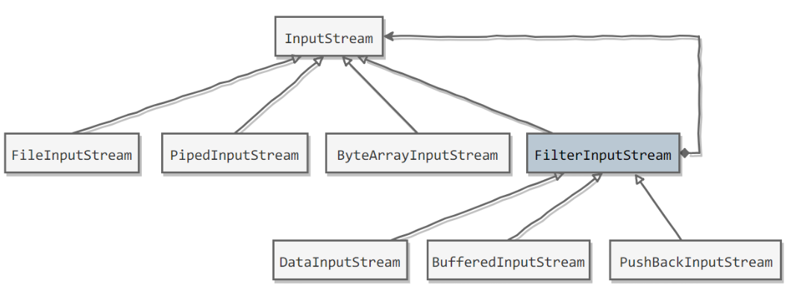

# 装饰者模式

Java I/O 使用了装饰者模式来实现附加功能（聚合）

Decorator：动态给一个对象添加一些额外职责（附加职责），它提供了用子类扩展功能的一个灵活替代，比派生一个子类更加灵活（聚合）。

## 以 InputStream 为例

1. InputStream 是抽象组件；
2. FileInputStream 是 InputStream 的子类，属于具体组件，提供了字节流的输入操作；
3. FilterInputStream 属于抽象装饰者，装饰者用于装饰组件，为组件提供额外的功能；
4. BufferedInputStream 是 FilterInputStream 的子类，属于具体装饰者，提供缓存功能。



## BufferedInputStream（缓存功能）

BufferedInputStream 为 FileInputStream 提供缓存功能.

实例化一个具有缓存功能的字节流对象时，只需要在 FileInputStream 对象上再套一层 BufferedInputStream 对象即可.

```java
FileInputStream fileInputStream = new FileInputStream(filePath);
BufferedInputStream bufferedInputStream = new BufferedInputStream(fileInputStream);
```

## DataInputStream（更多数据类型操作）

DataInputStream 装饰者提供了对更多数据类型进行输入的操作，比如 int、double 等基本类型。