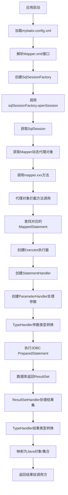

# MyBatis 核心执行步骤

## 第一阶段：初始化阶段
这个阶段发生在应用启动时，主要任务是加载并解析配置，创建核心对象。

**核心步骤：**

1.  **加载配置文件**
    *   系统读取全局配置文件（通常是 `mybatis-config.xml`），其中包含了数据源、事务管理器、设置（settings）、类型别名、类型处理器、插件以及最重要的 **Mapper 映射文件的位置** 等信息。

2.  **创建 SqlSessionFactory**
    *   这是整个 MyBatis 的“基石”，一个全局的单例对象。`SqlSessionFactoryBuilder` 使用上一步解析出的配置信息，通过 **建造者模式** 构建出 `SqlSessionFactory`。
    *   `SqlSessionFactory` 的作用是创建 `SqlSession`。

3.  **解析 Mapper 映射文件**
    *   根据配置，MyBatis 会扫描并解析所有的 `Mapper.xml` 文件或 `@Mapper` 注解的接口。
    *   对于每个 `<select>`、`<insert>`、`<update>`、`<delete>` 等 SQL 标签，MyBatis 会：
        *   解析 SQL 语句（包含 `#{}` 和 `${}` 占位符）。
        *   获取其 `id`、`parameterType`、`resultType`、`resultMap` 等属性。
        *   将解析后的信息封装为一个 **`MappedStatement` 对象**。
    *   **关键点**：`MappedStatement` 是 MyBatis 内部用来描述一个 SQL 语句的顶级对象，它包含了执行一条 SQL 所需的所有信息。所有解析好的 `MappedStatement` 对象会被注册到 `Configuration` 对象中，形成一个 Map（Key 通常是 “namespace.id”）。

**初始化阶段的结果**： 我们得到了一个包含所有配置和 SQL 映射信息的 `SqlSessionFactory`。

---

## 第二阶段：运行时阶段（SQL 执行流程）
这个阶段发生在每次数据库操作时，是 MyBatis 最核心、最复杂的部分。

**核心步骤：**

1.  **获取 SqlSession**
    *   通过 `SqlSessionFactory.openSession()` 获取一个 `SqlSession` 对象。可以将其理解为一次**数据库会话**（类似 JDBC 中的 Connection），它包含了执行 SQL 所需的所有方法。
    *   `SqlSession` 是线程不安全的，因此每次数据库交互都应该获取一个新的，用完后必须关闭。

2.  **获取 Mapper 接口的代理对象**
    *   当我们调用 `sqlSession.getMapper(UserMapper.class)` 时，MyBatis 会使用 **动态代理技术**，为传入的 Mapper 接口生成一个代理对象。
    *   这个代理对象是连接 Java 接口和 XML/注解中 SQL 语句的桥梁。

3.  **调用 Mapper 接口方法**
    *   当我们在代码中调用 `userMapper.selectUserById(1)` 时，实际上调用的是上一步生成的**代理对象的方法**。

4.  **代理对象的方法拦截**
    *   代理对象会拦截所有接口方法的调用。它会根据**当前调用的方法名和所属的类**，去 `Configuration` 中查找对应的 `MappedStatement`。
    *   例如，调用 `UserMapper.selectUserById` 方法，代理对象会去查找 Key 为 `"com.example.mapper.UserMapper.selectUserById"` 的 `MappedStatement`。

5.  **创建 Executor（执行器）**
    *   `SqlSession` 内部会使用一个 `Executor` 对象来执行具体的数据库操作。`Executor` 是 MyBatis 的**执行引擎**，负责调度整个执行过程。
    *   `Executor` 有不同的类型：`SimpleExecutor`（默认，每次执行都创建新 `Statement`）、`ReuseExecutor`（复用 `Statement`）、`BatchExecutor`（批处理）。

6.  **创建 StatementHandler**
    *   `Executor` 会创建一个 `StatementHandler` 对象。这个对象负责：
        *   与底层的 JDBC `PreparedStatement` 交互。
        *   对参数进行预处理（设置到 `PreparedStatement` 中）。
        *   执行 SQL。
    *   在创建 `StatementHandler` 的过程中，会通过**责任链模式**依次触发已配置的**插件**（Interceptor），允许对 `StatementHandler` 进行增强（例如分页、性能监控）。

7.  **创建 ParameterHandler 处理参数**
    *   `StatementHandler` 内部会使用一个 `ParameterHandler` 对象。
    *   它的职责是将用户传入的 Java 参数，按照 SQL 中 `#{}` 的规则，通过**类型处理器（TypeHandler）** 转换成 JDBC 类型，并精确地设置到 `PreparedStatement` 的相应位置。

8.  **执行 SQL 语句**
    *   `StatementHandler` 调用 JDBC 的 `PreparedStatement.execute()` 方法，将 SQL 发送给数据库执行。

9.  **创建 ResultSetHandler 处理结果集**
    *   `StatementHandler` 内部还会使用一个 `ResultSetHandler` 对象来处理返回的 `ResultSet`。
    *   这是 MyBatis 的“魔法”所在。`ResultSetHandler` 会遍历结果集的每一行，根据 `resultType` 或 `resultMap` 的配置，通过**类型处理器**将 JDBC 类型转换回 Java 类型，并最终组装成我们指定的返回值（单个对象、List、Map 等）。

10. **返回结果**
    *   处理后的结果会沿着调用链逐层返回：`ResultSetHandler` -> `StatementHandler` -> `Executor` -> `SqlSession`。
    *   最终，代理对象将结果返回给我们的业务代码，就像这个方法真的有实现一样。

11. **事务提交与资源关闭**
    *   在操作完成后，我们需要手动调用 `sqlSession.commit()`（如果非自动提交）和 `sqlSession.close()` 来提交事务并释放连接（归还给连接池）。

## 流程图解



## 关键对象总结

| 对象                    | 职责                                                         |
| :---------------------- | :----------------------------------------------------------- |
| **`SqlSessionFactory`** | 根据配置创建 `SqlSession`。                                  |
| **`SqlSession`**        | 提供执行 SQL 的 API，是用户与 MyBatis 交互的主要入口。       |
| **`Executor`**          | 执行引擎，负责 SQL 执行的总体调度（包括缓存、事务等）。      |
| **`MappedStatement`**   | 存储了一个 SQL 语句的完整信息（源码、输入输出、执行类型等）。是 SQL 在内存中的映射。 |
| **`StatementHandler`**  | 操作 JDBC `Statement`，执行 SQL。                            |
| **`ParameterHandler`**  | 将用户参数转换为 JDBC 参数。                                 |
| **`ResultSetHandler`**  | 将 JDBC 返回的 `ResultSet` 转换为 Java 对象列表。            |
| **`TypeHandler`**       | 负责 Java 类型与 JDBC 类型之间的相互转换。                   |

## 一个简单的执行示例

```java
// 1. 初始化阶段（通常只在应用启动时执行一次）
String resource = "mybatis-config.xml";
InputStream inputStream = Resources.getResourceAsStream(resource);
SqlSessionFactory sqlSessionFactory = new SqlSessionFactoryBuilder().build(inputStream);

// 2. 运行时阶段（每次数据操作）
try (SqlSession session = sqlSessionFactory.openSession()) {
    // 获取Mapper接口的代理对象
    UserMapper mapper = session.getMapper(UserMapper.class);
    
    // 调用方法，触发完整执行链
    User user = mapper.selectUserById(1);
    
    System.out.println(user.getName());
    session.commit(); // 提交事务
}
```
