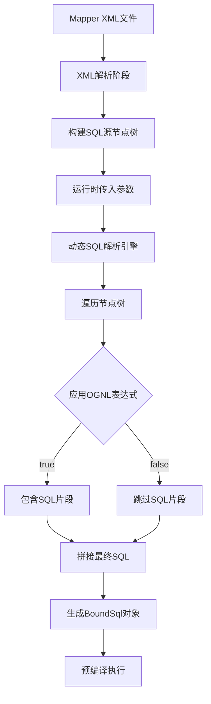

# 动态SQL

## 一 简介

**动态SQL** 是指 SQL 语句可以根据不同的条件或参数**动态生成不同结构**的能力。它允许你在运行时根据业务逻辑**灵活构建SQL语句**，而不是写死一个固定的SQL。

## 二 核心思想
**"按需拼接SQL"** - 只有在条件满足时，相应的SQL片段才会被包含到最终的SQL语句中。

---

## 三 为什么需要动态SQL？

### 传统JDBC的问题（没有动态SQL）
```java
// 根据多个可选条件查询用户
StringBuilder sql = new StringBuilder("SELECT * FROM user WHERE 1=1");

if (name != null) {
    sql.append(" AND name = '").append(name).append("'");  // ❌ SQL注入风险！
}
if (age != null) {
    sql.append(" AND age = ").append(age);
}
if (email != null) {
    sql.append(" AND email = '").append(email).append("'");
}
// 需要手动拼接，容易出错且不安全
```

### MyBatis动态SQL的优雅解决方案
```xml
<select id="findUsers" resultType="User">
    SELECT * FROM user
    <where>
        <if test="name != null and name != ''">
            AND name = #{name}  <!-- 只有name有值时才包含此条件 -->
        </if>
        <if test="age != null">
            AND age = #{age}    <!-- 只有age有值时才包含 -->
        </if>
        <if test="email != null">
            AND email = #{email}
        </if>
    </where>
</select>
```

---

## 四 MyBatis动态SQL的核心标签

Mybatis动态SQL写在 XML文件内，以标签的形式编写动态SQL，共9种动态SQL标签：

```xml
trim、where、set、foreach、if、choose、when、otherwise、bind
```

### 1. **`<if>`** - 条件判断
```xml
<select id="findActiveUsers" resultType="User">
    SELECT * FROM user
    WHERE status = 'ACTIVE'
    <if test="role != null">
        AND role = #{role}
    </if>
</select>
```

### 2. **`<choose> <when> <otherwise>`** - 多选一（类似Java的switch-case）
```xml
<select id="findUsers" resultType="User">
    SELECT * FROM user
    WHERE 
    <choose>
        <when test="searchType == 'name'">
            name LIKE CONCAT('%', #{keyword}, '%')
        </when>
        <when test="searchType == 'email'">
            email LIKE CONCAT('%', #{keyword}, '%')
        </when>
        <otherwise>
            username LIKE CONCAT('%', #{keyword}, '%')
        </otherwise>
    </choose>
</select>
```

### 3. **`<where>`** - 智能WHERE子句
```xml
<!-- 自动处理AND前缀和去除多余WHERE -->
<select id="findUsers" resultType="User">
    SELECT * FROM user
    <where>
        <if test="name != null">AND name = #{name}</if>
        <if test="age != null">AND age = #{age}</if>
    </where>
</select>

<!-- 如果所有if都不满足，生成：SELECT * FROM user -->
<!-- 如果只有age有值，生成：SELECT * FROM user WHERE age = ? -->
```

### 4. **`<set>`** - 智能UPDATE语句
```xml
<!-- 动态更新，只更新有值的字段 -->
<update id="updateUser">
    UPDATE user
    <set>
        <if test="name != null">name = #{name},</if>
        <if test="age != null">age = #{age},</if>
        <if test="email != null">email = #{email},</if>
    </set>
    WHERE id = #{id}
</update>
<!-- 自动去除最后一个逗号 -->
```

### 5. **`<foreach>`** - 遍历集合（处理IN查询）
```xml
<!-- 批量查询 -->
<select id="findByIds" resultType="User">
    SELECT * FROM user
    WHERE id IN
    <foreach collection="ids" item="id" 
             open="(" separator="," close=")">
        #{id}
    </foreach>
</select>

<!-- 批量插入 -->
<insert id="batchInsert">
    INSERT INTO user (name, age) VALUES
    <foreach collection="users" item="user" separator=",">
        (#{user.name}, #{user.age})
    </foreach>
</insert>
```

### 6. **`<trim>`** - 自定义修剪（更灵活的控制）
```xml
<!-- 自定义前缀/后缀处理 -->
<select id="findUsers" resultType="User">
    SELECT * FROM user
    <trim prefix="WHERE" prefixOverrides="AND |OR ">
        <if test="name != null">AND name = #{name}</if>
        <if test="age != null">AND age > #{age}</if>
    </trim>
</select>
```

### 7. **`<bind>`** - 创建变量（用于LIKE查询等）
```xml
<!-- 解决不同数据库的LIKE语法差异 -->
<select id="searchUsers" resultType="User">
    <bind name="pattern" value="'%' + keyword + '%'" />
    SELECT * FROM user
    WHERE 
        name LIKE #{pattern}
        OR email LIKE #{pattern}
</select>
```

---

## 五 实际应用示例

### 复杂查询场景
```xml
<select id="searchProducts" resultType="Product">
    SELECT * FROM product
    <where>
        <!-- 分类筛选 -->
        <if test="categoryId != null">
            AND category_id = #{categoryId}
        </if>
        
        <!-- 价格区间 -->
        <if test="minPrice != null">
            AND price >= #{minPrice}
        </if>
        <if test="maxPrice != null">
            AND price <= #{maxPrice}
        </if>
        
        <!-- 关键字搜索 -->
        <if test="keyword != null and keyword != ''">
            <bind name="pattern" value="'%' + keyword + '%'" />
            AND (product_name LIKE #{pattern} OR description LIKE #{pattern})
        </if>
        
        <!-- 状态筛选 -->
        <if test="statusList != null and statusList.size() > 0">
            AND status IN
            <foreach collection="statusList" item="status" 
                     open="(" separator="," close=")">
                #{status}
            </foreach>
        </if>
    </where>
    
    <!-- 排序 -->
    <choose>
        <when test="orderBy == 'price'">ORDER BY price</when>
        <when test="orderBy == 'sales'">ORDER BY sales_count</when>
        <otherwise>ORDER BY create_time</otherwise>
    </choose>
    
    <!-- 升降序 -->
    <if test="orderDirection != null">
        ${orderDirection}  <!-- 注意：这里用${}因为ASC/DESC是SQL关键字 -->
    </if>
</select>
```

### 动态INSERT示例
```xml
<!-- 智能插入：只插入非空字段 -->
<insert id="insertSelective" useGeneratedKeys="true" keyProperty="id">
    INSERT INTO employee
    <trim prefix="(" suffix=")" suffixOverrides=",">
        <if test="name != null">name,</if>
        <if test="department != null">department,</if>
        <if test="salary != null">salary,</if>
        <if test="hireDate != null">hire_date,</if>
    </trim>
    VALUES
    <trim prefix="(" suffix=")" suffixOverrides=",">
        <if test="name != null">#{name},</if>
        <if test="department != null">#{department},</if>
        <if test="salary != null">#{salary},</if>
        <if test="hireDate != null">#{hireDate},</if>
    </trim>
</insert>
```

---

## 六 动态SQL的优势

1. **代码简洁**：避免大量Java中的字符串拼接
2. **安全可靠**：自动使用`#{}`防止SQL注入
3. **可读性强**：SQL结构清晰，便于维护
4. **灵活性高**：适应多变的业务需求
5. **类型安全**：自动进行参数类型转换

---

## 七 最佳实践建议

1. **优先使用`<where>`和`<set>`**：让MyBatis自动处理前缀/后缀问题
2. **合理使用`<choose>`**：替代复杂的if-else嵌套
3. **批量操作用`<foreach>`**：提高数据库操作效率
4. **模糊查询用`<bind>`**：统一处理不同数据库的LIKE语法
5. **适度使用**：避免过度复杂的动态SQL，影响可读性

**一句话总结**：动态SQL让SQL语句从"静态模板"变成了"智能程序"，能够根据运行时的条件动态调整自己的结构，大大提升了MyBatis的灵活性和表达能力。

## 八 动态SQL原理深度解析

动态SQL的实现原理可以分为三个层次来理解：**XML解析 → SQL节点树构建 → 动态解析渲染**。

### 1.整体架构与核心流程



### 执行步骤

1. **XML解析阶段：构建SQL源节点树**
   1. 当MyBatis初始化时，会解析Mapper XML文件，将动态SQL标签转换为**节点对象树**：

2. **OGNL表达式引擎**
   1. 动态SQL的条件判断依赖于**OGNL（Object-Graph Navigation Language）**：

3. **运行时动态解析**
   1. 当调用Mapper方法时，真正的动态SQL处理才开始：

### 3.**完整执行流程示例**

假设有如下查询：
```xml
<select id="findUsers">
    SELECT * FROM user
    <where>
        <if test="name != null">AND name = #{name}</if>
        <if test="age != null">AND age > #{age}</if>
    </where>
</select>
```

参数：`name = "张三"`, `age = null`

执行流程：
1. **初始化阶段**：构建`IfSqlNode`树
2. **运行时阶段**：
   ```java
   // 1. 创建DynamicContext
   DynamicContext context = new DynamicContext(configuration, params);
   
   // 2. 根节点应用
   rootSqlNode.apply(context);
     // → StaticTextSqlNode: "SELECT * FROM user "
     // → WhereSqlNode.apply()
       // → IfSqlNode("name != null"): true
         // → 子节点: "AND name = #{name}"
       // → IfSqlNode("age != null"): false
         // → 跳过
   
   // 3. 获取SQL
   String sql = context.getSql();  // "SELECT * FROM user WHERE name = #{name}"
   
   // 4. 转换#{}为?
   // "SELECT * FROM user WHERE name = ?"
   
   // 5. 创建ParameterMapping
   // ParameterMapping{property='name'}
   ```

### 4.原理总结

核心设计模式

1. **组合模式**：`SqlNode`接口和实现类形成树形结构
2. **解释器模式**：动态SQL标签被解释执行
3. **策略模式**：不同的`SqlNode`实现不同的处理策略
4. **模板方法模式**：在父类中定义算法骨架

关键技术点

1. **XML解析 → 对象树**：将静态XML转换为运行时可操作的对象结构
2. **OGNL表达式引擎**：提供灵活的条件判断能力
3. **惰性求值**：只有在运行时才真正解析SQL
4. **上下文管理**：`DynamicContext`管理参数绑定和SQL拼接
5. **智能修剪**：自动处理SQL语法细节（如AND前缀）

### 5.性能考虑
1. **缓存机制**：相同参数模式的SQL会被缓存
2. **预编译**：最终生成的SQL会转换为`PreparedStatement`
3. **批量绑定**：`foreach`等操作会优化参数绑定过程

动态SQL的本质是**将一个声明式的XML描述，通过解释器模式在运行时转换为具体的SQL字符串**，这种设计既保持了XML配置的清晰性，又提供了运行时的灵活性。