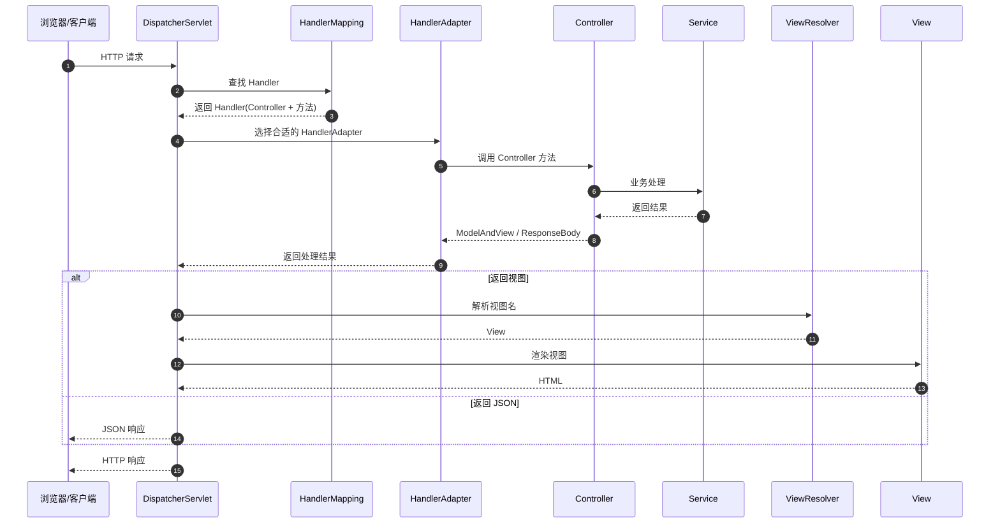

# Spring MVC

## 引言 Model / View / Controller

MVC是一种设计模式，Spring MVC是一款很优秀的MVC框架。

Spring MVC可以帮助进行更简洁的Web层的开发，并且它天生与Spring框架集成。

Spring MVC下我们一般把后端项目分为：

- Service层（处理业务）
- Dao层（数据库操作）
- Entity层（实体类）
- Controller层（控制层，返回数据给前台页面）

------

## 一、Spring MVC 核心组件

各个组件职责划分清晰，DispatcherServlet 负责协调，其它组件则各自做分内之事，互不干扰。

```
浏览器
  |
DispatcherServlet（前端控制器）
  |
HandlerMapping（处理器映射器）
  |
HandlerAdapter（处理器适配器）
  |
Controller（控制器）
  |
Service / DAO
  |
ViewResolver（视图解析器）
  |
View（JSP / Thymeleaf / JSON）
```

### 详细组件交互时序图

```text
时序编号  组件                                     流程描述
────────  ──────────────────────────────────────  ─────────────────────────────────────────────
(1)       客户端 → DispatcherServlet             发送HTTP请求
(2)       DispatcherServlet → HandlerMapping     查询请求对应的处理器
(3)       HandlerMapping → DispatcherServlet     返回HandlerExecutionChain
(4)       DispatcherServlet → HandlerAdapter     获取处理器适配器
(5)       HandlerAdapter → Controller            调用处理器方法（可能经过拦截器）
(6)       Controller → HandlerAdapter            返回ModelAndView或视图名
(7)       HandlerAdapter → DispatcherServlet     返回ModelAndView
(8)       DispatcherServlet → ViewResolver       解析视图名称
(9)       ViewResolver → DispatcherServlet       返回View对象
(10)      DispatcherServlet → View               渲染视图（将模型数据填充到视图模板）
(11)      View → DispatcherServlet               返回渲染结果
(12)      DispatcherServlet → 客户端             发送HTTP响应
```

------

## 二、Spring MVC 请求处理流程图



------

## 三、流程拆解

### 1.DispatcherServlet（核心入口）

- Spring MVC 的**前端控制器**
- 所有请求都会先到这里
- 类似 **“总调度中心”**

------

### 2.HandlerMapping（找 Controller）

- 根据：
  - URL
  - HTTP 方法（GET / POST）
- 找到：
  - 对应的 `Controller`
  - 具体的处理方法

常见实现：

- `RequestMappingHandlerMapping`

------

### 3.HandlerAdapter（适配器）

- 因为 Controller 形式很多（注解 / 接口）
- 需要适配器来**统一调用方式**

常见实现：

- `RequestMappingHandlerAdapter`

------

### 4.Controller 执行业务逻辑

```java
@GetMapping("/user")
public String getUser(Model model) {
    model.addAttribute("user", userService.getUser());
    return "user";
}
```

或 REST 接口：

```java
@GetMapping("/user")
@ResponseBody
public User getUser() {
    return userService.getUser();
}
```

------

### 5.返回结果类型

| 返回方式         | 说明           |
| ---------------- | -------------- |
| `ModelAndView`   | 传统 MVC       |
| `String`         | 视图名         |
| `@ResponseBody`  | JSON           |
| `ResponseEntity` | 完整 HTTP 响应 |

------

### 6.ViewResolver（可选）

- 只有**返回视图名时才会走**
- 将 `"user"` → `/WEB-INF/jsp/user.jsp`

常见：

- `InternalResourceViewResolver`
- `ThymeleafViewResolver`

------

## 四、Spring MVC 与 REST 的区别（快速对比）

| 场景              | 是否走 ViewResolver |
| ----------------- | ------------------- |
| JSP / Thymeleaf   | ✅ 是                |
| `@RestController` | ❌ 否                |
| `@ResponseBody`   | ❌ 否                |

------

## 五、代码执行流程示例

```java
// 1. 请求入口：DispatcherServlet的doDispatch方法
protected void doDispatch(HttpServletRequest request, HttpServletResponse response) {
    // 确定处理器
    mappedHandler = getHandler(processedRequest);
    
    // 确定处理器适配器
    HandlerAdapter ha = getHandlerAdapter(mappedHandler.getHandler());
    
    // 执行拦截器的preHandle
    if (!mappedHandler.applyPreHandle(processedRequest, response)) {
        return;
    }
    
    // 实际调用处理器
    mv = ha.handle(processedRequest, response, mappedHandler.getHandler());
    
    // 应用默认视图名
    applyDefaultViewName(processedRequest, mv);
    
    // 执行拦截器的postHandle
    mappedHandler.applyPostHandle(processedRequest, response, mv);
    
    // 处理分发结果
    processDispatchResult(processedRequest, response, mappedHandler, mv, dispatchException);
}

// 2. 处理器映射器查找处理器
protected HandlerExecutionChain getHandler(HttpServletRequest request) {
    // 遍历所有HandlerMapping
    for (HandlerMapping hm : this.handlerMappings) {
        HandlerExecutionChain handler = hm.getHandler(request);
        if (handler != null) {
            return handler;
        }
    }
    return null;
}

// 3. 处理器适配器执行处理器
public ModelAndView handle(HttpServletRequest request, 
                          HttpServletResponse response, 
                          Object handler) {
    // 参数绑定
    // 调用处理器方法
    // 处理返回值
}

// 4. 视图解析器解析视图
protected View resolveViewName(String viewName, 
                              Map<String, Object> model,
                              Locale locale,
                              HttpServletRequest request) {
    // 遍历所有ViewResolver
    for (ViewResolver viewResolver : this.viewResolvers) {
        View view = viewResolver.resolveViewName(viewName, locale);
        if (view != null) {
            return view;
        }
    }
    return null;
}
```

## 六、Spring MVC (Spring Boot) 自动配置

```text
┌─────────────────────────────────────────────────────────────────────────────┐
│                     Spring Boot Auto-Configuration                          │
├─────────────────────────────────────────────────────────────────────────────┤
│                                                                             │
│  ┌─────────────┐   自动配置类                提供的Bean                     │
│  │  条件判断    │                                                        │
│  │ (Conditional)│───────► WebMvcAutoConfiguration ───► DispatcherServlet  │
│  └─────────────┘                           │          HandlerMapping      │
│       │                                    │          HandlerAdapter      │
│       │                             @ConditionalOnMissingBean              │
│       ▼                                    │          ViewResolver        │
│  ┌─────────────┐                           ▼          MessageConverter    │
│  │ 类路径检测    │                 用户自定义配置类                           │
│  │ (Classpath)  │───────► @Configuration + @EnableWebMvc ──► 自定义Bean   │
│  └─────────────┘                    (完全接管MVC配置)                       │
│                                                                             │
│  ┌───────────────────────────────────────────────────────────────────────┐  │
│  │                     常用自动配置特性                                    │  │
│  │  • 自动注册 DispatcherServlet (ServletRegistrationBean)               │  │
│  │  • 自动配置静态资源路径 (classpath:/static, /public, /resources, /META-INF/resources)│
│  │  • 自动配置视图解析器 (InternalResourceViewResolver)                   │  │
│  │  • 自动配置消息转换器 (JSON: Jackson, XML: JAXB)                      │  │
│  │  • 自动配置 MultipartResolver (文件上传)                               │  │
│  │  • 自动配置异常处理 (@ControllerAdvice)                                │  │
│  └───────────────────────────────────────────────────────────────────────┘  │
│                                                                             │
└─────────────────────────────────────────────────────────────────────────────┘
```

## 七、一句话总结

> Spring MVC 通过 **DispatcherServlet 统一接收请求**，
> 利用 **HandlerMapping 找处理器**，
> 通过 **HandlerAdapter 调用 Controller**，
> 最终 **渲染视图或返回 JSON 响应**。

从请求进入DispatcherServlet开始，经过HandlerMapping查找处理器，HandlerAdapter执行处理器，ViewResolver解析视图，最终渲染响应返回给客户端。每个组件都有明确的职责，体现了单一职责原则和MVC设计模式。