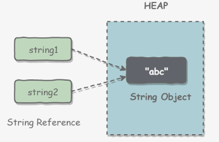
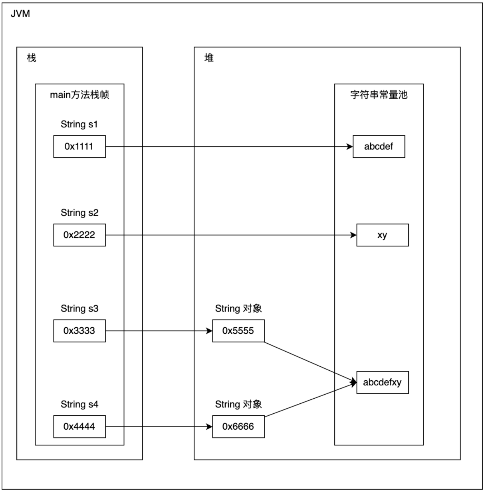

# String

## 概述

```java
public final class String
```

String 被声明为 **final**，因此它**不可被继承**(Integer 等包装类也不能被继承）。

**存储**

- 在 Java 8 中，String 内部使用 char 数组存储数据。
  - char数据类型是一个采用UTF-16编码表示Unicode码点的代码单元。
  - `private final char[] value;`
- 在 Java 9 后，String 内部使用 byte 数组存储（字节）。
  - `private final byte[] value;`
- 编码（字符-字节）
- 解码（字节-字符）

**final修饰（不可变）**

- **value 数组被声明为 final**，这意味着 value 数组初始化后就不能再引用其它数组。
- String类内部没有提供修改value数组的方法，因此可以保证String 不可变。
- 对于已存在的String对象的修改都是重新创建一个新对象，然后把新值保存进去。

**判断**

- 空串和`Null`不同，空串`""`是**长度为0**的字符串.
- `==`运算符只能确定两个字符是否存放在同一位置上。
- `equals`方法检测两个字符串是否相等。

## StringAPI

- `s1.compareTO(s2)`：相同返回0
- `toLowerCase()`：小写
- `toUpperCase()`：大写
- `trim()`、`strip()`：去除字符串两端的空白字符
  - `trim()` 只能去除 ASCII 空白字符
  - `strip()` Java 11 引入，可以去除所有 Unicode 空白字符
- `repeat()`：Java 11 中引入的，用于将字符串重复指定次数。
- `String.format`：创建格式化的字符串以及连接多个字符串对象
- `substring()`：字符串截取
- `toCharArray()`：String转char数组

**读取**

- `nextLine()`：不读取字符前/后的空格/Tab键，只读取字符，遇到**空格/Tab键/回车键**截止
- `nextLine()`：读取字符前/后的空格/Tab键，回车键截止

**拼接**

- 使用加号运算符 (`+`)
- `String.Join()`：静态方法，可以使用界定符分隔字符串。
  - 第1个参数：分隔符
  - 第2个参数：需要进行拼接的元素，多个字符串/字符串数组/字符串集合。
- `String.concat()` ：用于连接两个字符串
- `StringBuilder`：进行较多字符串操作时，更为高效
- `String.format()`：格式化字符串

**输入输出**

```java
// 读取输入
Scanner in = new Scanner(System.in);
String name = in.nextLine();
String name = in.next();

// 读取文件
Scanner in = new Scanner(Path.of("test.txt"),StandardCharsets.UTF_8);

// 写入文件
PrintWriter out = new PrintWriter("test.txt",StandardCharsets.UTF_8);
```


## 不可变好处

###  1. 可以缓存 hash 值（一次计算）

- 因为String的hash值经常被使用，例如：String用做 HashMap 的 key。
- 不可变的特性可以使得 hash 值也不可变，因此只需要进行一次计算。

### 2. String Pool 的需要

- Java编译器可以让字符串共享
  - 若有多个String类对象的字符内容相同，则这些字符串变量（引用）都指向存储池中相同的位置（共享）
- 只有 String 是不可变的，才可能使用 String Pool（安全）
- 

### 3. 参数安全性（参数不可变）

- String 经常作为参数，String 不可变性可以保证参数不可变，不可通过对象引用改变对象状态。

### 4. 线程安全（不可变）

- String 不可变性天生具备线程安全，可以在多个线程中安全地使用。


## String Pool（字符串常量池）

**字符串常量池**：保存着所有**字符串字面量**（literal strings），这些字面量在编译时期就确定。

### intern()

作用：运行时调用此方法将**字符串加入String Pool**

- 在运行过程中，当一个字符串调用 `intern()`方法时
  - 如果 String Pool 中已经存在一个字符串和该字符串值相等（equals），就返回 String Pool 中字符串的引用
  - 否则，就会在 String Pool 中添加一个新的字符串，并返回这个新字符串的引用

示例：

```java
String s1 = new String("aaa"); // 堆
String s2 = new String("aaa"); // 堆
System.out.println(s1 == s2); // 同一性，比较地址， false
String s3 = s1.intern(); // 字符串常量池
String s4 = s2.intern(); // 字符串常量池
System.out.println(s3 == s4); // 同一性，比较地址， true
```

- s1 和 s2 采用 new String() 的方式新建了两个不同字符串；
- s3 和 s4 是通过 s1.intern() 和 s2.intern() 方法取得同一个字符串引用；
- intern() 首先把 "aaa" 放到 String Pool 中，然后返回这个字符串引用；
- 因此 s3 和 s4 引用的是同一个字符串。

### String Pool 位置

- 在 Java 7 之前，String Pool 被放在**运行时常量池**中，它属于永久代。
- 在 Java 7，String Pool 被移到**堆**中。

- 因为永久代的空间有限，在大量使用字符串的场景下会导致OutOfMemoryError 错误。

### 为什么把字符串存储在⼀个String Pool中？ 

- 重用字符串对象，以节省内存

- 因为字符串使用太频繁，为了提⾼执⾏效率，所以把字符串放到“字符串常量池”当中，方便共享


## "abc"和new String("abc")

### "abc"

Java 中⽤**双引号**括起来的字符串，会自动地将字符串放入 String Pool（编译时期）

```java
String s1 = "aaa"; // 字符串常量池
String s2 = "aaa"; // 字符串常量池
System.out.println(s1 == s2); // 同一性，比较地址， true
```

### new String("abc")

new String("abc")一共会创建两个字符串对象（Heap、String Pool，前提 String Pool 中没有 "abc" ）

- "abc" 属于字符串字面量，编译时期会在 String Pool 中创建一个字符串对象，指向这个 "abc" 字符串字面量
- new String("abc") 会在堆中创建一个字符串对象
  - 堆中存的是指向“字符串常量池”的内存地址
  - 栈中存的是指向堆引用地址



```java
public String(String original) {
    this.value = original.value;
    this.hash = original.hash;
}
```

```java
String s1 = "abcdef"; // 字符串常量池
String s2 = "xy"; // 字符串常量池
String s3 = new String("abcdefxy"); // 堆
String s4 = new String("abcdefxy"); // 堆
System.out.println(s3 == s4); // 同一性，比较地址， false
System.out.println(s3.equals(s4)); // 等同性，比较内容，true
```


## StringBuilder

StringBuilder的四种清空方式

1. 使用new关键字重新生成一个StringBuilder对象
2. 使用StringBuilder的delete方法
3. 使用StringBuilder的setLength方法
4. 使用StringBuilder的replace方法


## String, StringBuffer and StringBuilder

### 1. 可变性

- String 不可变
- StringBuffer 和 StringBuilder 可变

### 2. 线程安全

- String 不可变，因此是线程安全的
- StringBuilder 不是线程安全的
- StringBuffer 是线程安全的，内部使用 **synchronized** 进行同步