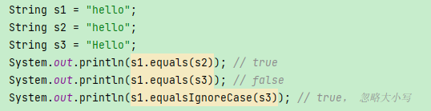

# String

## 概述

```
public final class String
```

String 被声明为 **final**，因此它**不可被继承**(Integer 等包装类也不能被继承）。

**存储**

- 在 Java 8 中，String 内部使用 char 数组存储数据。
  - char数据类型是一个采用UTF-16编码表示Unicode码点的代码单元。
  - `private final char[] value;`
- 在 Java 9 后，String 内部使用 byte 数组存储（字节）。
  - `private final byte[] value;`
- 编码（字符-字节）
- 解码（字节-字符）

**final修饰（不可变）**

- **value 数组被声明为 final**，这意味着 value 数组初始化后就不能再引用其它数组。
- String类内部没有提供修改value数组的方法，因此可以保证String 不可变。
- 对于已存在的String对象的修改都是重新创建一个新对象，然后把新值保存进去。

**判断**

- 空串和`Null`不同，空串`""`是**长度为0**的字符串.
- `==`运算符只能确定两个字符是否存放在同一位置上。
- `equals`方法检测两个字符串是否相等。
- 

## StringAPI

- `s1.compareTO(s2)`：相同返回0
- `toLowerCase()`：小写
- `toUpperCase()`：大写
- `trim()`、`strip()`：去除字符串两端的空白字符
  - `trim()` 只能去除 ASCII 空白字符
  - `strip()` Java 11 引入，可以去除所有 Unicode 空白字符
- `repeat()`：Java 11 中引入的，用于将字符串重复指定次数。
- `String.format`：创建格式化的字符串以及连接多个字符串对象
- `substring()`：字符串截取
- `toCharArray()`：String转char数组

**读取**

- `nextLine()`：不读取字符前/后的空格/Tab键，只读取字符，遇到空格/Tab键/回车键截止
- `nextLine()`：读取字符前/后的空格/Tab键，回车键截止

**拼接**

- 使用加号运算符 (`+`)
- `String.Join()`：静态方法，可以使用界定符分隔字符串。
  - 第1个参数：分隔符
  - 第2个参数：需要进行拼接的元素，多个字符串/字符串数组/字符串集合。
- `String.concat()` ：用于连接两个字符串
- `StringBuilder`：进行较多字符串操作时，更为高效
- `String.format()`：格式化字符串

**输入输出**

```java
// 读取输入
Scanner in = new Scanner(System.in);
String name = in.nextLine();
String name = in.next();

// 读取文件
Scanner in = new Scanner(Path.of("test.txt"),StandardCharsets.UTF_8);

// 写入文件
PrintWriter out = new PrintWriter("test.txt",StandardCharsets.UTF_8);
```

## StringBuilder

StringBuilder的四种清空方式
1. 使用new关键字重新生成一个StringBuilder对象
2. 使用StringBuilder的delete方法
3. 使用StringBuilder的setLength方法
4. 使用StringBuilder的replace方法