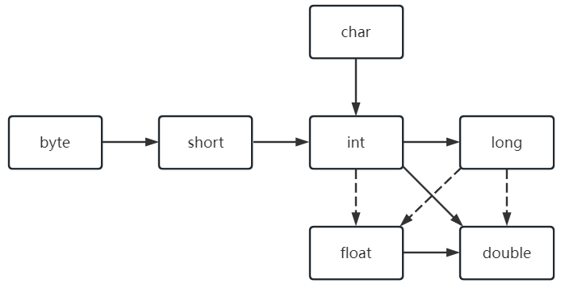

# Java 与 C++ 的区别
1. Java 是纯粹的面向对象语言，所有对象都继承自` java.lang.Object`，C++ 支持面向对象和面向过程。
2. Java 通过虚拟机实现**跨平台**（**一次编译，到处执行**）特性，但是 C++ 依赖于特定的平台。
3. Java **没有指针**，它的引用可以理解为安全指针，而 C++ 具有和 C 一样的指针。
4. Java **支持自动垃圾回收**，而 C++ 需要手动回收。
5. Java **不支持多重继承**，只能通过实现多个接口来达到相同目的，而 C++ 支持多重继承。
6. Java **不支持操作符重载**，而 C++ 可以。
7. Java 的 **goto 是保留字，但是不可用**，C++ 可以使用 goto。
8. Java和C/C++最大的不同：**内存管理**。

## 内存管理差异

### C/C++中的指针

在C/C++中，指针直接操作内存地址，允许对内存进行灵活控制，但也容易引发以下问题：
- 内存损坏：指针操作不当可能导致数据损坏或程序崩溃。
- 野指针：指向已释放内存的指针可能引发不可预知的行为。
- 内存泄漏：未释放不再使用的内存会导致内存泄漏。

### Java中的引用

Java使用引用而非指针，引用指向对象但不直接操作内存地址，具有以下特点：
- 内存安全：Java自动管理内存，通过垃圾回收机制回收不再使用的对象，避免内存泄漏。
- 边界检查：数组和集合在访问时进行边界检查，防止越界访问。
- 无显式指针：开发者无法直接操作内存地址，减少了内存损坏的风险。

### 总结

Java通过引用模型和自动内存管理，避免了C/C++中常见的指针问题，如内存损坏和数据损坏，提升了程序的稳定性和安全性。

# JRE or JDK

JRE：Java Runtime Environment，**Java 运行环境**，提供了 Java 所需的**运行环境**。

- JRE是一个 **JVM 程序**，主要包括了 **JVM** **的标准实现**和一些 Java **基本类库**。

JDK：Java Development Kit，**Java 开发工具包**，提供了 Java 的**开发及运行环境**。

- JDK是Java 开发的核心，集成了**JRE**以及一些**其它工具**，如编译Java 源码的**编译器 javac** 等。

# 基础

1. **Java是解释型语言**
2. Java存在即时编译(“热点”字节码转化为机器码)
3. Javac：Java编译器，`.java`编译为`.class`，Java虚拟机执行字节码
4. Java自动进行垃圾回收，如果一个内存块不再使用了，系统将回收。
5. Java没有运算符重载功能
6. Java中，对象值即为引用，任何对象变量的值都是对存储在另一个地方的某个对象的引用。
7. 所有的Java对象都存储在堆中
8. Java区分大小写

9. 访问修饰符：public、protected、default、private 控制访问级别
10. Java代码以分号`;`结束
11. 类名必须以字母为开头，后跟字母和数字，但不能使用Java保留字
12. 骆驼命名法
13. java9中，单下划线_不能作为变量名
14. Java虚拟机从指定类中的`main`方法的代码开始执行
15. 三种注释
       1. 单行注释 / /
       2. 多行注释 /*  */ ，此注释不可嵌套
       3. 文档注释 /  / 
16. 空白符会被Java编译器（Javac）忽略

# 数据类型（**强类型**）

1. **Java是强类型语言：必须为每一种变量声明一种类型**
2. 8种基本数据类型
   1. byte：1字节
   2. short：2字节
   3. int：4字节
   4. long：8字节
   5. float：4字节
   6. double：8字节
   7. char：2字节
   8. boolean
      1. **单独声明** 的 `boolean`：通常占用 **1 个字节**。
      2. **数组中的 `boolean`**：通常占用 **1 个字节**。
      3. 在某些 JVM 实现中，`boolean` 可能被优化为占用 **4 个字节（32 位）**，尤其是在栈上分配时，以对齐内存。
3. 数据类型前后缀表示
   - 后缀L，l ：long
   - 后缀F，f：float 有效数字6-7位
   - 后缀D，d(可无)：double 有效数字15位
   - 前缀0x，0X ：十六进制
   - 前缀0：八进制
   - **前缀0b，0B：二进制**
4. 字符采用**Unicode格式**存储
5. 所有浮点数值计算遵循：IEEE 754规范
6. **特殊浮点数值：**
   - 正无穷大
   - 负无穷大
   - NAN（不是数字）：0/0 、负数的平方根结果为NAN
7. 整型值和布尔值之间不能进行相互转换
8. final 指示常量，只赋值一次且不能再次修改，常量名使用全大写
9. static 指示类常量，定义在main方法外部，可以在一个类的多个方法中使用
10. 变量的取值在一个有限集合内，自定义枚举类型（enumerate），枚举类型包括有限个命名的值（对象）
    1. `enum Size { M, S, L, XL, XXL, XXXL}; Size s = Size.XXXL;`
11. 数据类型之间的合法转换，虚线表示可以强转（可能有精度丢失），如下图：

    

# 隐式类型转换