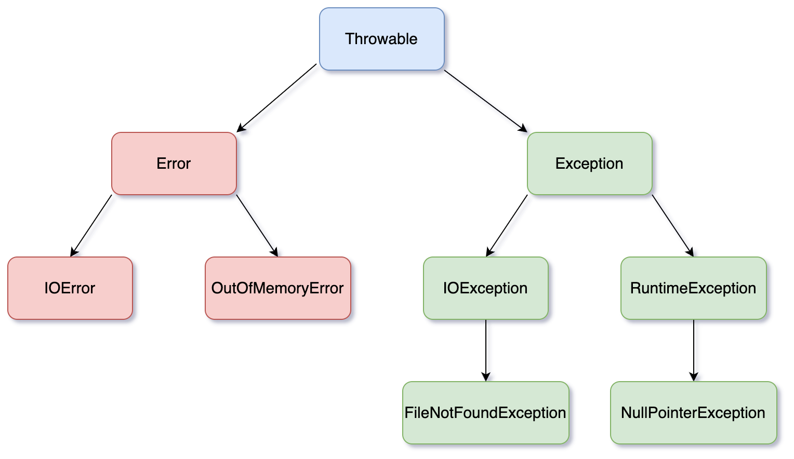

# 异常

## Throwable

在 Java 中，`Throwable` 类是所有错误（`Error`）和异常（`Exception`）的基类。

它提供了一组核心方法，用于获取异常信息、追踪堆栈轨迹和管理异常链。

**理论上所有的错误都是运行时发生的。**

---

1. `getMessage()`

- **作用**：返回异常的详细信息（消息）。**示例**：  

  ```java
  try {
      // 可能抛出异常的代码
  } catch (Exception e) {
      System.out.println(e.getMessage()); // 输出异常的描述信息
  }
  ```

---

2. `printStackTrace()`

- **作用**：打印异常的堆栈跟踪信息（从异常发生点到捕获点的调用路径），默认输出到标准错误流（`System.err`）。**示例**：  

  ```java
  try {
      // 可能抛出异常的代码
  } catch (Exception e) {
      e.printStackTrace(); // 输出完整的堆栈轨迹
  }
  ```

---

3. `getCause()`

- **作用**：返回导致当前异常的底层原因（即触发当前异常的另一个 `Throwable` 对象），常用于异常链（chained exceptions）。**示例**：  

  ```java
  try {
      // 可能抛出异常的代码
  } catch (Exception e) {
      Throwable cause = e.getCause(); // 获取原始异常
      if (cause != null) {
          System.out.println("Root cause: " + cause.getMessage());
      }
  }
  ```

---

4. `toString()`

- **作用**：返回异常的简短描述，通常格式为 `类名 + ": " + 消息`。**示例**：  

  ```java
  try {
      // 可能抛出异常的代码
  } catch (Exception e) {
      System.out.println(e.toString()); // 输出类似 "java.lang.NullPointerException: ..."
  }
  ```

---

5. `getStackTrace()`

- **作用**：返回一个 `StackTraceElement` 数组，表示异常的堆栈跟踪信息（每个元素对应一个调用栈帧）。**示例**：  

  ```java
  try {
      // 可能抛出异常的代码
  } catch (Exception e) {
      for (StackTraceElement element : e.getStackTrace()) {
          System.out.println(element.toString()); // 输出每个堆栈元素
      }
  }
  ```

---

6. `fillInStackTrace()`

- **作用**：填充堆栈跟踪信息，重置异常抛出点。通常在重新抛出异常时使用。**示例**：  

  ```java
  try {
      // 可能抛出异常的代码
  } catch (Exception e) {
      Throwable newEx = e.fillInStackTrace(); // 重置堆栈轨迹到当前行
      throw newEx;
  }
  ```

---

7. `initCause(Throwable cause)`

- **作用**：设置当前异常的原因（通常用于构造异常链）。**示例**：  

  ```java
  try {
      // 可能抛出底层异常的代码
  } catch (IOException cause) {
      Exception ex = new Exception("High-level error");
      ex.initCause(cause); // 设置原始异常为原因
      throw ex;
  }
  ```

---

8. `addSuppressed(Throwable exception)` 和 `getSuppressed()`

- **作用**：  
  - `addSuppressed()`：添加被抑制的异常（常见于 `try-with-resources` 中，当主异常和其他资源关闭异常同时发生时，关闭异常会被抑制）。  
  - `getSuppressed()`：返回所有被抑制的异常数组。
- **示例**：  
  
  ```java
  try (Resource res = new Resource()) {
      // 使用资源
  } catch (Exception e) {
      Throwable[] suppressed = e.getSuppressed(); // 获取资源关闭时的抑制异常
  }
  ```

---

9. 构造函数

- `Throwable()`：无参构造，消息为 `null`。
- `Throwable(String message)`：指定消息。
- `Throwable(String message, Throwable cause)`：指定消息和原因。
- `Throwable(Throwable cause)`：指定原因。

---

关键注意事项

1. **异常链**：通过 `initCause()` 或构造函数传递原因，可以构建异常链，帮助追踪问题的根源。
2. **性能**：生成堆栈跟踪（如 `printStackTrace()`）是昂贵的操作，生产环境中需谨慎使用。
3. **抑制异常**：在资源管理（如 `try-with-resources`）中，自动处理多个异常时，次要异常会被抑制。

## 异常分类




### Error

`Error` 描述了 `Java` 运⾏时系统的**内部错误和资源耗尽错误**。

`Error`表⽰⽐较严重的问题，⼀般是`JVM`运⾏时出现了错误，如：

- 没有内存可分配，抛出`OOM`错误。
- 栈资源耗尽，抛出`StackOverflowError`错误。
- `JVM`运⾏错误，抛出`Virtual MachineError`错误。
- 类定义错误，抛出`NoClassDefFoundError`错误。

### Exception

`Exception`又分为`RuntimeException`和其它异常

- 程序有错误，导致的异常属于`RuntimeException`。

- 程序本身没有问题，像 I/O 错误导致的异常属于其它异常。

### RuntimeException

**`RuntimeException`又称运行时异常，非检查异常。**

出现了`RuntimeException`异常，⼀般是**程序逻辑有问题**，是程序⾃⾝的题⽽⾮外部因素，应尽量避免。

运⾏时才可能抛出的异常，**编译器不处理此类异常**。⽐如：

- 数组索引越界
- 使⽤的对象为`null`
- 强制类型转换错误
- 除0等等

### 其它异常

`Exception`中除了运⾏时异常外，都属于其它异常，**其它异常又称编译时异常，检查异常。**

其它异常一般是**外部运⾏环境导致**，编译器要求**必须处理：抛出或捕捉处理**。如：

- 试图超越文件末尾继续读取数据。
- 试图打开⼀个不存在的⽂件，此时抛出`FileNotFoundException`。
- 试图根据给定的字符串查找`Class`对象，而这个字符串表示的类不存在。

- 编译器要求Java程序必须捕获或声明所有的编译时异常，强制要求程序为可能出现的异常做准备⼯作。

### 注意

**不要被异常的名称所迷惑，理论上所有的错误都是运行时发生的**。包括`Error`、`RuntimeException`、其它异常(编译时异常)等。

**非检查异常**：派生于`Error` 类和`RuntimeException`类的所有异常（尽量避免）

**检查异常**：所有其它异常，这些异常在编译时被强制要求捕获或者声明。编译器将会为所有的受检异常提供异常处理器（`handler`）。

 

## 异常的存在(分类、定位、解决)

- 其实异常发⽣了，除了更改程序或者配置等，没有其它的⽅法。
- 为了对引起程序不正常⼯作的原因进⾏**分类**，就出现了 `Error` 和 `Exception`。
- 这种分类能让程序员更好的**定位错误原因**，更⽅便和⾼效的进⾏开发，写出健壮性更好的代码。
- 但是异常并不能改变当前运⾏的结果，因为从程序开始运⾏的那⼀刻，整个逻辑和数据都已经固定了。

## 异常处理机制

主要是`try-catch-finally`和`throw`、`throws`关键字

检查异常只有两种选择

- 要么被捕获处理
- 要么被抛出（让调⽤者处理）

非检查异常没有此强制要求

- `Error`在控制之外
- `RuntimeException`，应尽量避免，把时间花在修正程序的错误上(`Error`)

### throws(声明检查异常)

- `throws`关注点是检查异常，声明方法可能抛出的检查异常。

- 一个⽅法应该在**⽅法⾸部声明**所有可能抛出的受检异常，强制要求，否则编译器就会发出错误提示。

### throw(抛出异常)

- 在方法内部主动抛出异常。
- `throw`的对象必须是派⽣于`Throwable`类的实例，其它类型⽆法通过编译。

### try-catch-finally(捕获异常)

所有派⽣于`Throwable`类都可以通过 `catch` 捕获，`try` 中放可能存在异常的⽅法

- 如果 `try` 语句块中的代码没有拋出任何异常，那么程序将跳过 `catch` ⼦句。
- 如果 `try`语句块中的代码抛出了⼀个在 `catch` ⼦句中**声明**的异常类，那么程序将跳过 `try` 语句块的其余代码，并执⾏ `catch` ⼦句中的处理器代码。
- 如果 `try` 语句块中的代码拋出了⼀个在 `catch`  ⼦句中**没有声明**的异常类型，那么这个⽅法就会⽴刻退出。

在⼀个 `try` 语句块中可以捕获多个异常类型，并对不同类型的异常做出不同的处理。可以为每个异常类型使⽤⼀个单独的 `catch` ⼦句。

- 如果多个`catch`中的异常⾮继承关系，那么`catch`顺序不影响结果。
- 如果多个`catch`中的异常存在类继承关系，那么**⼦类在前面，⽗类在后。**
- 如果⽗类在前，会执⾏⽗类的处理代码，这样导致后⾯⼦类的处理代码永远不会被执⾏。

### 抓抛模型

`try-catch-finally`是抓，`throw/throws`是抛。⼀个类遇到异常：

- 要么利⽤`try-catch-finally`对异常进⾏捕获处理。
- 要么继续向上抛出，由调⽤者进⾏处理。

## catch

- `catch`中可以为空，这样程序就会忽略掉那些异常，不进⾏处理本⾝就是⼀种处理⽅式。
- 可以在`catch`中抛出异常，通常希望改变异常的类型时会这样做。
- 使⽤异常的包装技术，**原先的异常设置为新异常的原因**，可以让⽤户抛出⼦程序中的⾼级异常，⽽不会丢失原始异常的细节。

```java
public class CustomException extends RuntimeException {
    private final int code;

    public CustomException(int code, String message, Throwable cause) {
        super(message, cause);
        this.code = code;
    }
}

public static void test1() {
    try {
        int a = 1 / 0;
    } catch (RuntimeException e) {
        // 原先异常设置为新异常的原因，可以让⽤户抛出⼦程序中的⾼级异常，⽽不会丢失原始异常的细节。
        throw new CustomException(100, "自定义异常", e);
    }
}
public static void test2() {
    try {
        int a = 1 / 0;
    } catch (RuntimeException e) {
        // catch中可以为空，不进⾏处理本⾝就是⼀种处理⽅式。
    }
}
```

## try-catch-finally灵活组合

- `try-catch`
- ``try-finally`
- `try-catch-finally`

## finally(关闭所占用的资源)

`finally`⼀般⽤来关闭所占⽤的资源。

- 如果代码抛出异常，就会终⽌剩余代码的处理，并且退出这个⽅法，可能会导致⼀些程序占⽤的系统资源并不能被正确的释放。

- 不管是否有异常被捕获，`finally`中⼦句的代码都会被执⾏，可以在这⾥正确的释放资源。

如果`try`或者`catch`中出现了 `System.exit()`语句，则会直接退出，并不会执⾏`finally`模块。

## finally中的return语句

```java
// finally中没有return语句 最后返回值为2
public static int test3() {
    int i = 1;
    try {
        i = 2;
        return i;
    } catch (Exception e) {
    } finally {
        i = 3;
    }
    return i;
}
// finally中有return语句 最后返回值为3
public static int test4() {
    int i = 1;
    try {
        i = 2;
        return i;
    } catch (Exception e) {
    } finally {
        i = 3;
        return i;
    }
}
```

- 在`try`中的数据处理完，检测到有`return`语句时，会先将数据**压⼊操作数栈**等待返回，然后去执⾏`finally`语句
- 如果`finally`语句没有将新的结果压⼊操作数栈，那么只可能返回原先的结果。
- `finally`并不是没有执⾏，⽽是执⾏了却没有返回（针对基本数据类型，引⽤类型不受此影响）

`finally`主要用于清理资源，不要把改变控制流的的语句（`return`、`throw`、`break`、`continue`）放在`finally`子句中

## 自定义异常类

标准异常无法描述清楚的问题，可以自定义异常类，向上报告某些错误信息。

⼀般地，⽤户⾃定义异常类都是`RuntimeException`的⼦类，自定义异常类一般包括：

- 默认构造器
- 包含详细描述信息的构造器 
- 需要提供 `serialVersionUID` 序列化唯⼀ID，⽅便调试
- 异常类的名字，当异常出现时，可以根据 名字判断异常类型，见名知意

```java
public class CustomException extends RuntimeException {
    private static final long serialVersionUID = 1L;
    private int code;

    public CustomException() {
    }

    public CustomException(int code, String message) {
        super(message);
        this.code = code;
    }

    public CustomException(int code, String message, Throwable cause) {
        super(message, cause);
        this.code = code;
    }
}
```

##  注意

`Java`中的异常是线程独⽴的，线程的问题应该由线程⾃⼰来解决，⽽不要委托到外部，这样不会直接影响到其它线程的执⾏。
