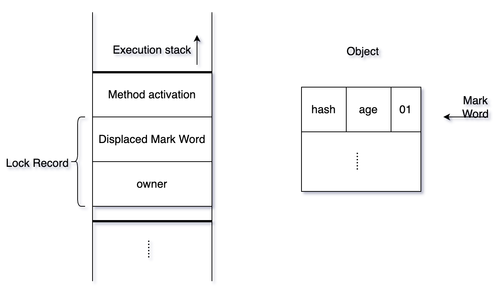
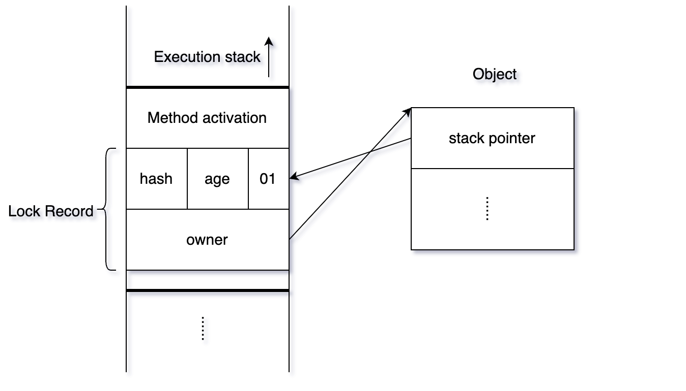

# 轻量级锁

- 轻量级锁是相对于使⽤操作系统互斥量来实现的传统锁（重量级锁）⽽⾔的。
- 轻量级锁并不是⽤来代替重量级锁的。
- 目标是在无实际竞争或短时间竞争(多线程交替执行)场景下，避免使用操作系统互斥量（重量级锁），减少用户态与内核态的切换开销。  
- 适合多个线程竞争不激烈场景。

## 加锁（CAS+自旋）

1. 线程执行同步块之前，JVM会先在当前线程的栈帧中创建用于存储锁记录的空间（`Lock Record`）。锁记录空间（`Lock Record`）包含两部分：
   1. `Displaced Mark Word`：⽤于存储锁对象⽬前的`Mark Word`的拷贝。
   2. `owner`：指向当前锁对象的指针。

2. 然后线程尝试使用CAS将对象头中的`Mark Word` 替换为指向`Lock Record`的指针。
   1. 如果成功，当前线程获得锁，对象锁标志位变为00。
   2. 如果失败，表示存在其它线程竞争锁，当前线程尝试使用自旋获取锁 (自旋超过次数，变为重量级锁)。

## 解锁（CAS）

使用原子CAS操作将`Lock Record`中的`Displaced Mark Word`替换为对象头。

- 如果成功，表示没有竞争。
- 如果失败，表示当前锁存在竞争，锁会膨胀为重量锁 。