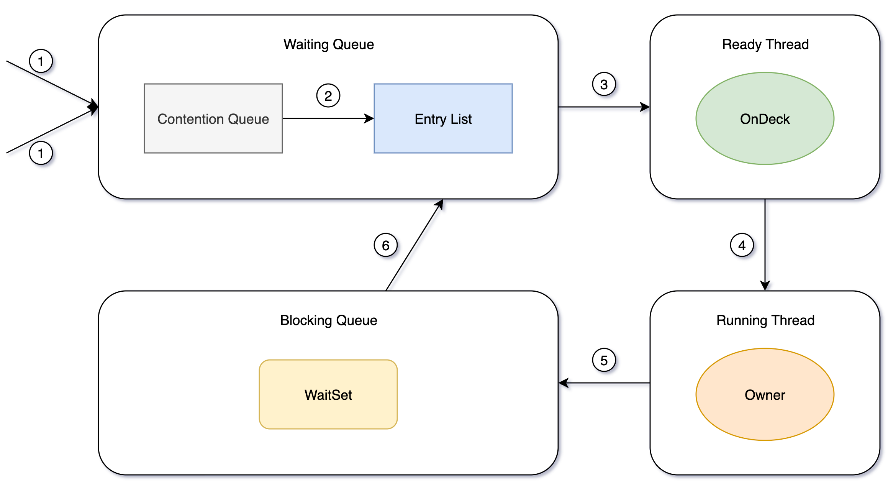

# 重量级锁

重量级锁的实现依赖于ObjectMonitor，⽽ObjectMonitor又依赖于操作系统底层的Mutex Lock（互斥锁）实现。

Monitor可以理解为⼀个同步⼯具或⼀种同步机制，通常被描述为⼀个对象。

每⼀个Java对象就有⼀把看不见的锁，称为内部锁或者Monitor锁。

主要包含以下⼏部分：

- Contention List：竞争队列，所有请求锁的线程⾸先被放在这个竞争队列中；
- Entry List：Contention List中那些有资格成为候选资源的线程被移动到Entry List中；
- Wait Set：哪些调⽤wait⽅法被阻塞的线程被放置在这⾥；
- OnDeck：任意时刻，最多只有⼀个线程正在竞争锁资源，该线程被成为OnDeck；
- Owner：当前已经获取到所资源的线程被称为Owner；
- !Owner：当前释放锁的线程。
- count：monitor的计数器，数值加1表⽰当前对象的锁被⼀个线程获取，线程释放monitor对象时减1

重量级锁的特点，其他线程试图获取锁时，都会被阻塞，只有持有锁的线程释放锁之后才会唤醒这些线程。

重量级锁需要内核态和⽤户态的切换，这个代价很⼤。

所以把它放在最后，经过偏向和轻量级之后才是它。

适合竞争激烈的场景，也算是JVM最后的杀⼿锏了。