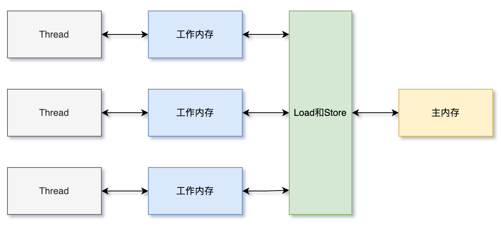
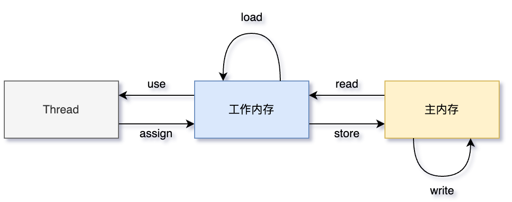

# Java内存模型

## 定义

**内存模型：在特定的操作协议下，对特定的内存或高速缓存进⾏读写访问的过程抽象**。

不同的硬件之间的内存模型有些许差异，Java内存模型(JMM)屏蔽各种硬件和操作系统的内存访问差异，以实现让Java程序在各种平台下都能达到⼀致的内存访问效果。

## 并发编程的通信和同步

在并发编程中，**线程间通信有两种模型：共享内存和消息传递**。

### 共享内存

- 共享内存是指线程间共享，通过读写内存中的公共状态来实现隐式通信。
- 共享内存的同步是显式执⾏的，必须显⽰的指定某个⽅法或者某段代码在程序之间互斥执⾏。

### 消息传递

- 消息传递线程间没有共享状态，线程间必须通过发送/接受消息来进⾏显式通信。
- 消息传递的同步是隐式执⾏的，消息的发送⼀定在消息的接受之前。

**Java采⽤的是共享内存模型：隐式通信、显式同步**。

- 共享内存存在缓存一致性问题。

## 缓存一致性(寄存器-高速缓存-内存)

**存储器层次结构：寄存器 > Cache > 内存**。

高速缓存带来了一个新问题，缓存一致性：

- 如果多个缓存共享同一块主内存区域，那么多个缓存的数据可能会不一致，需要协议来解决，保证缓存一致性。

### 主内存与线程工作内存

所有变量都存储在主内存中，线程共享。

线程有自己的工作内存，工作内存在高速缓存或者寄存器中，保存了该线程使用的变量主内存副本拷贝。

线程只能直接操作工作内存中的变量，线程之间的变量值传递需要通过主内存来完成（共享内存），所以存在缓存一致性问题。

- 主内存对应于Java堆内存中的数据部分（对象等）。

- 局部变量表和⽅法参数等线程私有，不会被共享，分配在线程虚拟机栈上。

## 内存间交互操作（8个原子操作）

- read：把一个变量的值从主内存传输到工作内存中
- load：在 read 之后执行，把 read 得到的值放入工作内存的变量副本中
- use：把工作内存中一个变量的值传递给执行引擎
- assign：把一个从执行引擎接收到的值赋给工作内存的变量
- store：把工作内存的一个变量的值传送到主内存中
- write：在 store 之后执行，把 store 得到的值放入主内存的变量中
- lock：加锁，作用于主内存的变量
- unlock：解锁，作用于主内存的变量

相关规则

- unlock 必须在lock 之后
- read、load两两成对
- store、write两两成对

## volatile 内存语义实现（限制部分重排序）

### load和store

和volatile相关的记住两个重要操作：load和store。

### 限制部分重排序

标注volatile变量会限制⼀部分重排序，防止结果被改变。

| 是否能重排序   | 第二个操作 |             |             |
| -------------- | ---------- | ----------- | ----------- |
| **第一个操作** | 普通读/写  | volatile 读 | volatile 写 |
| 普通读/写      |            |             | NO          |
| volatile 读    | NO         | NO          | NO          |
| volatile 写    |            | NO          | NO          |

1. 第一个操作是volatile 读，不允许重排序，确保volatile 读之后的操作不会被编译器重排序到 volatile 读之前。
2. 第二个操作是volatile 写，不允许重排序，确保volatile 写之前的操作不会被编译器重排序到 volatile 写之后。
3. 第一个操作是volatile 写，第二个操作是volatile 读/写，不允许重排序。

### 内存屏障

为了实现volatile限制重排序的功能，编译器在⽣成字节码时会插⼊内存屏障来禁止特定类型的处理器重排序。
因为每个处理器重排序规则都不⼀样，JMM采取了保守策略插⼊内存屏障，保证JMM在不同处理器上的重排序限制都相同。

- 在每个 volatile 写操作的前⾯插⼊⼀个 StoreStore 屏障
- 在每个 volatile 写操作的后⾯插⼊⼀个 StoreLoad 屏障

## final内存语义

对于 final 域，编译器和处理器要遵守排序规则

这三个操作不可重排序

1. 初始化
2. 构造函数
3. 访问

这两个操作之间不能重排序（先赋值再引用）

1. 构造函数内对⼀个 final域的写⼊
2. 随后把构造对象的引用赋值给一个引用变量

这两个操作之间不能重排序（先读引用再读值）

1. 初次读⼀个包含 final域的对象引用
2. 随后初次读这个 final域

# 内存模型三大特性