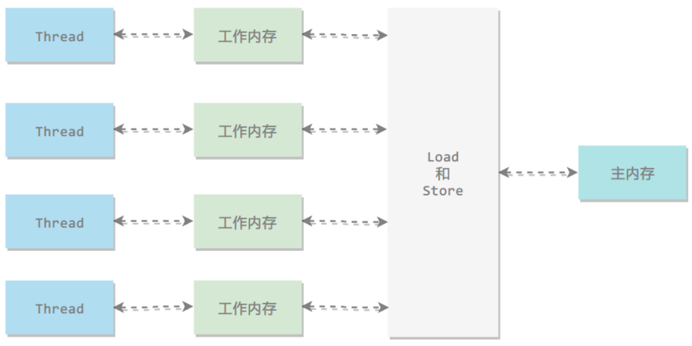
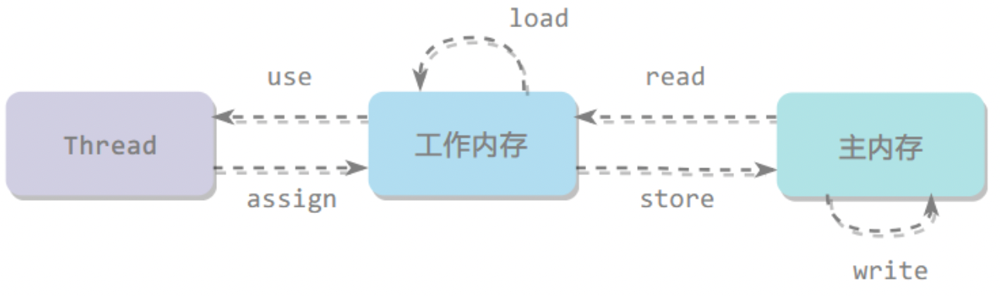

# Java内存模型

## 定义

**内存模型：在特定的操作协议下，对特定的内存或高速缓存进⾏读写访问的过程抽象**。

不同的硬件之间的内存模型有些许差异，Java内存模型(JMM)屏蔽各种硬件和操作系统的内存访问差异，以实现让Java程序在各种平台下都能达到⼀致的内存访问效果。

## 并发编程的通信和同步

在并发编程中，**线程间通信有两种模型：共享内存和消息传递**。

### 共享内存

- 共享内存是指线程间共享，通过读写内存中的公共状态来实现隐式通信。
- 共享内存的同步是显式执⾏的，必须显⽰的指定某个⽅法或者某段代码在程序之间互斥执⾏。

### 消息传递

- 消息传递线程间没有共享状态，线程间必须通过发送/接受消息来进⾏显式通信。
- 消息传递的同步是隐式执⾏的，消息的发送⼀定在消息的接受之前。

**Java采⽤的是共享内存模型：隐式通信、显式同步**。

- 共享内存存在缓存一致性问题。

## 缓存一致性(寄存器-高速缓存-内存)

**存储器层次结构：寄存器 > Cache > 内存**。

高速缓存带来了一个新问题，缓存一致性：

- 如果多个缓存共享同一块主内存区域，那么多个缓存的数据可能会不一致，需要协议来解决，保证缓存一致性。

## 主内存与线程工作内存

所有变量都存储在主内存中，线程共享。

线程有自己的工作内存，工作内存在高速缓存或者寄存器中，保存了该线程使用的变量主内存副本拷贝。

线程只能直接操作工作内存中的变量，线程之间的变量值传递需要通过主内存来完成（共享内存），所以存在缓存一致性问题。

- 主内存对应于Java堆内存中的数据部分（对象等）。

- 局部变量表和⽅法参数等线程私有，不会被共享，分配在线程虚拟机栈上。

## 内存间交互操作（8个原子操作）

- read：把一个变量的值从主内存传输到工作内存中
- load：在 read 之后执行，把 read 得到的值放入工作内存的变量副本中
- use：把工作内存中一个变量的值传递给执行引擎
- assign：把一个从执行引擎接收到的值赋给工作内存的变量
- store：把工作内存的一个变量的值传送到主内存中
- write：在 store 之后执行，把 store 得到的值放入主内存的变量中
- lock：加锁，作用于主内存的变量
- unlock：解锁，作用于主内存的变量

相关规则等

- unlock必须在lock之后
- read、load两两成对
- store、write两两成对

## volatile 内存语义实现（限制部分重排序）

和volatile相关的只需要记住两个操作。

- load和store

标注volatile变量会限制⼀部分重排序，防止结果被改变。