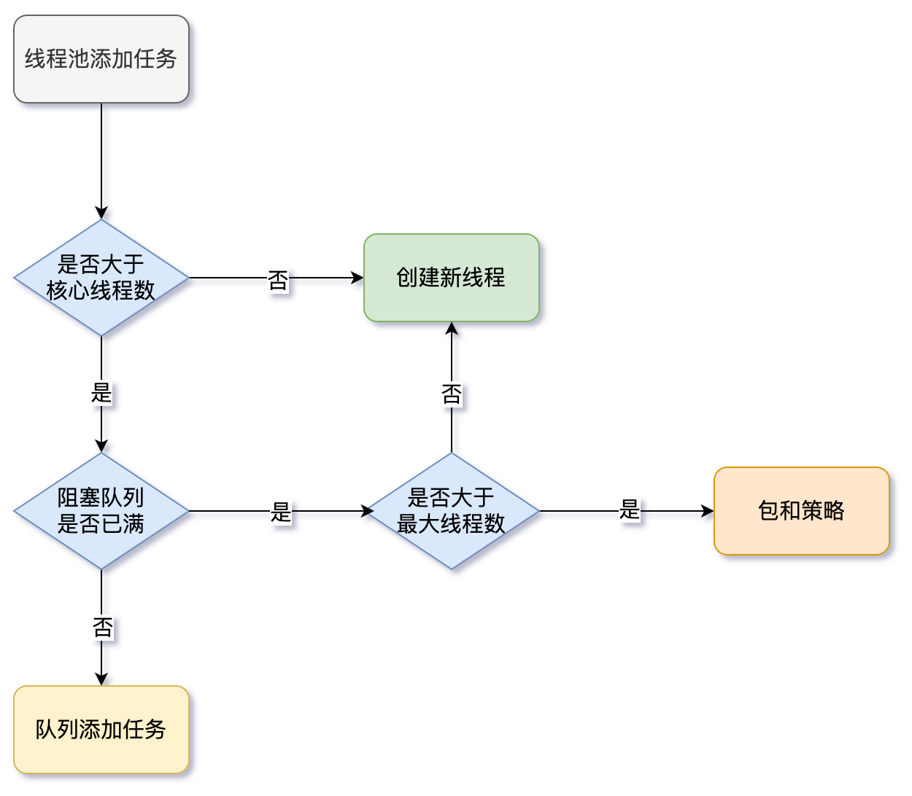

# 线程池

## Callable、Future、FutureTask

```java
@FunctionalInterface
public interface Runnable {
    public abstract void run();
}

public interface Future<V> {

    boolean cancel(boolean mayInterruptIfRunning);

    boolean isCancelled();

    boolean isDone();

    V get() throws InterruptedException, ExecutionException;

    V get(long timeout, TimeUnit unit) throws InterruptedException, ExecutionException, TimeoutException;
}

public interface RunnableFuture<V> extends Runnable, Future<V> {
    void run();
}

public class FutureTask<V> implements RunnableFuture<V> {
  ...
}
```

`Callable`有返回值，返回异步计算结果，返回值通过`Future<V>` 进行封装。

`FutureTask` 实现了 `RunnableFuture` 接口，`RunnableFuture` 接口继承自 `Runnable` 和 `Future<V>` 接口。

1. `FutureTask` 可以当做一个任务执行（`Runnable` ）。
2. `FutureTask` 有返回值，可以用于获取异步计算结果（`Future`）。

`FutureTask` 用于异步获取执行结果（`get`）或 取消执行任务的场景（`shutdown`、`shutdownNow`）。

- 当一个计算任务需要执行很长时间，可以用 `FutureTask` 来封装这个任务，主线程在完成自己的任务之后再去获取结果。

`FutureTask`执行过程：

1. 构建`Callable`；
2. `FutureTask`封装`Callable；`
3. 构造线程执行任务；
4. `get()`异步获取执行结果。

```java
public static void main(String[] args) throws ExecutionException, InterruptedException {
    Callable c = new MyCallable();
    FutureTask<String> ft = new FutureTask<>(c);
    Thread t = new Thread(ft);
    t.start();
    String res = ft.get();
    System.out.println(res);
}
```

## 控制任务组（控制一组相关的任务）

- `shutdown`：取消所有任务。
- `invokeAny`：提交一个`Callable`对象集合中的所有对象，并返回某个已完成的结果。
- `invokeAll`：提交一个`Callable`对象集合中的所有对象，直到所有任务都完成，方法会阻塞，返回`Future`对象集合。

## fork-join框架

- 主要用于并行计算中，和 MapReduce 原理类似，把大计算任务拆分成多个小任务并行计算，完成计算密集任务。
- 假设有一个处理任务，它可以分解为子任务 。
- 采用工作密集方法 ，平衡可用线程的工作负载。

### 工作密集方法 

大任务拆分成小任务，放到不同队列执行，交由不同线程分别执行时，有的线程优先把任务执行完了，其它线程还在处理自己的任务，这时候可以使用工作密集方法提高效率：

- “某个线程，从其它队列中窃取任务，进行执行”。
- 一般指做得快的线程（盗窃线程）抢慢的线程的任务来做。
- 同时为了减少锁竞争，通常使用双端队列，即快线程和慢线程各在一端。

## Executor**s**(**工具类**，构造线程池)

`Executors`有许多静态工厂方法，用来构造线程池 ：

- `newCachedThreadPool`（缓存线程池）
- `newFixedThreadPool`（固定线程池）
- `newSingleThreadExecutor`（单线程池）
- `newScheduleThreadPool`（周期单线程池）

建议使用`ThreadPoolExecutor` 可以创建自定义线程池

## Executor(执行器，**管理线程任务**) 

`Executor` 管理多个异步任务的执行，而无需显式地管理线程的生命周期。

- 异步是指多个任务的执行互不干扰，不需要同步操作。

## shutdown() 和 shutdownNow()区别

`shutdown()`

- 关闭线程池，线程池的状态变为 `SHUTDOWN`。
- 线程池不再接受新任务，但队列里的任务得执行完毕，即等待线程都执行完毕之后再关闭。

`shutdownNow()`

- 关闭线程池，线程的状态变为 `STOP`。
- 线程池会终止当前正在运行的任务，停止处理排队的任务，并返回正在等待执行的 `List`。
- 原理是遍历线程池中的工作线程，然后逐个调用线程的`interrupt()`方法来中断线程，所以无法响应中断的任务可能永远无法终止。

## 线程池工作

1. `Executors` 获取线程池;
2. `Executor` 提交`Callable`/`Runnable`对象（线程任务）;
3. 保存返回的`Future`对象，以便得到结果或取消任务 ;
4. 当不想在提交任务时，调用`shutdown`。

```java
ExecutorService service1 = Executors.newCachedThreadPool();
ExecutorService service2 = Executors.newFixedThreadPool(16);
ExecutorService service3 = Executors.newSingleThreadExecutor();

// 提交到线程池，Future得到结果或取消任务
Future f1 = service1.submit(new MyCallable());
Future f2 = service2.submit(new MyRunnable());
Future f3 = service3.submit(new MyThread());

service1.shutdown();
service1.shutdownNow();

List<MyCallable> list = new ArrayList<>();
service1.invokeAll(list);
service1.invokeAny(list);
```

## Executor和Executors区别

- `Executors` 工具类的不同方法创建了不同的线程池，来满足业务的需求。
- `Executor` 接口对象能执行线程任务（管理线程任务的执行）。
  - `ExecutorService`接口继承了`Executor`接口并进行了扩展，提供了更多的方法。
  - 获得任务执行状态，并可获取任务返回值（`Future`）。
## 为什么要用线程池？（重复利用）

限制和管理资源（包括执行任务）。 线程池还维护一些基本统计信息，例如已完成任务的数量。

1. 降低资源消耗。 重复利用已创建线程，降低线程创建和销毁造成的消耗。
2. 提高响应速度。 当任务到达时，任务可以不需要等到线程创建就能立即执行（线程池已有线程）。
3. 提高线程的可管理性。 线程是稀缺资源，如果无限制的创建，不仅会消耗系统资源，还会降低系统的稳定性，使用线程池可以进行统一的分配，调优和监控。

## execute()和submit()区别

`execute()` 方法用于提交无返回值的任务，所以无法获取异步计算结果。

`submit()`方法用于提交需要返回值的任务，方法返回一个`Future`类型的对象。

- 通过这个对象可以判断任务是否执行成功。
- 使用`get()`方法来获取返回值，`get()`方法会阻塞当前线程直到任务完成。
- 使用 `get(long timeout，TimeUnit unit)`方法会阻塞当前线程一段时间后立即返回，有可能任务没有执行完。

## 线程池核心参数

1. `corePoolSize` ： 核心线程大小。线程池一直运行，核心线程就不会停止。
2. `maximumPoolSize` ：线程池最大线程数量。非核心线程数量 = `maximumPoolSize - corePoolSize`

3. `keepAliveTime` ：非核心线程的心跳时间。如果非核心线程在`keepAliveTime`内没有运行任务，非核心线程会消亡。
4. `workQueue` ：阻塞队列。`ArrayBlockingQueue`，`LinkedBlockingQueue`等，用来存放线程任务。

5. `defaultHandler` ：饱和策略（阻塞队列满了，该如何做）。`ThreadPoolExecutor`类中一共有4种饱和策略。通过实现`RejectedExecutionHandler`接口。
   1. `AbortPolicy` ： 线程任务丢弃报错。默认饱和策略。

   2. `DiscardPolicy` ： 线程任务直接丢弃不报错。

   3. `DiscardOldestPolicy` ： 将`workQueue`队首任务丢弃，将最新线程任务重新加入队列执行。

   4. `CallerRunsPolicy` ：线程池之外的线程直接调用`run`方法执行。

6. `ThreadFactory` ：线程工厂，新建线程工厂。

### 线程池执行任务流程



1. 执行`execute`/`submit`方法向线程池添加任务。
2. 当工作线程数量小于核心线程数`corePoolSize`，线程池中创建新线程。
3. 当工作线程数量大于核心线程数`corePoolSize`，向阻塞队列添加任务。
4. 如果阻塞队列未满，加入队列。
5. 如果阻塞队列已满，比较参数`maximumPoolSize`。
   1. 当工作线程数量小于`maximumPoolSize`，线程池中创建新线程。
   2. 当工作线程数量大于`maximumPoolSize`，说明当前线程池处理不了，执行饱和策略。

## JAVA常用线程池

### 1、`newCachedThreadPool`

缓存线程池，无数量限制（可能`OOM`），空闲线程回收，使用`SynchronousQueue`阻塞队列。

- 创建一个可缓存线程池。
- 无空闲线程时创建新线程，空闲线程会保留60秒（灵活回收）。
- 一个任务创建一个线程，立即执行各个任务，有空闲线程直接使用，没有创建。
- 工作线程的创建数量几乎没有限制，如果大量线程同时运行，很有会造成系统`OOM`。 

### 2、`newFixedThreadPool`

固定线程池，有数量限制，空闲线程不回收，使用`LinkedBlockingQueue`阻塞队列。

- 创建一个指定工作线程数量的线程池。
- 线程池中包含固定数目的线程，空闲线程会一直保留，所有任务只能使用固定大小的线程。
- 每当提交一个任务就创建一个工作线程，如果工作线程数量达到最大数，则将任务存入阻塞队列。
- 它具有线程池提高程序效率，节省创建线程时所耗的开销的优点；但是在线程池空闲时，它不会释放工作线程，占用一定的系统资源。

### 3、`newSingleThreadExecutor`

单线程池，顺序执行，使用`LinkedBlockingQueue`阻塞队列。

- 只有一个线程，相当于大小为 1 的 `newFixedThreadPool`；会顺序执行(FIFO/LIFO/优先级)任务。
- 如果这个线程异常结束，会有另一个取代它，保证顺序执行。
- 单工作线程最大的特点是可保证顺序地执行各个任务，并且在任意给定的时间不会有多个线程是活动的。

### 4、`newScheduleThreadPool`

使用`DelayedWorkQueue`阻塞队列。

- 创建一个定长的线程池，支持定时、周期性任务执行。

## 线程池复用线程原理

`worker`线程，置换`worker`中`Runnable`对象。

- `ThreadPoolExecutor`中有个内置对象`Worker`，每个`worker`都是一个线程，`worker`线程数量和参数有关。
- 每个`worker`会`while`死循环从阻塞队列中取数据，通过置换`worker`中`Runnable`对象，运行其`run`方法起到线程置换效果。
- 这样做的好处是避免多线程频繁线程切换，提高程序运行性能。

## 线程池参数配置

合理配置线程池参数需要结合任务类型（CPU/IO密集型）、硬件资源（CPU核心数）和任务特性（任务耗时、任务数量）来综合判断。以下是具体策略和示例：

---

### 1. CPU密集型任务
**特点**：计算逻辑复杂，CPU占用高（如加密解密、复杂算法）。 
**优化目标**：减少线程上下文切换，避免线程数过多导致CPU资源浪费。

#### **配置建议**：
- **核心线程数 = 最大线程数 = CPU核心数 + 1**  
  - 加1是为了防止偶发缺页中断或其他阻塞导致CPU闲置
  
- **队列选择有界队列**（如 `ArrayBlockingQueue`），容量根据任务数量调整，避免内存溢出。
- **拒绝策略**：用 `AbortPolicy`（直接抛出异常，防止任务丢失）。

#### **示例代码**：
```java
int cpuCores = Runtime.getRuntime().availableProcessors();
ThreadPoolExecutor executor = new ThreadPoolExecutor(
    cpuCores + 1,      // corePoolSize
    cpuCores + 1,      // maximumPoolSize
    0L,                // keepAliveTime
    TimeUnit.MILLISECONDS,
    new ArrayBlockingQueue<>(1000),  // 有界队列
    new ThreadPoolExecutor.AbortPolicy()
);
```

---

### 2. IO密集型任务
**特点**：任务需要等待IO操作（如数据库查询、网络请求），CPU空闲时间长。 
**优化目标**：充分利用CPU空闲时间，增加线程数处理更多任务。

#### **配置建议**：
- **核心线程数 = CPU核心数**  
- **最大线程数 = CPU核心数 * 2**（经验值）  
- **最大线程数 = CPU核心数 * (1 + 平均IO等待时间 / 平均CPU计算时间)**  
  （例如IO耗时占比50%，则线程数为 `2N`）
- **队列选择无界队列**（如 `LinkedBlockingQueue`）或容量较大的有界队列。
- **拒绝策略**：用 `CallerRunsPolicy`（由提交任务的线程执行任务，避免任务丢失）。

#### **示例代码**：
```java
int cpuCores = Runtime.getRuntime().availableProcessors();
ThreadPoolExecutor executor = new ThreadPoolExecutor(
    cpuCores,          // corePoolSize
    cpuCores * 2,      // maximumPoolSize
    60L,               // keepAliveTime（回收空闲线程）
    TimeUnit.SECONDS,
    new LinkedBlockingQueue<>(),  // 无界队列
    new ThreadPoolExecutor.CallerRunsPolicy()
);
```

---

### 3. 通用优化技巧
1. **动态调整参数**：  
   - 使用 `setCorePoolSize()` 和 `setMaximumPoolSize()` 方法动态调整线程数（如结合系统监控指标）。
2. **监控线程池状态**：  
   - 通过 `ThreadPoolExecutor#getActiveCount()` 监控活跃线程数。
   - 使用 `JMX` 或 `Micrometer` 导出线程池指标。
3. **避免资源耗尽**：  
   - 对IO密集型任务，需限制最大线程数（避免耗尽数据库连接或文件句柄）。
4. **队列选择策略**：  
   - 高吞吐场景用 `LinkedBlockingQueue`，严格顺序执行用 `ArrayBlockingQueue`。
   - 快速响应任务用 `SynchronousQueue`（配合 `CachedThreadPool`）。

---

### 4. 实际案例
- **Web服务器（IO密集型）**：  
  ```java
  // 假设CPU核心数为8，任务主要处理HTTP请求（含DB查询）
  ThreadPoolExecutor executor = new ThreadPoolExecutor(
      8,     // corePoolSize
      32,    // maximumPoolSize（假设IO等待时间较长）
      30,    // keepAliveTime
      TimeUnit.SECONDS,
      new LinkedBlockingQueue<>(5000),
      new ThreadPoolExecutor.CallerRunsPolicy()
  );
  ```

- **视频编码（CPU密集型）**：  
  
  ```java
  // 假设CPU核心数为12
  ThreadPoolExecutor executor = new ThreadPoolExecutor(
      12,    // corePoolSize
      12,    // maximumPoolSize
      0L,
      TimeUnit.MILLISECONDS,
      new ArrayBlockingQueue<>(200),
      new ThreadPoolExecutor.AbortPolicy()
  );
  ```

---

### 5. 工具推荐
- **动态调参**：Netflix 的 `Hystrix` 或阿里开源的 `DynamicTp`。
- **监控工具**：Prometheus + Grafana 监控线程池队列堆积情况。
