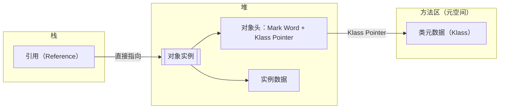
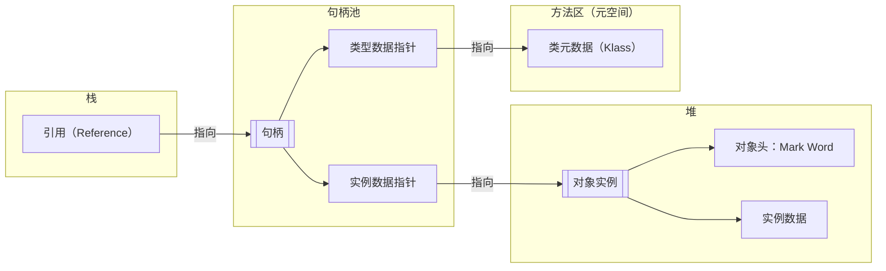

# 对象内存布局

## 内存布局示意图

以 64 位 JVM 为例，开启指针压缩。

```
|-----------------|----------------------|----------------|--------------------------|---------------------|
|  Mark Word (64) |  Klass Pointer (32)  |  数组长度 (32)  |  实例数据 (Instance Data)  |  对齐填充 (Padding)  |
|-----------------|----------------------|----------------|--------------------------|---------------------|

|-------------------------------------------------------------------------------------|---------------------|
|                      对象头 (Header)                     |  实例数据 (Instance Data)  |  对齐填充 (Padding)  |
|-------------------------------------------------------------------------------------|---------------------|
```

- 非数组对象无“数组长度”字段。
- 对象头总大小：普通对象为 12 字节（8 字节 Mark Word + 4 字节 Klass Pointer），数组对象为 16 字节。

## 一.对象头 (Header) 

**对象头（Object Header）** 是 Java 对象内存布局的核心部分，主要包含以下内容：

---

### 1. Mark Word
**作用**：存储对象自身的运行时数据，包括锁状态、GC 信息等。

**内容**（具体内容根据对象状态动态变化）：

- **哈希码（Identity Hash Code）**：对象的哈希值（延迟计算，第一次调用 `hashCode()` 时生成）。
- **GC 分代年龄（Age Bits）**：记录对象被垃圾回收的次数（4 bits，最大值为 15）。
- **锁状态标志（Lock Flags）**：标记对象的锁状态（无锁、偏向锁、轻量级锁、重量级锁）。
- **线程 ID**：偏向锁状态下，记录持有偏向锁的线程 ID。
- **epoch**：偏向锁的时间戳，用于优化偏向锁的撤销。
- **指向锁记录的指针**：轻量级锁状态下，指向线程栈中的锁记录（Lock Record）。
- **指向重量级锁的指针**：重量级锁状态下，指向监视器（Monitor）的指针。

在运行期间，Mark Word 存储的数据会随着锁标志位的变化而变化 ，**动态结构**（以 64 位 JVM 为例）：

| 锁状态   | Mark Word 内容（64 位）                                      |
| -------- | ------------------------------------------------------------ |
| 无锁     | 25 位哈希码 + 4 位分代年龄 + 1 位偏向锁标志（`0`） + 2 位锁标志位（`01`） |
| 偏向锁   | 54 位线程 ID + 2 位 Epoch + 4 位分代年龄 + 1 位偏向锁标志（`1`） + 2 位锁标志位（`01`） |
| 轻量级锁 | 62 位指向线程栈中锁记录（Lock Record）的指针 + 2 位锁标志位（`00`） |
| 重量级锁 | 62 位指向 Monitor 的指针 + 2 位锁标志位（`10`）              |
| GC 标记  | 空（用于垃圾回收阶段，锁标志位为（`11`））                   |

---

### 2. Klass Pointer（类型指针）
**作用**：指向对象的类元数据（`Klass` 结构），JVM 通过它确定对象的类型。

- ⽐如通过`getInstance()`得到对象实例时就需要⽤到该指针。

**大小**：

- 32 位 JVM：4 字节。
- 64 位 JVM：默认开启指针压缩（`-XX:+UseCompressedOops`）时为 4 字节，关闭时为 8 字节。

---

### 3. 数组长度（仅数组对象）
**作用**：如果是数组对象（如 `int[]`），对象头会额外包含数组长度。

**大小**：4 字节（32 位或 64 位 JVM 均适用）。

---

### 总结

对象头是 JVM 管理对象的关键数据结构，支持锁机制、垃圾回收和类型识别。理解其结构对分析内存占用、锁优化（如偏向锁升级）和性能调优有重要意义。

---

## 二. 实例数据（Instance Data）
存储对象实际定义的字段（成员变量），按以下规则排列：
1. **父类字段优先子类字段**（继承关系）。
2. **基本类型优先于引用类型**（如 `int` 排在 `String` 前）。
3. **字段宽度对齐**：`long/double`（8 字节）排在 `int`（4 字节）前。
4. 如果开启 `-XX:CompactFields`（默认开启），允许更紧凑的排列（可能打破上述规则）。

### 示例
```java
class Parent {
    int a;      // 4 字节
}

class Child extends Parent {
    long b;     // 8 字节
    String c;   // 引用类型（4 字节，开启指针压缩）
}
```
内存布局：
```
| Parent.a (4) | Child.b (8) | Child.c (4) | ... |
```

---

## 三. 对齐填充（Padding）
HotSpot虚拟机的⾃动内存管理系统要求**对象起始地址必须是8字节的整数倍**。

- **作用**：确保对象总大小为 **8 字节的整数倍**（64 位 JVM 的默认对齐要求）。
- **原因**：内存对齐能提高 CPU 访问数据的效率。

### 示例
- 对象头：12 字节（Mark Word 8 + Klass Pointer 4，开启指针压缩）。
- 实例数据：5 字节（如 `byte` + `int`）。
- 对齐填充：8字节。
- 总大小：12 + 5 = 17 字节 → 对齐填充至 **24 字节**（满足 8 的倍数）。

---

## 内存布局示例

以 64 位 JVM 为例，开启指针压缩。

### 普通对象
```java
class Example {
    int x;       // 4 字节
    boolean y;   // 1 字节
    Object z;    // 4 字节（引用类型，开启指针压缩）
}
```
内存布局：
```
| Mark Word (8) | Klass Pointer (4) | x (4) | y (1) | z (4) | Padding (3) | 
```
总大小：8 + 4 + 4 + 1 + 4 + 3 = **24 字节**。

### 数组对象
```java
int[] arr = new int[3]; 
```
内存布局：
```
| Mark Word (8) | Klass Pointer (4) | 数组长度 (4) | arr[0] (4) | arr[1] (4) | arr[2] (4) | Padding (4) |
```
总大小：8 + 4 + 4 + 12 = **28 字节** → 对齐填充至 **32 字节**。

---

## 指针压缩

**默认开启**：`-XX:+UseCompressedOops`（压缩普通对象指针）和 `-XX:+UseCompressedClassPointers`（压缩类指针）。

**效果**：

- 对象引用（`Object` 类型）从8字节压缩为4字节。
- 类型指针（Klass Pointer）从8字节压缩为4字节。

**限制**：堆内存超过32GB时压缩指针失效。

## 总结

| 组成部分     | 内容                                 | 大小（64 位 JVM，开启指针压缩）    |
| ------------ | ------------------------------------ | ---------------------------------- |
| **对象头**   | Mark Word + Klass Pointer + 数组长度 | 普通对象 12 字节，数组对象 16 字节 |
| **实例数据** | 对象实际字段                         | 由字段类型决定                     |
| **对齐填充** | 补足 8 字节对齐                      | 0~7 字节                           |

理解对象内存布局有助于：
1. 分析内存占用（如通过 `jol-core` 工具）。
2. 优化对象设计（减少填充浪费）。
3. 理解锁升级、垃圾回收等机制的底层实现。


## 对象访问定位方式

对象的访问定位方式指的是**如何通过栈上的引用（Reference）找到堆中对象实例的具体位置**。

常见的访问定位方式有两种：**直接指针访问**和**句柄访问**。

---

### 1. 直接指针访问（HotSpot默认方式）



#### 原理：
- **引用直接指向堆中对象实例的内存地址**，对象头中保存了类型指针（Klass Pointer），直接指向方法区（Metaspace）中的类元数据。
- **内存结构**：
  ```
  栈中的引用 → 直接指向堆中的对象实例 → 对象头中的Klass Pointer → 方法区中的类元数据
  ```

#### 优点：
1. **访问速度快**：只需一次指针跳转即可访问对象实例数据（如字段值）。
2. **内存占用小**：不需要额外的句柄池结构。

#### 缺点：
- 对象移动时（如GC过程中），所有指向该对象的引用都需要更新（但现代GC算法已优化此问题）。

#### 示例：
```java
Object obj = new Object();
// 栈中的obj引用直接指向堆中Object实例的内存地址
```

---

### 2. 句柄访问



#### 原理：
- **引用指向一个句柄池（Handle Pool）中的句柄**，句柄包含两个指针：
  1. **实例数据指针**：指向堆中对象实例。
  2. **类型数据指针**：指向方法区中的类元数据。
- **内存结构**：
  ```
  栈中的引用 → 句柄池中的句柄 → 实例数据指针 → 堆中的对象实例
                                → 类型数据指针 → 方法区中的类元数据
  ```

#### 优点：
1. **对象移动稳定**：GC过程中只需更新句柄中的实例数据指针，无需修改栈中的引用。
2. **引用固定**：栈中的引用始终指向句柄池，适合某些特定场景（如频繁GC的早期虚拟机）。

#### 缺点：
1. **访问速度慢**：需要两次指针跳转（先访问句柄，再访问对象实例）。
2. **内存占用高**：需额外维护句柄池。

#### 示例：
```java
Object obj = new Object();
// 栈中的obj引用指向句柄池中的句柄，句柄再分别指向对象实例和类元数据
```

---

### 两种方式的对比
| **特性**       | **直接指针访问**      | **句柄访问**                |
| -------------- | --------------------- | --------------------------- |
| **访问速度**   | 快（1次指针跳转）     | 慢（2次指针跳转）           |
| **内存占用**   | 低（无句柄池）        | 高（需维护句柄池）          |
| **GC友好性**   | 对象移动时需更新引用  | 对象移动时只需更新句柄      |
| **实现复杂度** | 简单                  | 复杂                        |
| **典型应用**   | HotSpot虚拟机默认方式 | 早期虚拟机（如部分JVM实现） |

---

### 为什么HotSpot选择直接指针访问？
1. **性能优先**：减少一次指针跳转，直接访问对象实例数据，显著提升字段读取速度。
2. **内存优化**：现代GC算法（如分代GC、标记-整理）已能高效处理对象移动时的引用更新问题。
3. **硬件支持**：现代CPU缓存和内存对齐机制对直接访问更友好。

---

### 总结
- **直接指针访问**是主流JVM（如HotSpot）的首选，权衡了性能和内存效率。
- **句柄访问**在特定场景下（如需要频繁GC且对象移动较多）可能更稳定，但实际中较少使用。

理解这两种方式有助于分析JVM性能调优（如GC对程序的影响）和内存泄漏问题。


