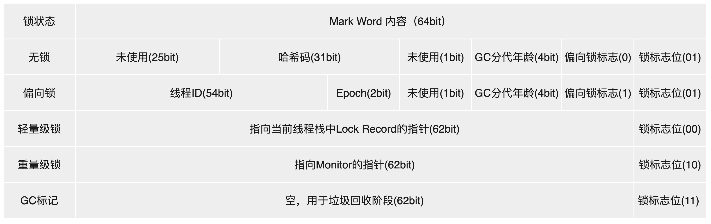

# 并发底层实现原理

## volatile （可见性，免锁）

`volatile` 是轻量级的`synchronized`，它在多处理器开发中保证了共享变量的“可见性”。

- Java内存模型保证所有线程看到的变量值是一致的，当`volatile`变量被修改，修改对于所有读取变量的线程可见。

`volatile` 关键字为实例字段的同步访问提供了一种免锁机制。

`volatile` 不会引起上下文的切换。

`volatile` 不能提供原子性 。

```java
volatile count；
count ++ // ++操作不能保证原子性
```

### CPU术语

- 内存屏障
- **缓存行：缓存的最小操作单位**
- 原子操作
- **缓存行填充**
- 缓存命中
- 写命中
- 写缺失

### volatile 原理

`volatile`变量转变成汇编语言，会多出`Lock`前缀的汇编代码，`Lock`前缀指令在多处理器下会引发两件事：

1. 将当前处理器**缓存行**的数据写回到系统内存。
2. 这个写回内存操作会使在其它CPU里缓存了该内存地址的数据失效。

如果对`volatile`变量进行写操作，JVM会向处理器发送一条`Lock`前缀的指令，将这个变量在缓存行的数据写回到系统内存。同时，根据缓存一致性协议 ，当处理器发现自己缓存行对应的**内存地址**被修改，就将当前处理器的缓存行设置为无效状态 ，当处理器对这个数据进行修改操作的时候，重新从系统内存把数据读取到处理器缓存里（**缓存行填充**）。

#### volatile的两条实现原则：

1. `Lock`前缀指令会引起处理器**缓存回写到内存**。
2. 一个处理器的缓存回写到内存操作会导致其它处理器的**缓存失效** 。

## synchronized（**原⼦性、可见性、有序性**）

`synchronized`关键字通过**对象头、锁升级机制和字节码指令**实现线程同步，解决了对共享变量操作的原⼦性、保证了其它线程对共享变量的可见性、有序性，确保了并发情况下的线程安全。 

Java中的锁分为显式锁和隐式锁：

- 隐式锁由`synchronized`关键字实现
- 显式锁是由实现了`Lock`接口和`AQS`框架等类来实现

## synchronized 同步实现机制

`synchronized`的同步实现细节基于 **对象监视器（Monitor）** 和 **字节码指令**。
### 1. 底层实现：Monitor与字节码指令
#### 同步代码块

```java
public void syncMethod() {
    synchronized (obj) {
        // 临界区代码
    }
}
```

对应的字节码指令如下：
```java
monitorenter     // 尝试获取对象锁
// 临界区代码
monitorexit      // 释放锁
monitorexit      // 异常路径释放锁（确保异常时锁被释放）
```

- **`monitorenter`**：  线程执行到此处时，尝试获取与对象关联的Monitor（监视器锁）。  
  - 若锁未被占用（Monitor的计数器为0），线程获取锁，计数器置为1。  
  - 若线程已持有锁（重入），计数器递增。  
  - 若锁被其它线程占用，线程进入阻塞队列，等待唤醒。
  
- **`monitorexit`**：  释放锁，计数器递减。当计数器归零时，唤醒阻塞队列中的线程。

#### 同步方法

```java
public synchronized void syncMethod() {
    // 临界区代码
}
```

对应的字节码中，方法会标记为`ACC_SYNCHRONIZED`：

```java
flags: ACC_PUBLIC, ACC_SYNCHRONIZED
```

- JVM在方法调用时隐式获取锁（当前实例或类的Monitor），方法返回时自动释放锁。

### 2. Monitor的底层结构

每个Java对象都与一个Monitor（监视器锁）关联，其底层通过C++的`ObjectMonitor`类实现（位于HotSpot源码中）：

```cpp
class ObjectMonitor {
    void*    _header;          // 对象头（Mark Word）
    void*    _owner;           // 持有锁的线程
    intptr_t _count;           // 重入次数
    intptr_t _waiters;         // 等待线程数
    ObjectWaiter* _cxq;        // 竞争队列（Contention Queue）
    ObjectWaiter* _EntryList;  // 阻塞队列（Entry List）
    // ...
};
```

### 3. 关键流程：

1. **锁竞争**  
   - 当线程尝试获取锁时，若`_owner`为`null`，通过CAS操作将`_owner`设置为当前线程，`_count`置1。  
   - 若`_owner`已为当前线程（重入），`_count`递增。

2. **锁冲突**  
   - 若锁被其它线程占用，线程封装为`ObjectWaiter`节点，加入`_cxq`（竞争队列）。  
   - 线程进入阻塞状态（通过`pthread_mutex_lock`或自旋等待）。

3. **锁释放**  
   - `_count`递减，若归零，`_owner`置为`null`。  
   - 从`_cxq`或`_EntryList`中唤醒一个线程（策略因JVM实现而异）。

## 对象三种加锁⽅式

1. 对于普通同步⽅法，锁是当前实例对象。
2. 对于静态同步⽅法，锁是当前类的 `Class` 对象。
3. 对于同步⽅法块，锁是 `synchonized` 括号⾥配置的对象。

## Mark Word动态结构

**对象头的Mark Word字段存储了与锁相关的关键信息**，是实现锁优化（如偏向锁、轻量级锁、重量级锁）的核心结构。

在运行期间，Mark Word 存储内容会根据锁状态的变化而动态调整 ，**动态结构**（以 64 位 JVM 为例）：



#### 1. 无锁状态（Unlocked）

- 锁标志位：`01`
- 偏向锁标志：`0`
- 存储内容：
  - 对象哈希码（31位）：通过`Object.hashCode()`或`System.identityHashCode()`生成的唯一标识（仅在第一次调用时计算并存储）。
  - GC分代年龄（4位）：对象在YGC中存活的次数（最大值为15，超过则进入老年代）。

#### 2. 偏向锁（Biased Locking）

- 锁标志位：`01`
- 偏向锁标志：`1`
- 设计目标：减少无竞争场景下的锁开销（假设锁总是被同一线程多次获取）。
- 存储内容：
  - 线程ID（54位）：持有偏向锁的线程ID（通过CAS操作设置）。
  - 时间戳（2位）：偏向锁的epoch值（用于批量重偏向优化）。
  - GC分代年龄（4位）：与无锁状态相同。
- 升级条件：当其它线程尝试竞争偏向锁时，偏向锁会升级为轻量级锁（或直接膨胀为重量级锁，取决于竞争程度）。


#### 3. 轻量级锁（Lightweight Locking）

- 锁标志位：`00`
- 设计目标：在无实际竞争（仅存在线程交替执行）的场景下，避免使用重量级锁的内核态开销。
- 存储内容：
  - 锁记录指针（62位）：指向当前线程栈中`Lock Record`的指针。`Lock Record`是线程为锁对象分配的一块内存，用于存储锁对象的Mark Word拷贝（称为`Displaced Mark Word`）。
- 加锁逻辑：
  1. 线程尝试获取锁时，会在自己的栈中创建`Lock Record`，并将Mark Word的拷贝存入其中。
  2. 通过CAS操作将Mark Word的锁标志位改为`00`，并指向`Lock Record`的指针。
  3. 若CAS成功，线程获得轻量级锁；若失败（说明存在竞争），轻量级锁升级为重量级锁。


#### 4. 重量级锁（Heavyweight Locking）

- 锁标志位：`10`
- 设计目标：在存在实际竞争的场景下，通过操作系统互斥量（Mutex）实现强互斥。
- 存储内容：
  - `Monitor`指针（62位）：指向堆中`ObjectMonitor`对象的指针。`ObjectMonitor`是HotSpot实现的锁核心结构，包含`_owner`（持有锁的线程）、`_waitSet`（等待线程队列）、`_EntryList`（竞争队列）等字段。
- 加锁逻辑：
  1. 当轻量级锁竞争失败时，锁膨胀为重量级锁，Mark Word指向`ObjectMonitor`。
  2. 竞争线程会被阻塞并进入`_EntryList`队列，释放锁时唤醒队列中的线程重新竞争。


#### 5. GC标记（GC Marked）

- 锁标志位：`11`
- 用途：垃圾收集器标记对象即将被回收，此时Mark Word的其它字段无意义。

Mark Word的动态变化本质是HotSpot为了优化锁性能而设计的**状态机**。通过偏向锁（减少无竞争开销）→轻量级锁（减少短时间竞争的开销）→重量级锁（处理长时间竞争）的逐步升级策略，在保证正确性的同时最大化性能。理解这一过程对分析锁优化、死锁排查及JVM调优有重要意义。

## 锁升级过程

`synchronized`锁的状态被分为4种，级别从低到⾼依次是：⽆锁、偏向锁、轻量级锁、重量级锁，且锁可以升级但不能降级。


## 锁可以升级但不能降级

**锁可以升级但不能降级**，意味着偏向锁升级成轻量级锁后不能降级成偏向锁。

这种锁升级却不能降级的策略，⽬的是为了提⾼获得锁和释放锁的效率。