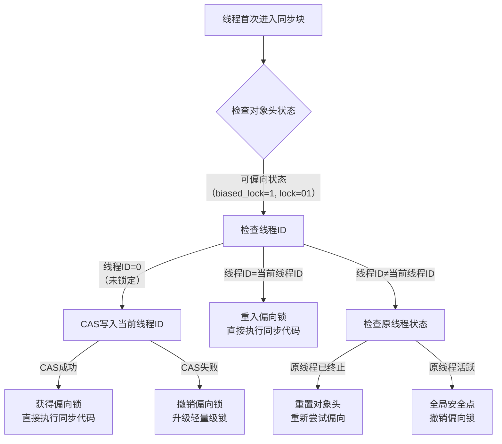
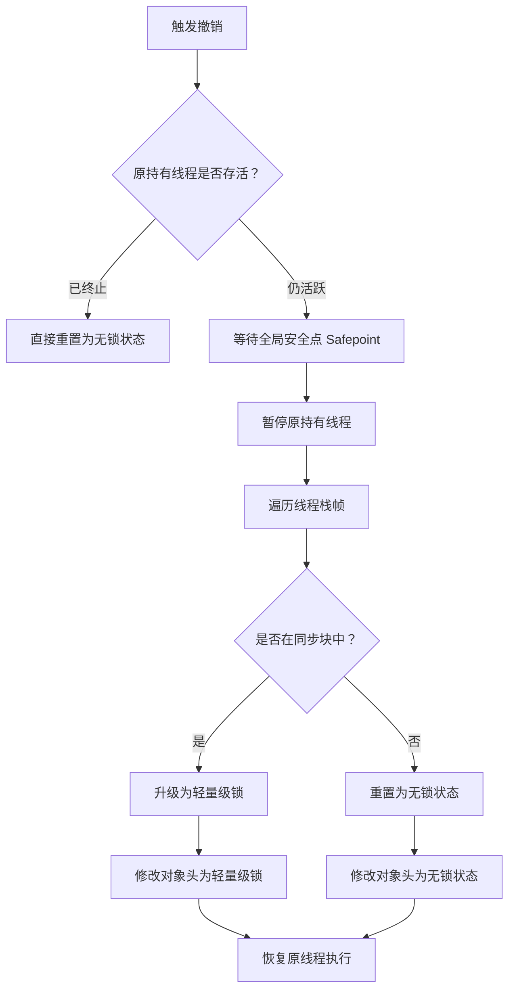
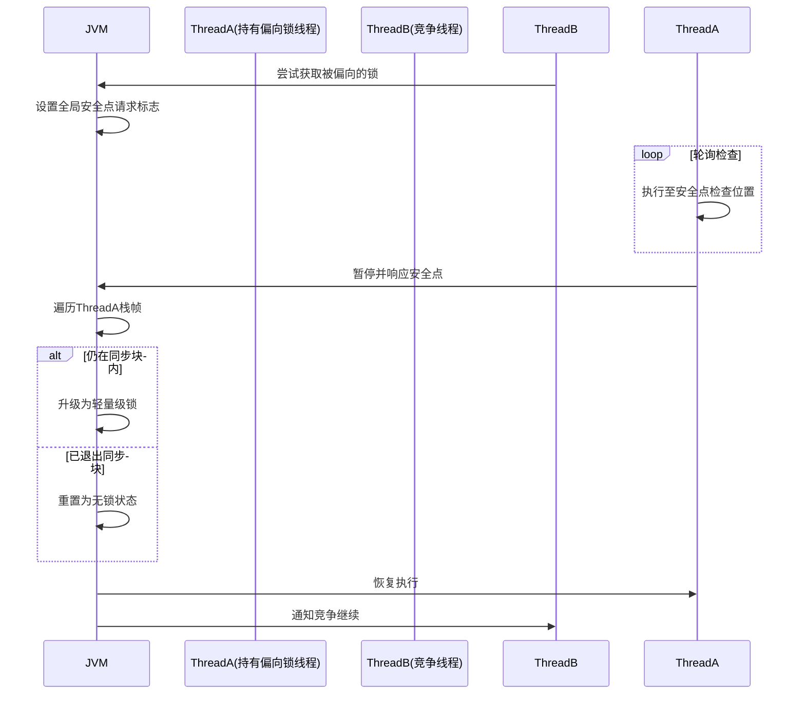

# 并发底层实现原理-synchronized

## 一、synchronized（原⼦性、可见性、有序性）

`synchronized`关键字通过**对象头、锁升级机制和字节码指令**实现线程同步，解决了对共享变量操作的原⼦性、保证了其它线程对共享变量的可见性、有序性，确保了并发情况下的线程安全。 

Java中的锁分为显式锁和隐式锁：

- 隐式锁由`synchronized`关键字实现
- 显式锁是由实现了`Lock`接口和`AQS`框架等类来实现

## 二、对象三种加锁⽅式

1. 对于普通同步⽅法，锁是当前实例对象。
2. 对于静态同步⽅法，锁是当前类的 `Class` 对象。
3. 对于同步⽅法块，锁是 `synchonized` 括号⾥配置的对象。

## 三、Mark Word动态结构(状态机)

**对象头的Mark Word字段存储了与锁相关的关键信息**，是实现锁优化（如偏向锁、轻量级锁、重量级锁）的核心结构。

在运行期间，Mark Word 存储内容会根据锁状态的变化而动态调整 ，**动态结构**（以 64 位 JVM 为例）：


### 1. 无锁状态（Unlocked）

- 锁标志位：`01`
- 偏向锁标志：`0`
- 存储内容：
  - 对象哈希码（31位）：通过`Object.hashCode()`或`System.identityHashCode()`生成的唯一标识（仅在第一次调用时计算并存储）。
  - GC分代年龄（4位）：对象在YGC中存活的次数（最大值为15，超过则进入老年代）。

### 2. 偏向锁（Biased Locking）

- 锁标志位：`01`
- 偏向锁标志：`1`
- 设计目标：减少无竞争场景下的锁开销（假设锁总是被同一线程多次获取）。
- 存储内容：
  - 线程ID（54位）：持有偏向锁的线程ID（通过CAS操作设置）。
  - 时间戳（2位）：偏向锁的epoch值（用于批量重偏向优化）。
  - GC分代年龄（4位）：与无锁状态相同。
- 升级条件：当其它线程尝试竞争偏向锁时，偏向锁会升级为轻量级锁（或直接膨胀为重量级锁，取决于竞争程度）。


### 3. 轻量级锁（Lightweight Locking）

- 锁标志位：`00`
- 设计目标：在无实际竞争（仅存在线程交替执行）的场景下，避免使用重量级锁的内核态开销。
- 存储内容：
  - 锁记录指针（62位）：指向当前线程栈中`Lock Record`的指针。`Lock Record`是线程为锁对象分配的一块内存，用于存储锁对象的Mark Word拷贝（称为`Displaced Mark Word`）。
- 加锁逻辑：
  1. 线程尝试获取锁时，会在自己的栈中创建`Lock Record`，并将Mark Word的拷贝存入其中。
  2. 通过CAS操作将Mark Word的锁标志位改为`00`，并指向`Lock Record`的指针。
  3. 若CAS成功，线程获得轻量级锁；若失败（说明存在竞争），轻量级锁升级为重量级锁。


### 4. 重量级锁（Heavyweight Locking）

- 锁标志位：`10`
- 设计目标：在存在实际竞争的场景下，通过操作系统互斥量（Mutex）实现强互斥。
- 存储内容：
  - `Monitor`指针（62位）：指向堆中`ObjectMonitor`对象的指针。`ObjectMonitor`是HotSpot实现的锁核心结构，包含`_owner`（持有锁的线程）、`_waitSet`（等待线程队列）、`_EntryList`（竞争队列）等字段。
- 加锁逻辑：
  1. 当轻量级锁竞争失败时，锁膨胀为重量级锁，Mark Word指向`ObjectMonitor`。
  2. 竞争线程会被阻塞并进入`_EntryList`队列，释放锁时唤醒队列中的线程重新竞争。


### 5. GC标记（GC Marked）

- 锁标志位：`11`
- 用途：垃圾收集器标记对象即将被回收，此时Mark Word的其它字段无意义。

Mark Word的动态变化本质是HotSpot为了优化锁性能而设计的**状态机**。

通过偏向锁（减少无竞争开销）→轻量级锁（减少短时间竞争的开销）→重量级锁（处理长时间竞争）的逐步升级策略，在保证正确性的同时最大化性能。理解这一过程对分析锁优化、死锁排查及JVM调优有重要意义。

## 四、锁升级过程

Java对象头（Mark Word）会存储锁的关键信息。  

在JDK8中，`synchronized` 锁机制通过 **锁升级（Lock Escalation）** 优化了性能，其核心思想是根据线程竞争的激烈程度，逐步升级锁的状态，避免直接使用高开销的重量级锁。

锁的状态从低到高依次为：**无锁 → 偏向锁 → 轻量级锁 → 重量级锁**，且升级过程是单向不可逆的。

这种锁升级却不能降级的策略，⽬的是为了提⾼获得锁和释放锁的效率。

### 1. 无锁状态（Unlocked）  

对象刚被创建时，未被任何线程访问，Mark Word的锁标志位为 `01`，偏向位为 `0`（表示未开启偏向锁）。  


### 2. 偏向锁（Biased Lock）

**目标**：优化单线程重复访问同步块的场景（大多数情况下，锁总是被同一线程多次获取）。  

**升级条件**：当第一个线程首次进入同步块时，JVM会尝试将对象头的偏向位设为 `1`，并将当前线程ID记录到Mark Word中。  

**执行流程**：  

- 线程第一次进入同步块时，检查Mark Word的偏向线程ID是否为当前线程：  
  - 是：直接进入同步块（无需加锁）。  
  - 否：尝试通过CAS（原子操作）将Mark Word的偏向线程ID替换为当前线程ID：  
    - 成功：获得偏向锁。  
    - 失败：说明存在竞争，偏向锁需要**撤销**，升级为轻量级锁。  

**偏向锁的撤销**：  
当其他线程尝试竞争偏向锁时，持有偏向锁的线程会被暂停，JVM检查该线程是否仍在执行同步块：  

- 若未执行（同步块已退出）：偏向锁被撤销，对象头恢复为无锁状态（偏向位设为0）。  
- 若仍在执行：偏向锁升级为轻量级锁，原线程继续执行，竞争线程进入轻量级锁竞争。  


### 3. 轻量级锁（Lightweight Lock）  

**目标**：在无实际竞争（或短时间竞争）的场景下，避免使用操作系统互斥量（重量级锁），减少用户态与内核态的切换开销。  

**升级条件**：当偏向锁因竞争被撤销后，锁升级为轻量级锁。  

**执行流程**：  

1. **加锁**：  
   线程进入同步块时，在自己的栈帧中创建一个 **锁记录（Lock Record）**，复制对象头的Mark Word到锁记录中（称为“Displaced Mark Word”）。  
   然后通过CAS尝试将对象头的Mark Word替换为指向锁记录的指针：  
   - 成功：当前线程获得轻量级锁（锁标志位变为 `00`）。  
   - 失败：说明有其他线程竞争，尝试**自旋（Spin）** 等待（通过循环空转尝试获取锁）。  

2. **自旋优化**：  
   若自旋次数超过阈值（默认10次，或JVM根据历史自旋成功率动态调整），轻量级锁升级为重量级锁。  

3. **解锁**：  
   线程退出同步块时，通过CAS将锁记录中的Displaced Mark Word替换回对象头：  
   - 成功：释放轻量级锁。  
   - 失败：说明有其他线程在自旋等待，此时需要唤醒被阻塞的线程，锁升级为重量级锁。  


### 4. 重量级锁（Heavyweight Lock）  

**目标**：在激烈竞争场景下，通过操作系统的互斥量（Monitor）保证线程安全。  

**升级条件**：轻量级锁自旋失败或解锁时发现竞争。  

**执行流程**：  

- 对象头的Mark Word会指向一个 **Monitor（监视器）** 对象，Monitor内部包含：  
  - `_owner`：记录当前持有锁的线程。  
  - `_waitSet`：存储调用 `wait()` 方法的线程。  
  - `_entryList`：存储竞争锁失败的线程（阻塞状态）。  

- 线程竞争时，未获得锁的线程会进入 `_entryList` 并被挂起（操作系统层面的阻塞，需从用户态切换到内核态）。  
- 持有锁的线程释放锁时，会唤醒 `_entryList` 中的线程重新竞争。  


### 锁升级总结

| 锁状态   | 适用场景               | 核心机制                  | 性能开销                |
| -------- | ---------------------- | ------------------------- | ----------------------- |
| 无锁     | 无线程访问同步块       | 无锁标志                  | 最低（无开销）          |
| 偏向锁   | 单线程重复访问同步块   | 记录偏向线程ID            | 低（仅首次CAS）         |
| 轻量级锁 | 无实际竞争或短时间竞争 | 自旋+CAS                  | 中（自旋消耗CPU）       |
| 重量级锁 | 激烈竞争               | 操作系统互斥量（Monitor） | 高（用户态→内核态切换） |

**关键结论**：  
` synchronized` 的锁升级机制通过“逐步升级”策略，在不同竞争程度下选择最优的锁状态，平衡了单线程效率与多线程竞争的性能，是JDK6之后 `synchronized` 性能大幅提升的核心优化。

## 五、⽆锁

- 根据最后3位标识位来判断，⽆锁是`001`，偏向标志为0，锁标志为01。
- `001`状态是⽆锁不可偏，⽆锁不可偏状态下遇到同步，会直接升级为轻量级锁，⽽不会变为偏向锁。
- `101`状态是⽆锁可偏，只有在⽆锁可偏的状态下，才可能变成偏向锁。
- ⽆锁可偏（匿名偏向）状态下虽然标识码是`101`，但是线程ID部分全为0，意味着没有线程实际获得偏向锁。

### ⽆锁可偏和⽆锁不可偏区分？

- 因为所有偏向锁的起点就是⽆锁可偏，只有在⽆锁可偏的状态下，才可能变成偏向锁。
- ⽆锁不可偏状态会直接变为轻量级锁。

### JVM为什么延迟启⽤偏向锁？

JDK8默认启动了偏向锁，偏向锁在JVM启动4秒(默认4秒)后启动，此时能设置为匿名偏向的会全部设置为匿名偏向，匿名偏向是偏向锁的起点。

JVM库类会使⽤`synchronized`，存在多线程竞争情况，如果开始就采⽤锁升级策略，撤销偏向锁会浪费很多时间。

- 若刚开始就设置为⽆锁可偏，存在线程竞争，偏向锁会撤销，然后升级，浪费资源。

- 所以JVM索性先不开启偏向锁，先执⾏这些库类，等过⼏秒再开启偏向锁。
- ⾄于JDK8为啥默认4秒，这是个经验值，4秒⼤多数类都启动完了，此数值可以修改。

### 对象创建是无锁还是偏向锁？

当一个对象创建的时候要看该对象创建的时候**是否已经启动了偏向锁**。
- 如果**没有启动，则对象锁状态为无锁状态。
- 如果**启用**了偏向锁，则对象锁状态为偏向锁状态。

## 六、偏向锁

在 JDK 8 的 `synchronized` 锁机制中，**偏向锁（Biased Locking）** 是一项重要的优化技术，旨在减少无竞争场景下的同步开销。

---

### 1. 偏向锁的设计目标
- **核心思想**：当锁始终被同一线程重复获取时，避免执行 CAS 等原子操作。
- **适用场景**：单线程重复访问同步块的场景（无实际竞争）。
- **优势**：消除无竞争下的同步开销，提升性能。

---

### 2.偏向锁的底层实现
#### 1). 对象头（Mark Word）结构
对象头中的 Mark Word 存储锁状态信息（以 64 位 JVM 为例）：
```plaintext
|-------------------------------------------------------|--------------------|
|                  Mark Word (64 bits)                  |       State        |
|-------------------------------------------------------|--------------------|
| unused:25 | identity_hashcode:31 | unused:1 | age:4 | biased_lock:0 | 01 | Normal（无锁）
| thread:54 |       epoch:2        | unused:1 | age:4 | biased_lock:1 | 01 | Biased（偏向锁）
```
- **偏向锁标志**：`biased_lock=1` 且锁标志位 `01`。
- **关键字段**：
  - `thread`：持有偏向锁的线程 ID。
  - `epoch`：偏向锁的时间戳（用于批量重偏向）。
  - `age`：对象分代年龄。

---

#### 2). 偏向锁的获取流程
1. **首次加锁**：
   - 检查对象头是否为**可偏向状态**（偏向模式开启且未锁定）。
   - 通过 **CAS 操作** 将当前线程 ID 写入 Mark Word。
   - 若 CAS 成功，线程获得偏向锁，直接进入同步代码块。
   - **无需全局锁或系统调用**，开销极低。

2. **同一线程重入**：
   - 检查 Mark Word 中的线程 ID 与当前线程一致。
   - **直接执行同步代码**，无任何额外操作。

---

#### 3). 偏向锁的撤销（Revocation）
当其他线程尝试获取锁时，触发撤销流程：
1. **检查持有线程状态**：
   - 若原持有线程**已退出同步块**，则重置对象头为无锁状态。
   - 若原持有线程**仍活跃**，JVM 等待全局安全点（Safepoint）。
2. **升级为轻量级锁**：
   - 暂停持有偏向锁的线程。
   - 将对象头替换为指向**锁记录（Lock Record）的指针**（轻量级锁状态）。
   - 恢复线程，竞争线程通过**自旋**尝试获取轻量级锁。
3. **开销**：撤销操作涉及 STW（Stop-The-World），成本较高。

注意以下情况也会触发撤销

1. **调用对象的 `hashCode()` 方法**、
2. **调用 `wait()/notify()/notifyAll()`**
3. **超过批量撤销阈值**

#### 4). 批量重偏向与批量撤销

- **批量重偏向（Bulk Rebiasing）**：
  - 当同一类的**多个对象被不同线程交替访问**（未发生竞争，例如线程 A 先获取，之后线程 B 频繁获取），JVM 会将偏向锁重偏向到新线程。
  - 触发条件：针对**同一类**的多个对象，在一个时间窗口（默认 20 秒）内，该类的对象被重偏向的次数超过阈值（默认 20 次）。
  - 目的：优化 “多线程交替获取同一类对象” 的场景，减少逐个撤销的开销。
- **批量撤销（Bulk Revocation）**：
  - 触发条件：当类的偏向锁撤销总次数超过阈值（默认 `40`），JVM 禁用该类的偏向锁。
  - 后续新对象直接进入轻量级锁状态。
  - 目的：当偏向锁无法稳定生效时（大量竞争），禁用该类对象的偏向锁，避免无效开销。

#### 5). 偏向锁获取流程详解



##### **步骤1：首次获取偏向锁**

1. **检查对象头**  
   线程首次进入 `synchronized` 块时，检查对象头：

   - 确认 `biased_lock=1` 且 `lock=01`（可偏向状态）
   - 确认 `thread` 字段为 0（未偏向任何线程）

2. **CAS 写入线程 ID**  

   ```java
   // 伪代码：CAS操作实现
   if (compareAndSwapMarkWord(
        objectHeader, 
        expected: [unused|hash|unused|age|1|01],  // 期望值
        new: [currentThreadID | epoch | age | 1 | 01] // 新值
   )) {
        // CAS成功
   } else {
        // CAS失败
   }
   ```

   - **成功**：当前线程ID写入对象头，线程获得偏向锁，直接执行同步代码
   - **失败**：说明其他线程竞争，触发**偏向锁撤销**

3. **执行同步代码**  

   - 无任何原子操作或系统调用
   - 仅通过对象头线程ID验证所有权

##### **步骤2：同一线程重入**

1. **检查对象头**  
   线程再次进入同步块时：
   - 验证 `thread` 字段 == 当前线程ID
   - 确认 `biased_lock=1` 且 `lock=01`

2. **直接执行**  
   - 无CAS操作
   - 无锁记录创建
   - 直接进入同步代码块

##### **步骤3：竞争场景处理**

1. **其他线程尝试获取**  

   - 当线程B检测到对象头 `thread` ≠ 自身ID，并且CAS替换失败时：

     ```java
     if (markWord.threadID != currentThread.id) {
         // 触发撤销流程
         revokeBiasedLock(object);
     }
     ```

2. **撤销决策树**



3. **安全点与偏向锁撤销的协同**



---

### 3. 偏向锁的配置参数

| **JVM 参数**                    | **作用**                               | **默认值**     |
| ------------------------------- | -------------------------------------- | -------------- |
| `-XX:+UseBiasedLocking`         | 启用偏向锁                             | JDK 8 默认开启 |
| `-XX:BiasedLockingStartupDelay` | 应用启动后偏向锁的延迟生效时间（毫秒） | 4000（4秒）    |
| `-XX:-UseBiasedLocking`         | 关闭偏向锁                             | -              |

> **注**：偏向锁在 JDK 15+ 中已被废弃（JEP 374），但 JDK 8 仍广泛使用。

---

### 4. 撤销操作的性能影响
#### 1). 开销来源

- **STW 暂停**：安全点暂停所有线程（通常 10ms 级）
- **栈帧扫描**：遍历线程栈查找 Lock Record
- **锁升级**：从偏向锁到轻量级锁的状态转换

#### 2). 优化措施

| **JVM 参数**                           | **作用**                   | **默认值** |
| :------------------------------------- | :------------------------- | :--------- |
| `-XX:BiasedLockingBulkRebiasThreshold` | 批量重偏向阈值             | 20         |
| `-XX:BiasedLockingBulkRevokeThreshold` | 批量撤销阈值               | 40         |
| `-XX:BiasedLockingDecayTime`           | 批量撤销后的冷却时间（ms） | 25000      |

#### 3). 生产建议

- **高竞争环境**：关闭偏向锁（`-XX:-UseBiasedLocking`）
- **监控工具**：
  - `jstack`：查看线程锁状态
  - JFR（Java Flight Recorder）：分析 `biasedLockRevocation` 事件

---

### 5. 适用场景与注意事项
- **适用**：明确单线程重复访问的场景（如局部同步块）。
- **不适用**：
  - 高竞争环境（频繁撤销导致性能下降）。
  - 线程池场景（多线程交替执行易触发批量撤销）。
- **生产建议**：监控 `jstack` 或 JFR 中的锁竞争情况，高竞争时关闭偏向锁。

---

### 6. 示例代码分析

#### 示例1：偏向锁

```java
public class BiasedLockExample {
    private static final Object lock = new Object();

    public static void main(String[] args) {
        // 偏向锁生效（单线程重复获取）
        for (int i = 0; i < 10; i++) {
            synchronized (lock) {
                System.out.println("Enter sync block, i=" + i);
            }
        }
    }
}
```
**对象头变化**：

1. 首次进入：Mark Word 写入线程 ID（偏向锁）。
2. 后续进入：检查线程 ID 一致，直接执行。


#### 示例2：批量重偏向

**场景描述**

- 线程A创建100个`TestObject`实例，并逐个获取它们的锁（此时这些对象的偏向锁指向线程A）。
- 线程B随后尝试获取这100个对象的锁（无竞争，但线程不同）。
- 当线程B获取前20个对象的锁时，JVM会逐个撤销并重偏向（指向线程B）；当获取到第21个对象时，触发**批量重偏向**，剩余对象直接重置偏向锁，无需逐个处理。

```java

public class BiasedLockExample {
    static class TestObject {
    }

    public static List<TestObject> list = new ArrayList<>();

    public static void biasedLockExample() throws InterruptedException {

        // 步骤1：线程A创建对象并加锁（偏向线程A）
        Thread threadA = new Thread(() -> {
            for (int i = 0; i < 100; i++) {
                TestObject obj = new TestObject();
                synchronized (obj) {
                    list.add(obj);
                }
            }
        });
        threadA.start();
        threadA.join(); // 等待线程A完成

        // 步骤2：线程B尝试获取前20个对象的锁（触发逐个重偏向）
        Thread threadB = new Thread(() -> {
            for (int i = 0; i < 20; i++) {
                TestObject obj = list.get(i);
                synchronized (obj) {
                    // 此时对象的偏向锁会从A重偏向到B（前20次逐个处理）
                }
            }
            // 步骤3：线程B继续获取第21~100个对象的锁（触发批量重偏向）
            for (int i = 20; i < 100; i++) {
                TestObject obj = list.get(i);
                synchronized (obj) {
                    // 第21次开始，JVM批量重偏向，无需逐个撤销
                }
            }
        });
        threadB.start();
        threadB.join();
    }

    public static void main(String[] args) throws InterruptedException {
        biasedLockExample();
    }
}
```

**现象说明**

- **前20次加锁（线程B获取0~19号对象）**：每个对象的偏向锁会逐个撤销（指向线程A）并重新偏向线程B。此时JVM统计到该类（`TestObject`）的重偏向次数达到阈值（默认20次）。
- **第21次及之后（线程B获取20~99号对象）**：触发批量重偏向。JVM直接将`TestObject`类所有未被竞争的对象（20~99号）的偏向锁标记为“可重偏向”，线程B获取这些对象时无需CAS操作，直接修改偏向线程ID为B，效率更高。


#### 示例3：批量撤销

**场景描述**

- 在示例1的基础上，线程C、D、E等更多线程开始竞争`TestObject`的锁。
- 当`TestObject`类的重偏向次数超过更高阈值（默认40次），JVM认为该类的对象无法稳定保持偏向锁，触发批量撤销。

```java
// 延续示例1的代码，添加线程C、D竞争锁
public class BiasedLockRevokeExample extends BiasedLockExample {
    public static void main(String[] args) throws InterruptedException {
        // 步骤4：执行示例1的逻辑
        BiasedLockExample.biasedLockExample();

        // 步骤5：线程C、D等更多线程竞争锁（触发批量撤销）
        Thread threadC = new Thread(() -> {
            for (int i = 0; i < 50; i++) {
                TestObject obj = BiasedLockExample.list.get(i);
                synchronized (obj) {
                } // 竞争锁
            }
        });
        Thread threadD = new Thread(() -> {
            for (int i = 50; i < 100; i++) {
                TestObject obj = BiasedLockExample.list.get(i);
                synchronized (obj) {
                } // 竞争锁
            }
        });
        threadC.start();
        threadD.start();
        threadC.join();
        threadD.join();
    }
}
```

**现象说明**

- **批量重偏向后续竞争**：线程C、D加入后，`TestObject`类的对象被不同线程频繁获取，导致重偏向次数超过40次（默认阈值）。
- **批量撤销触发**：JVM会批量撤销该类所有对象的偏向锁（升级为轻量级锁或重量级锁），且后续新创建的`TestObject`对象不再启用偏向锁（直接使用轻量级锁）。
- **最终结果**：偏向锁机制对该类失效，避免了因频繁撤销带来的性能损耗。

---

### 7.总结
偏向锁通过消除单线程场景下的同步开销，优化了 `synchronized` 的性能。但其撤销成本较高，需结合场景合理使用。理解对象头结构、升级路径及 JVM 参数配置，有助于在高并发系统中进行有效的锁优化。

## 九、synchronized 同步实现机制

`synchronized`的同步实现细节基于 **对象监视器（Monitor）** 和 **字节码指令** `monitorenter` 和 `monitorexit`。

**字节码指令**由编译器自动插入到同步块的开始和结束位置。

### 同步代码块

对于同步代码块，编译器会在进入同步块时插入 `monitorenter` 指令，在退出同步块时（包括正常退出和异常退出）插入 `monitorexit` 指令（可能有多个 `monitorexit` 处理不同异常场景）。  

```java
public void syncMethod() {
    synchronized (obj) { // 同步块开始
        // 临界区代码
      	System.out.println("Hello");
    } // 同步块结束
}
```

对应的字节码指令如下：

```java
0: aload_0         // 加载this对象
1: dup             // 复制引用
2: astore_1        // 保存到局部变量表
3: monitorenter    // 进入同步块（开始尝试获取对象锁）
4: getstatic       #2 // Field java/lang/System.out:Ljava/io/PrintStream;
7: ldc             #3 // String Hello
9: invokevirtual   #4 // Method java/io/PrintStream.println:(Ljava/lang/String;)V
12: aload_1        // 加载保存的对象引用
13: monitorexit    // 正常退出同步块（释放锁）
14: goto          22
17: astore_2       // 异常处理
18: aload_1        // 加载对象引用
19: monitorexit    // 异常退出同步块（释放锁）
20: aload_2
21: athrow
22: return
```

### 同步方法

```java
public synchronized void syncMethod() {
    // 临界区代码
}
```

对应的字节码中，方法会标记为`ACC_SYNCHRONIZED`：

```java
flags: ACC_PUBLIC, ACC_SYNCHRONIZED
```

对于同步方法，编译器不会显式插入 `monitorenter` 和 `monitorexit`，而是通过方法表的 `ACC_SYNCHRONIZED` 标志位隐式实现。当方法被调用时，JVM会检查该标志位：  

- 若标志位为 `true`，则先执行 `monitorenter`（获取方法对应的Monitor），方法执行完成后自动执行 `monitorexit`（释放Monitor）。  

## 十、Monitor的底层结构

在Java的 `synchronized` 锁机制中，**Monitor（监视器/管程）** 是实现线程互斥与协作的核心底层结构。

每个Java对象都与一个Monitor（监视器锁）关联，它由JVM（如HotSpot）通过C++实现，负责管理线程对共享资源的访问、阻塞与唤醒。

以下从**数据结构**、**关键字段**、**工作流程**三个维度详细解析Monitor的底层结构。

### 1. Monitor的底层数据结构（以HotSpot为例）

```c++
ObjectMonitor {
    _owner: 指向当前持有锁的线程（JavaThread*）
    _recursions: 重入次数（int）
    _count: 锁占用次数（int）
    _entryList: 竞争锁失败的线程队列（BLOCKED状态）
    _waitSet: 调用wait()后的线程队列（WAITING状态）
    _cxq: 优化竞争的单向链表（新竞争线程先入此队列）
    ...
}
```

在HotSpot JVM中，Monitor的核心实现是 `ObjectMonitor` 类（位于 `hotspot/src/share/vm/runtime/objectMonitor.hpp`）。

其关键字段及作用如下：  


#### 1). 线程所有权与重入计数  

- `_owner`：`void*` 类型，指向当前持有Monitor的线程（Java线程的底层 `JavaThread` 对象）。若为 `null`，表示Monitor未被任何线程持有。  
- `_recursions`：`int` 类型，记录当前线程对Monitor的**重入次数**（解决 `synchronized` 的可重入性）。例如，同一线程多次进入同步块时，`_recursions` 递增，退出时递减，直到为0才释放Monitor。  


#### 2). 线程等待队列  

- `_entryList`：双向链表，存储**竞争锁失败的线程**（状态为 `BLOCKED`）。这些线程在Monitor的入口处等待，故称为“入口集”。  
- `_waitSet`：双向链表，存储调用 `wait()` 方法后释放锁并等待唤醒的线程（状态为 `WAITING` 或 `TIMED_WAITING`）。这些线程需通过 `notify()` 或 `notifyAll()` 唤醒后，重新进入 `_entryList` 竞争锁。  


#### 3). 锁竞争与线程调度  

- `_count`：`int` 类型，记录当前持有Monitor的线程对锁的“占用次数”（与 `_recursions` 配合实现重入）。  
- `_cxq`（Contention Queue）：单向链表，用于**优化线程竞争**。新竞争锁失败的线程会先进入 `_cxq`，后续由JVM调度迁移到 `_entryList`，减少对 `_entryList` 的频繁修改（CAS操作更高效）。  


#### 4). 其他辅助字段  

- `_Responsible`：指向可能唤醒其他线程的“责任线程”（用于优化调度）。  
- `_SpinDuration`：`int` 类型，记录线程自旋等待的时间（轻量级锁升级为重量级锁时的自旋阈值）。  


### 2. Monitor与Java对象的绑定关系

在Java中，每个对象（`Object`）默认关联一个Monitor实例（通过对象头的Mark Word指向Monitor）。具体绑定逻辑如下：  


#### 1). 对象头的Mark Word指向Monitor  

当锁升级为**重量级锁**时，对象头的Mark Word会存储指向Monitor实例的指针（`_ptr_to_monitor`）。此时，对该对象的 `synchronized` 操作会直接关联到对应的Monitor。  


#### 2). Monitor的唯一性  

每个对象的Monitor是**唯一的**（通过对象内存地址标识），因此多个线程对同一对象的 `synchronized` 块访问会竞争同一个Monitor。若同步的是类（`synchronized(Class)`），则关联的是类的Class对象的Monitor。  


### 3. Monitor的工作流程（线程竞争与协作）

Monitor的核心职责是管理线程的**互斥访问**和**协作唤醒**，其工作流程可分为以下阶段：  


#### 1.) 线程获取锁（monitorenter）  

当线程执行 `monitorenter` 指令时，会尝试获取对象关联的Monitor：  

1. **检查 `_owner`**：若 `_owner` 为 `null`（Monitor未被持有），则通过CAS将 `_owner` 设为当前线程，`_recursions` 设为1，获取锁成功。  
2. **可重入处理**：若 `_owner` 是当前线程（重入），则 `_recursions` 递增，无需重新竞争。  
3. **竞争失败**：若 `_owner` 是其他线程，当前线程进入**竞争队列**（先进入 `_cxq`，再迁移到 `_entryList`），状态变为 `BLOCKED`，并被操作系统挂起（用户态→内核态切换）。  


#### 2). 线程释放锁（monitorexit）  

当线程执行 `monitorexit` 指令时，释放Monitor：  

1. **重入递减**：`_recursions` 递减。若 `_recursions > 0`，仅减少计数，不释放锁。  
2. **完全释放**：若 `_recursions == 0`，将 `_owner` 设为 `null`，`_count` 设为0。  
3. **唤醒线程**：从 `_entryList` 或 `_cxq` 中唤醒一个线程（由JVM调度策略决定，如公平锁/非公平锁），被唤醒的线程重新竞争Monitor。  


#### 3). 线程等待（wait()）  

当线程在同步块中调用 `wait()` 时：  

1. **释放锁**：将 `_owner` 设为 `null`，`_recursions` 设为0，并将当前线程加入 `_waitSet`。  
2. **线程挂起**：线程状态变为 `WAITING`，被操作系统挂起。  
3. **唤醒等待**：其他线程调用 `notify()` 或 `notifyAll()` 时，会将 `_waitSet` 中的线程迁移到 `_entryList`，等待重新竞争锁。  


### 4. Monitor设计目标

Monitor的底层结构设计围绕以下核心目标优化：  

- **互斥性**：通过 `_owner` 字段确保同一时间仅一个线程持有锁。  
- **可重入性**：通过 `_recursions` 支持同一线程多次获取同一锁。  
- **高效调度**：通过 `_cxq` 和 `_entryList` 分离竞争线程的快速入队与调度，减少对共享队列的频繁修改。  
- **协作支持**：通过 `_waitSet` 实现线程间的等待-通知（`wait/notify`）机制。  

**核心结论**：  
Monitor是JVM实现 `synchronized` 的底层基石，通过 `_owner`、`_entryList`、`_waitSet` 等字段管理线程的互斥与协作。

理解其底层结构，能深入掌握 `synchronized` 锁升级（尤其是重量级锁阶段）的核心逻辑，以及多线程竞争、`wait/notify` 等操作的底层实现原理。

## 十一、字节码和Monitor的操作时机

锁升级的核心是**根据竞争程度动态调整锁的状态**（偏向→轻量级→重量级），而 `monitorenter` 和 `monitorexit` 的执行逻辑会随着锁状态的变化而变化：  


### 1. 偏向锁阶段（无竞争或单线程重复获取，无Monitor操作）  

**触发条件**：第一个线程首次进入同步块，且无其他线程竞争。  


**monitorenter的执行逻辑**：  

- 检查对象头的Mark Word中是否记录了当前线程ID（偏向位为1）：  
  - 是：直接进入同步块（无需实际操作Monitor，仅通过Mark Word的偏向线程ID快速验证）。  
  - 否：通过CAS尝试将Mark Word的偏向线程ID替换为当前线程ID：  
    - 成功：获得偏向锁（仍不涉及Monitor的实际操作）。  
    - 失败：偏向锁撤销，升级为轻量级锁，此时 `monitorenter` 开始触发轻量级锁逻辑。  


**monitorexit的执行逻辑**：  

- 偏向锁的释放无需操作Monitor（因为未实际获取Monitor），仅保留Mark Word中的偏向线程ID（以便同一线程下次快速进入）。  


### 2. 轻量级锁阶段（短时间或无实际竞争）  

**触发条件**：偏向锁因竞争被撤销（如第二个线程尝试获取同一锁）。  


**monitorenter的执行逻辑**：  

- 线程在自己的栈帧中创建 **锁记录（Lock Record）**，复制对象头的Mark Word到锁记录（Displaced Mark Word）。  
- 通过CAS尝试将对象头的Mark Word替换为指向锁记录的指针：  
  - 成功：获得轻量级锁（`monitorenter` 完成，无需操作Monitor）。  
  - 失败：说明存在竞争，线程进入**自旋等待**（循环尝试CAS）；若自旋次数超过阈值（默认10次），轻量级锁升级为重量级锁，此时 `monitorenter` 会真正操作Monitor（设置Monitor的 `_owner` 为当前线程，其他线程进入 `_entryList` 阻塞）。  


**monitorexit的执行逻辑**：  

- 通过CAS将锁记录中的Displaced Mark Word替换回对象头：  
  - 成功：释放轻量级锁（无Monitor操作）。  
  - 失败：说明有其他线程在自旋等待，此时需要唤醒被阻塞的线程，锁升级为重量级锁，`monitorexit` 会释放Monitor（设置 `_owner` 为 `null`，唤醒 `_entryList` 中的线程）。  


### 3. 重量级锁阶段（激烈竞争）  

**触发条件**：轻量级锁自旋失败或竞争持续加剧。  


**monitorenter的执行逻辑**：  

- 直接操作Monitor对象：  
  - 检查Monitor的 `_owner` 字段：  
    - 若 `_owner` 是当前线程（可重入）：`_recursions`（重入次数）递增，直接进入同步块。  
    - 若 `_owner` 是其他线程：当前线程进入Monitor的 `_entryList` 队列，状态变为 `BLOCKED`（被操作系统挂起，需内核态调度唤醒）。  


**monitorexit的执行逻辑**：  

- 减少Monitor的 `_recursions`（重入次数）：  
  - 若 `_recursions > 0`：仅减少计数，不释放锁。  
  - 若 `_recursions == 0`：将 `_owner` 设为 `null`，并唤醒 `_entryList` 中的一个线程（由JVM调度策略决定），被唤醒的线程重新竞争Monitor。  


### 4.关键总结

| 锁状态   | monitorenter核心行为                       | monitorexit核心行为                       | 是否操作Monitor对象 |
| -------- | ------------------------------------------ | ----------------------------------------- | ------------------- |
| 偏向锁   | 验证偏向线程ID（CAS替换偏向ID）            | 无Monitor操作（保留偏向线程ID）           | 否                  |
| 轻量级锁 | CAS替换Mark Word（指向栈中锁记录）         | CAS恢复Mark Word（竞争时触发Monitor操作） | 否（仅升级时操作）  |
| 重量级锁 | 检查Monitor的 `_owner`，竞争失败则入队阻塞 | 释放Monitor（唤醒 `_entryList` 中的线程） | 是                  |


### 5.核心结论

`monitorenter` 和 `monitorexit` 是字节码层面的“同步入口”和“同步出口”，但JVM通过锁升级机制优化了它们的执行逻辑：  

- **偏向锁和轻量级锁**阶段尽量避免操作Monitor（减少内核态切换开销）；  
- **重量级锁**阶段才真正依赖Monitor的互斥机制（通过 `_owner`、`_entryList` 管理线程竞争）。  

这一设计使得 `synchronized` 在不同竞争场景下均能保持高效，是JDK6之后性能提升的关键优化。