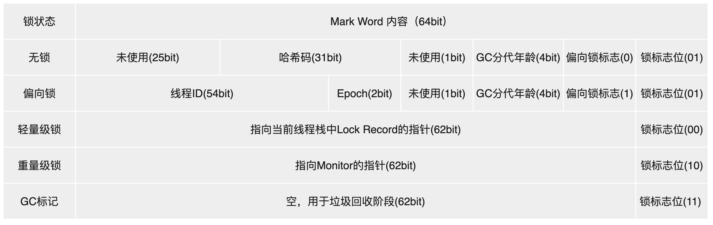

# 并发底层实现原理-synchronized

## 一、synchronized（原⼦性、可见性、有序性）

`synchronized`关键字通过**对象头、锁升级机制和字节码指令**实现线程同步，解决了对共享变量操作的原⼦性、保证了其它线程对共享变量的可见性、有序性，确保了并发情况下的线程安全。 

Java中的锁分为显式锁和隐式锁：

- 隐式锁由`synchronized`关键字实现
- 显式锁是由实现了`Lock`接口和`AQS`框架等类来实现

## 二、对象三种加锁⽅式

1. 对于普通同步⽅法，锁是当前实例对象。
2. 对于静态同步⽅法，锁是当前类的 `Class` 对象。
3. 对于同步⽅法块，锁是 `synchonized` 括号⾥配置的对象。

## 三、Mark Word动态结构(状态机)

**对象头的Mark Word字段存储了与锁相关的关键信息**，是实现锁优化（如偏向锁、轻量级锁、重量级锁）的核心结构。

在运行期间，Mark Word 存储内容会根据锁状态的变化而动态调整 ，**动态结构**（以 64 位 JVM 为例）：



### 1. 无锁状态（Unlocked）

- 锁标志位：`01`
- 偏向锁标志：`0`
- 存储内容：
  - 对象哈希码（31位）：通过`Object.hashCode()`或`System.identityHashCode()`生成的唯一标识（仅在第一次调用时计算并存储）。
  - GC分代年龄（4位）：对象在YGC中存活的次数（最大值为15，超过则进入老年代）。

### 2. 偏向锁（Biased Locking）

- 锁标志位：`01`
- 偏向锁标志：`1`
- 设计目标：减少无竞争场景下的锁开销（假设锁总是被同一线程多次获取）。
- 存储内容：
  - 线程ID（54位）：持有偏向锁的线程ID（通过CAS操作设置）。
  - 时间戳（2位）：偏向锁的epoch值（用于批量重偏向优化）。
  - GC分代年龄（4位）：与无锁状态相同。
- 升级条件：当其它线程尝试竞争偏向锁时，偏向锁会升级为轻量级锁（或直接膨胀为重量级锁，取决于竞争程度）。


### 3. 轻量级锁（Lightweight Locking）

- 锁标志位：`00`
- 设计目标：在无实际竞争（仅存在线程交替执行）的场景下，避免使用重量级锁的内核态开销。
- 存储内容：
  - 锁记录指针（62位）：指向当前线程栈中`Lock Record`的指针。
  - `Lock Record`是线程为锁对象分配的一块内存，用于存储锁对象的Mark Word拷贝（称为`Displaced Mark Word`）。
- 加锁逻辑：
  1. 线程尝试获取锁时，会在自己的栈中创建`Lock Record`，并将Mark Word的拷贝存入其中。
  2. 通过CAS操作将Mark Word的锁标志位改为`00`，并指向`Lock Record`的指针。
  3. 若CAS成功，线程获得轻量级锁；若失败（说明存在竞争），轻量级锁升级为重量级锁。


### 4. 重量级锁（Heavyweight Locking）

- 锁标志位：`10`
- 设计目标：在存在实际竞争的场景下，通过操作系统互斥量（Mutex）实现强互斥。
- 存储内容：
  - `Monitor`指针（62位）：指向堆中`ObjectMonitor`对象的指针。
  - `ObjectMonitor`是HotSpot实现的锁核心结构，包含`_owner`（持有锁的线程）、`_waitSet`（等待线程队列）、`_EntryList`（竞争队列）等字段。
- 加锁逻辑：
  1. 当轻量级锁竞争失败时，锁膨胀为重量级锁，Mark Word指向`ObjectMonitor`。
  2. 竞争线程会被阻塞并进入`_EntryList`队列，释放锁时唤醒队列中的线程重新竞争。


### 5. GC标记（GC Marked）

- 锁标志位：`11`
- 用途：垃圾收集器标记对象即将被回收，此时Mark Word的其它字段无意义。

Mark Word的动态变化本质是HotSpot为了优化锁性能而设计的**状态机**。

通过偏向锁（减少无竞争开销）→轻量级锁（减少短时间竞争的开销）→重量级锁（处理长时间竞争）的逐步升级策略，在保证正确性的同时最大化性能。理解这一过程对分析锁优化、死锁排查及JVM调优有重要意义。

## 四、锁升级过程

Java对象头（Mark Word）会存储锁的关键信息。  

在JDK8中，`synchronized` 锁机制通过 **锁升级（Lock Escalation）** 优化了性能，其核心思想是根据线程竞争的激烈程度，逐步升级锁的状态，避免直接使用高开销的重量级锁。

锁的状态从低到高依次为：**无锁 → 偏向锁 → 轻量级锁 → 重量级锁**，且升级过程是单向不可逆的。

这种锁升级却不能降级的策略，⽬的是为了提⾼获得锁和释放锁的效率。

### 1. 无锁状态（Unlocked）  

对象刚被创建时，未被任何线程访问，Mark Word的锁标志位为 `01`，偏向位为 `0`（表示未开启偏向锁）。  


### 2. 偏向锁（Biased Lock）

**目标**：优化单线程重复访问同步块的场景（大多数情况下，锁总是被同一线程多次获取）。  

- 消除无竞争场景下的同步开销。

**升级条件**：当第一个线程首次进入同步块时，JVM会尝试将对象头的偏向位设为 `1`，并将当前线程ID记录到Mark Word中。  

**执行流程**：  

- 线程第一次进入同步块时，检查Mark Word的偏向线程ID是否为当前线程：  
  - 是：直接进入同步块（无需加锁）。  
  - 否：尝试通过CAS（原子操作）将Mark Word的偏向线程ID替换为当前线程ID：  
    - 成功：获得偏向锁。  
    - 失败：说明存在竞争，偏向锁需要**撤销**，升级为轻量级锁。  

**偏向锁的撤销**：  
当其他线程尝试竞争偏向锁时，持有偏向锁的线程会被暂停，JVM检查该线程是否仍在执行同步块：  

- 若未执行（同步块已退出）：偏向锁被撤销，对象头恢复为无锁状态（偏向位设为0）。  
- 若仍在执行：偏向锁升级为轻量级锁，原线程继续执行，竞争线程进入轻量级锁竞争。  


### 3. 轻量级锁（Lightweight Lock）  

**目标**：在无实际竞争（或短时间竞争）的场景下，避免使用操作系统互斥量（重量级锁），减少用户态与内核态的切换开销。  

- 减少无实际竞争时的锁开销。

**升级条件**：当偏向锁因竞争被撤销后，锁升级为轻量级锁。  

**执行流程**：  

1. **加锁**：  
   线程进入同步块时，在自己的栈帧中创建一个 **锁记录（Lock Record）**，复制对象头的Mark Word到锁记录中（称为“Displaced Mark Word”）。  
   然后通过CAS尝试将对象头的Mark Word替换为指向锁记录的指针：  
   - 成功：当前线程获得轻量级锁（锁标志位变为 `00`）。  
   - 失败：说明有其他线程竞争，尝试**自旋（Spin）** 等待（通过循环空转尝试获取锁）。  

2. **自旋优化**：  
   若自旋次数超过阈值（默认10次，或JVM根据历史自旋成功率动态调整），轻量级锁升级为重量级锁。  

3. **解锁**：  
   线程退出同步块时，通过CAS将锁记录中的Displaced Mark Word替换回对象头：  
   - 成功：释放轻量级锁。  
   - 失败：说明有其他线程在自旋等待，此时需要唤醒被阻塞的线程，锁升级为重量级锁。  


### 4. 重量级锁（Heavyweight Lock）  

**目标**：在激烈竞争场景下，通过操作系统的互斥量（Monitor）保证线程安全。  

- 解决高竞争场景下的线程同步。

**升级条件**：轻量级锁自旋失败或解锁时发现竞争。  

**执行流程**：  

- 对象头的Mark Word会指向一个 **Monitor（监视器）** 对象，Monitor内部包含：  
  - `_owner`：记录当前持有锁的线程。  
  - `_waitSet`：存储调用 `wait()` 方法的线程。  
  - `_entryList`：存储竞争锁失败的线程（阻塞状态）。  

- 线程竞争时，未获得锁的线程会进入 `_entryList` 并被挂起（操作系统层面的阻塞，需从用户态切换到内核态）。  
- 持有锁的线程释放锁时，会唤醒 `_entryList` 中的线程重新竞争。  
- 涉及用户态到内核态的切换（性能开销大）。

### 5.关键优化技术

**自旋锁（Spin Lock）**

- 轻量级锁竞争失败时，线程不会立即阻塞，而是执行忙循环（自旋）尝试获取锁。
- **自旋次数**：默认10次（可通过`-XX:PreBlockSpin`调整）。

**自适应自旋（Adaptive Spinning）**

- JVM根据前一次自旋的成功率动态调整自旋次数：
  - 若某个锁的自旋经常成功，允许更长的自旋。
  - 若自旋很少成功，直接跳过自旋，进入阻塞。

**锁消除（Lock Elimination）**

- JVM通过逃逸分析判断锁对象是否仅被当前线程访问：
  ```java
  public void method() {
      Object localObj = new Object();
      synchronized (localObj) {  // 锁被消除
          // 临界区
      }
  }
  ```

**锁粗化（Lock Coarsening）**

- 合并多个连续的锁操作，减少加锁/解锁次数：
  ```java
  synchronized (obj) { ... }
  synchronized (obj) { ... }  // 合并为一次锁操作
  ```

### 6.锁升级总结

` synchronized` 的锁升级机制通过“逐步升级”策略，在不同竞争程度下选择最优的锁状态，平衡了单线程效率与多线程竞争的性能，是JDK6之后 `synchronized` 性能大幅提升的核心优化。

| 锁状态   | 适用场景                               | 核心机制                  | 性能开销                |
| -------- | -------------------------------------- | ------------------------- | ----------------------- |
| 无锁     | 无线程访问同步块                       | 无锁标志                  | 最低（无开销）          |
| 偏向锁   | 单线程重复访问同步块                   | 记录偏向线程ID            | 低（仅首次CAS）         |
| 轻量级锁 | 无实际竞争或短时间竞争(多线程交替执行) | 自旋+CAS                  | 中（自旋消耗CPU）       |
| 重量级锁 | 激烈竞争                               | 操作系统互斥量（Monitor） | 高（用户态→内核态切换） |

## 五、synchronized 同步实现机制

`synchronized`的同步实现细节基于 **对象监视器（Monitor）** 和 **字节码指令** `monitorenter` 和 `monitorexit`。

**字节码指令**由编译器自动插入到同步块的开始和结束位置。

### 1.同步代码块

对于同步代码块，编译器会在进入同步块时插入 `monitorenter` 指令，在退出同步块时（包括正常退出和异常退出）插入 `monitorexit` 指令（可能有多个 `monitorexit` 处理不同异常场景）。  

```java
public void syncMethod() {
    synchronized (obj) { // 同步块开始
        // 临界区代码
      	System.out.println("Hello");
    } // 同步块结束
}
```

对应的字节码指令如下：

```java
0: aload_0         // 加载this对象
1: dup             // 复制引用
2: astore_1        // 保存到局部变量表
3: monitorenter    // 进入同步块（开始尝试获取对象锁）
4: getstatic       #2 // Field java/lang/System.out:Ljava/io/PrintStream;
7: ldc             #3 // String Hello
9: invokevirtual   #4 // Method java/io/PrintStream.println:(Ljava/lang/String;)V
12: aload_1        // 加载保存的对象引用
13: monitorexit    // 正常退出同步块（释放锁）
14: goto          22
17: astore_2       // 异常处理
18: aload_1        // 加载对象引用
19: monitorexit    // 异常退出同步块（释放锁）
20: aload_2
21: athrow
22: return
```

### 2.同步方法

```java
public synchronized void syncMethod() {
    // 临界区代码
}
```

对应的字节码中，方法会标记为`ACC_SYNCHRONIZED`：

```java
flags: ACC_PUBLIC, ACC_SYNCHRONIZED
```

对于同步方法，编译器不会显式插入 `monitorenter` 和 `monitorexit`，而是通过方法表的 `ACC_SYNCHRONIZED` 标志位隐式实现。当方法被调用时，JVM会检查该标志位：  

- 若标志位为 `true`，则先执行 `monitorenter`（获取方法对应的Monitor），方法执行完成后自动执行 `monitorexit`（释放Monitor）。  

## 六、Monitor的底层结构

在Java的 `synchronized` 锁机制中，**Monitor（监视器/管程）** 是实现线程互斥与协作的核心底层结构。

每个Java对象都与一个Monitor（监视器锁）关联，它由JVM（如HotSpot）通过C++实现，负责管理线程对共享资源的访问、阻塞与唤醒。

以下从**数据结构**、**关键字段**、**工作流程**三个维度详细解析Monitor的底层结构。

### 1. Monitor的底层数据结构（以HotSpot为例）

```c++
ObjectMonitor {
    _header: 对象头（Mark Word）
    _owner: 指向当前持有锁的线程（JavaThread*）
    _recursions: 重入次数（int）
    _count: 锁占用次数（int）
    _entryList: 竞争锁失败的线程队列（BLOCKED状态）
    _waitSet: 调用wait()后的线程队列（WAITING状态）
    _cxq: 优化竞争的单向链表（新竞争线程先入此队列）
    ...
}
```

在HotSpot JVM中，Monitor的核心实现是 `ObjectMonitor` 类（位于 `hotspot/src/share/vm/runtime/objectMonitor.hpp`）。

其关键字段及作用如下：  


#### 1). 线程所有权与重入计数  

- `_owner`：`void*` 类型，指向当前持有Monitor的线程（Java线程的底层 `JavaThread` 对象）。若为 `null`，表示Monitor未被任何线程持有。  
- `_recursions`：`int` 类型，记录当前线程对Monitor的**重入次数**（解决 `synchronized` 的可重入性）。例如，同一线程多次进入同步块时，`_recursions` 递增，退出时递减，直到为0才释放Monitor。  


#### 2). 线程等待队列  

- `_entryList`：双向链表，存储**竞争锁失败的线程**（状态为 `BLOCKED`）。这些线程在Monitor的入口处等待，故称为“入口集”。  
- `_waitSet`：双向链表，存储调用 `wait()` 方法后释放锁并等待唤醒的线程（状态为 `WAITING` 或 `TIMED_WAITING`）。这些线程需通过 `notify()` 或 `notifyAll()` 唤醒后，重新进入 `_entryList` 竞争锁。  


#### 3). 锁竞争与线程调度  

- `_count`：`int` 类型，记录当前持有Monitor的线程对锁的“占用次数”（与 `_recursions` 配合实现重入）。  
- `_cxq`（Contention Queue）：单向链表，用于**优化线程竞争**。新竞争锁失败的线程会先进入 `_cxq`，后续由JVM调度迁移到 `_entryList`，减少对 `_entryList` 的频繁修改（CAS操作更高效）。  


#### 4). 其他辅助字段  

- `_Responsible`：指向可能唤醒其他线程的“责任线程”（用于优化调度）。  
- `_SpinDuration`：`int` 类型，记录线程自旋等待的时间（轻量级锁升级为重量级锁时的自旋阈值）。  


### 2. Monitor与Java对象的绑定关系

在Java中，每个对象（`Object`）默认关联一个Monitor实例（通过对象头的Mark Word指向Monitor）。具体绑定逻辑如下：  


#### 1). 对象头的Mark Word指向Monitor  

当锁升级为**重量级锁**时，对象头的Mark Word会存储指向Monitor实例的指针（`_ptr_to_monitor`）。此时，对该对象的 `synchronized` 操作会直接关联到对应的Monitor。  


#### 2). Monitor的唯一性  

每个对象的Monitor是**唯一的**（通过对象内存地址标识），因此多个线程对同一对象的 `synchronized` 块访问会竞争同一个Monitor。若同步的是类（`synchronized(Class)`），则关联的是类的Class对象的Monitor。  


### 3. Monitor的工作流程（线程竞争与协作）

Monitor的核心职责是管理线程的**互斥访问**和**协作唤醒**，其工作流程可分为以下阶段：  


#### 1.) 线程获取锁（monitorenter）  

当线程执行 `monitorenter` 指令时，会尝试获取对象关联的Monitor：  

1. **检查 `_owner`**：若 `_owner` 为 `null`（Monitor未被持有），则通过CAS将 `_owner` 设为当前线程，`_recursions` 设为1，获取锁成功。  
2. **可重入处理**：若 `_owner` 是当前线程（重入），则 `_recursions` 递增，无需重新竞争。  
3. **竞争失败**：若 `_owner` 是其他线程，当前线程进入**竞争队列**（先进入 `_cxq`，再迁移到 `_entryList`），状态变为 `BLOCKED`，并被操作系统挂起（用户态→内核态切换）。  


#### 2). 线程释放锁（monitorexit）  

当线程执行 `monitorexit` 指令时，释放Monitor：  

1. **重入递减**：`_recursions` 递减。若 `_recursions > 0`，仅减少计数，不释放锁。  
2. **完全释放**：若 `_recursions == 0`，将 `_owner` 设为 `null`，`_count` 设为0。  
3. **唤醒线程**：从 `_entryList` 或 `_cxq` 中唤醒一个线程（由JVM调度策略决定，如公平锁/非公平锁），被唤醒的线程重新竞争Monitor。  


#### 3). 线程等待（wait）  

当线程在同步块中调用 `wait()` 时：  

1. **释放锁**：将 `_owner` 设为 `null`，`_recursions` 设为0，并将当前线程加入 `_waitSet`。  
2. **线程挂起**：线程状态变为 `WAITING`，被操作系统挂起。  
3. **唤醒等待**：其他线程调用 `notify()` 或 `notifyAll()` 时，会将 `_waitSet` 中的线程迁移到 `_entryList`，等待重新竞争锁。  


### 4. Monitor设计目标

Monitor的底层结构设计围绕以下核心目标优化：  

- **互斥性**：通过 `_owner` 字段确保同一时间仅一个线程持有锁。  
- **可重入性**：通过 `_recursions` 支持同一线程多次获取同一锁。  
- **高效调度**：通过 `_cxq` 和 `_entryList` 分离竞争线程的快速入队与调度，减少对共享队列的频繁修改。  
- **协作支持**：通过 `_waitSet` 实现线程间的等待-通知（`wait/notify`）机制。  

**核心结论**：  
Monitor是JVM实现 `synchronized` 的底层基石，通过 `_owner`、`_entryList`、`_waitSet` 等字段管理线程的互斥与协作。

理解其底层结构，能深入掌握 `synchronized` 锁升级（尤其是重量级锁阶段）的核心逻辑，以及多线程竞争、`wait/notify` 等操作的底层实现原理。

## 七、字节码和Monitor的操作时机

锁升级的核心是**根据竞争程度动态调整锁的状态**（偏向→轻量级→重量级），而 `monitorenter` 和 `monitorexit` 的执行逻辑会随着锁状态的变化而变化：  


### 1. 偏向锁阶段（无竞争或单线程重复获取，无Monitor操作）  

**触发条件**：第一个线程首次进入同步块，且无其他线程竞争。  


**monitorenter的执行逻辑**：  

- 检查对象头的Mark Word中是否记录了当前线程ID（偏向位为1）：  
  - 是：直接进入同步块（无需实际操作Monitor，仅通过Mark Word的偏向线程ID快速验证）。  
  - 否：通过CAS尝试将Mark Word的偏向线程ID替换为当前线程ID：  
    - 成功：获得偏向锁（仍不涉及Monitor的实际操作）。  
    - 失败：偏向锁撤销，升级为轻量级锁，此时 `monitorenter` 开始触发轻量级锁逻辑。  


**monitorexit的执行逻辑**：  

- 偏向锁的释放无需操作Monitor（因为未实际获取Monitor），仅保留Mark Word中的偏向线程ID（以便同一线程下次快速进入）。  


### 2. 轻量级锁阶段（短时间或无实际竞争）  

**触发条件**：偏向锁因竞争被撤销（如第二个线程尝试获取同一锁）。  


**monitorenter的执行逻辑**：  

- 线程在自己的栈帧中创建 **锁记录（Lock Record）**，复制对象头的Mark Word到锁记录（Displaced Mark Word）。  
- 通过CAS尝试将对象头的Mark Word替换为指向锁记录的指针：  
  - 成功：获得轻量级锁（`monitorenter` 完成，无需操作Monitor）。  
  - 失败：说明存在竞争，线程进入**自旋等待**（循环尝试CAS）；若自旋次数超过阈值（默认10次），轻量级锁升级为重量级锁，此时 `monitorenter` 会真正操作Monitor（设置Monitor的 `_owner` 为当前线程，其他线程进入 `_entryList` 阻塞）。  


**monitorexit的执行逻辑**：  

- 通过CAS将锁记录中的Displaced Mark Word替换回对象头：  
  - 成功：释放轻量级锁（无Monitor操作）。  
  - 失败：说明有其他线程在自旋等待，此时需要唤醒被阻塞的线程，锁升级为重量级锁，`monitorexit` 会释放Monitor（设置 `_owner` 为 `null`，唤醒 `_entryList` 中的线程）。  


### 3. 重量级锁阶段（激烈竞争）  

**触发条件**：轻量级锁自旋失败或竞争持续加剧。  


**monitorenter的执行逻辑**：  

- 直接操作Monitor对象：  
  - 检查Monitor的 `_owner` 字段：  
    - 若 `_owner` 是当前线程（可重入）：`_recursions`（重入次数）递增，直接进入同步块。  
    - 若 `_owner` 是其他线程：当前线程进入Monitor的 `_entryList` 队列，状态变为 `BLOCKED`（被操作系统挂起，需内核态调度唤醒）。  


**monitorexit的执行逻辑**：  

- 减少Monitor的 `_recursions`（重入次数）：  
  - 若 `_recursions > 0`：仅减少计数，不释放锁。  
  - 若 `_recursions == 0`：将 `_owner` 设为 `null`，并唤醒 `_entryList` 中的一个线程（由JVM调度策略决定），被唤醒的线程重新竞争Monitor。  


### 4.关键总结

| 锁状态   | monitorenter核心行为                       | monitorexit核心行为                       | 是否操作Monitor对象 |
| -------- | ------------------------------------------ | ----------------------------------------- | ------------------- |
| 偏向锁   | 验证偏向线程ID（CAS替换偏向ID）            | 无Monitor操作（保留偏向线程ID）           | 否                  |
| 轻量级锁 | CAS替换Mark Word（指向栈中锁记录）         | CAS恢复Mark Word（竞争时触发Monitor操作） | 否（仅升级时操作）  |
| 重量级锁 | 检查Monitor的 `_owner`，竞争失败则入队阻塞 | 释放Monitor（唤醒 `_entryList` 中的线程） | 是                  |


### 5.核心结论

`monitorenter` 和 `monitorexit` 是字节码层面的“同步入口”和“同步出口”，但JVM通过锁升级机制优化了它们的执行逻辑：  

- **偏向锁和轻量级锁**阶段尽量避免操作Monitor（减少内核态切换开销）；  
- **重量级锁**阶段才真正依赖Monitor的互斥机制（通过 `_owner`、`_entryList` 管理线程竞争）。  

这一设计使得 `synchronized` 在不同竞争场景下均能保持高效，是JDK6之后性能提升的关键优化。