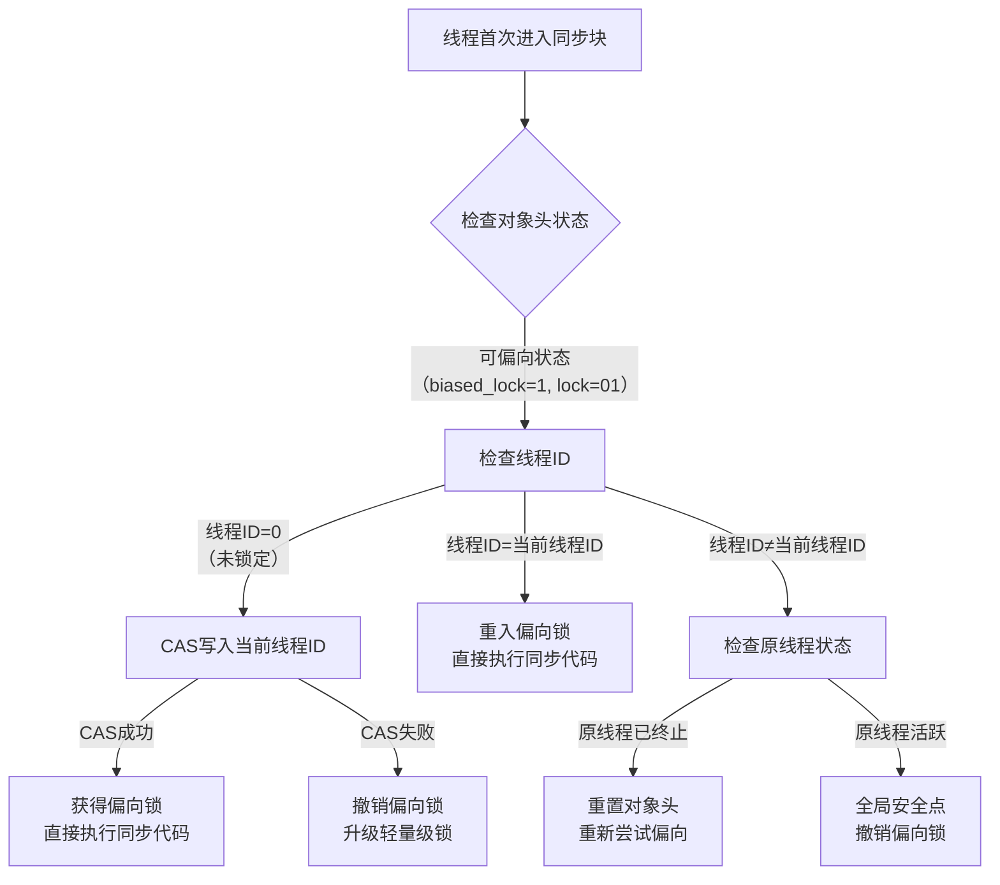
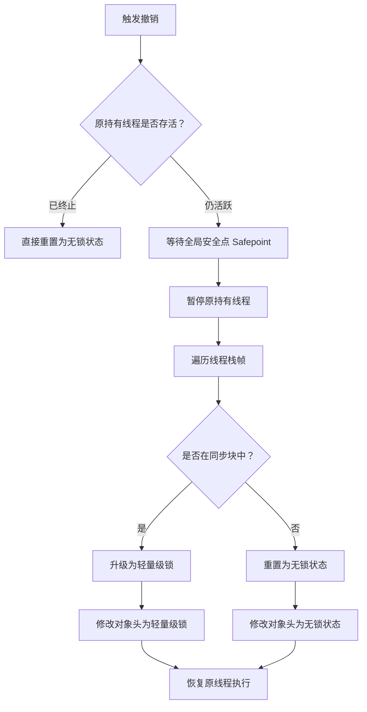
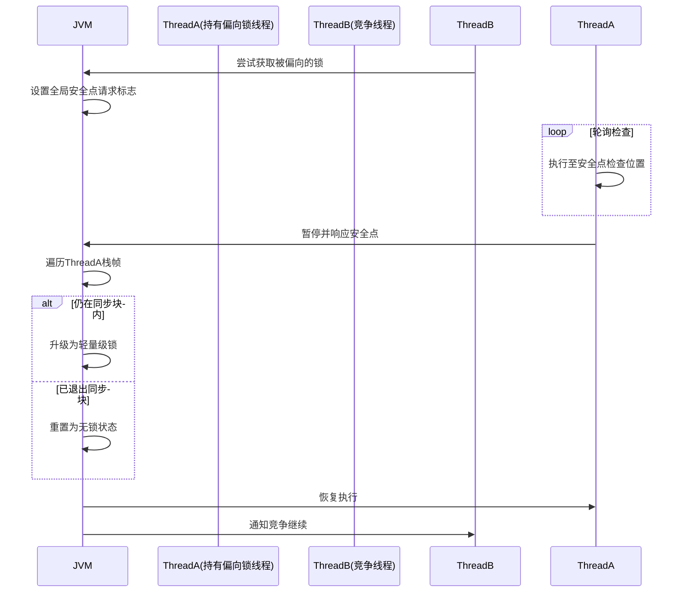
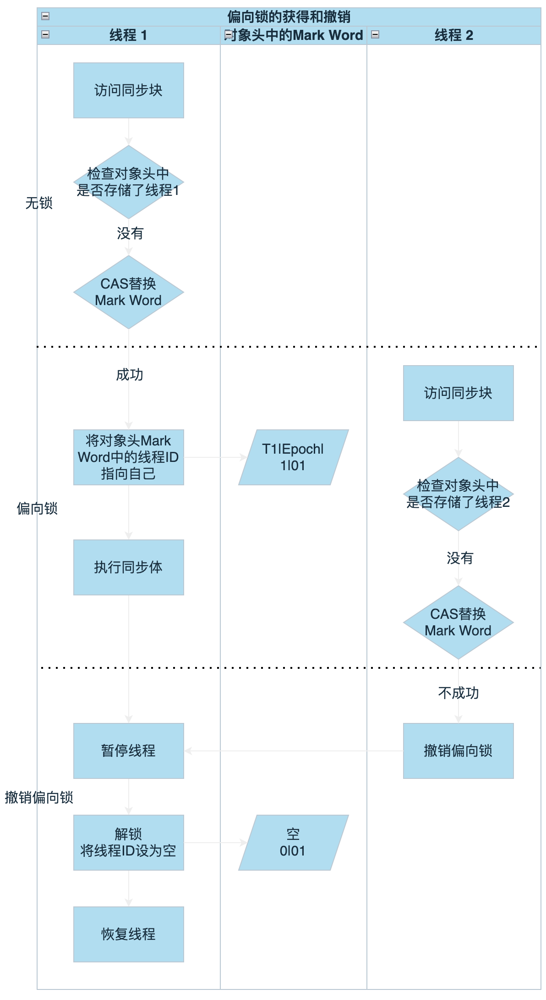

# 偏向锁

在 JDK 8 的 `synchronized` 锁机制中，**偏向锁（Biased Locking）** 是一项重要的优化技术，旨在减少无竞争场景下的同步开销。

---

## 一、偏向锁的设计目标

- **核心思想**：当锁始终被同一线程重复获取时，避免执行 CAS 等原子操作。
- **适用场景**：单线程重复访问同步块的场景（无实际竞争）。
- **优势**：消除无竞争下的同步开销，提升性能。

---

## 二、偏向锁的底层实现

### 1.对象头（Mark Word）结构

对象头中的 Mark Word 存储锁状态信息（以 64 位 JVM 为例）：

```plaintext
|-------------------------------------------------------|--------------------|
|                  Mark Word (64 bits)                  |       State        |
|-------------------------------------------------------|--------------------|
| unused:25 | identity_hashcode:31 | unused:1 | age:4 | biased_lock:0 | 01 | Normal（无锁）
| thread:54 |       epoch:2        | unused:1 | age:4 | biased_lock:1 | 01 | Biased（偏向锁）
```

- **偏向锁标志**：`biased_lock=1` 且锁标志位 `01`。
- **关键字段**：
  - `thread`：持有偏向锁的线程 ID。
  - `epoch`：偏向锁的时间戳（用于批量重偏向）。
  - `age`：对象分代年龄。

---

### 2.偏向锁的获取流程

1. **首次加锁**：
   - 检查对象头是否为**可偏向状态**（偏向模式开启且未锁定）。
   - 通过 **CAS 操作** 将当前线程 ID 写入 Mark Word。
   - 若 CAS 成功，线程获得偏向锁，直接进入同步代码块。
   - **无需全局锁或系统调用**，开销极低。

2. **同一线程重入**：
   - 检查 Mark Word 中的线程 ID 与当前线程一致。
   - **直接执行同步代码**，无任何额外操作。

---

### 3. 偏向锁的撤销（Revocation）

当其他线程尝试获取锁时，触发撤销流程：

1. **检查持有线程状态**：
   - 若原持有线程**已退出同步块**，则重置对象头为无锁状态。
   - 若原持有线程**仍活跃**，JVM 等待全局安全点（Safepoint）。
2. **升级为轻量级锁**：
   - 暂停持有偏向锁的线程。
   - 将对象头替换为指向**锁记录（Lock Record）的指针**（轻量级锁状态）。
   - 恢复线程，竞争线程通过**自旋**尝试获取轻量级锁。
3. **开销**：撤销操作涉及 STW（Stop-The-World），成本较高。

注意以下情况也会触发撤销

1. **调用对象的 `hashCode()` 方法**、
2. **调用 `wait()/notify()/notifyAll()`**
3. **超过批量撤销阈值**

### 4. 批量重偏向与批量撤销

- **批量重偏向（Bulk Rebiasing）**：
  - 当同一类的**多个对象被不同线程交替访问**（未发生竞争，例如线程 A 先获取，之后线程 B 频繁获取），JVM 会将偏向锁重偏向到新线程。
  - 触发条件：针对**同一类**的多个对象，在一个时间窗口（默认 20 秒）内，该类的对象被重偏向的次数超过阈值（默认 20 次）。
  - 目的：优化 “多线程交替获取同一类对象” 的场景，减少逐个撤销的开销。
- **批量撤销（Bulk Revocation）**：
  - 触发条件：当类的偏向锁撤销总次数超过阈值（默认 `40`），JVM 禁用该类的偏向锁。
  - 后续新对象直接进入轻量级锁状态。
  - 目的：当偏向锁无法稳定生效时（大量竞争），禁用该类对象的偏向锁，避免无效开销。

### 5. 偏向锁获取流程详解



#### 步骤1：首次获取偏向锁

1. **检查对象头**  
   线程首次进入 `synchronized` 块时，检查对象头：

   - 确认 `biased_lock=1` 且 `lock=01`（可偏向状态）
   - 确认 `thread` 字段为 0（未偏向任何线程）

2. **CAS 写入线程 ID**  

   ```java
   // 伪代码：CAS操作实现
   if (compareAndSwapMarkWord(
        objectHeader, 
        expected: [unused|hash|unused|age|1|01],  // 期望值
        new: [currentThreadID | epoch | age | 1 | 01] // 新值
   )) {
        // CAS成功
   } else {
        // CAS失败
   }
   ```

   - **成功**：当前线程ID写入对象头，线程获得偏向锁，直接执行同步代码
   - **失败**：说明其他线程竞争，触发**偏向锁撤销**

3. **执行同步代码**  

   - 无任何原子操作或系统调用
   - 仅通过对象头线程ID验证所有权

#### 步骤2：同一线程重入

1. **检查对象头**  
   线程再次进入同步块时：
   - 验证 `thread` 字段 == 当前线程ID
   - 确认 `biased_lock=1` 且 `lock=01`

2. **直接执行**  
   - 无CAS操作
   - 无锁记录创建
   - 直接进入同步代码块

#### 步骤3：竞争场景处理

1. **其他线程尝试获取**  

   - 当线程B检测到对象头 `thread` ≠ 自身ID，并且CAS替换失败时：

     ```java
     if (markWord.threadID != currentThread.id) {
         // 触发撤销流程
         revokeBiasedLock(object);
     }
     ```

2. **撤销决策树**



3. **安全点与偏向锁撤销的协同**



---

## 三、偏向锁的配置参数

| **JVM 参数**                    | **作用**                               | **默认值**     |
| ------------------------------- | -------------------------------------- | -------------- |
| `-XX:+UseBiasedLocking`         | 启用偏向锁                             | JDK 8 默认开启 |
| `-XX:BiasedLockingStartupDelay` | 应用启动后偏向锁的延迟生效时间（毫秒） | 4000（4秒）    |
| `-XX:-UseBiasedLocking`         | 关闭偏向锁                             | -              |

> **注**：偏向锁在 JDK 15+ 中已被废弃（JEP 374），但 JDK 8 仍广泛使用。

---

## 四、撤销操作的性能影响

### 1. 开销来源

- **STW 暂停**：安全点暂停所有线程（通常 10ms 级）
- **栈帧扫描**：遍历线程栈查找 Lock Record
- **锁升级**：从偏向锁到轻量级锁的状态转换

### 2. 优化措施

| **JVM 参数**                           | **作用**                   | **默认值** |
| :------------------------------------- | :------------------------- | :--------- |
| `-XX:BiasedLockingBulkRebiasThreshold` | 批量重偏向阈值             | 20         |
| `-XX:BiasedLockingBulkRevokeThreshold` | 批量撤销阈值               | 40         |
| `-XX:BiasedLockingDecayTime`           | 批量撤销后的冷却时间（ms） | 25000      |

### 3. 生产建议

- **高竞争环境**：关闭偏向锁（`-XX:-UseBiasedLocking`）
- **监控工具**：
  - `jstack`：查看线程锁状态
  - JFR（Java Flight Recorder）：分析 `biasedLockRevocation` 事件

---

## 五、适用场景与注意事项

- **适用**：明确单线程重复访问的场景（如局部同步块）。
- **不适用**：
  - 高竞争环境（频繁撤销导致性能下降）。
  - 线程池场景（多线程交替执行易触发批量撤销）。
- **生产建议**：监控 `jstack` 或 JFR 中的锁竞争情况，高竞争时关闭偏向锁。

---

## 六、示例代码分析

### 示例1：偏向锁

```java
public class BiasedLockExample {
    private static final Object lock = new Object();

    public static void main(String[] args) {
        // 偏向锁生效（单线程重复获取）
        for (int i = 0; i < 10; i++) {
            synchronized (lock) {
                System.out.println("Enter sync block, i=" + i);
            }
        }
    }
}
```

**对象头变化**：

1. 首次进入：Mark Word 写入线程 ID（偏向锁）。
2. 后续进入：检查线程 ID 一致，直接执行。


### 示例2：批量重偏向

**场景描述**

- 线程A创建100个`TestObject`实例，并逐个获取它们的锁（此时这些对象的偏向锁指向线程A）。
- 线程B随后尝试获取这100个对象的锁（无竞争，但线程不同）。
- 当线程B获取前20个对象的锁时，JVM会逐个撤销并重偏向（指向线程B）；当获取到第21个对象时，触发**批量重偏向**，剩余对象直接重置偏向锁，无需逐个处理。

```java
public class BiasedLockExample {
    static class TestObject {
    }

    public static List<TestObject> list = new ArrayList<>();

    public static void biasedLockExample() throws InterruptedException {

        // 步骤1：线程A创建对象并加锁（偏向线程A）
        Thread threadA = new Thread(() -> {
            for (int i = 0; i < 100; i++) {
                TestObject obj = new TestObject();
                synchronized (obj) {
                    list.add(obj);
                }
            }
        });
        threadA.start();
        threadA.join(); // 等待线程A完成

        // 步骤2：线程B尝试获取前20个对象的锁（触发逐个重偏向）
        Thread threadB = new Thread(() -> {
            for (int i = 0; i < 20; i++) {
                TestObject obj = list.get(i);
                synchronized (obj) {
                    // 此时对象的偏向锁会从A重偏向到B（前20次逐个处理）
                }
            }
            // 步骤3：线程B继续获取第21~100个对象的锁（触发批量重偏向）
            for (int i = 20; i < 100; i++) {
                TestObject obj = list.get(i);
                synchronized (obj) {
                    // 第21次开始，JVM批量重偏向，无需逐个撤销
                }
            }
        });
        threadB.start();
        threadB.join();
    }

    public static void main(String[] args) throws InterruptedException {
        biasedLockExample();
    }
}
```

**现象说明**

- **前20次加锁（线程B获取0~19号对象）**：每个对象的偏向锁会逐个撤销（指向线程A）并重新偏向线程B。此时JVM统计到该类（`TestObject`）的重偏向次数达到阈值（默认20次）。
- **第21次及之后（线程B获取20~99号对象）**：触发批量重偏向。JVM直接将`TestObject`类所有未被竞争的对象（20~99号）的偏向锁标记为“可重偏向”，线程B获取这些对象时无需CAS操作，直接修改偏向线程ID为B，效率更高。


### 示例3：批量撤销

**场景描述**

- 在示例1的基础上，线程C、D、E等更多线程开始竞争`TestObject`的锁。
- 当`TestObject`类的重偏向次数超过更高阈值（默认40次），JVM认为该类的对象无法稳定保持偏向锁，触发批量撤销。

```java
// 延续示例1的代码，添加线程C、D竞争锁
public class BiasedLockRevokeExample extends BiasedLockExample {
    public static void main(String[] args) throws InterruptedException {
        // 步骤4：执行示例1的逻辑
        BiasedLockExample.biasedLockExample();

        // 步骤5：线程C、D等更多线程竞争锁（触发批量撤销）
        Thread threadC = new Thread(() -> {
            for (int i = 0; i < 50; i++) {
                TestObject obj = BiasedLockExample.list.get(i);
                synchronized (obj) {
                } // 竞争锁
            }
        });
        Thread threadD = new Thread(() -> {
            for (int i = 50; i < 100; i++) {
                TestObject obj = BiasedLockExample.list.get(i);
                synchronized (obj) {
                } // 竞争锁
            }
        });
        threadC.start();
        threadD.start();
        threadC.join();
        threadD.join();
    }
}
```

**现象说明**

- **批量重偏向后续竞争**：线程C、D加入后，`TestObject`类的对象被不同线程频繁获取，导致重偏向次数超过40次（默认阈值）。
- **批量撤销触发**：JVM会批量撤销该类所有对象的偏向锁（升级为轻量级锁或重量级锁），且后续新创建的`TestObject`对象不再启用偏向锁（直接使用轻量级锁）。
- **最终结果**：偏向锁机制对该类失效，避免了因频繁撤销带来的性能损耗。

---

## 七、总结

偏向锁通过消除单线程场景下的同步开销，优化了 `synchronized` 的性能。但其撤销成本较高，需结合场景合理使用。理解对象头结构、升级路径及 JVM 参数配置，有助于在高并发系统中进行有效的锁优化。

