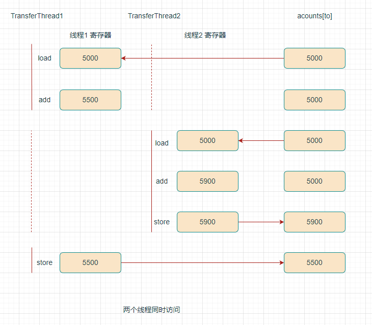

# 互斥同步

## 竞态条件

两个或两个以上线程需要共享对同一数据的存取 ，线程会相互覆盖，取决于线程访问数据的次序，可能导致数据被破坏。线程会相互覆盖，取决于线程访问数据的次序，可能导致数据被破坏。

- 指令操作（线程工作内存和主存之间的数据交换）：
  1. 将 `acounts[to]` 加载到 寄存器（线程工作内存）。
  2. 增加 `acounts[to]`。
  3. 将结果写入 `acounts[to]`（主存）。

- 线程1 会 覆盖 线程2 所做的 更新。

线程工作内存：一般在寄存器或者高速缓存。



## 锁对象

两种机制防止并发访问代码块，控制多个线程对共享资源的互斥访问（防止并发情况导致的数据不一致情况）

- `ReentrantLock`（重入锁）
- `synchronized`（内部锁）

## ReentrantLock（重入锁，显式锁）

基本结构如下：

```java
myLock.lock(); // a ReentrantLock object
try {
    Critical section
} finally {
    myLock.unlock(); // make sure the lock is unlocked even if an exception is thrown
}
```

- 任何时刻只有一个线程进入**临界区(对临界资源进行访问的那段代码)**，一旦一个线程锁定了锁对象，其它线程无法通过 `lock` 语句。
- 当其它线程调用`lock`时，它们会阻塞，直到第一个线程释放锁对象。
- `unlock` 放在 `finally`中，临界区若抛出异常，锁必须被释放，防止其它线程被永远堵塞。
- 使用锁时，不能使用 `try-with-resources`语句。

重入锁（`reentrant`）

- 线程可以反复获得已拥有的锁。
- 锁有一个持有计数 ，跟踪对`lock`方法的嵌套调用。
- 被一个锁保护的代码可以调用另一个使用相同锁的方法。

常用方法

`void lock()`

- 获得锁，如果锁被其它线程占用，则阻塞。

`void unlock()`

- 释放锁。

`new ReentrantLock()`

- 构造一个重入锁，保护临界区（代码）。

`new ReentrantLock(boolean fair)`

- 构造公平锁，倾向于等待时间最长的线程，影响性能。

### 条件对象

条件对象，也被称为条件变量，用来**管理获得锁却不能做有用工作的线程**（条件不满足，等待）

- 通常`await`调用放在如下形式的循环：

```java
while (!OK to proced) // 指定条件，不满足，等待
  sufficientFunds.await(); // 等待
```

 `await`

- 线程调用`await`方法后，放弃锁，进入等待集（`wait set`）。

- 线程无法自动激活，需要其它线程调用`signal` 或者 `signalAll` 方法。

 `signal`、`signalAll` 

- `signal` 从等待集中随机选择一个线程，解除阻塞。
- `signalAll` 等待集中的所有线程，解除阻塞。
- 激活后，从等待集中移出，进入`Runnable`状态，所有线程竞向访问对象，线程获得锁后，从之前暂停的地方继续执行。

方法

`Condition newCondition()`

- 返回与锁对象相关联的条件对象。

`void await() throws InterruptedException`

- 将该线程放在这个条件的等待集（`wait set`）。

`void signal()`

- 该条件的等待集中，随机选择一个线程，解除阻塞。

`void signalAll()`

- 该条件的等待集中，所有线程，解除阻塞。

### 总结

- 锁用来保护代码片段（临界区），一次只有一个线程执行被保护的代码。
- 锁可以管理试图进入被保护代码段的线程（通过条件对象）。

- 一个锁可以有一个或多个相关联的条件对象。

- 每个条件对象管理那些已经进入被保护代码段（获得锁） 但还不能运行的程序。

## synchronized（内部锁，隐式锁）

- Java每个对象都有一个内部锁（对象头）
- 内部对象锁只有一个条件对象