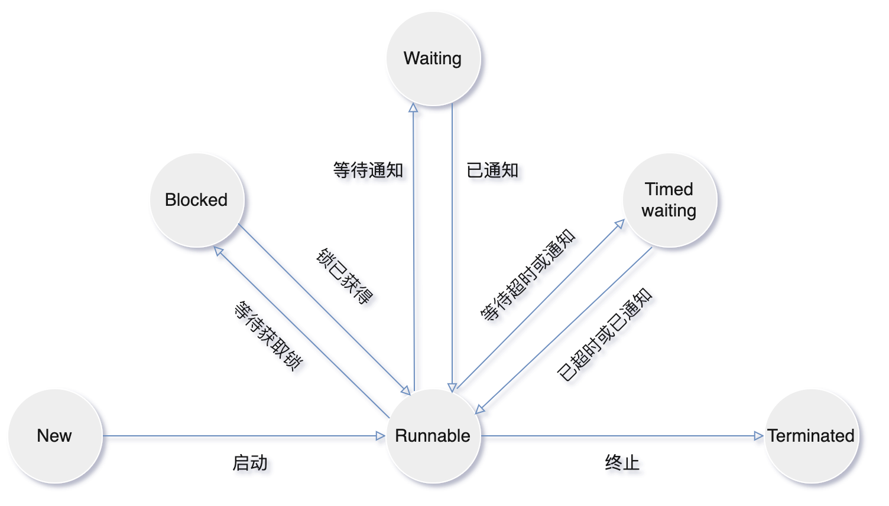
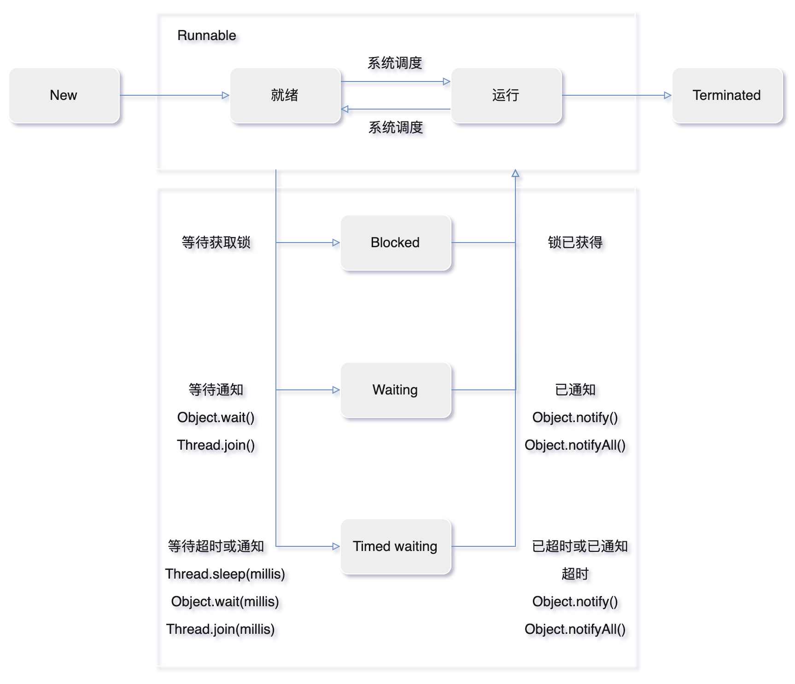
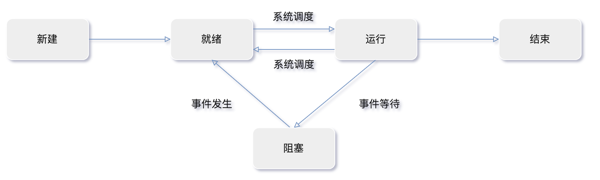

# 线程基础

## 使用线程

有三种使用线程的方法：

- 实现 `Runnable` 接口
- 实现 `Callable` 接口（泛型接口）
- 继承 `Thread` 类

`Runnable`、`Callable`都是函数式接口，可以提供一个`lambda`表达式。

`Runnable` 和 `Callable` 接口的实现类只是一个可以在线程中运行的任务，不是真正意义上的线程。

任务最终还需要通过 `Thread` 来调用，即任务是通过线程驱动从而执行的。

`Thread.start()`方法才会创建一个执行`run()`方法的新线程。

虚拟机会将该线程放入就绪队列中等待被调度，当一个线程被调度时会执行该线程的 `run()` 方法。

### 实现 Runnable 接口

- 任务类实现`Runnable`接口中的 `run()` 方法。
- 使用 `Runnable` 实例再创建一个 `Thread`实例，然后调用 `Thread` 实例的 `start()` 方法来启动线程。

### 实现 Callable 接口

- 任务类实现`Callable`接口中的 ` call()` 方法。
- 与 `Runnable` 相比，`Callable` 可以有返回值，返回值通过 `FutureTask` 进行封装。
- 使用 `FutureTask` 实例再创建一个 `Thread`实例，然后调用 `Thread` 实例的 `start()` 方法来启动线程。

### 继承 Thread 类

- 任务类覆写`run()` 方法，因为 `Thread`  类也实现`Runnable`接口中的 `run()` 方法。
- 调用  `Thread` 实例`start()` 方法启动一个线程时。

### 实现接口 VS 继承 Thread

实现接口会更好

- Java 不支持多重继承，继承了`Thread` 类就无法继承其它类，但是可以实现多个接口。
- 类可能只要求可执行就行，继承整个 `Thread` 类开销过大。

### Runnable和Callable的区别

- `Callable`接口方法是`call()`；`Runnable`接口方法是`run()`。
- `Callable`的任务执行后可返回值，而`Runnable`的任务不能返回值。
- `Call`方法可以抛出异常，`run`方法不可以。

- `Callable`任务可以拿到一个`Future`对象，表示异步计算的结果。
  - `Future`对象提供了检查计算是否完成的方法，以等待计算的完成，并检索计算的结果。
  - `Future`对象可以了解任务执行情况，可取消任务的执行，还可获取执行结果。

```java
Runnable r = new MyRunnable();
Thread t1 = new Thread(r);
t1.start();

Callable c = new MyCallable();
FutureTask ft = new FutureTask<>(c);
Thread t2 = new Thread(ft);
t2.start();

Thread t3 = new MyThread();
t3.start();
```

## 使用线程

### 6种状态

- `New`：新建
- `Runnable`：可运行（就绪+运行）
- `Blocked`：阻塞
- `Waiting`：等待
- `Timed waiting`：计时等待
- `Terminated`：终止

### New（新建）

`new Thread(r)`，线程创建后尚未启动。

### Runnable可运行（就绪+运行）

可能正在运行，也可能正在等待 CPU 时间片（就绪）。

包含了**操作系统线程状态**中的 **Running（运行）和 Ready（就绪）**。

**当调用线程对象`start()`方法，线程进入就绪状态(等待调度):**

- 处于就绪状态的线程，只是说明此线程准备好了，随时等待CPU调度执行，并不是说执行了`t.start()`此线程立即就会执行。

### Blocked（阻塞）

等待获取一个排它锁，如果其它线程释放了锁，此线程就会结束此状态。

- 一个线程请求获取锁(`synchronized`)，但是这个锁目前被其它线程占用，该线程会被阻塞。
- 当所有其它线程都释放了这个锁，线程调度器并允许该线程持有这个锁，它将变成`Runnable`状态。

### Waiting（无限期等待）

**已经获得锁，等待，放弃锁。**

等待其它线程**显式唤醒**，否则不会被分配 CPU 时间片。

调用以下方法进入`Waiting`状态

- `Object.wait()`：使线程进入无限期等待。
- `Thread.join()`：等待其它线程完成（唤醒）。

| 进入方法             | 退出方法                               |
| -------------------- | -------------------------------------- |
| 无参`Object.wait()`  | `Object.notify()`/`Object.notifyAll()` |
| 无参`Thread.join()`  | 被调用的线程执行完毕                   |
| `LockSupport.park()` | `LockSupport.unpark(Thread)`           |

### Timed waiting （计时等待、限期等待）

**已获得锁，等待，继续持有锁。**

超时后会被系统自动唤醒，无需等待其它线程显式唤醒。

睡眠和挂起是用来描述行为，而阻塞和等待用来描述状态。

调用以下方法进入`Timed waiting`状态

- `Thread.sleep(millis)`：使线程进入限期等待状态，常用“使一个线程睡眠”进行描述。
- `Object.wait(millis)`：使线程进入限期等待，常用“挂起一个线程”进行描述。
- `Thread.join(millis)`：等待其它线程完成（唤醒），超时自动唤醒。

| 进入方法                              | 退出方法                                        |
| ------------------------------------- | ----------------------------------------------- |
| `Thread.sleep(millis)`                | 时间结束                                        |
| 有参`Object.wait(millis)`             | 时间结束/`Object.notify()`/`Object.notifyAll()` |
| 有参`Thread.join(millis)`             | 时间结束/被调用的线程执行完毕                   |
| `LockSupport.parkNanos(nanoseconds)`  | `LockSupport.unpark(Thread)`                    |
| `LockSupport.parkUntil(milliseconds)` | `LockSupport.unpark(Thread)`                    |

### Terminated（终止）

- `run()`方法正常退出，线程自然终止。
- 产生了异常而结束。

## Blocked(阻塞)和Waiting(等待)区别

- `Blocked`是被动的，没有获得锁，它是在等待获取一个排它锁。
- `Waiting`是主动的，已经获得锁，主动放弃。

## 线程状态流程图

当线程阻塞或等待（或终止），可以调度另一个线程运行。



### Java线程状态/生命周期



### 操作系统线程状态/生命周期



### 操作系统和Java线程状态区别

Java中将操作系统中的**就绪状态+运⾏状态**转化为⼀个状态`Runnable`，阻塞状态细分为了三种：

- `Blocked`、`Waiting`、`Timed waiting`