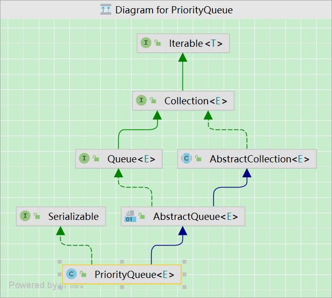

# 线程安全集合

## ConcurrentHashMap（原理：Segment 、CAS + synchronized）

## 阻塞队列（BlockingQueue）

阻塞队列为空/满时，线程操作会导致线程阻塞。

阻塞队列方法分为以下三类：插入、弹出、获取队列头元素。

- `add`、`remove`、`element`，阻塞队列为空/满时，操作抛出异常。
- `offer`、`poll`、`peek`，替代上面三个方法，阻塞队列为空/满时，操作不抛出异常，会给出错误提示。
  - `offer` 返回 `false`，`poll`、`peek`返回`null`。
- 队列插入`null`非法。

## 银行转账使用阻塞队列

- 转账线程A将转账指令对象插入一个队列，不直接访问银行对象。

- 另一个线程B从队列中取出指令对象完成转账。只有线程B可以访问银行对象的内部，因此不需要同步。

## LinkedBlockingQueue（双向链表）

- 构造一个无上限的阻塞队列或双向队列，也可以指定最大容量。
- 双端队列。
- 队列实现为链表。

## ArrayBlockingQueue（循环数组）

- 构造一个存在上限的阻塞队列，构造时需要指定容量 。
- 可选参数指定是否需要公平性 。
- 队列实现为循环数组。

## PriorityQueue



优先队列，是0个或者多个元素构成的集合。

- 内部数据结构是**二叉堆**（默认小根堆），二叉堆逻辑上是完全二叉树，物理存储包含有链式存储或者顺序存储。

- `PriorityQueue`使⽤的是**顺序存储**，使⽤`Object[]`数组，然后利⽤完全⼆叉树的性质，解决⽗⼦节点关系问题。

- 队列为空时，线程操作会阻塞。
- **默认初始容量为 11**。

### 扩容

- 数组长度 < 64时，扩容：`newCapacity = 2 * oldCapacity + 2`
- 数组长度超过64时，扩容：`newCapacity = 1.5 * oldCapacity`

```java
private void grow(int minCapacity) {
    int oldCapacity = queue.length;
    // Double size if small; else grow by 50%
    int newCapacity = oldCapacity + ((oldCapacity < 64) ?
                                     (oldCapacity + 2) :
                                     (oldCapacity >> 1));
    // overflow-conscious code
    if (newCapacity - MAX_ARRAY_SIZE > 0)
        newCapacity = hugeCapacity(minCapacity);
    queue = Arrays.copyOf(queue, newCapacity);
}
```

### 操作

- 支持放溢出处理，⽀持最⼤元素个数`Integer.MAX_VALUE`。
- 删除和插⼊操作均会破坏当前的堆结果，所以每次都需要调⽤`siftUp`、`siftDown`动态调整。
- 插⼊操作：插⼊当前堆的末尾，调⽤`siftUp`，⾃底向上调整。
- 删除操作：弹出堆顶元素，然后将堆最后⼀个元素置于堆顶，调⽤`siftDown`，⾃顶向下调整。
- 同样具有`fast-fail`机制。

### 相关题⽬

- 频率相关问题，结合`map`使⽤。
- `TopK`问题（海量数据处理）。

## 高效的映射、集和队列

返回弱一致性的迭代器。

- 因为`fast-fail`机制，迭代器复制访问，原数据可能发生变更，迭代器无法感知，所以具有弱一致性。