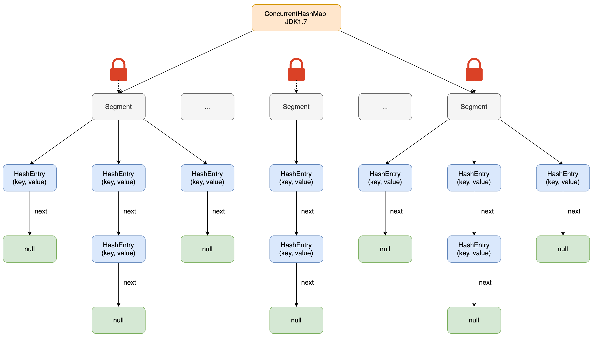
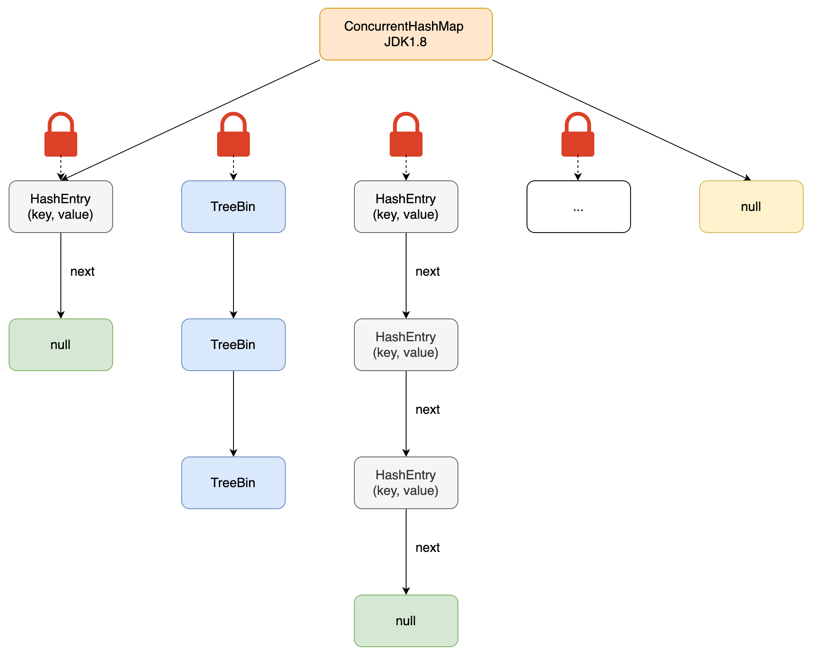

# 线程安全集合

## 弱一致性

线程安全的映射、集和队列，返回弱一致性的迭代器。

因为`fast-fail`机制，迭代器复制访问，原数据可能发生变更，迭代器无法感知，所以具有弱一致性。

## 阻塞队列（BlockingQueue）

阻塞队列为空/满时，线程操作会导致线程阻塞。

阻塞队列方法分为以下三类：插入、弹出、获取队列头元素。

- `add`、`remove`、`element`，阻塞队列为空/满时，操作抛出异常。
- `offer`、`poll`、`peek`，替代上面三个方法，阻塞队列为空/满时，操作不抛出异常，会给出错误提示。
  - `offer` 返回 `false`，`poll`、`peek`返回`null`。
- 队列插入`null`非法。

## 银行转账使用阻塞队列

- 转账线程A将转账指令对象插入一个队列，不直接访问银行对象。

- 另一个线程B从队列中取出指令对象完成转账。只有线程B可以访问银行对象的内部，因此不需要同步。

## LinkedBlockingQueue（双向链表）

- 构造一个无上限的阻塞队列或双向队列，也可以指定最大容量。
- 双端队列。
- 队列实现为链表。

## ArrayBlockingQueue（循环数组）

- 构造一个存在上限的阻塞队列，构造时需要指定容量 。
- 可选参数指定是否需要公平性 。
- 队列实现为循环数组。

## PriorityQueue


优先队列，是0个或者多个元素构成的集合。

- 内部数据结构是**二叉堆**（默认小根堆），二叉堆逻辑上是完全二叉树，物理存储包含有链式存储或者顺序存储。

- `PriorityQueue`使⽤的是**顺序存储**，使⽤`Object[]`数组，然后利⽤完全⼆叉树的性质，解决⽗⼦节点关系问题。

- 队列为空时，线程操作会阻塞。
- **默认初始容量为 11**。

### 扩容

- 数组长度 < 64时，扩容：`newCapacity = 2 * oldCapacity + 2`
- 数组长度超过64时，扩容：`newCapacity = 1.5 * oldCapacity`

```java
private void grow(int minCapacity) {
    int oldCapacity = queue.length;
    // Double size if small; else grow by 50%
    int newCapacity = oldCapacity + ((oldCapacity < 64) ?
                                     (oldCapacity + 2) :
                                     (oldCapacity >> 1));
    // overflow-conscious code
    if (newCapacity - MAX_ARRAY_SIZE > 0)
        newCapacity = hugeCapacity(minCapacity);
    queue = Arrays.copyOf(queue, newCapacity);
}
```

### 操作

- 支持放溢出处理，⽀持最⼤元素个数`Integer.MAX_VALUE`。
- 删除和插⼊操作均会破坏当前的堆结果，所以每次都需要调⽤`siftUp`、`siftDown`动态调整。
- 插⼊操作：插⼊当前堆的末尾，调⽤`siftUp`，⾃底向上调整。
- 删除操作：弹出堆顶元素，然后将堆最后⼀个元素置于堆顶，调⽤`siftDown`，⾃顶向下调整。
- 同样具有`fast-fail`机制。

### 相关题⽬

- 频率相关问题，结合`map`使⽤。
- `TopK`问题（海量数据处理）。

## 队列（Queue）

`ConcurrentLinkedQueue<E>`

- 构造一个可以被多线程安全访问的无上限的非阻塞队列。

## 有序集（Set）

`ConcurrentSkipListSet<E>`

`ConcurrentSkipListSet<E>(Comparator<? super E> comparator)` 

- 构造一个可以被多线程安全访问有序集。
- `E` 要求实现`Comparable`接口。

## ConcurrentHashMap(不允许有null值)

`ConcurrentHashMap<K,V>`

`ConcurrentHashMap<K,V> (int initialCapacity)` 

`ConcurrentHashMap<K,V>(int initialCapacity,  float loadFactor, int concurrencyLevel)` 

- 构造一个可以被多线程安全访问的散列映射表。
- `initialCapacity`初始容量默认16。
- `loadFactor`装载因子默认0.75。
- 高效地支持大量阅读器和一定数量的书写器 ，默认16个同时运行的书写器线程， 多于16 ，阻塞。

- `concurrencyLevel`是估计并发书写器的线程数。

## ConcurrentHashMap原子更新

`compute`方法

- 提供一个键和一个计算新值的函数：函数接受键关联的值，计算新值（若不存在，为null）。

- `computeIfPresent`、`computeIfAbsent`。

`merge`方法

- 首次增加一个键需要特殊处理，可以使用`merge`（键不存在使用初始值）。

- 方法有一个参数，表示键不存在时使用的初始值，否则，会调用你提供的函数来结合原值和初始值。
- 和`compute`不同，`merge`不处理键。

```java
// 原子更新
ConcurrentHashMap<String, Integer> map = new ConcurrentHashMap<>();
String key1 = "key1";
map.put(key1, 1);

// compute方法 提供一个键 和 一个计算新值的函数
// 这个函数接受 键 和相关联的 值，计算新值（若不存在，为null）
map.compute(key1, (k, v) -> v == null ? 1 : v + 1);
System.out.println(map.get(key1)); // 2

String key2 = "key2";
map.computeIfAbsent(key2, k -> 100); // 若不存在，put键值对
System.out.println(map.get(key2)); // 100

String key3 = "key3";
// map.put(key3, 1);
map.computeIfPresent(key3, (k, v) -> v + 1); // 若不存在，为null
System.out.println(map.get(key3)); // null

String key4 = "key4";
// map.put(key4, 10);
map.merge(key4, 1, Integer::sum); // 若不存在，为初始值
System.out.println(map.get(key4)); // 1
```

## ConcurrentHashMap(JDK1.7 )

`ConcurrentHashMap` 由多个 `Segment` 组成。

- 每个 `Segment` 是一个独立的哈希表（类似 `HashMap`），继承自 `ReentrantLock`。

- 每个 `Segment` 管理一个 `HashEntry` 数组，通过分段锁机制保证线程安全：不同 `Segment` 的操作可以并发执行。
- `HashEntry` 用于存储键、值对数据。

### Segment (**可重入锁**)

- `Segment` 继承了 `ReentrantLock`， 是一种可重入锁。
- 多个线程可以同时访问**不同分段锁**上的桶，从而使其并发度更高（并发度就是 `Segment`的个数）。
- 当一个线程占用锁访问其中一个段数据时，其它段的数据可以被其它线程访问，能够实现真正的并发访问。



## ConcurrentHashMap(JDK1.8)

```java
static class Node<K,V> implements Map.Entry<K,V> {
    final int hash;
    final K key;
    volatile V val;
    volatile Node<K,V> next;
    Node(int hash, K key, V val, Node<K,V> next) {
        this.hash = hash;
        this.key = key;
        this.val = val;
        this.next = next;
    }
...
}

transient volatile Node<K,V>[] table;
```

`ConcurrentHashMap` 选择了与 `HashMap` 相同的结构：数组+链表+红黑树。

- `transient Node<K,V>[] table` 数组
- `Node<K, V>` 链表
- `Node<K, V>` 红黑树
- `val`、`next`被`volatile`修饰，保证可见性

### CAS + synchronized（CAS失败，采用synchronized，锁住单个桶）

采用`CAS` + `synchronized`锁链表头节点，实现更低粒度的锁。

- `put`操作时，先进行`CAS`。
- `CAS` 操作失败时，再使用内置锁 `synchronized`。
- 更细粒度的锁级别：哈希桶
  - 只需要锁住链表头节点/红黑树根节点，一个桶加一个锁，就不会影响其它的哈希桶的读写，大大提高了并发度。



##  put 方法(JDK1.7)

### 1. 计算 Key 的哈希值

   ```java
   int hash = hash(key); // 通过再哈希算法减少哈希冲突
   ```

### 2. 定位到具体的 `Segment`

   ```java
   int segmentIndex = (hash >>> segmentShift) & segmentMask; // 计算段索引
   Segment<K,V> segment = ensureSegment(segmentIndex); // 确保目标段已初始化
   ```
   - `ensureSegment`：如果目标 `Segment` 未初始化，使用 CAS 无锁方式创建，保证线程安全。

### 3. 调用 `Segment.put` 方法

   ```java
   segment.put(key, hash, value, false); // 实际插入操作
   ```

### 4. `Segment.put` 内部流程

每个 `Segment` 内部的操作需获取锁（保证线程安全）：

**(1) 加锁**

   ```java
   lock(); // 获取 ReentrantLock 锁
   ```

**(2) 定位 HashEntry 的数组下标**

   ```java
   int index = (hash & (table.length - 1)); // 通过哈希计算数组下标
   HashEntry<K,V> first = table[index]; // 获取链表头节点
   ```

**(3) 遍历链表查找 Key**

   - 遍历链表，检查是否已存在相同 Key：
     - 存在：更新 `value`。
     - 不存在：创建新 `HashEntry`，插入链表头部。

**(4) 检查是否需要扩容**

   - 如果当前 `Segment` 的元素数量超过阈值（`threshold = capacity * loadFactor`），触发扩容：
     
     ```java
     if (count + 1 > threshold) rehash();
     ```
   - 扩容过程：
     1. 创建新的 `HashEntry` 数组（大小为原数组的 2 倍）。
     2. 重新计算所有元素的位置，并复制到新数组。
     3. 新数组替换旧数组。

**(5) 释放锁**

   ```java
   unlock(); // 释放 ReentrantLock 锁
   ```

### 5. 关键特性

1. 分段锁的并发度：
   - 默认有 16 个 `Segment`，最多支持 16 个线程并发写操作。
   - 可通过构造函数指定并发级别（`concurrencyLevel`），但最终向上取整为 2 的幂次。

2. 无锁读操作：
   - `get` 操作无需加锁，通过 `volatile` 修饰的 `HashEntry.value` 保证可见性。

3. 线程安全的初始化：
   - 初始化 `Segment` 时使用 CAS 操作，避免锁竞争。

## put 方法(JDK1.8)

### 1. 参数校验与哈希计算
- **参数校验**：`ConcurrentHashMap` 不允许 `key` 或 `value` 为 `null`，若检测到则直接抛出 `NullPointerException`。
- **哈希计算**：通过 `spread()` 方法对 `key` 的哈希码进行二次处理，确保哈希值分布均匀：
  
  - `spread()` 将哈希码的高 16 位与低 16 位异或，再与 `HASH_BITS` 掩码（`0x7fffffff`）按位与，确保结果为非负数。
  
  ```java
  int hash = spread(key.hashCode());
  ```

---

### 2. 初始化哈希表
**延迟初始化**：当首次插入数据时，若哈希表 `table` 未初始化，调用 `initTable()` 方法：

- 检查 `sizeCtl` 变量

- `sizeCtl < 0`：其他线程正在初始化，当前线程通过 `Thread.yield()` 让出 CPU。
- 否则，通过 **CAS** 将 `sizeCtl` 置为 `-1`（标记初始化状态），创建默认容量为 16 的 `Node` 数组，并计算扩容阈值（`容量 * 0.75`）。

---

### 3. 定位桶并插入数据
- **计算桶索引**：`(n - 1) & hash` 确定键值对在数组中的位置（`n` 为数组长度）。
- **CAS 无锁插入**：
  - 若目标桶为空（`tabAt(tab, i) == null`），直接通过 `casTabAt()` 以 **CAS** 方式插入新 `Node` 节点，无需加锁。
  - **失败处理**：若 CAS 失败（其他线程已修改桶），重新进入循环尝试。

---

### 4. 处理哈希冲突
若目标桶非空，需处理哈希冲突：

**(1) 检查扩容状态**

- 若桶头节点的哈希值为 `MOVED`（`-1`），表示当前处于扩容状态，调用 `helpTransfer()` 协助数据迁移，完成后继续插入。

**(2) 加锁操作**

- 使用 `synchronized` 锁住桶头节点，确保同一时刻仅一个线程操作该桶。
- **遍历链表或红黑树**：
  - **链表**：遍历链表查找相同 `key`：
    - 存在：根据 `onlyIfAbsent` 参数决定是否更新 `value`。
    - 不存在：将新节点插入链表末尾，并统计链表长度 `binCount`。
  - **红黑树**：通过 `TreeBin` 节点操作红黑树插入。

**(3) 结构转换**

- 若链表长度超过阈值（默认 8），将链表转换为红黑树，提升查询效率。

---

### 5. 扩容检查与触发
- **扩容触发条件**：插入完成后，调用 `addCount()` 统计元素总数，若超过阈值（`容量 * 负载因子`），触发扩容。
- **多线程协助扩容**：
  - 通过 `transfer()` 方法迁移数据，每个线程负责迁移一部分桶，利用 `transferIndex` 分配迁移范围。
  - 迁移时，旧桶标记为 `ForwardingNode`，其他线程插入时若发现此状态，会协助迁移。

---

### 6. 关键特性与优化
1. **锁粒度细化**：仅锁单个桶的头节点（链表或红黑树），相比 JDK 1.7 的分段锁，并发度更高。
2. **CAS 无锁化**：初始化、空桶插入等场景通过 CAS 减少锁竞争，提升性能。
3. **红黑树优化**：链表过长时转换为红黑树，避免查询效率退化。
4. **并发扩容**：多线程协作迁移数据，避免单线程扩容阻塞。

## JDK1.7与JDK1.8 中ConcurrentHashMap 的区别？

- 数据结构：取消了`Segment`分段锁的数据结构，取而代之的是数组+链表+红黑树的结构。
- 保证线程安全机制：
  - JDK1.7采用`Segment`分段锁机制实现线程安全，其中`segment`继承自`ReentrantLock`。
  - JDK1.8 采用`CAS`+`Synchronized`保证线程安全。
- 锁粒度：
  - 原来是对需要进行数据操作的`Segment`加锁。
  - 现调整为对每个数组元素加锁（`Node`），粒度更小。
- 链表转化为红黑树：
  - JDK1.7，链表。
  - JDK1.8 ，链表节点数量大于8时，会将链表转化为红黑树。
- 查询时间复杂度：从原来的遍历链表`O(n)`，变成遍历红黑树`O(logN)`。

## get 方法是否要加锁？（1.8）

`get` 操作无需加锁，通过 `volatile` 修饰保证可见性。

- `Node` 的元素 `val` 和指针 `next` 是用 `volatile` 修饰的。
- 在多线程环境下，线程A修改结点的`val`或者新增节点的时候是对线程B可见的。
- 这也是其安全效率高的原因之一。

## get 方法不需要加锁与volatile修饰的哈希桶有关吗？（1.7）

没有关系，哈希桶`table`用`volatile`修饰主要是保证在数组扩容的时候保证可见性。

## ConcurrentHashMap 不支持 key 或者 value 为 null 的原因？

**存在二义性**

- 多线程环境下，`ConcurrentHashMap` 调用 `get(key)` 得到了 `null` ，无法确定是键不存在，还是键存在但值为 `null`。

**哈希值处理**

- 哈希表的计算依赖 `key.hashCode()`，若 `key` 为 `null`，调用 `hashCode()` 会直接抛出 `NullPointerException`。
- 即使允许 `key` 为 `null`，也需要额外处理哈希值（如 `HashMap` 中为 `null` 键分配固定哈希值），但并发场景下会增加复杂性。

**与 HashMap 的对比**

- `HashMap` 允许 `null` ，单线程环境下，可以通过 `containsKey()` 明确判断键是否存在。无并发竞争，状态一致性容易保证。

- `ConcurrentHashMap` 牺牲 `null` 的灵活性，换取更高效的线程安全和更简洁的实现。

## ConcurrentHashMap **迭代器**是强一致性还是**弱一致性**？

与`HashMap`迭代器是强一致性不同，`ConcurrentHashMap` 迭代器是弱一致性。

- `ConcurrentHashMap` 的迭代器创建后，按照哈希表结构遍历每个元素，但在遍历过程中，内部元素可能会发生变化。
  - 如果变化发生在已遍历过的部分，迭代器就不会反映出来。
  - 如果变化发生在未遍历过的部分，迭代器就会发现并反映出来（遍历修改后的数据），这就是弱一致性。

迭代器线程使用原来老的数据，写线程也可以并发的完成改变，这保证了多个线程并发执行的连续性和扩展性，是性能提升的关键。

### ConcurrentHashMap 和Hashtable的效率哪个更高？

`ConcurrentHashMap` 的效率要高于`Hashtable`。

- `Hashtable`使用`Synchronized`给整个哈希表加锁从而实现线程安全。
  - 多线程访问时候，只要有一个线程访问或操作该对象，其它线程阻塞等待，在竞争激烈的多线程场景中性能就会非常差。
- `ConcurrentHashMap` 的锁粒度更低。
  - 在JDK1.7中采用分段锁实现线程安全。
  - 在JDK1.8中采用`CAS`+`Synchronized`实现线程安全。

## CopyOnWriteArrayList (读写分离)

`CopyOnWriteArrayList`可以理解成是`ArrayList`的线程安全的版本，内部也是使⽤数组实现。

### 读写分离

读写分离：阻塞写操作，不阻塞读操作。

- 读操作，在原始数组中进行。

- 写操作，在新数组上做修改。
  1. 每次对原数组的写操作，先加锁（`ReentrantLock`，独占不公平锁）。
  2. 然后复制⼀份新数组，在新数组上做修改（`Arrays.copyOf()`）。
  3. 修改后再替换原来的老数组。

整个数组使⽤`volatile`修饰保证了可见性，结合锁之后，确保了单个api操作的线程安全。

内部⽆`size`属性，直接通过获取当前数组⼤⼩得到对应的元素的个数。

因为写时会复制⼀个近乎等⼤⼩的数组，所以需要考虑内存空间和集合使⽤的业务场景 。

### 适用场景-读多写少

`CopyOnWriteArrayList` 在写操作的同时允许读操作，大大提高了读操作的性能，很适合读多写少的应用场景。

`CopyOnWriteArrayList` 缺点：

- 内存占用：在写操作时需要复制一个新的数组，使得内存占用为原来的两倍左右。
- 数据不一致：读操作不能读取到实时数据，因为部分写操作的数据还未同步到读数组中，⽆法保证实时⼀致性，只能保证最终⼀致性。
-  不适合内存敏感以及对实时性要求很高的场景。

```java
public boolean add(E e) {
    final ReentrantLock lock = this.lock;
    lock.lock();
    try {
        Object[] elements = getArray();
        int len = elements.length;
        Object[] newElements = Arrays.copyOf(elements, len + 1);
        newElements[len] = e;
        setArray(newElements);
        return true;
    } finally {
        lock.unlock();
    }
}

final void setArray(Object[] a) {
    array = a;
}
```

