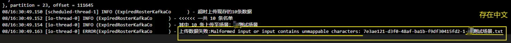

## `tk.mybatis` 插入失败，主键重复

**背景**

数据库：id自增，当前`AUTO_INCREMENT=1411`。

代码如下：

```java
// Mapper接口
@org.apache.ibatis.annotations.Mapper
public interface UserMapper extends Mapper<User> {
}

// 插入操作
public void save(User user) {
    userMapper.insertSelective(user);
}
```

**插入失败，主键重复**

第一次插入，插入成功。

1. 对象`id`回写为0。
2. 数据插入数据库，`id`为1411。
3. `AUTO_INCREMENT=1412`

```
DEBUG(insertSelective-XNIO-1 tas:135) - ==>  Preparing: INSERT INTO user ( id,name,age ) VALUES( ?,?,? )
DEBUG(insertSelective-XNIO-1 tas:135) - ==>  Parameters: 0(Long), 小明(String), 18(Integer)
DEBUG(insertSelective-XNIO-1 tas:135) - <==  Updates: 1
```

第二次插入失败，报错主键重复。

1. 对象`id`回写为1411。
2. 数据库已存在`id`为1411的数据，插入失败。

```
DEBUG(insertSelective-XNIO-1 tas:135) - ==>  Preparing: INSERT INTO user ( id,name,age ) VALUES( ?,?,? )
DEBUG(insertSelective-XNIO-1 tas:135) - ==>  Parameters: 1411(Long), 小明2(String), 19(Integer)
ERROR(SessionConcurre-XNIO-1 tas:122) - 插入用户失败
```

第三次插入失败，报错主键重复。

1. 对象`id`回写为1411。
2. 数据库已存在`id`为1411的数据，插入失败。

```
DEBUG(insertSelective-XNIO-1 tas:135) - ==>  Preparing: INSERT INTO user ( id,name,age ) VALUES( ?,?,? )
DEBUG(insertSelective-XNIO-1 tas:135) - ==>  Parameters: 1411(Long), 小明3(String), 20(Integer)
ERROR(SessionConcurre-XNIO-1 tas:122) - 插入用户失败
```

后续插入操作均失败......

**原因：`@org.apache.ibatis.annotations.Mapper`与`tk.mybatis`冲突。**

- **重复注册**：`@Mapper`注解会注册接口，而`tk.mybatis`的`@MapperScan`也会注册它，导致注册两次。
- **功能覆盖**：MyBatis 官方的注册逻辑可能无法正确识别`tk.mybatis`的扩展功能（如主键回写），导致部分配置失效。

**解决方案一**

1. `Mapper`接口移除`@org.apache.ibatis.annotations.Mapper`注解。
2. 启动类/配置类加上`tk.mybatis` 的 `@MapperScan`。

**解决方案二**

主键字段加上`@Column(insertable = false)`，忽略id。

------

## log4j12和logback 冲突

**日志**

```log
SLF4J: Class path contains multiple SLF4J bindings.
SLF4J: Found binding in [jar:file:/var/app/ocm-manager.jar!/BOOT-INF/lib/slf4j-log4j12-1.7.25.jar!/org/slf4j/impl/StaticLoggerBinder.class]
SLF4J: Found binding in [jar:file:/var/app/ocm-manager.jar!/BOOT-INF/lib/logback-classic-1.2.3.jar!/org/slf4j/impl/StaticLoggerBinder.class]
SLF4J: See http://www.slf4j.org/codes.html#multiple_bindings for an explanation.
SLF4J: Actual binding is of type [org.slf4j.impl.Log4jLoggerFactory]
Exception in thread "main" java.lang.reflect.InvocationTargetException
        at sun.reflect.NativeMethodAccessorImpl.invoke0(Native Method)
        at sun.reflect.NativeMethodAccessorImpl.invoke(NativeMethodAccessorImpl.java:62)
        at sun.reflect.DelegatingMethodAccessorImpl.invoke(DelegatingMethodAccessorImpl.java:43)
        at java.lang.reflect.Method.invoke(Method.java:498)
        at org.springframework.boot.loader.MainMethodRunner.run(MainMethodRunner.java:48)
        at org.springframework.boot.loader.Launcher.launch(Launcher.java:87)
        at org.springframework.boot.loader.Launcher.launch(Launcher.java:50)
        at org.springframework.boot.loader.JarLauncher.main(JarLauncher.java:51)
Caused by: java.lang.IllegalArgumentException: LoggerFactory is not a Logback LoggerContext but Logback is on the classpath. Either remove Logback or the competing implementation (class org.slf4j.impl.Log4jLoggerFactory loaded from jar:file:/var/app/ocm-manager.jar!/BOOT-INF/lib/slf4j-log4j12-1.7.25.jar!/). If you are using WebLogic you will need to add 'org.slf4j' to prefer-application-packages in WEB-INF/weblogic.xml: org.slf4j.impl.Log4jLoggerFactory
        at org.springframework.util.Assert.instanceCheckFailed(Assert.java:655)
        at org.springframework.util.Assert.isInstanceOf(Assert.java:555)
```

**原因**：项目中同时存在Logback和Log4j 1.x的SLF4J绑定，导致SLF4J无法确定使用哪个日志框架。

**解决**：**保留Logback（推荐）**

移除冲突的 `slf4j-log4j12` 依赖，保持Spring Boot默认的Logback。

1. **查找依赖来源**：使用Maven分析依赖树，找到引入 `slf4j-log4j12` 的库：

   ```bash
   mvn dependency:tree | grep slf4j-log4j12
   ```

2. **排除冲突依赖**：在对应的依赖项中添加排除：

   ```xml
   <dependency>
       <groupId>your.dependency.group</groupId>
       <artifactId>your-dependency-artifact</artifactId>
       <version>your-version</version>
       <exclusions>
           <exclusion>
               <groupId>org.slf4j</groupId>
               <artifactId>slf4j-log4j12</artifactId>
           </exclusion>
       </exclusions>
   </dependency>
   ```

3. **验证依赖**：重新构建项目并检查 `slf4j-log4j12` 是否已移除。

------

## Swagger2 - 版本冲突:documentationPluginsBootstrapper

版本冲突导致项目**启动报错**

```java
2024-07-29 10:23:24.385 ERROR 40632 --- [main] o.s.boot.SpringApplication : Application run failed
org.springframework.context.ApplicationContextException: Failed to start bean 'documentationPluginsBootstrapper'; nested exception is java.lang.NullPointerException
```

**解决**

**`application.properties`配置**

```
spring.mvc.pathmatch.matching-strategy=ant_path_matcher
```

**`SpringMVC`配置（可选）**

同时配置**静态资源和`swagger`**，否则可能**映射**`swagger`**失败**。

```java
@Configuration
public class WebMvcConfig implements WebMvcConfigurer {
    @Overrde
    public void addResourceHandlers(ResourceHandlerRegistry registry) {
        // 静态资源配置
        registry.addResourceHandler("/**").
                addResourceLocations("classpath:/static/");
        // swagger配置
        registry.addResourceHandler("swagger-ui.html")
                .addResourceLocations("classpath:/META-INF/resources/");
    }
}
```

**Swagger2 - Security配置**

`SpringBoot`项目若集成了`Spring Security`，如果不做额外配置，`Swagger2`文档可能**会被拦截**，此时只需要在 `Spring Security` **配置类**中**重写** `configure`方法，添加如下过滤即可：

```java
@Override
public void configure(WebSecurity web) throws Exception {
   web.ignoring()
           .antMatchers("/swagger-ui.html")
           .antMatchers("/v2/**")
           .antMatchers("/swagger-resources/**");
}
```

------

## org.apache.commons.pool2.impl.GenericObjectPoolConfig.setMaxWait(Ljava/time/Duration;)V

**原因：**

`spring-boot-starter-parent`和`spring-data-redis(commons-pool2)`版本冲突

**解决：**

1. 单独升级`commons-pool2`版本
2. 降低`spring-boot`版本

------

## jar运行报错no main manifest attribute

**原因：找不到主类。**

一般情况下，`java`打包成 `jar`包需要在`MANIFEST.MF` 中指定 `Start-Class`项，以便运行 `java -jar xxx.jar` 时找到对应的**主类**。

查看`META-INF`下的`MANIFEST.MF`，正常的文件如下：

```
Manifest-Version: 1.0
Spring-Boot-Classpath-Index: BOOT-INF/classpath.idx
Archiver-Version: Plexus Archiver
Built-By: Ban
Spring-Boot-Layers-Index: BOOT-INF/layers.idx
Start-Class: cc.wellcloud.cloud.CallbackSupplementApplication
Spring-Boot-Classes: BOOT-INF/classes/
Spring-Boot-Lib: BOOT-INF/lib/
Spring-Boot-Version: 2.7.18
Created-By: Apache Maven 3.8.1
Build-Jdk: 1.8.0_261
Main-Class: org.springframework.boot.loader.JarLauncher
```

**解决：修改`POM`文件中的打包插件配置**

```xml
<build>
    <plugins>
        <plugin>
            <groupId>org.apache.maven.plugins</groupId>
            <artifactId>maven-compiler-plugin</artifactId>
          	......
        </plugin>
        <plugin>
            <groupId>org.springframework.boot</groupId>
            <artifactId>spring-boot-maven-plugin</artifactId>
            <version>${spring-boot.version}</version>
            <configuration>
		            <!-- 主类 -->
                <mainClass>cc.wellcloud.cloud.CallbackSupplementApplication</mainClass>
            </configuration>
            <executions>
                <execution>
                    <id>repackage</id>
                    <goals>
                        <goal>repackage</goal>
                    </goals>
                </execution>
            </executions>
        </plugin>
    </plugins>
    <!-- 置打包后的jar包名称 -->
    <finalName>callback-supplement</finalName>
</build>
```

------

## com.fasterxml.jackson.databind.exc.InvalidDefinitionException

**问题描述**

```yaml
com.fasterxml.jackson.databind.exc.InvalidDefinitionException: 
Cannot construct instance of 'xxx' (no Creators, like default construct, exist): 
cannot deserialize from Object value (no delegate- or property-based Creator)
```

**原因：**

`com.fasterxml.jackson.databind.ObjectMapper.readValue(String content, Class<T> valueType)`方法，传入的`class`对象**没有无参构造器**，具体原因是在该对象上同时使用了`@Data`和`@AllArgsConstructor`注解，`@AllArgsConstructor`**阻止**了`@Data`**生成（无参）构造器**，从而该对象只有一个全参构造器，没有无参构造器，导致反序列化失败。

**注意：**

- 显式构造器、 `@RequiredArgsConstructor`, `@AllArgsConstructor`都会**抑制`@Data`生成构造器**。

**解决：**

- 显式添加**无参构造器**
- 或者使用`@NoArgsConstructor`

------

## Optional int parameter '' is present but cannot be

```
Optional int parameter 'timeout' is present but cannot be translated into a null value 
due to being declared as a primitive type. 
Consider declaring it as object wrapper for the corresponding primitive type
```

**接口传参时**，存在`int`参数`timeout`，但由于被声明为基本类型，因此无法转换为空值。

考虑将其声明为对应基本类型的**对象包装器**。

------

## RedisCommandExecutionException

```lua
io.lettuce.core.RedisCommandExecutionException: 
ERR Error running script (): 
@enable_strict_lua:8: 
user_script:1: 
Script attempted to create global variable 'token'
```

**问题描述**

- **Redis在严格模式下不允许创建全局变量**

**解决**

- 使用局部变量`local`

------

## An attempt was made to call a method that does not exist. 

`An attempt was made to call a method that does not exist. The attempt was made from the following location:`

依赖版本冲突，可能更新了依赖，不兼容之前的配置

------

## 循环依赖问题

**问题描述**

```
Description:

The dependencies of some of the beans in the application context form a cycle:

   kafkaConfig
      ↓
   backContainerImpl
      ↓
   resultConsumerFactory
┌─────┐
|  timeWheelOperations defined in class path resource [cc/wellcloud/framework/timewheel/spring/boot/autoconfigure/config/TimeWheelAutoConfiguration.class]
↑     ↓
|  redisTimeWheel defined in class path resource [cc/wellcloud/framework/timewheel/spring/boot/autoconfigure/config/TimeWheelAutoConfiguration.class]
↑     ↓
|  customDelayTaskListener defined in file [D:\\workspace-wellcloud\\custom-module\\target\\classes\\cc\\wellcloud\\ocm\\timewheel\\CustomDelayTaskListener.class]
└─────┘
```

**解决**

1. 单例模式下的`setter`循环依赖
2. 使用 `@Lazy` 注解
3. 使用 `@Configuration `和 `@Bean` 显式地定义Bean的创建顺序。
4. 使用 `@Lookup` 注解解决循环依赖

------

## maven install (repackage failed: Unable to find main class）

背景

- 自定义starter打成jar包，但`maven install`时却提示缺少主类，但这是一个公共模块，无主类。

原因

- 使用spring boot项目，用的maven插件为`spring-boot-maven-plugin`

- 用此插件打包时，会默认寻找签名是`public static void main(String[] args)`的方法，没有所以报错

**解决1：修改配置，`<skip>true</skip>`**

```xml
<plugin>
    <groupId>org.springframework.boot</groupId>
    <artifactId>spring-boot-maven-plugin</artifactId>
    <configuration>
        <skip>true</skip>
    </configuration>
</plugin>
```

**解决2：改用apache的maven插件**

```xml
 <plugin>
        <groupId>org.apache.maven.plugins</groupId>
        <artifactId>maven-compiler-plugin</artifactId>
</plugin>
```

------

## 切换网络导致的 connection timeout

**原因：IP地址变化**

解决

1. 插入网线和无线网的ip不同
2. 本地测试时，注意IP地址的变化 ，及时切换。
3. 尤其分布式调度时，注意IP地址的变化 ，防止连接超时。

------

## factoryBeanObjectType

```
java.lang.IllegalArgumentException: 
Invalid value type for attribute 'factoryBeanObjectType': java.lang.String
```

原因：mybatis和springboot的版本不匹配

解决：springboot版本和mybatis版本适配，例如：springboot 3.2.2、mybatis 3.0.3

```xml
<!--springBoot--> 
<parent>
        <groupId>org.springframework.boot</groupId>
        <artifactId>spring-boot-starter-parent</artifactId>
        <version>3.2.2</version>
        <relativePath/> <!-- lookup parent from repository -->
 </parent>
 <!--MyBatis-->
 <dependency>
         <groupId>org.mybatis.spring.boot</groupId>
         <artifactId>mybatis-spring-boot-starter</artifactId>
         <version>3.0.3</version>
 </dependency>
```


------

##  "mapper" 必须匹配 DOCTYPE 根 "null”

`Caused by: org.xml.sax.SAXParseException`: 文档根元素 "mapper" 必须匹配 DOCTYPE 根 "null”

原因：mapper.xml缺少头部配置文件

解决

```xml
<?xml version="1.0" encoding="UTF-8" ?>
<!DOCTYPE mapper PUBLIC "-//mybatis.org//DTD Mapper 3.0//EN" "http://mybatis.org/dtd/mybatis-3-mapper.dtd" >
<mapper namespace="org.lbb.mapper.YourMapper">
</mapper>
```

------

## 基础镜像不支持中文

在使用`Docker`或`Kubernetes`等容器技术时，有时会遇到**基础镜像不支持中文**导致的错误

`Malformed input or input contains unmappable characters`

比如使用`java.nio.file.Path`规范并解析路径，生成文件到本地，部分文件名带中文。会报错误：

- `Malformed input or input contains unmappable characters: uuid-测试文件名.txt`



------

## safeMode not support autoType : …

**原因**：fastjson开启了**安全模式**(safeMode)

`ParserConfig.getGlobalInstance().setSafeMode(true);`

**解决**

1. 建议开启：开启安全模式**禁止**自动类型转化(`@Type`)
2. **若使用，不做任何设置即可**
