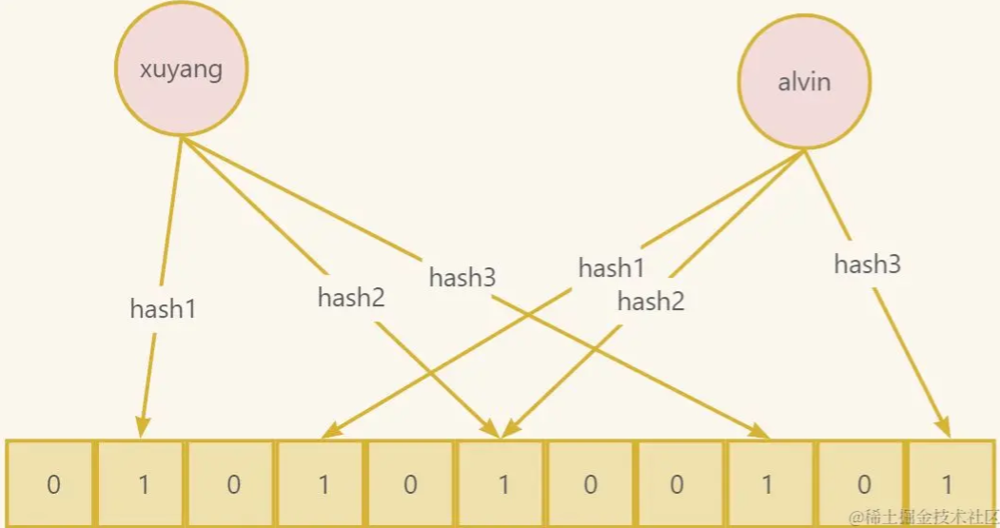

# 布隆过滤器

## 问题：十亿用户中，检查用户名是否存在

1. 数据库
2. 缓存
3. Hyperloglog
4. 布隆过滤器

## 数据库方案

1. 性能问题，延迟高 。 如果数据量很大，查询速度慢。
2. 数据库负载过高。
3. 可扩展性差。

## 缓存方案

内存占用过大。

假如每个用户名需要大约 20 字节的内存。你想要存储10亿个用户名的话，就需要20G的内存。

总内存

- 每条记录的内存使用量 * 记录数 
- 20 字节  * 1,000,000,000 条记录 
- 20,000,000,000 字节 = 20,000,000 KB = 20,000 MB = 20 GB

## Hyperloglog方案

HyperLogLog 是一种用于统计基数的数据集合类型。

优点

- 输入元素数量或者体积非常非常大时，计算基数所需空间总是固定的、并且是很小的。

- 每个 HyperLogLog 键只需要花费 12 KB 内存，就可以计算接近 2^64 个不同元素的基数。

场景：统计网页的UV（Unique Visitor，不重复访客，一个人访问某个网站多次，但是还是只计算为一次）。

注意：HyperLogLog 的统计规则是基于概率完成的，所以它给出的统计结果是有一定误差的，标准误算率是     0.81%。

## 布隆过滤器方案（数据结构）

布隆过滤器（Bloom Filter）是一种数据结构。

- 用于快速检查一个元素是否存在于一个大型数据集中。
- 通常用于在某些情况下快速过滤掉不可能存在的元素，以减少后续更昂贵的查询操作。
- 可以提供快速的查找和插入操作，并且在内存占用方面非常高效。

## 核心思想

布隆过滤器的核心思想是使用一个位数组（bit array）和一组哈希函数。

- 位数组（Bit Array） ：布隆过滤器使用一个包含大量位的数组，通常初始化为全0。每个位可以存储两个值，通常是0或1。这些位被用来表示元素的存在或可能的存在。
- 哈希函数（Hash Functions） ：布隆过滤器使用多个哈希函数，每个哈希函数可以将输入元素映射到位数组的一个或多个位置。这些哈希函数必须是独立且具有均匀分布特性。

## 具体实现

添加元素：

- 当将字符串“xuyang”，“alvin”插入布隆过滤器时，通过多个哈希函数将元素映射到位数组的多个位置，然后将这些位置的位设置为1。

查询元素：

- 当要检查一个元素是否存在于布隆过滤器中时，通过相同的哈希函数将元素映射到位数组的相应位置，然后检查这些位置的位是否都为1。

- 如果有任何一个位为0，那么可以确定元素不存在于数据集中。
- 如果所有位都是1，元素可能存在于数据集中，但也可能是误判。

## 优点

节约内存空间，相比使用哈希表等数据结构，布隆过滤器通常需要更少的内存空间，因为它不存储实际元素，而只存储元素的哈希值。

- 如果以 0.001 误差概率存储 10 亿条记录，只需要  1.67 GB 内存，对比原来的20G，大大的减少了。

高效的查找， 布隆过滤器可以在常数时间内（O(1)）快速查找一个元素是否存在于集合中，无需遍历整个集合。

## 缺点

误判率存在：布隆过滤器在判断元素是否存在时，有一定的误判率。

- 这意味着在某些情况下，它可能会错误地报告元素存在，但不会错误地报告元素不存在。

不能删除元素：布隆过滤器通常不支持从集合中删除元素，因为删除一个元素会影响其他元素的哈希值，增加了误判率。

## 总结

Redis 布隆过滤器的方案为大数据量下唯一性验证 提供了一种基于内存的高效解决方案，它需要在内存消耗和错误率之间取得一个平衡点。

当然布隆过滤器还有更多应用场景，比如防止缓存穿透、防止恶意访问等。