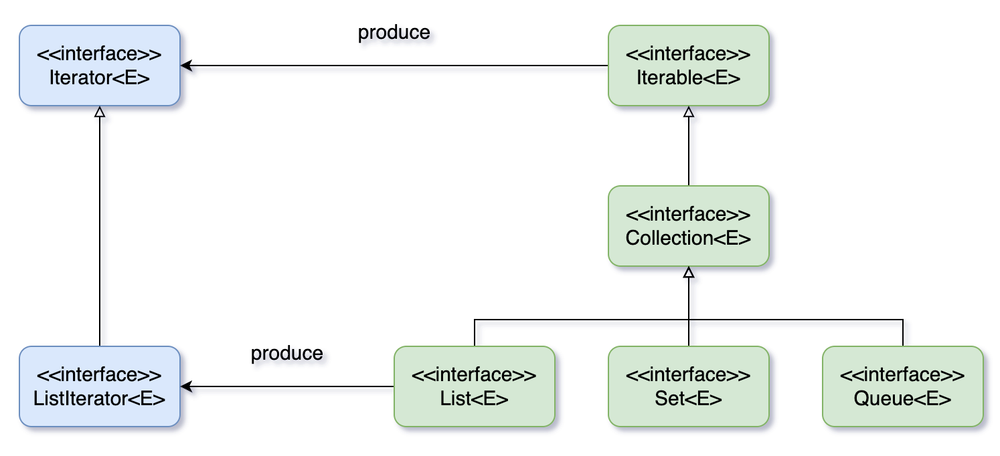

# 集合中的设计模式

## **迭代器**模式



`Collection` 继承了 `Iterable` 接口，其中的 `iterator()` 方法能够产生一个 `Iterator` 对象，通过这个对象就可以迭代遍历 `Collection` 中的元素。

## **适配器**模式

`java.util.Arrays.asList()` 可以把数组类型转换为 `List` 类型

```java
@SafeVarargs
@SuppressWarnings("varargs")
public static <T> List<T> asList(T... a) {
    return new ArrayList<>(a);
}
```

注意:

- `asList()` 参数为泛型的变长参数，不能使用基本类型数组作为参数，只能使用相应的包装类型数组。
- `asList()` 内部实现为数组，可以修改元素值，但不能添加，否则`UnsupportedOperationException`

```java
List<String> list1 = Arrays.asList("hello", "world");

Integer[] arr = {1, 2, 3};
List list2 = Arrays.asList(arr);
list2.add(4); // java.lang.UnsupportedOperationException
```

