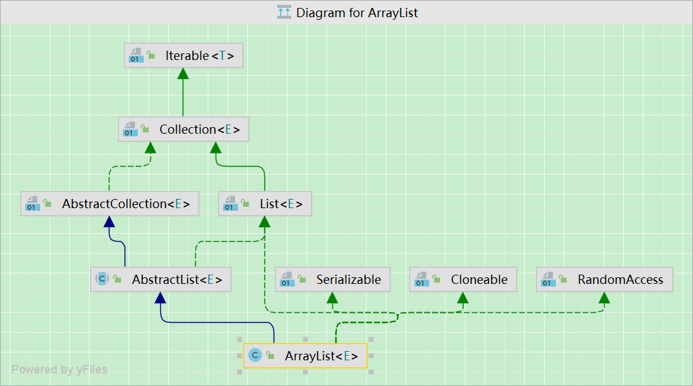

## List接口

`List`接口继承⾃`Collection`，`List`中的⽅法和`Collection`中的⼤致相同，多出`sort()`、`get()`、`listIterator()`等⽅法

`List`接口常⽤的实现类有：`ArrayList`、`LinkedList`

`List`有着特殊的迭代器接口`ListIterator`，继承`Iterator`接口

`listIterator`返回⼀个链表迭代器

## ArrayList 

`ArrayList` 底层是⼀个 `Object[]` 数组（动态数组），支持随机访问。

`ArrayList` 底层数组默认初始化容量为 10。

`ArrayList`是一个有类型参数的泛型类，可以指定数组列表保存的元素对象的类型。

- `< >` 中的类型参数，不是基本数据类型。

### 扩容（1.5倍，复制，效率低）

`ArrayList` 容量使⽤完后，需要对容量进⾏扩容（**基于反射**）。

- 新容量的大小为 `oldCapacity + (oldCapacity >> 1)`，即 `oldCapacity + oldCapacity/2`。
- 新容量大约是旧容量的 1.5 倍左右。

扩容时，会将原数组中所有元素拷贝`(Arrays.copyOf()`)，这会导致效率降低。

尽量提供初始化容量，避免一开始就⼀直扩容，造成效率较低。

- `ArrayList(int capacity)` 
- `ensureCapacity(int capacity)` 

`size`方法，返回元素个数，不是容量，初始`size`是0。

`trimTosize`方法，存储容量削减为当前大小，数组列表的大小保存恒定，可使用此方法，保存存储空间，回收多余空间。

### 删除元素（代价高，移动，O(N)）

需要调用 `System.arraycopy()` 将 `index+1` 后面的元素都复制到 `index` 位置上，该操作的时间复杂度为 `O(N)`

`ArrayList` 删除元素的代价是非常高的。

### 序列化（没必要全部序列化，transient ）

`ArrayList` 基于数组实现，并且具有动态扩容特性，因此保存元素的数组不一定都会被使用，没必要全部进行序列化。

保存元素的数组 `elementData` 使用 `transient` 修饰，该关键字声明数组默认不会被序列化。

- `transient Object[] elementData`

### 优点

- `ArrayList`  向末尾添加元素(`add`)时，效率较⾼；向中间添加元素，效率低。

-  查询效率⾼，随机访问。

### 缺点

- 扩容会造成效率较低（指定初始化容量，在⼀定程度上对其进⾏改善）。
- ⽆法存储⼤数据量（很难找到⼀块很大的连续内存空间）。

- 向 `ArrayList` 中间添加元素，需要移动元素，效率较低。
- 向 `ArrayList` 中间位置增/删元素的情况较少时不影响。
- 如果增/删操作较多，可考虑改⽤链表。

## Vector 

底层是数组、初始化容量为 10 。

扩容：新容量扩⼤为原始容量的 2 倍 。

`Vector` 是线程安全的（⽅法 `synchronized` 修饰），效率较低，现在使⽤较少。

## ArrayList 与 Vector 区别？

- `Vector`是线程安全的，`ArrayList`不是线程安全的。
- `ArrayList`扩展0.5倍，`Vector`是扩展1倍，ArrayList有利于节约内存空间。 

## Vector替代方案

可以使用 `Collections.synchronizedList()`; 得到一个线程安全的 `ArrayList`。

- `List<String> list = new  ArrayList<>();`
- `List<String> synList =  Collections.synchronizedList(list);`

可以使用 `concurrent` 并发包下的 `CopyOnWriteArrayList` 类。

- `List<String> list = new   CopyOnWriteArrayList<>();`