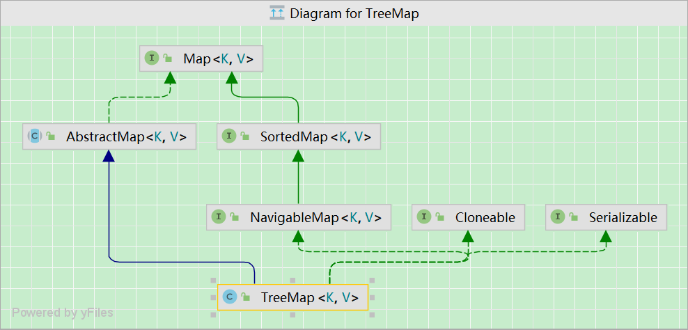
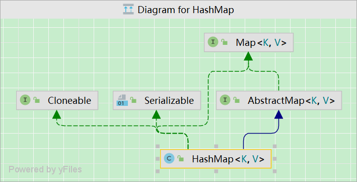

# Map

`Map`是双列集合，存储⼀组键值对，它独立于`Collection`接口。常⽤的实现类有：

- `HashMap`
- `TreeMap`
- `HashTable`
- `LinkedHashMap`

`Map`是顶层接口

- `sortedMap`接口提供排序选项

所有实现类都派⽣于`AbstractMap`抽象类

迭代处理`Map`的键/值

- `map.entrySet`方法
  - `Set<Map.Entry<Integer, Integer>> entry = map.entrySet();`
- `forEach`方法
  - `map.forEach((k, v) -> System.out.println(k + ":" + v));`

`Map.Entry<K, V>` 是 `Map` 的⼀个接口，接口的内部接口默认是`public static` 

- `Map`实现类内部会实现`Map.Entry<K, V>` 接口，存储键值对。

## HashTable

- 和 `HashMap` 类似，但它是线程安全的，即同一时刻多个线程同时写入 `HashTable` 不会导致数据不一致。
- 遗留类，不应该使用，而是使用 `ConcurrentHashMap` 来支持线程安全。
- `ConcurrentHashMap`的效率会更高，因为 `ConcurrentHashMap` 引入了分段锁、CAS和锁。

## LinkedHashMap

使用**双向链表**来维护元素的顺序，顺序为：

- 插入顺序
- 最近最少使用顺序（LRU）

## TreeMap



⽆序，不可重复，但是可排序。

⽀持范围查找，查找最近的元素。

`TreeMap`底层基于**红黑树**实现。

- `TreeMap`内部⽆扩容概念，因为使⽤的是树的链式存储结构。
- 可以保证在`log(n)`内完成`containsKey`、`get`、`put`、`remove`操作。
- 迭代器采⽤的是**中序遍历**。

红黑树相⽐于AVL树，牺牲了部分平衡性，以换取删除/插⼊操作时少量的旋转次数，整体来说，性能优于AVL树。

- AVL树为了维护严苛的平衡条件，在破坏了平衡之后（插⼊、删除），需要执⾏旋转操作。
- 共分为四种：左单旋、先左后右旋、右单旋、先右后左旋。

## 排序

内部是按照`key`进行排序的，所以不⽀持`key`为`null`。

可以⾃动对 `String` 类型或8⼤基本类型的包装类型进⾏排序 。

⾃定义类型进⾏排序：

- 存放在集合中的⾃定义类型实现 `java.lang.Comparable` 接口，并重写 `compareTo` ⽅法。
- 使用 `TreeSet/TreeMap` 带⽐较器参数（`Comparator`）的构造器 ，并重写⽐较器中的 `compare` ⽅法。

## HashMap

### 概述



基于**数组+链表+红黑树**实现

- 数组：`transient Node<K,V>[] table`

- 链表：`Node<K, V>`
- 红黑树：`Node<K, V>`

`HashMap`从宏观来看是基于`Hash`表实现的，通过拉链法解决哈希冲突。

引⼊红黑树，避免⼤量冲突导致某个位置链表长度过长，使得某些元素的查询效率变低。

链表是**尾插法**，保证了插⼊顺序的同时，也避免了并发操作下的⼀些异常。

- 头插法在扩容时有可能导致环形链表的出现，形成死循环。

### 存储结构

```java
package java.util;

public class HashMap<K,V> extends AbstractMap<K,V>
    implements Map<K,V>, Cloneable, Serializable {
  
    static final int DEFAULT_INITIAL_CAPACITY = 1 << 4; // 16，默认初始化容量
    static final int MAXIMUM_CAPACITY = 1 << 30;				// 最大容量
    static final float DEFAULT_LOAD_FACTOR = 0.75f;			// 默认装填因子
    static final int TREEIFY_THRESHOLD = 8;							// 单链表元素超过8个，则变为红⿊树
    static final int UNTREEIFY_THRESHOLD = 6;						// 红⿊树节点数量⼩于6，则变为单链表
    static final int MIN_TREEIFY_CAPACITY = 64;					// 单链表和红⿊树相互转换前提，table数组长度(桶数量)>64

    static class Node<K,V> implements Map.Entry<K,V> {
        final int hash; // 哈希值，通过key的hashcode计算出hash
        final K key; 		// final修饰
        V value;
        Node<K,V> next; // 下一个节点地址
    }
   
    transient Node<K,V>[] table; // 哈希表（链表数组）

    ......
}
```

**`HashMap` 是数组和单链表的结合体（链表数组）**

- 数组查询效率⾼，但是增删元素效率较低。
- 单链表在随机增删元素⽅⾯效率较⾼，但是查询效率较低。
- `HashMap` 将⼆者结合起来，充分它们各⾃的优点。

内部采⽤`Node`数组来表⽰`Hash`表，数组长度为2的幂次。

- `transient Node<K,V>[] table`：链表数组）
- `Node`长度为2的幂次：主要为了能通过**位运算**获取`key`的索引位置，提升计算的效率。

单链表的节点每个节点是 `Node<K, V>` 类型

- 从 `next` 字段可以看出 `Node`是一个链表。
- 数组中的每个位置被当成一个桶，一个桶存放一个链表。

前提`Node`数组容量>64时：

- 如果单链表元素超过8个，则将单链表转变为红⿊树。
- 如果红⿊树节点数量⼩于6，则将红⿊树重新变为单链表。

### 拉链法(解决冲突)

1. 取`key`的 `hashCode` 值。

2. 根据 `hashcode` 计算出`hash`值。

   1. 采⽤的是**高16位 异或  低16位**求`hash`值，从`hash`分布的情况来看，这样离散性更好。

   2. ```java
      static final int hash(Object key) {
          int h;
          return (key == null) ? 0 : (h = key.hashCode()) ^ (h >>> 16);
      }
      ```

3. 根据`hash`值，通过**位运算(取模)**：`(n - 1) & hash` 计算**桶下标**（数组下标）。

   1. 同⼀单链表中所有 `Node` 的 `hash`值不⼀定⼀样（不同`hash`值映射到同一位置），但是对应的数组下标⼀定⼀样（同一位置）。

   2. 位运算替代取模前提：`n`为2的次幂(`n-1`，二级制全为1)。

   3. 桶下标计算：`i = (n - 1) & hash` ，位运算。

   4. `(n - 1) & hash`  等同于 `hash mod n`，位运算和取模结果一样，但是位运算性能更高。

   5. ```java
      final V putVal(int hash, K key, V value, boolean onlyIfAbsent,
                     boolean evict) {
          Node<K,V>[] tab; Node<K,V> p; int n, i;
          if ((tab = table) == null || (n = tab.length) == 0)
              n = (tab = resize()).length;
          if ((p = tab[i = (n - 1) & hash]) == null)
              tab[i] = newNode(hash, key, value, null);
          else {
              Node<K,V> e; K k;
            	......
      }
      ```

4. 插入链表
   - JDK1.7是头插法，扩容时可能会导致死循环。
   - JDK1.8是尾插法，避免并发插入异常。
   - 找到数组下标后，`key`和链表元素比较(`equals`)：相等则覆盖；都不相等，插入尾部。

### 扩容(Node数组容量)

装填因子默认为`0.75`，超过扩容。

`loadFactor`为`0.75`是对空间和时间效率的一个平衡选择，一般不修改，除非在时间和空间比较特殊的情况下 ：

- 如果内存空间很多，而对时间效率要求很高，可以降低`loadFactor`。
- 如果内存空间紧张，而对时间效率要求不高，可以增加`loadFactor`。

**动态扩容**，默认是扩容为原数组长度的2倍。

- 内部没有`capacity`变量，`Node`数组⼤⼩是在扩容时确定的。
- 初始化没有指定`Node`容量⼤⼩，直接从`0`扩容为`16`（默认16）。
- 初始化时指定了`Node`容量⼤⼩，则整个`Hash`表的容量⼤⼩为最接近指定容量且⼤于指定容量的2的幂次（2的下一个幂值）。

1.8之前

- 将原有`Entry`数组的元素拷贝到新的`Entry`数组里，对所有元素`rehash`，映射到对应的位置。
- 会重新计算`hash`值。
- 会重新计算每个元素在数组中的位置。

1.8及之后

- 根据`hash & oldCap`的相与结果，来判断是否在新数组里面位移。
- 元素的位置要么是在原位置，要么是在原位置再移动2次幂位置（`oldCap` ）。

- 不需要重新计算`hash`值。

- 将`key`的`hash`值和`oldCap`相与，重新计算桶下标。

  - `oldCap` 二进制是`1000….`

- 如果为`0`，则保持原位。

- 如果为`1`，则放⼊到`原位+oldCap`的位置。

### put() ⽅法原理

```java
public V put(K key, V value) {
    return putVal(hash(key), key, value, false, true);
}

final V putVal(int hash, K key, V value, boolean onlyIfAbsent,
               boolean evict) {
    Node<K,V>[] tab; Node<K,V> p; int n, i;
    if ((tab = table) == null || (n = tab.length) == 0)  // 初始化没有指定Node容量⼤⼩，从0扩容为16
        n = (tab = resize()).length;
    if ((p = tab[i = (n - 1) & hash]) == null)  // 下标位置无值，node添加到位置
        tab[i] = newNode(hash, key, value, null);
    else {  // 下标位置存在单链表
        Node<K,V> e; K k;
        if (p.hash == hash &&   // 首先检查第一个节点
            ((k = p.key) == key || (key != null && key.equals(k))))
            e = p;
        else if (p instanceof TreeNode)
            e = ((TreeNode<K,V>)p).putTreeVal(this, tab, hash, key, value);
        else {
            for (int binCount = 0; ; ++binCount) {  // 与链表上每⼀个节点⽐较
                if ((e = p.next) == null) {
                    p.next = newNode(hash, key, value, null);
                    if (binCount >= TREEIFY_THRESHOLD - 1) // -1 for 1st
                        treeifyBin(tab, hash);
                    break;
                }
                if (e.hash == hash &&
                    ((k = e.key) == key || (key != null && key.equals(k))))
                    break;
                p = e;
            }
        }
        if (e != null) { // existing mapping for key
            V oldValue = e.value;
            if (!onlyIfAbsent || oldValue == null)
                e.value = value;
            afterNodeAccess(e);
            return oldValue;
        }
    }
    ++modCount;
    if (++size > threshold)
        resize();
    afterNodeInsertion(evict);
    return null;
}
```

1. 调⽤ `key` 的 `hashCode()` ⽅法得出 `hash` 值(高16位 异或 低16位)。
2. 将 `hash` 值转换为数组下标(位运算/取模):
   1. 注意：`hash` ,`key`, `value` 会封装为 `Node` 对象
   2. 如果下标位置上为`null`， `Node` 添加到这个位置上。
   3. 如果下标位置上有单链表，会将当前 `Node` 的 `key` 与链表上每⼀个节点中的 `key` 进⾏⽐较( `equals` )。
      1. 如果所有的 `equals` ⽅法返回都是 `false`，那么这个新节点 `Node` 将被添加到链表末尾。
      2. 如果其中⼀个 `equals` 返回了 `true`，那么链表的这个节点的 `value` 会被新`Node` 的 `value` 覆盖（保证了不可重复） 。

### get() ⽅法原理

```java
public V get(Object key) {
    Node<K,V> e;
    return (e = getNode(hash(key), key)) == null ? null : e.value;
}

final Node<K,V> getNode(int hash, Object key) {
    Node<K,V>[] tab; Node<K,V> first, e; int n; K k;
    if ((tab = table) != null && (n = tab.length) > 0 &&
        (first = tab[(n - 1) & hash]) != null) {
        if (first.hash == hash && // 首先检查第一个节点
            ((k = first.key) == key || (key != null && key.equals(k))))
            return first;
        if ((e = first.next) != null) {
            if (first instanceof TreeNode)
                return ((TreeNode<K,V>)first).getTreeNode(hash, key);
            do {    // 与链表上每⼀个节点⽐较
                if (e.hash == hash &&
                    ((k = e.key) == key || (key != null && key.equals(k))))
                    return e;
            } while ((e = e.next) != null);
        }
    }
    return null;
}
```

1. 调⽤ `key` 的 `hashCode()` ⽅法得出 `hash` 值(高16位 异或 低16位)。
2. 将 `hash` 值转换为数组下标(位运算/取模)。
3. 通过数组下标快速定位到数组中的某个位置（桶）：
   1. 注意：从链表头开始 `first = tab[(n - 1) & hash`
   2. 如果这个位置上为`null`，则返回 `null`。
   3. 如果这个位置上有单链表，会将当前 `Node` 的 `key` 与链表上每⼀个节点中的 `key` 进⾏⽐较( `equals` )。
      1. 如果所有的 `equals` ⽅法返回都是 `false`，那么 `get` ⽅法返回 `null`；。
      2. 如果其中⼀个 `equals` 返回了 `true`，那么链表的这个节点 `value` 是我们要找的 `value`，此时 `get` ⽅法返回找到的 `value`。

## HashMap 允许插入键为 null 的键值对

- 因为无法调用 `null` 的 `hashCode()`  方法，即无法确定该键值对的桶下标(数组下标)，只能通过**强制指定一个桶下标存放**。

- `HashMap` 使用第 `0` 个桶存放键为 `null` 的键值对。

- ```java
  static final int hash(Object key) {
      int h;
      return (key == null) ? 0 : (h = key.hashCode()) ^ (h >>> 16);
  }
  ```

## 同时重写 hashCode() 和 equals() ⽅法

集合存放的元素需要同时重写`hashCode()` 和 `equals()` ⽅法，保证等价的两个对象哈希值也相等。

`equals`和`hashCode`的定义必须相容：

- `x.equals(y)`返回`true`，必定 `x.hashCode()==y.hashCode()`。

但是`hashCode`相同的两个对象不一定等价：

- 这是因为计算哈希值具有随机性，无规律，两个值不同的对象可能计算出相同的哈希值。

`HashSet` 和 `HashMap` 等集合类使用`hashCode()` 方法来计算对象的存储位置：

- 要将对象添加到这些集合类中，对象的类需实现  `hashCode()` 方法。

- 不实现 `hashCode()` 会导致集合添加等价的对象。

重写 `hashCode()` ⽅法时还要达到散列分布均匀，散列分布不均匀：

- 如果 `hashCode()` ⽅法返回⼀个固定值， `HashMap` 底层则变成了⼀个单链表。
- 如果 `hashCode()` ⽅法所有返回的值都不同， `HashMap` 底层则变成了⼀个数组。

## HashMap与 Hashtable 的比较

- `Hashtable` 使用 `synchronized` 来进行同步。
- `HashMap` 可以插入键为 `null` 的 `Entry`。
- `HashMap` 的迭代器是 `fail-fast` 迭代器。
- `HashMap` 不能保证随着时间的推移 `Map`中的元素次序是不变的。

## 解决hash冲突时，为什么不直接用红黑树？而先用链表，再转红黑树?

当元素小于 8 个时，查询操作，链表结构已能保证查询性能。

当元素大于 8 个时， 红黑树搜索时间复杂度是 `O(logn)，`而链表是 `O(n)`，需要**红黑树来加快查询速度**，但是新增节点效率变慢了。

**因此，如果一开始用红黑树，元素太少，新增效率又比较慢，无疑这是浪费性能的。**

- 一开始，元素数量少，**主要是新增**，先采用链表，新增节点效率快，且数量少，链表已能保证查询性能。
  - 红黑树需要进行左旋，右旋，变色这些操作来保持平衡，新增效率慢，而单链表不需要。
- 后来，元素数量多，**主要是查询**，采用红黑树，查询节点效率快。

## 不用红黑树，用二叉查找树可以么?

可以使用二叉查找树。

但是二叉查找树在特殊情况下会变成一条线性结构，时间复杂度O(N)（和链表结构一样），遍历查找会非常慢。

## HashMap为什么线程不安全？

- 多线程下扩容死循环：
  - JDK1.7 `HashMap` 使用头插法插入元素，在多线程的环境下，扩容的时有可能导致**环形链表**的出现，形成死循环。
  - JDK1.8 `HashMap` 使用**尾插法**插入元素，在扩容时会保持链表元素原本的顺序，不会出现环形链表的问题。
- 多线程下`put`可能导致元素的丢失:
  - 静态条件，同时`put`，覆盖。
  - 多线程同时执行 `put` 操作，如果计算出索引位置相同，那会造成前一个 `key` 被后一个 `key`  覆盖，从而导致元素的丢失。
  - 此问题在JDK 1.7和 JDK 1.8 中都存在。
- `put`和`get`并发时，可能导致`get`为`null`：
  - 扩容过程中`get`可能返回`null`。
  - 线程1执行`put`时，因为元素个数超出`threshold`而导致`rehash`，线程2此时执行`get`，有可能导致这个问题。
  - 此问题在JDK 1.7和 JDK 1.8 中都存在。

## HashMap 和 HashSet 区别?

| HashMap                                                  | HashSet                                                      |
| -------------------------------------------------------- | ------------------------------------------------------------ |
| 实现`Map`接口                                            | 实现`Set`接口                                                |
| 双列集合，存储键值对                                     | 单列集合，存储对象                                           |
| 调用`put()`添加元素                                      | 调用`add()`添加元素                                          |
| 使用键(`key`)计算使用`hashCode`                          | 使用实例字段来计算`hashCode`<br />两个对象`hashCode`可能相同，所以会采用`equal()`方法比较，不同返回false |
| `HashMap`相对于`HashSet`较快，因为它使用唯一的键获取对象 | 较慢                                                         |

`HashSet`底层是`HashMap`，把数据作为`key`值，`V`值使用一个相同的虚值来保存(`PRESENT`)。

- `HashMap`的`key`值不允许重复，且`key`相同时，会用`newV`覆盖掉`oldV`，然后返回`oldV`。
- 那么在`HashSet`中执行以下代码始终会返回一个`false`，导致插入失败，保证了数据的不可重复性。

```java
private transient HashMap<E,Object> map;

private static final Object PRESENT = new Object();

public boolean add(E e) {
    return map.put(e, PRESENT)==null;
}
```

## JDK1.8 计算hashcode为什么要异或其右移十六位的值？

JDK1.8 优化了高位运算的算法，通过`hashCode()`的高16位异或低16位实现：

- `(h = key.hashCode()) ^ (h >>> 16)`

在数组`table` 的 `length` 比较小时，也能保证到高/低`Bit`都参与到`Hash`计算中，同时不会有太大的开销。

## 为什么 hash 值要与length-1相与？

前提：`length` 是 2 的`n`次方时

- `h& (length-1)` 等价于`h%length`， `&` 比 `%` 具有更高的效率。

## HashMap数组的长度为什么是 2 的幂次方？

- 保证位运算等同于取模，位运算在速度、效率上比直接取模要快得多。
- 除此之外，2 的 N 次幂有助于减少碰撞的几率。

## 一般用什么作为HashMap的key?

一般用`Integer`、`String` 这种不可变类当作 `HashMap` 的 `key`，而且 `String` 最为常用。

- 因为字符串是不可变的，所以在它创建时`hashcode` 就被缓存了，不需要重新计算。
- 且这些类已经很规范的重写了 `hashCode()` 以及 `equals()` 方法。

## 用可变类当 HashMap 的 key 有什么问题?

- `hashcode` 可能发生改变，导致 `put` 进去的值，无法 `get` 出。