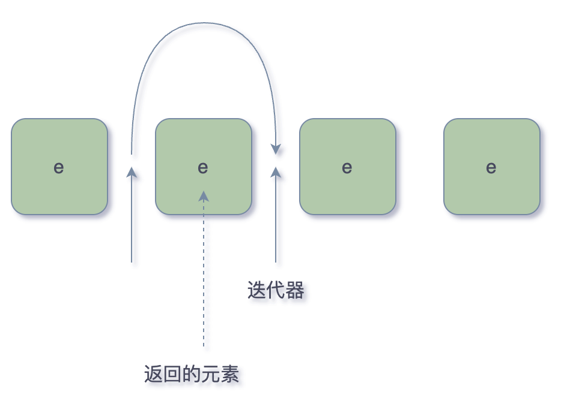

# 迭代器

## Iterable

`Collection` 继承了 `Iterable` 接口，其中的 `iterator()` 方法能够产生一个 `Iterator` 对象，通过这个对象就可以迭代遍历 `Collection` 中的元素。

- 迭代器位于两个元素之间。

- 访问顺序取决于集合类型。
- `foreach` 循环可以处理任何实现了`Iterable`接口的对象。

迭代器方法

- `hasNext()`
- `next()`
- `remove()`
  - 删除上次调用`next`方法返回的元素（迭代器左侧元素）。
  - 必须先调用`next`，越过将要删除的元素。
- `forEachRemaining(Consumer)`

## ListIterator(List特有，正/反向遍历)

`List`有着特殊的迭代器接口`ListIterator`，继承`Iterator`接口。

`listIterator`返回⼀个**链表迭代器。**

- `ListIterator`增加了 `previous()` 、`hasPrevious()`⽅法⽤来**反向遍历**，功能更加强⼤。
- `ListIterator`只能`List`使⽤，其它接口⽆法使⽤。

迭代器方法

- `remove()`
  - 调⽤ `next` 后，`remove` 删除迭代器左侧的元素。
  - 调⽤ `previous` 后，`remove` 删除迭代器右侧的元素 。
- `add()`
  - 调⽤ `next` 后，`add()`在迭代器左侧添加⼀个元素。
  - 调⽤ `previous` 后，`add()` 在迭代器右侧添加元素。

## 比较

### iterator

- 单向移动
- 只可在末尾添加元素，不可在中间
- 不可修改
- 无法获取索引

### listIterator

- 双向移动

- 可以在中间添加元素

- 可以使用`set()`修改集合中的元素
- 可以获取集合中元素的索引